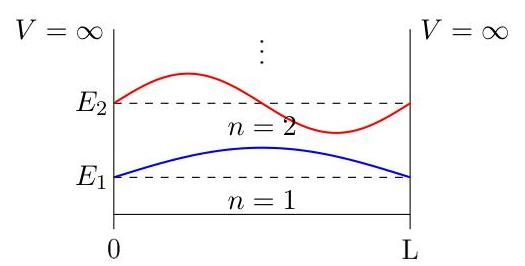
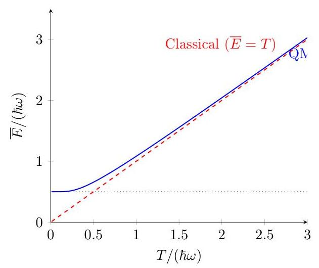
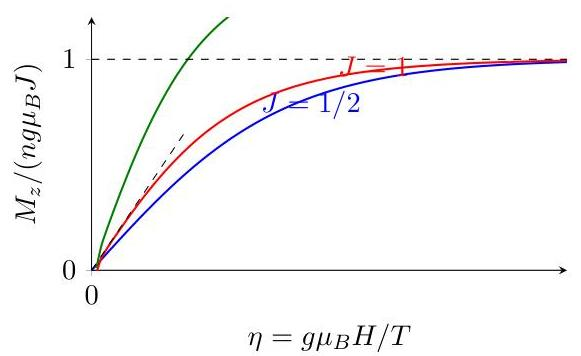
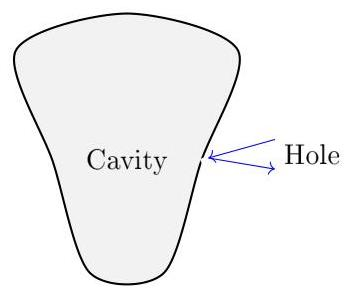

# 415 Lecture Notes Combined 

Gemini 2.5 Pro
May, 2025

$2=$

# Contents 

Lecture 1 ..... 5
Lecture 2 ..... 9
Lecture 3 ..... 15
Lecture 4 ..... 19
Lecture 5 ..... 23
Lecture 6 ..... 27
Lecture 7 ..... 33
Lecture 8 ..... 37
Lecture 9 ..... 41
Lecture 10 ..... 47
Lecture 11 ..... 51
Lecture 12 ..... 57
Lecture 13 ..... 61
Lecture 14 ..... 67
Lecture 15 ..... 73
Lecture 16 ..... 77
Lecture 18 ..... 83
Lecture 19 ..... 89
Lecture 20 ..... 93

Lecture 21 ..... 99
Lecture 22 ..... 105
Lecture 23 ..... 109
Lecture 24 ..... 113
Lecture 25 ..... 119
Lecture 27 ..... 123
Lecture 28 ..... 127
Lecture 30 ..... 131
Lecture 31 ..... 135
Lecture 32 ..... 139
Lecture 33 ..... 145
Lecture 34 ..... 151
Lecture 35 ..... 157
Lecture 36 ..... 161

# Physics 415 - Lecture 1: Statistical Mechanics (Preview) 

January 22, 2025

In statistical mechanics, we will be interested in the laws governing the behavior of "macroscopic" systems.

- Macroscopic $=$ composed of many constituent particles (atoms, molecules, etc.)
- Typical $\# \sim 10^{23}$ particles.

In principle, if "microscopic" (M-scopic) laws are known, then properties of systems of a large \# of particles can be deduced by solving the M-scopic equations.

Example: Classical system of N particles:

$$
m_{i} \ddot{\vec{r}_{i}}=\vec{F}_{i}\left(\vec{r}_{1}, \ldots, \vec{r}_{N}\right), \quad i=1, \ldots, N
$$

(where $\dot{ } \equiv \frac{d}{d t}, \quad \equiv \frac{d^{2}}{d t^{2}}$, etc.) Given initial conditions $\vec{r}_{i}(t=0)$ and $\vec{v}_{i}(t=0)\left(\vec{v}_{i}=\dot{\vec{r}}_{i}\right)$, we have complete knowledge of the state of the system at any time $t$.

However, for macroscopic $\mathrm{N}\left(N \sim 10^{23}\right)$, this is not feasible.

- Even if we could solve the equations of motion (EOM), simply recording all initial conditions is not practical.
- Indeed, knowing the state of each particle is not even useful or interesting info.
- When the \# of particles is large, we'd rather have info about the "average" properties of the system.

Thus, in statistical mechanics, we will abandon such M-scopic determinism in favor of a statistical (or probabilistic) description.

We will find that, precisely because of the large \# of particles involved, new laws \& types of regularities will appear that govern the macroscopic behavior.

- Notions like "entropy" \& "temperature" will emerge, that have no analog in particle mechanics \& are purely of statistical nature.

Since statistical notions will be important for understanding macroscopic systems, we'll spend some time reviewing basics of probability. This will be mostly math (not physics). We'll illustrate important ideas through an important example:

## 1D Random Walk

(A good starting point for understanding a variety of phenomena).

- Walker starts from lamppost at $x=0$.
- Taking random steps of length $l$ at regular intervals.
- Each step is independent of the last.
- Probability $p$ to step to the right \& probability $q=1-p$ to step to the left.

Question: After taking $N$ steps, what is the probability that the walker is at a position $x=m l(m=$ integer $)$ ? (For another example of a 1D random walk, see "probability board" demo at Ingersoll museum).

We want to calculate the probability $P_{N}(m)$ that the walker is at position $x=m l$ after $N$ steps.

- Let $n_{1}=\#$ of steps right, $n_{2}=\#$ of steps left.
- Total steps: $N=n_{1}+n_{2}$.
- Final position: $m l=n_{1} l-n_{2} l \Longrightarrow m=n_{1}-n_{2}$.
- Note: $-N \leq m \leq N$. Also, $N$ and $m$ must have the same parity ( $N-m=2 n_{2}$ is even).
- From the above, we can express $n_{1}$ and $n_{2}$ in terms of $N$ and $m: n_{1}=(N+m) / 2$ $n_{2}=(N-m) / 2$

The probability of taking a specific sequence of $n_{1}$ steps right and $n_{2}$ steps left is:

$$
\underbrace{(p \times p \times \cdots \times p)}_{n_{1} \text { times }} \times(\underbrace{q \times q \times \cdots \times q}_{n_{2} \text { times }})=p^{n_{1}} q^{n_{2}}
$$

Of course, there are many different ways (sequences) in which the walker could take $n_{1}$ steps right \& $n_{2}$ steps left.

Example: $N=3, m=1$. Then $n_{1}=(3+1) / 2=2, n_{2}=(3-1) / 2=1$. Possible sequences: a) $\rightarrow \rightarrow \leftarrow$ b) $\rightarrow \leftarrow \rightarrow$ c) $\longleftrightarrow \rightarrow$ There are 3 ways.

In general, the number of ways is given by the binomial coefficient:

$$
\text { \# of ways }=\binom{N}{n_{1}}=\frac{N!}{n_{1}!\left(N-n_{1}\right)!}=\frac{N!}{n_{1}!n_{2}!}
$$

Check above example: $N=3, n_{1}=2, n_{2}=1 \Longrightarrow\binom{3}{2}=\frac{3!}{2!1!}=3 . \checkmark$
Therefore, the total probability $P_{N}(m)$ is (number of ways) $\times$ (probability of one way):

$$
P_{N}(m)=\frac{N!}{n_{1}!n_{2}!} p^{n_{1}} q^{n_{2}}
$$

This is the "binomial distribution".
Using $n_{1}=(N+m) / 2$ and $n_{2}=(N-m) / 2$ :

$$
P_{N}(m)=\frac{N!}{[(N+m) / 2]![(N-m) / 2]!} p^{(N+m) / 2}(1-p)^{(N-m) / 2}
$$

Recall the binomial theorem: $(p+q)^{N}=\sum_{n_{1}=0}^{N} \frac{N!}{n_{1}!\left(N-n_{1}\right)!} p^{n_{1}} q^{N-n_{1}}$. Comparing with the formula for $P_{N}(m)$ (summed over $n_{1}$ or $m$ ) explains the name.

Example: $p=q=1 / 2$ (unbiased walk).

$$
P_{N}\left(n_{1}\right)=\frac{N!}{n_{1}!n_{2}!}\left(\frac{1}{2}\right)^{N}
$$

Let's consider $N=10$. The probability $P_{10}\left(n_{1}\right)$ is plotted below. Note: $m=n_{1}-n_{2}=$ $n_{1}-\left(N-n_{1}\right)=2 n_{1}-N$.

| $n_{1}$ | Approx $P_{10}\left(n_{1}\right)$ |
| :--: | :--: |
| 0 | $\approx 0.001$ |
| 1 | $\approx 0.01$ |
| 2 | $\approx 0.044$ |
| 3 | $\approx 0.12$ |
| 4 | $\approx 0.21$ |
| 5 | $\approx 0.25$ |

After $N=10$ steps, probability is largest for the particle to be near the origin ( $m=0$, or $n_{1}=5$ ). Probability to be far from the origin is small.

# General Notions 

Let $X$ be a random variable, taking $K$ possible values $x_{1}, x_{2}, \ldots, x_{K}$, with associated probabilities $P\left(x_{1}\right), P\left(x_{2}\right), \ldots, P\left(x_{K}\right) .\left(0 \leq P\left(x_{i}\right) \leq 1\right.$ and $\left.\sum_{i=1}^{K} P\left(x_{i}\right)=1\right)$.

## Mean

The "mean" (average) of $X$ is: $\bar{X}=\sum_{i=1}^{K} P\left(x_{i}\right) x_{i}$. For a function $f(X): \overline{f(X)}=\sum_{i=1}^{K} P\left(x_{i}\right) f\left(x_{i}\right)$.

## Variance

Suppose we want to know how much measurements of $X$ "fluctuate" about the mean value. The "variance" (second moment, dispersion) is defined as:

$$
\operatorname{Var}(X)=\sigma_{X}^{2}=\overline{(X-\bar{X})^{2}}=\sum_{i=1}^{K} P\left(x_{i}\right)\left(x_{i}-\bar{X}\right)^{2}
$$

We square the deviation $\left(x_{i}-\bar{X}\right)$ since fluctuations can have either sign. Note the useful identity:

$$
\overline{(X-\bar{X})^{2}}=\overline{X^{2}-2 X \bar{X}+(\bar{X})^{2}}=\overline{X^{2}}-2 \overline{X X}+(\bar{X})^{2}=\overline{X^{2}}-(\bar{X})^{2}
$$

We also define the root-mean-square (RMS) deviation (or standard deviation):

$$
\Delta X_{r m s}=\sigma_{X}=\sqrt{\overline{(X-\bar{X})^{2}}}=\sqrt{\overline{X^{2}}-(\bar{X})^{2}}
$$

Example: Binomial Distribution Properties (results to be shown in discussion section/homework)

- Average $\#$ of steps to the right: $\overline{n_{1}}=N \times p$
(= (total \# of steps) $\times$ (prob. of step right))
- Variance: $\operatorname{Var}\left(n_{1}\right)=\overline{n_{1}^{2}}-\left(\overline{n_{1}}\right)^{2}=N \times p q$
- RMS deviation: $\Delta n_{1, r m s}=\sqrt{N p q}$
- The relative width is:

$$
\frac{\Delta n_{1, r m s}}{\overline{n_{1}}}=\frac{\sqrt{N p q}}{N p}=\sqrt{\frac{q}{p}} \times \frac{1}{\sqrt{N}}
$$

- This shows the distribution becomes sharply peaked (relative width $\rightarrow 0$ ) when $N \gg 1$.

CONTENTS

# Physics 415 - Lecture 2 

January 24, 2025

## Summary: Binomial Distribution

The binomial distribution gives the likelihood that an event with probability $p$ occurs $n$ times in $N$ independent trials:

$$
P_{N}(n)=\binom{N}{n} p^{n} q^{N-n}=\frac{N!}{n!(N-n)!} p^{n}(1-p)^{N-n}
$$

where $q=1-p$.

- Mean: $\bar{n}=N p$
- Variance: $\sigma_{n}^{2}=\overline{n^{2}}-(\bar{n})^{2}=N p q$
- Relative width (RMS deviation / mean): $\frac{\Delta n_{r m s}}{\bar{n}}=\frac{\sqrt{N p q}}{N p}=\sqrt{\frac{q}{p}} \frac{1}{\sqrt{N}}$

Important regime to understand is $N \gg 1$.

## Gaussian Approximation to Binomial Distribution $(N \gg 1)$

It is convenient to work with $\ln P_{N}(n)$ :

$$
\ln P_{N}(n)=\ln N!-\ln n!-\ln (N-n)!+n \ln p+(N-n) \ln q
$$

For $N \gg 1$, we use Stirling's formula (see Reif App. A. 6 for derivation):

$$
N!\approx \sqrt{2 \pi N}\left(\frac{N}{e}\right)^{N} \quad(N \gg 1)
$$

or more conveniently for logarithms:

$$
\ln N!\approx N \ln N-N+\frac{1}{2} \ln (2 \pi N)
$$

Applying this to $\ln N!, \ln n$ !, and $\ln (N-n)$ ! (assuming $n \gg 1$ and $N-n \gg 1$ ):

$$
\begin{aligned}
\ln P_{N}(n) \approx & \left(N \ln N-N+\frac{1}{2} \ln (2 \pi N)\right) \\
& -\left(n \ln n-n+\frac{1}{2} \ln (2 \pi n)\right) \\
& -\left((N-n) \ln (N-n)-(N-n)+\frac{1}{2} \ln (2 \pi(N-n))\right) \\
& +n \ln p+(N-n) \ln q
\end{aligned}
$$

Grouping terms:
$\ln P_{N}(n) \approx \frac{1}{2} \ln \left(\frac{2 \pi N}{2 \pi n \cdot 2 \pi(N-n)}\right)+N \ln N-n \ln n-(N-n) \ln (N-n)+n \ln p+(N-n) \ln q$

Let $x=n / N$. Then $n=N x$ and $N-n=N(1-x)$.

$$
\begin{aligned}
\ln P_{N}(n) \approx & \frac{1}{2} \ln \left(\frac{N}{2 \pi n(N-n)}\right) \\
& +N \ln N-N x \ln (N x)-N(1-x) \ln (N(1-x)) \\
& +N x \ln p+N(1-x) \ln q \\
\ln P_{N}(n) \approx & \frac{1}{2} \ln \left(\frac{N}{2 \pi n(N-n)}\right) \\
& +N \ln N-N x(\ln N+\ln x)-N(1-x)(\ln N+\ln (1-x)) \\
& +N x \ln p+N(1-x) \ln q \\
& \ln P_{N}(n) \approx & \frac{1}{2} \ln \left(\frac{N}{2 \pi n(N-n)}\right) \\
& +(N-N x-N(1-x)) \ln N \\
& -N[x \ln x+(1-x) \ln (1-x)] \\
& +N[x \ln p+(1-x) \ln q]
\end{aligned}
$$

The $\ln N$ terms cancel. Let $f(x)=[x \ln x+(1-x) \ln (1-x)]-[x \ln p+(1-x) \ln q]$. Then $\ln P_{N}(n) \approx \frac{1}{2} \ln \left[\frac{N}{2 \pi n(N-n)}\right]-N f(n / N)$.

$$
\Longrightarrow P_{N}(n) \approx \sqrt{\frac{N}{2 \pi n(N-n)}} e^{-N f(n / N)} \quad(\text { for } n \gg 1, N-n \gg 1)
$$

For $N$ large, $P_{N}(n)$ will be sharply peaked near its maximum at $n=\tilde{n}$. We seek an approximation for $P_{N}(n)$ near $n=\tilde{n}$.

The maximum of $P_{N}(n)$ corresponds to the minimum of $f(x)$. We find the minimum by setting $f^{\prime}(x)=\frac{\mathrm{d} f}{\mathrm{~d} x}=0$.

$$
f^{\prime}(x)=[\ln x+1-\ln (1-x)-1]-[\ln p-\ln q]=\ln \left(\frac{x}{1-x}\right)-\ln \left(\frac{p}{q}\right)=\ln \left(\frac{q x}{p(1-x)}\right)
$$

Setting $f^{\prime}(\tilde{x})=0 \Longrightarrow \frac{q \tilde{x}}{p(1-\tilde{x})}=1 \Longrightarrow q \tilde{x}=p(1-\tilde{x}) \Longrightarrow(q+p) \tilde{x}=p \Longrightarrow \tilde{x}=p$. So the peak occurs at $\tilde{x}=\tilde{n} / N=p \Longrightarrow \tilde{n}=N p$, which is the mean value.

Now expand $f(x)$ about $x=\tilde{x}=p$ :

$$
f(x) \approx f(\tilde{x})+f^{\prime}(\tilde{x})(x-\tilde{x})+\frac{1}{2} f^{\prime \prime}(\tilde{x})(x-\tilde{x})^{2}
$$

We have $f^{\prime}(\tilde{x})=0$.

$$
f(\tilde{x})=p \ln p+q \ln q-(p \ln p+q \ln q)=0
$$

We need the second derivative:

$$
\begin{aligned}
& f^{\prime \prime}(x)=\frac{\mathrm{d}}{\mathrm{~d} x} \ln \left(\frac{q x}{p(1-x)}\right)=\frac{p(1-x)}{q x} \cdot \frac{q p(1-x)-q x(-p)}{(p(1-x))^{2}}=\frac{p(1-x)}{q x} \frac{p q}{(p(1-x))^{2}}=\frac{q}{x(1-x) p} \\
& f^{\prime \prime}(x)=\frac{\mathrm{d}}{\mathrm{~d} x}(\ln x-\ln (1-x)-(\ln p-\ln q))=\frac{1}{x}-\frac{1}{1-x}(-1)=\frac{1}{x}+\frac{1}{1-x}=\frac{1}{x(1-x)}
\end{aligned}
$$

At $x=\tilde{x}=p: f^{\prime \prime}(p)=\frac{1}{p(1-p)}=\frac{1}{p q}$.

So, $f(x) \approx \frac{1}{2} f^{\prime \prime}(p)(x-p)^{2}=\frac{1}{2 p q}(n / N-p)^{2}=\frac{(n-N p)^{2}}{2 N^{2} p q}$. The exponent becomes $-N f(n / N) \approx$ $-N \frac{(n-N p)^{2}}{2 N^{2} p q}=-\frac{(n-N p)^{2}}{2 N p q}$.

$$
\Longrightarrow P_{N}(n) \approx \sqrt{\frac{N}{2 \pi n(N-n)}} e^{-\frac{(n-N p)^{2}}{2 N p q}}
$$

Finally, because the exponential factor is sharply peaked at $n=\tilde{n}=N p$, we may approximate the $n$ dependence in the prefactor by replacing $n$ with $\tilde{n}=N p$ and $N-n$ with $N-\tilde{n}=N q$ :

$$
\begin{gathered}
n(N-n) \approx(N p)(N q)=N^{2} p q \\
\sqrt{\frac{N}{2 \pi n(N-n)}} \approx \sqrt{\frac{N}{2 \pi N^{2} p q}}=\sqrt{\frac{1}{2 \pi N p q}}=\frac{1}{\sqrt{2 \pi \sigma_{n}^{2}}}
\end{gathered}
$$

where $\sigma_{n}^{2}=N p q$ is the variance. Thus, the Gaussian approximation to the binomial distribution for $N \gg 1$ is:

$$
P_{N}(n) \approx \frac{1}{\sqrt{2 \pi N p q}} e^{-\frac{(n-N p)^{2}}{2 N p q}}
$$

This can be written as:

$$
P_{N}(n) \approx \frac{1}{\sqrt{2 \pi \sigma^{2}}} e^{-\frac{(n-p)^{2}}{2 \sigma^{2}}}
$$

where $\mu=N p$ (mean) and $\sigma^{2}=N p q$ (variance). This is the Gaussian (or Normal) distribution. This result is an example of the "central limit theorem".

The Gaussian distribution can be shown to be properly normalized when treated as a continuous distribution (replacing sum by integral for large N ):

$$
\sum_{n=0}^{N} P_{N}(n) \approx \int_{-\infty}^{\infty} \mathrm{d} n P_{N}(n)=\int_{-\infty}^{\infty} \mathrm{d} n \frac{1}{\sqrt{2 \pi \sigma^{2}}} e^{-\frac{(n-p)^{2}}{2 \sigma^{2}}}=1
$$

(See Section 1 of notes for Gaussian integrals).

# Distributions with Multiple Variables 

Consider two random variables $u$ and $v$ (generalization to more variables is straightforward).

- Possible values: $\left\{u_{i}\right\}, i=1, \ldots, M ;\left\{v_{j}\right\}, j=1, \ldots, L$.
- Joint probability: $P\left(u_{i}, v_{j}\right)=\operatorname{prob}$ that $u=u_{i}$ and $v=v_{j}$.
- Normalization: $\sum_{i=1}^{M} \sum_{j=1}^{L} P\left(u_{i}, v_{j}\right)=1$.
- "Unconditional" probability distributions (marginal distributions):
$-P_{u}\left(u_{i}\right)=\sum_{j=1}^{L} P\left(u_{i}, v_{j}\right)=\operatorname{prob} u=u_{i}$, irrespective of $v$.
$-P_{v}\left(v_{j}\right)=\sum_{i=1}^{M} P\left(u_{i}, v_{j}\right)=\operatorname{prob} v=v_{j}$, irrespective of $u$.

## Statistical Independence

An important special case is when the probability that one variable assumes a certain value is independent of the value assumed by the other variable. The variables are "statistically independent" or "uncorrelated". In this case:

$$
P\left(u_{i}, v_{j}\right)=P_{u}\left(u_{i}\right) P_{v}\left(v_{j}\right) \quad \text { (for statistically independent } u, v \text { ) }
$$

# Mean Values 

The mean of a function $F(u, v)$ is:

$$
\overline{F(u, v)}=\sum_{i=1}^{M} \sum_{j=1}^{L} P\left(u_{i}, v_{j}\right) F\left(u_{i}, v_{j}\right)
$$

A special case is the mean of a product $f(u) \times g(v)$ when $u$ and $v$ are statistically independent:

$$
\begin{aligned}
\overline{f(u) g(v)} & =\sum_{i, j} P\left(u_{i}, v_{j}\right) f\left(u_{i}\right) g\left(v_{j}\right) \\
& =\sum_{i, j} P_{u}\left(u_{i}\right) P_{v}\left(v_{j}\right) f\left(u_{i}\right) g\left(v_{j}\right) \quad \text { (using independence) } \\
& =\left(\sum_{i=1}^{M} P_{u}\left(u_{i}\right) f\left(u_{i}\right)\right) \times\left(\sum_{j=1}^{L} P_{v}\left(v_{j}\right) g\left(v_{j}\right)\right) \\
& =\overline{f(u)} \times \overline{g(v)} \\
\Longrightarrow \overline{f(u) g(v)} & =\overline{f(u)} \times \overline{g(v)} \quad \text { if } u, v \text { are statistically independent }
\end{aligned}
$$

The average "factorizes". (This is not true in general!)

## Continuous Probability Distributions

We will often encounter "continuous" probability distributions, where a random variable $X$ can assume a continuous range of values, e.g., $a_{1}<x<a_{2}$. Example: Gaussian distribution $\mathcal{P}(() x)=\frac{1}{\sqrt{2 \pi \sigma^{2}}} e^{-\frac{(x-\mu)^{2}}{2 \sigma^{2}}}$ for $-\infty<x<\infty$.

For a continuous distribution, it does not make sense to consider the probability of $X$ taking any particular value (which would be vanishingly small). Rather, we consider the probability that the random variable lies in a small range between $x$ and $x+\mathrm{d} x$.

- $\mathcal{P}(() x) \mathrm{d} x=$ probability to find the random variable in the range $(x, x+\mathrm{d} x)$.
- $\mathcal{P}(() x)$ is the "probability density".
- Normalization: $\int_{a_{1}}^{a_{2}} \mathrm{~d} x \mathcal{P}(() x)=1$. (cf. $\sum P\left(x_{i}\right)=1$ )
- Mean of a function $f(x)$ : $\overline{f(x)}=\int_{a_{1}}^{a_{2}} \mathrm{~d} x \mathcal{P}(() x) f(x)$. (cf. $\overline{f(x)}=\sum P\left(x_{i}\right) f\left(x_{i}\right)$ )

Examples of important continuous probability distributions:

- Gaussian: $\mathcal{P}(() x)=\frac{1}{\sqrt{2 \pi \sigma^{2}}} e^{-(x-\mu)^{2} /\left(2 \sigma^{2}\right)}$
- Dirac delta: $\mathcal{P}(() x)=\delta\left(x-x_{0}\right)$
- Lorentzian: $\mathcal{P}(() x)=\frac{1}{\pi} \frac{\gamma}{\gamma^{2}+\left(x-x_{0}\right)^{2}}$

## Transformation of Continuous Distributions

For continuous probability distributions, it's important to know how to transform from one random variable $x$ to another random variable $y=f(x)$. That is, given the distribution $\mathcal{P}\left({ }_{\mathrm{j}} x(x)\right.$, what is the distribution $\mathcal{P}\left({ }_{\mathrm{j}} y(y)\right.$ of $\left.y=f(x)\right)$ ?

Consider the probability conservation: the probability that $y$ falls in the range $(y, y+\mathrm{d} y)$ must be equal to the probability that $x$ falls in the corresponding range(s) $\left(x_{i}, x_{i}+\mathrm{d} x_{i}\right)$. In general, there may be multiple points $x_{i}$ such that $y=f\left(x_{i}\right)$.

From the diagram: $\mathcal{P}\left({ }_{\mathrm{j}} y(y)|\mathrm{d} y|=\sum_{i} \mathcal{P}\left({ }_{\mathrm{j}} x\left(x_{i}\right) \mid \mathrm{d} x_{i}\right)\right.$, where the sum is over all $x_{i}$ such that $f\left(x_{i}\right)=y$. Since $\mathrm{d} y=\frac{\mathrm{d} f}{\mathrm{~d} x} \mathrm{~d} x=f^{\prime}(x) \mathrm{d} x$, we have $\left|\mathrm{d} x_{i}\right|=\frac{|\mathrm{d} y|}{\left|f^{\prime}\left(x_{i}\right)\right|}=\left|\frac{d x}{d y}\right|_{x=x_{i}}|\mathrm{~d} y|$.

$$
\begin{aligned}
& \mathcal{P}\left({ }_{\mathrm{j}} y(y) \mid \mathrm{d} y\right]=\sum_{i} \mathcal{P}\left({ }_{\mathrm{j}} x\left(x_{i}\right) \left|\frac{d x}{d y}\right|_{x=x_{i}} \mid \mathrm{d} y\right] \\
& \quad \Longrightarrow \mathcal{P}\left({ }_{\mathrm{j}} y(y)=\sum_{i} \mathcal{P}\left({ }_{\mathrm{j}} x\left(x_{i}\right) \left|\frac{d x}{d y}\right|_{x=x_{i}}\right.\right.
\end{aligned}
$$

where the sum is over all roots $x_{i}$ of $y=f(x)$ for a fixed $y$.

# Example: X-component of a Random 2D Vector 

Consider a 2D vector $\vec{B}$ with fixed length $B=|\vec{B}|$, equally likely to point in any direction $\theta$ (where $\theta$ is the angle with the x -axis). The probability distribution for the angle $\theta$ is uniform:

$$
\mathcal{P}\left({ }_{\mathrm{j}} \theta(\theta)=\frac{1}{2 \pi}, \quad 0 \leq \theta<2 \pi\right.
$$

Let $y=B_{x}$ be the x -component of $\vec{B}$. We have the relation:

$$
B_{x}(\theta)=B \cos \theta
$$

We want to find the probability distribution $\mathcal{P}\left({ }_{\mathrm{j}} B_{x}\left(B_{x}\right)\right.$. Note that $-B \leq B_{x} \leq B$.

For a given value of $B_{x}$ (where $-B<B_{x}<B$ ), there are two angles $\theta_{1}$ and $\theta_{2}=2 \pi-\theta_{1}$ such that $B_{x}=B \cos \theta_{1}=B \cos \theta_{2}$. (Let $\theta_{1}=\arccos \left(B_{x} / B\right)$ ). We use the general formula: $\mathcal{P}\left({ }_{\mathrm{j}} B_{x}\left(B_{x}\right)=\sum_{i=1,2} \mathcal{P}\left({ }_{\mathrm{j}} \theta\left(\theta_{i}\right) \mid \frac{\mathrm{d} \theta}{\mathrm{d} B_{x}}\right|_{\theta=\theta_{i}}$. We need the derivative $\frac{\mathrm{d} \theta}{\mathrm{d} B_{x}}$. It's easier to compute $\frac{\mathrm{d} B_{x}}{\mathrm{~d} \theta}$ :

$$
\frac{\mathrm{d} B_{x}}{\mathrm{~d} \theta}=\frac{\mathrm{d}}{\mathrm{~d} \theta}(B \cos \theta)=-B \sin \theta
$$

So, $\left|\frac{\mathrm{d} \theta}{\mathrm{d} B_{x}}\right|=\frac{1}{|-B \sin \theta|}=\frac{1}{B|\sin \theta|}$. Since $\sin ^{2} \theta+\cos ^{2} \theta=1,|\sin \theta|=\sqrt{1-\cos ^{2} \theta}=\sqrt{1-\left(B_{x} / B\right)^{2}}=$ $\frac{\sqrt{B^{2}-B_{x}^{2}}}{B}$. Therefore, $\left|\frac{\mathrm{d} \theta}{\mathrm{d} B_{x}}\right|=\frac{1}{B\left(\sqrt{B^{2}-B_{x}^{2}} / B\right)}=\frac{1}{\sqrt{B^{2}-B_{x}^{2}}}$. This derivative is the same for $\theta_{1}$ and $\theta_{2}$ since $\left|\sin \left(\theta_{1}\right)\right|=\left|\sin \left(2 \pi-\theta_{1}\right)\right|$.

Now apply the formula:

$$
\begin{aligned}
\mathcal{P}\left({ }_{\mathrm{j}} B_{x}\left(B_{x}\right)\right. & =\mathcal{P}\left({ }_{\mathrm{j}} \theta\left(\theta_{1}\right) \left|\frac{\mathrm{d} \theta}{\mathrm{~d} B_{x}}\right|_{\theta_{1}}+\mathcal{P}\left({ }_{\mathrm{j}} \theta\left(\theta_{2}\right) \left|\frac{\mathrm{d} \theta}{\mathrm{~d} B_{x}}\right|_{\theta_{2}}\right. \\
& =\left(\frac{1}{2 \pi}\right) \frac{1}{\sqrt{B^{2}-B_{x}^{2}}}+\left(\frac{1}{2 \pi}\right) \frac{1}{\sqrt{B^{2}-B_{x}^{2}}} \\
& =2 \times \frac{1}{2 \pi} \frac{1}{\sqrt{B^{2}-B_{x}^{2}}}
\end{aligned}
$$

$$
\mathcal{P}\left({ }_{1} B_{x}\left(B_{x}\right)=\frac{1}{\pi \sqrt{B^{2}-B_{x}^{2}}} \text { for }-B<B_{x}<B\right.
$$

This distribution is peaked near $B_{x}= \pm B$ and minimum at $B_{x}=0$.

# Physics 415 - Lecture 3: Statistical Description of Systems 

January 27, 2025

## Statistical Description of System of Particles

Use statistical ideas to go from microscopic ( $\mu$-scopic) laws to macroscopic properties.

- While the $\mu$-scopic world is governed by quantum mechanics (QM), it is often useful to consider the classical description (classical mechanics - CM) as well.
- We'll therefore go back \& forth between QM \& CM, starting now with CM.

## Classical Mechanical Description

Consider a mechanical system with $S$ degrees of freedom (DOF) associated with coordinates $\left(q_{1}, q_{2}, \ldots, q_{S}\right)$ and momenta $\left(p_{1}, p_{2}, \ldots, p_{S}\right)$.

- Example: N particles in 3D. $S=3 N$ DOFs. Coordinates $\left(\vec{x}_{1}, \vec{x}_{2}, \ldots, \vec{x}_{N}\right)$.
- The state of the system at any time $t$ is completely determined by its $2 S$ coordinates and momenta.
- The set $\left\{q_{1}(t), \ldots, q_{S}(t), p_{1}(t), \ldots, p_{S}(t)\right\}$ specifies the "microstate" ( $\mu$-state) of the system.
- We need both $q$ 's and $p$ 's to specify the state because the equations of motion (EOM) of CM are second-order in time derivatives (like $\dot{q}$ ) or first order for $q$ and $p$ (Hamilton's equations), requiring $2 S$ initial conditions (e.g., $q_{i}(0)$ and $p_{i}(0)$ for all $i$ ).

Each $\mu$-state specifies a point in the $2 S$-dimensional "phase space" of the mechanical system (coordinates $q_{1}, \ldots, q_{S}, p_{1}, \ldots, p_{S}$ ).

Example: For $S=1$ DOF, dimension of phase space $=2$.

A point A in phase space evolves according to "Hamilton's equations":

$$
\begin{aligned}
\dot{q}_{i} & =\frac{\partial H}{\partial p_{i}} \\
\dot{p}_{i} & =-\frac{\partial H}{\partial q_{i}}
\end{aligned}
$$

for $i=1, \ldots, S$.

- $H(q, p)$ is the "Hamiltonian function".
- This is a system of $2 S$ coupled first-order ODEs.
- $H(q, p)$ can usually be expressed as the energy of the mechanical system, written in terms of coordinates $q$ and momenta $p$.

The time evolution of $q_{i}(t)$ and $p_{i}(t)$ according to Hamilton's equations traces out an orbit (trajectory) in phase space.

Phase Space Trajectory $(\mathrm{S}=1)$

# Discretization of Phase Space 

In order to "count" all possible $\mu$-states, we conceptually discretize phase space into small cells.

- For $S=1$ DOF: Divide phase space into cells of small "area" $\delta q \delta p=h_{0}$. A $\mu$-state is specified by a phase space cell.
- For $S$ DOF: Similarly, divide phase space into cells with "volume" $\delta q_{1} \delta q_{2} \ldots \delta q_{S} \delta p_{1} \delta p_{2} \ldots \delta p_{S}=$ $h_{0}^{S}$. A $\mu$-state is again specified by a phase space cell. ( $h_{0}$ has units of action, e.g., related to Planck's constant in QM link).

## Statistical Approach

Having specified the $\mu$-states in the classical case (the phase space cells), we now turn to the statistical approach of analyzing the many-particle system.

Recall our motivation: If we could specify all $2 S$ initial conditions (say, for $N \sim 10^{23}$ particles $\Longrightarrow S=3 N \Longrightarrow 2 S \sim 6 \times 10^{23}$ conditions!) and time evolve Hamilton's equations, the state would be deterministic. However, this approach is neither practical nor useful. Instead, we seek statistical information regarding the macroscopic state of the system.

## Statistical Ensemble

To apply statistical/probabilistic concepts, we consider not a single isolated system, but rather an "ensemble" of a very large number $\mathcal{N} \gg 1$ of identical systems.

- Each system in the ensemble is prepared under identical macroscopic conditions (e.g., same $N, V, E)$.

- In general, systems in the ensemble will be in different $\mu$-states at any given time.

System $1\left(\mu\right.$-state $\left.\mu_{1}\right)$, Pressure $\left.\left.P_{1}\right)\right] \quad$ System $2\left(\mu\right.$-state $\left.\mu_{2}\right)$, Pressure $\left.\left.P_{2}\right)\right] \quad \ldots$
System $\mathcal{N}\left(\mu\right.$-state $\left.\mu_{\mathcal{N}}\right)$, Pressure $\left.\left.P_{\mathcal{N}}\right)\right]$
Since each system is in a different $\mu$-state, each system (at a given time) will be characterized by potentially different values of macroscopic parameters that are not fixed (e.g., pressure $P$ might fluctuate if $E, V, N$ are fixed). Example: Pressure of system 1 is $P_{1}$, pressure of system 2 is $P_{2}$, etc.

Question: What is the distribution of a macroscopic parameter (e.g., pressure) across the ensemble?

Before addressing this question, note that we can often place general constraints on the allowed $\mu$-states. For example, the total energy $E$, volume $V$, and number of particles $N$ may be fixed.

- This means only those $\mu$-states compatible with these fixed values are allowed. These are the "accessible states".

To answer the question above, we need to know the probability $P\left(\mu_{i}\right)$ to find a system (chosen randomly from the ensemble at some time) in $\mu$-state $\mu_{i}$.

To make progress, we will assume the system is in "equilibrium".

# Fundamental Postulate 

- Equilibrium here means the probability $P\left(\mu_{i}\right)$ is independent of time. This implies all average macroscopic parameters are also time-independent.
- Fundamental Postulate (Equal a Priori Probabilities): An isolated system in equilibrium is equally likely to be in any of its accessible $\mu$-states.
- (Classical case: all accessible phase space cells are equally likely).

Formulation: Consider an isolated system with volume $V$, consisting of $N$ particles, with fixed energy known to lie in some small range $(E, E+\delta E)$.

- Let $\Omega(E)=$ total number of $\mu$-states (phase space cells) in this energy range.
- Then the probability $P\left(\mu_{i}\right)$ of finding the system in a particular accessible $\mu$-state $\mu_{i}$ is:

$$
P\left(\mu_{i}\right)= \begin{cases}1 / \Omega(E) & \text { if } \mu_{i} \text { is accessible (Energy in range) } \\ 0 & \text { otherwise }\end{cases}
$$

Example: 1D harmonic oscillator. $H(q, p)=\frac{p^{2}}{2 m}+\frac{1}{2} k q^{2} . \quad H(q, p)=E=$ const defines an ellipse in phase space. States with energy between $E$ and $E+\delta E$ lie in the annular region between the ellipse for $E$ and the ellipse for $E+\delta E$.

Phase Space for 1D HO

$\Omega(E)=\frac{\text { Area of annular region (between } E \text { and } E+\delta E)}{\text { Area of one phase space cell } h_{0}}=\text { Number of accessible states }$

# Calculating Averages 

Using the fundamental postulate, we may now calculate probabilities and averages of interest.
Suppose we want to know the probability of the system having some particular value $y_{k}$ of a macroscopic parameter $Y$ (e.g., pressure $P=P_{k}$ ).

- Let $\Omega\left(E ; y_{k}\right)=\#$ of accessible states (energy in $(E, E+\delta E)$ ) for which the parameter $Y$ assumes the value $y_{k}$. (This is a subset of all $\Omega(E)$ accessible states).
- The probability of observing $Y=y_{k}$ is:

$$
P\left(Y=y_{k}\right)=\frac{\# \text { states with } Y=y_{k}}{\text { Total \# accessible states }}=\frac{\Omega\left(E ; y_{k}\right)}{\Omega(E)}
$$

To find the mean (ensemble average) value of the parameter $Y$ :

$$
\bar{Y}=\sum_{k} P\left(Y=y_{k}\right) y_{k}=\sum_{k} \frac{\Omega\left(E ; y_{k}\right)}{\Omega(E)} y_{k}=\frac{1}{\Omega(E)} \sum_{k} \Omega\left(E ; y_{k}\right) y_{k}
$$

# Physics 415 - Lecture 4 

January 29, 2025

## Summary of Classical Statistical Description

- Microstate ( $\mu$-state) $\leftrightarrow$ Phase space cell (size $h_{0}^{S}$ ).
- Fundamental Postulate: An isolated system in equilibrium is equally likely to be in any of its accessible $\mu$-states.
- Accessible states $=\mu$-states compatible with given constraints (e.g., energy in $(E, E+\delta E)$ ).
- $\Omega(E)=$ number of accessible states.
- Probability of being in a specific accessible $\mu$-state $=1 / \Omega(E)$.

## Quantum Mechanical (QM) Description

In QM, the main difference from the classical approach is in the identification of $\mu$-states.

- In QM, the state of a system is described by a wave function $\Psi$.
- Such a quantum state may be specified by a set of "quantum numbers".

Example 1: 1D particle in a box (Length $L, V=\infty$ at boundaries).

The time-independent Schrödinger equation is:

$$
-\frac{\hbar^{2}}{2 m} \frac{\mathrm{~d} l}{\mathrm{~d} 2} \mid \psi x=E \psi
$$

with boundary conditions $\psi(x=0)=\psi(x=L)=0$. The solutions (stationary states or $\mu$-states) are:

- Wave functions: $\psi_{n}(x)=\sqrt{\frac{2}{L}} \sin \left(\frac{n \pi x}{L}\right)$
- Energies: $E_{n}=\frac{\hbar^{2} \pi^{2} n^{2}}{2 m L^{2}}$
- Quantum number: $n=1,2,3, \ldots$ specifies the state.

Example 2: 1D harmonic oscillator. Schrödinger equation: $\left(-\frac{\hbar^{2}}{2 m} \frac{\mathrm{~d} l}{\mathrm{~d} 2}\right] x+\frac{1}{2} k x^{2} \frac{}{}\right) \psi=E \psi$.

- Allowed energies: $E_{n}=\left(n+\frac{1}{2}\right) \hbar \omega$, where $\omega=\sqrt{k / m}$.
- Quantum number: $n=0,1,2, \ldots$ specifies the state.
- For a system of $N$ decoupled oscillators, the quantum state is specified by $N$ quantum numbers: $\left\{n_{1}, n_{2}, \ldots, n_{N}\right\}$ with $n_{i}=0,1,2, \ldots$

Example 3: Spin-1/2 particle. Consider a spin-1/2 particle, fixed in space (no translational DOF).

- The quantum state can be specified by the projection of spin along some axis (say $z$ ).
- Quantum number $m$ can take values $m= \pm 1 / 2$.
- For $N$ spin- $1 / 2$ particles fixed in space, the quantum state is specified by $N$ quantum numbers: $\left\{m_{1}, m_{2}, \ldots, m_{N}\right\}$ with $m_{i}= \pm 1 / 2$. There are $2^{N}$ possible states.

# Fundamental Postulate in QM 

In QM, the fundamental postulate is unchanged:

- If $\Omega(E)=\#$ of quantum states with energy in the range $(E, E+\delta E)$ (or exactly energy $E$ if the spectrum is discrete and we consider degenerate states), then the probability that the system is in any particular accessible $\mu$-state is $1 / \Omega(E)$.

Example: Consider three spin-1/2 particles in equilibrium, in an external magnetic field $H$ (along $z$ ). Assume the Hamiltonian only involves the interaction with the field. The energy of each spin depends on its $m$ value:

$$
\text { Energy }= \begin{cases}-\mu H & \text { if } m=+1 / 2 \\ +\mu H & \text { if } m=-1 / 2\end{cases}
$$

( $\mu$ is the magnetic moment). The $\mu$-states are specified by $\left\{m_{1}, m_{2}, m_{3}\right\}$, and there are $2^{3}=8$ such states in total.

Now suppose the total energy of the system is known to be exactly $E_{\text {total }}=-\mu H$. What are the accessible states? The total energy is the sum of individual energies. We need $E_{\text {total }}=$ $E_{1}+E_{2}+E_{3}=-\mu H$. This requires two spins to be up $(m=+1 / 2$, energy $-\mu H)$ and one spin to be down $(m=-1 / 2$, energy $+\mu H)$. The accessible states are:

$$
\{+1 / 2,+1 / 2,-1 / 2\}, \quad\{+1 / 2,-1 / 2,+1 / 2\}, \quad\{-1 / 2,+1 / 2,+1 / 2\}
$$

There are 3 accessible states $\Longrightarrow \Omega(E=-\mu H)=3$.
Question: What is the probability that the first spin has $m_{1}=+1 / 2$ ? We need to count the number of accessible states where $m_{1}=+1 / 2$. These are the first two states listed above. $\Omega\left(E ; m_{1}=+1 / 2\right)=2$. The probability is $P\left(m_{1}=+1 / 2\right)=\frac{\Omega\left(E ; m_{1}=+1 / 2\right)}{\Omega(E)}=\frac{2}{3}$. Note also $P\left(m_{1}=-1 / 2\right)=\frac{\Omega\left(E ; m_{1}=-1 / 2\right)}{\Omega(E)}=\frac{1}{3}$.

Question: What is the mean value of the magnetic moment $\left(\mu_{z}\right)$ of the first spin? The moment is $+\mu$ if $m_{1}=+1 / 2$ and $-\mu$ if $m_{1}=-1 / 2$.

$$
\overline{\mu_{z, 1}}=P\left(m_{1}=+1 / 2\right)(+\mu)+P\left(m_{1}=-1 / 2\right)(-\mu)=\frac{2}{3}(+\mu)+\frac{1}{3}(-\mu)=\frac{1}{3} \mu
$$

# Density of States 

The number of accessible states $\Omega(E)$ plays a central role in statistical physics. We now examine its behavior, especially when the number of DOF becomes large $(N \gg 1)$.
$\Omega(E)=\#$ of accessible states with energy in $(E, E+\delta E)$. Note that $\Omega(E)$ depends on the chosen energy "width" $\delta E$. It is useful to write:

$$
\Omega(E)=\omega(E) \delta E
$$

where $\omega(E)$ is the "density of states" (DOS) $=\#$ of states per unit energy range at energy E. $\omega(E)$ is independent of $\delta E$ (assuming $\delta E$ is small enough that $\omega(E)$ is roughly constant over the interval, but large enough to contain many states).

Another way to think about $\omega(E)$ : Let $\Phi(E)=$ total $\#$ of states with energy $\leq E$.

Cumulative States vs Energy

Energy $E^{\prime}$

When the number of particles is large, energy levels are very dense, and we can treat $\Phi(E)$ as a smooth function of $E$. Then $\Omega(E)=\Phi(E+\delta E)-\Phi(E)$. For small $\delta E$ :

$$
\Omega(E) \approx \frac{\mathrm{d} \Phi(E)}{\mathrm{d} E} \delta E
$$

Comparing with $\Omega(E)=\omega(E) \delta E$, we have:

$$
\omega(E)=\frac{\mathrm{d} \Phi(E)}{\mathrm{d} E}
$$

## Dependence of $\Omega(E)$ (or $\omega(E)$ ) on $E$ and $N$

How does $\Omega(E)$ depend on energy $E$ and number of particles $N$ in a macroscopic system?
Example: Classical monatomic ideal gas.

- "Monatomic": particles have no internal DOF (like rotation or vibration).
- "Ideal gas": neglect interactions between atoms.

Consider $N$ monatomic particles enclosed in volume $V$. The Hamiltonian is purely kinetic:

$$
H\left(\vec{x}_{1}, \ldots, \vec{x}_{N}, \vec{p}_{1}, \ldots, \vec{p}_{N}\right)=\sum_{i=1}^{N} \frac{\left|\vec{p}_{i}\right|^{2}}{2 m}
$$

We want the number of states $\Omega(E)$ with energy in $(E, E+\delta E)$. This corresponds to the volume of phase space satisfying:

$$
E \leq \sum_{i=1}^{N} \frac{\left|\vec{p}_{i}\right|^{2}}{2 m} \leq E+\delta E
$$

The phase space volume element is $\mathrm{d}^{3} \vec{x}_{1} \ldots \mathrm{~d}^{3} \vec{x}_{N} \mathrm{~d}^{3} \vec{p}_{1} \ldots \mathrm{~d}^{3} \vec{p}_{N}$. The volume is:

$$
\operatorname{Vol}(E, \delta E)=\int_{E \leq H \leq E+\delta E} \mathrm{~d}^{3 N} \vec{x} \mathrm{~d}^{3 N} \vec{p}
$$

The inequality defining the integration region only depends on momenta $\vec{p}_{i}$, not coordinates $\vec{x}_{i}$. The integral over coordinates gives:

$$
\int \mathrm{d}^{3} \vec{x}_{1} \ldots \mathrm{~d}^{3} \vec{x}_{N}=\left(\int \mathrm{d}^{3} \vec{x}\right)^{N}=V^{N}
$$

So, the phase space volume is:

$$
\operatorname{Vol}(E, \delta E)=V^{N} \int_{E \leq \sum \frac{p_{i}^{2}}{2 m} \leq E+\delta E} \mathrm{~d}^{3 N} \vec{p}
$$

The integral is over the volume of a shell in $3 N$-dimensional momentum space. The condition $\sum_{i} \frac{\left|\vec{p}_{i}\right|^{2}}{2 m}=\mathcal{E}$ defines a hypersphere. Let $P_{i}=\sqrt{2 m \mathcal{E}_{i}}$ be related momenta, then $\sum P_{i}^{2}=2 m \mathcal{E}$. The surface $\sum_{j=1}^{3 N} p_{j}^{2}=2 m \mathcal{E}$ corresponds to a sphere of radius $R=\sqrt{2 m \mathcal{E}}$ in $3 N$-dimensional momentum space.

The volume of a $D$-dimensional sphere of radius $R$ is $V_{D}(R)=C_{D} R^{D}$ for some constant $C_{D}$. Here $D=3 N$. The volume in momentum space with total energy $\leq \mathcal{E}$ is proportional to $\left(\sqrt{2 m \mathcal{E}}\right)^{3 N} \propto \mathcal{E}^{3 N / 2}$. Let $\operatorname{Vol}_{p}(\mathcal{E})$ be the volume of momentum space with energy $\leq \mathcal{E}$. $\operatorname{Vol}_{p}(\mathcal{E})=K \mathcal{E}^{3 N / 2}$ for some constant $K$. The volume of the shell between $E$ and $E+\delta E$ is:

$$
\operatorname{Vol}_{p}(E+\delta E)-\operatorname{Vol}_{p}(E) \approx \frac{\mathrm{d}\left(\operatorname{Vol}_{p}\right)}{\mathrm{d} E} \delta E=K\left(\frac{3 N}{2}\right) E^{3 N / 2-1} \delta E
$$

So the phase space volume is $\operatorname{Vol}(E, \delta E) \propto V^{N} E^{3 N / 2-1} \delta E$.
The number of states is this volume divided by the volume of a single cell $\left(h_{0}^{3 N}\right.$ or simply $h^{3 N}$ if $\left.h_{0}=h\right)$ :

$$
\Omega(E) \propto V^{N} E^{3 N / 2-1} \delta E
$$

The density of states is:

$$
\omega(E)=\frac{\Omega(E)}{\delta E} \propto V^{N} E^{3 N / 2-1}
$$

For macroscopic systems, $N \sim 10^{23}$ is very large. In this limit $3 N / 2-1 \approx 3 N / 2$. The notes simplify this to:

$$
\begin{gathered}
\Omega(E) \propto V^{N} E^{3 N / 2} \delta E \quad(N \gg 1) \\
\omega(E) \propto V^{N} E^{3 N / 2} \quad(N \gg 1)
\end{gathered}
$$

(Note: This captures the dominant dependence but ignores the -1 in the exponent derived above).

Key takeaway: $\Omega(E)$ (and $\omega(E)$ ) are extremely rapidly increasing functions of energy $E$. They also increase exponentially with the number of particles $N$. This is representative of the general situation for macroscopic systems. In general:

$$
\omega(E) \sim E^{N a}
$$

where $a$ is a number of order 1 (e.g., $a=3 / 2$ for the ideal gas).

# Physics 415 - Lecture 5: Interaction Between Macroscopic Bodies 

January 31, 2025

## Summary

- Statistical description of systems of particles:
- Classical: $\mu$-state $\leftrightarrow$ phase space cell (size $h_{0}^{S}$ ).
- Quantum: $\mu$-state $\leftrightarrow$ quantum state specified by $f$ quantum numbers $\left\{n_{1}, \ldots, n_{f}\right\}$.
- $\Omega(E)=\#$ of accessible states $\sim E^{N a}(N=\#$ of particles, $a \sim O(1))$.
- Fundamental postulate: $\operatorname{Prob}(\mu$-state $)=1 / \Omega(E)$ for accessible states.

## Interaction Between Macroscopic Bodies

Consider a macroscopic system whose Hamiltonian depends on some external parameters $x_{1}, x_{2}, \ldots, x_{n}$ :

$$
H=H\left(q, p ; x_{1}, \ldots, x_{n}\right) \quad(\mathrm{CM} \text { or } \mathrm{QM})
$$

Examples of external parameters $x_{k}$ :

- $x=V=$ volume of the system.
- $x=$ externally applied field ( $\mathcal{E}, B$, etc.).

The energy levels $E_{r}$ of the system also depend on these parameters:

$$
E_{r}=E_{r}\left(x_{1}, x_{2}, \ldots, x_{n}\right) \quad(\mathrm{CM} \text { or } \mathrm{QM})
$$

A "macrostate" of the system is defined by specifying the values of all external parameters $\left(x_{1}, \ldots, x_{n}\right)$ and any other condition specified on the system, like the total energy $E$. Example: A system with fixed volume $V$ and fixed total energy $E$.

In a statistical ensemble, all $\mathcal{N}$ members are prepared in accordance with the specification of the macrostate. Example: All members have the same volume $V$ and total energy $E$ (or energy in range $(E, E+\delta E))$. For a given macrostate, the system can be in any one of a very large number $(\Omega(E))$ of accessible $\mu$-states. Note the difference:

- Data to specify macrostate $<<$ Data to specify $\mu$-state.

Consider now two macroscopic systems A \& B that can interact with each other, such that the total energy $E_{\text {total }}=E_{A}+E_{B}$ is conserved. We distinguish two types of interaction:

# 1) Thermal Interaction 

- Systems can exchange energy.
- External parameters are fixed, so energy levels $E_{r}^{(A)}$ and $E_{r}^{(B)}$ do not change. (This description uses QM language, but applies to CM too).
- Energy is transferred from one system to the other.

Consider the statistical ensemble.

- When thermal interaction is "turned off" (initially or conceptually), system A has energy $E_{A}^{(i)}$ and B has $E_{B}^{(i)}$ for member $i$ of the ensemble. $E_{A}^{(i)}+E_{B}^{(i)}=E=$ const.
- With thermal interaction allowed, after the combined system (A+B) has come to equilibrium, energy may have been transferred. For member $i$, let $\Delta E_{i}$ be the energy transferred from B to A.
- The final energies are $E_{A}^{\prime(i)}=E_{A}^{(i)}+\Delta E_{i}$ and $E_{B}^{\prime(i)}=E_{B}^{(i)}-\Delta E_{i}$.
- There will be a distribution of $\Delta E_{i}$ across the ensemble.

We consider the mean energy transfer $\overline{\Delta E}$. This is defined as the "heat" $Q$ absorbed by system A:

$$
Q_{A}=\overline{\Delta E}
$$

If $\overline{\Delta E}>0$, A absorbs heat. If $\overline{\Delta E}<0$, A gives off heat. (Heat absorbed by $\mathrm{A}=$ Heat given off by B, and vice-versa, since $E_{A}+E_{B}$ is constant).

Later we'll see that the distribution of $\Delta E_{i}$ is typically very sharply peaked about the mean $\overline{\Delta E}$ for macroscopic systems, so that statistical fluctuations will be entirely negligible. The same will be true for most macroscopic properties.

## 2) Mechanical Interaction

Consider "thermally isolated" systems (no thermal interaction with each other or the environment). Two thermally isolated systems may still interact through changes in their external parameters. This is "mechanical interaction". In this case, systems exchange energy through "macroscopic work".

Example: Gas expanding against a piston connected to a weight.

- System $\mathrm{A}=$ Gas, System $\mathrm{B}=$ Weight + Piston.
- Initially compressed gas. Gas expands, raising weight by amount $\Delta h$.
- Gas (A) does work raising weight + piston (B).
- Change in external parameters: Change in volume for $\mathrm{A}\left(V_{0} \rightarrow V_{f}\right)$ and change in height for $\mathrm{B}(\Delta h)$.

- The work done *by* the gas (neglecting weight of piston) is simply $W_{b g A}=$ (weight) $\times \Delta h$.

In the language of the statistical ensemble: As an external parameter $x_{\alpha}$ is varied, the energy of system $i$ changes by an amount $\Delta_{x_{\alpha}} E^{(i)}$. Consider the mean change $\overline{\Delta_{x_{\alpha}} E}$. This quantity is the "macroscopic work" done *on* the system A.

$$
W_{o n A}=\overline{\Delta_{x} E}
$$

We will more often use the quantity $W=$ work done *by* the system.

$$
W=-W_{o n A}=-\overline{\Delta_{x} E}
$$

In the example of the gas and weight + piston, $W_{b g A}=$ (weight) $\times \Delta h$.

# First Law of Thermodynamics 

In general, interaction between systems involves both a change in their external parameters (mechanical interaction) and heat exchange if they are not thermally isolated (thermal interaction). As a result of such an interaction, the mean energy of system A will be changed by an amount $\Delta \bar{E}$.

If $\overline{\Delta_{x} E}=-W$ is the increase in mean energy from macroscopic work done *on* the system, then we write the total change in energy as:

$$
\Delta \bar{E}=\overline{\Delta_{x} E}+Q
$$

This relation defines the heat $Q$ absorbed by system A:

$$
Q \equiv \Delta \bar{E}-\overline{\Delta_{x} E}=\Delta \bar{E}+W
$$

- $Q=$ Mean energy change not due to change in external parameters (i.e., not due to macro work). It represents energy transfer due to microscopic degrees of freedom (thermal interaction).
- $\Delta \bar{E}=$ Total change in mean internal energy of system A.
- $W=$ Macroscopic work done *by* system A.

This is the First Law of Thermodynamics: The change in the internal energy of a system is equal to the heat added to the system minus the work done by the system $(\Delta \bar{E}=Q-W$, which is equivalent to $Q=\Delta \bar{E}+W$ ).

Example: If the piston in the previous example is not insulating and is free to move, both mechanical and thermal interaction occurs between A \& B.

When the work done by the system is small (infinitesimal), $d W$, and correspondingly the change in mean energy is small, $d \bar{E}$, we write the first law in differential form:

$$
d Q \equiv d \bar{E}+d W
$$

- $d W=$ small work done *by* the system.
- $d Q=$ small amount of heat absorbed *by* the system.
- The symbol $d$ (or often $\delta$ ) denotes an "inexact" differential.
- Unlike the usual "d", $d$ does not indicate a small change in the value of a state function. While $d \bar{E}$ is a small difference between values of mean energy (a state function), there is no meaning to "small difference between works/heats".
- Moreover, while the mean energy $\bar{E}$ of a system is a well-defined quantity for a system in a given state, there is no meaning to "quantity of heat/work" contained in the system in a given state. Heat and Work are processes of energy transfer, not properties of the state itself.

CONTENTS

# Physics 415 - Lecture 6 

February 3, 2025

## Summary

- Macrostate of a system specified by:
- Fixed external parameters $\left(x_{1}, x_{2}, \ldots, x_{n}\right)$. Ex: $x=V=$ Volume.
- Additional conditions on the system. Ex: Energy $E=$ const (closed system).
- Interaction between macroscopic systems A and B (really, ensembles):
- Interaction leads to change in mean energy $\bar{E}$ of A (say).
- Interaction types:
* Thermal (Heat exchange $Q$ ).
* Mechanical (Work $W$ ).
- First Law of Thermodynamics (infinitesimal form):

$$
d Q=\bar{d} \bar{E}+d W
$$

where $\bar{d} \bar{E}=$ small change in mean energy, $d Q=$ small heat absorbed by $\mathrm{A}, d W=$ small work done *by* A.

## Exact and Inexact Differentials (Mathematical Aside)

Explain difference between " $d$ " and " $d$ ".
Consider a function $F(x, y)$ of two variables $x$ and $y$. A small change $x \rightarrow x+d x, y \rightarrow y+d y$ leads to $F(x, y) \rightarrow F(x+d x, y+d y)$. The change $d F$ is:

$$
d F=F(x+d x, y+d y)-F(x, y)
$$

Using Taylor expansion for small $d x, d y$ :

$$
d F=\frac{\partial F}{\partial x} d x+\frac{\partial F}{\partial y} d y
$$

Let $A(x, y)=\frac{\partial F}{\partial x}$ and $B(x, y)=\frac{\partial F}{\partial y}$. Then $d F=A(x, y) d x+B(x, y) d y$. This is called an "exact differential". It is the differential of an actual function $F(x, y)$.

- In going from an initial point $\left(x_{i}, y_{i}\right)$ to a final point $\left(x_{f}, y_{f}\right)$, the net change in $F$ is:

$$
\Delta F=F\left(x_{f}, y_{f}\right)-F\left(x_{i}, y_{i}\right)=\int_{i}^{f} d F=\int_{i}^{f}(A d x+B d y)
$$

- The integral $\int_{i}^{f} d F$ is independent of the path taken in the $(x, y)$-plane between $\left(x_{i}, y_{i}\right)$ and $\left(x_{f}, y_{f}\right) . F$ is a "state function".

Now consider infinitesimal quantities of the form $\tilde{A}(x, y) d x+\tilde{B}(x, y) d y$ that are *not* the differential of any function $G(x, y)$. That is, there is no function $G$ such that $\frac{\partial G}{\partial x}=\tilde{A}$ and $\frac{\partial G}{\partial y}=\tilde{B}$ simultaneously (mathematically, this requires $\frac{\partial \tilde{A}}{\partial y}=\frac{\partial \tilde{B}}{\partial x}$ ). We write such infinitesimal quantities using $d$ :

$$
d G=\tilde{A}(x, y) d x+\tilde{B}(x, y) d y \quad \text { (inexact differential) }
$$

In contrast to an exact differential, the integral

$$
\int_{i}^{f} d G=\int_{i}^{f}(\tilde{A} d x+\tilde{B} d y)
$$

is generally dependent on the path taken in the $(x, y)$-plane between the initial and final points.

# Return to Physics 

First Law: $d Q=d \bar{E}+d W$.

- $d \bar{E}$ is the difference between mean energies $\bar{E}_{f}-\bar{E}_{i}$. It's an exact differential because $\bar{E}$ is a state function. If the system goes from initial macrostate $i$ to final macrostate $f$, the change $\Delta \bar{E}=\bar{E}_{f}-\bar{E}_{i}=\int_{i}^{f} d \bar{E}$ is independent of the path (or process) used to go from $i$ to $f$.
- In contrast, $d W$ and $d Q$ are generally inexact differentials. The total work $W_{i f}=\int_{i}^{f} d W$ and total heat $Q_{i f}=\int_{i}^{f} d Q$ do, in general, depend on the process (path) taken from $i$ to $f$.

## Special Cases:

- Thermally isolated system $\left(Q=0 \Longrightarrow d Q=0\right)$ : Then $d W=-d \bar{E}$. The work done $W_{i f}=-\Delta \bar{E}$ depends only on the energy difference and is path independent (for adiabatic processes).
- External parameters held fixed $\left(W=0 \Longrightarrow d W=0\right)$ : Then $d Q=d \bar{E}$. The heat absorbed $Q_{i f}=\Delta \bar{E}$ is independent of the process (as long as volume, etc., are constant).

## Quasi-static Processes

A quasi-static process is one where system A interacts with system B (heat exchange + work) sufficiently slowly such that system A remains in equilibrium throughout the process.

- "How slowly?" depends on the microscopic "relaxation time" $\tau=$ time for the system to return to equilibrium if perturbed. The process must occur over times $t \gg \tau$.

For concreteness, consider a system whose Hamiltonian depends on a single external parameter $x$ (e.g., $x=$ Volume $V$ ). Let $q=\left(q_{1}, \ldots, q_{S}\right)$ and $p=\left(p_{1}, \ldots, p_{S}\right)$.

$$
H=H(q, p ; x)
$$

If $x$ changes in time, $x(t)$ (e.g., slow change in volume), we have:

$$
\frac{\mathrm{d} H}{\mathrm{~d} t}=\sum_{i}\left(\frac{\partial H}{\partial q_{i}} \dot{q}_{i}+\frac{\partial H}{\partial p_{i}} \dot{p}_{i}\right)+\frac{\partial H}{\partial x} \dot{x}
$$

Using Hamilton's equations $\dot{q}_{i}=\frac{\partial H}{\partial p_{i}}$ and $\dot{p}_{i}=-\frac{\partial H}{\partial q_{i}}$ :

$$
\begin{aligned}
\frac{\mathrm{d} H}{\mathrm{~d} t}= & \sum_{i}\left(\frac{\partial H}{\partial q_{i}} \frac{\partial H}{\partial p_{i}}-\frac{\partial H}{\partial p_{i}} \frac{\partial H}{\partial q_{i}}\right)+\frac{\partial H}{\partial x} \dot{x} \\
& \Longrightarrow \frac{\mathrm{~d} H}{\mathrm{~d} t}=\frac{\partial H}{\partial x} \dot{x}=\frac{\partial H}{\partial x} \frac{\mathrm{~d} x}{\mathrm{~d} t}
\end{aligned}
$$

Identifying $H$ with the energy $E$ of a specific microstate, $E=H(q, p ; x)$, we can write:

$$
\frac{\mathrm{d} E}{\mathrm{~d} t}=\frac{\partial H}{\partial x} \frac{\mathrm{~d} x}{\mathrm{~d} t} \quad(\text { due to time-variation of } x)
$$

In a small time $d t$, the change in energy for this microstate is:

$$
d E=\frac{\partial H}{\partial x} \frac{\mathrm{~d} x}{\mathrm{~d} t} d t=\frac{\partial H}{\partial x} d x
$$

In a quasi-static process, at each time $t$ the system is in equilibrium. We average (*) over the equilibrium ensemble corresponding to the value of $x$ at time $t$ :

$$
d \bar{E}=\frac{\overline{\partial H}}{\partial x} d x
$$

This change $d \bar{E}$ is due only to the change in the external parameter $x$. This corresponds to the work done *on* the system in an infinitesimal step:

$$
d W_{o n}=\frac{\overline{\partial H}}{\partial x} d x
$$

The work done *by* the system is $d W=-d W_{o n}$ :

$$
d W=-\frac{\overline{\partial H}}{\partial x} d x
$$

We define the "generalized force" $X$ conjugate to the external parameter $x$ as:

$$
X=-\frac{\overline{\partial H}}{\partial x}
$$

Then the work done by the system is:

$$
d W=X d x
$$

(This is analogous to mechanical work $d W=F d x$ ).
With multiple external parameters $\left(x_{1}, x_{2}, \ldots, x_{n}\right)$ :

$$
d W=\sum_{\alpha=1}^{n} X_{\alpha} d x_{\alpha}
$$

where $X_{\alpha}=-\overline{\frac{\partial H}{\partial x_{\alpha}}}$ is the generalized force conjugate to $x_{\alpha}$.

# Important Example: Work Done by Pressure 

Let the external parameter be the volume, $x=V$. Consider a gas in a cylinder with a piston of cross-sectional area $A$.

The mean force on the piston due to the gas pressure is $F=\bar{p} A$. If the piston moves outward by a small amount $d s$, the work done *by* the gas is:

$$
d W=F \times d s=(\bar{p} A) d s=\bar{p}(A d s)
$$

Since $d V=A d s$ is the change in volume, we have:

$$
d W=\bar{p} d V
$$

Here, the generalized force conjugate to volume $V$ is the mean pressure $\bar{p}$.
If the change in volume $d V$ is quasi-static, then the system is in equilibrium at each volume $V$ during the process, and we can compute the mean pressure $\bar{p}$ at that volume, $\bar{p}=\bar{p}(V)$. When the system volume changes quasi-statically from $V_{i} \rightarrow V_{f}$, the total work done is:

$$
W_{i f}=\int_{V_{i}}^{V_{f}} d W=\int_{V_{i}}^{V_{f}} \bar{p}(V) d V
$$

Since $\bar{p}=\bar{p}(V)$, we can graph this relationship in a $p V$-diagram.

Since $d W=\bar{p} d V$ is an inexact differential, the work $W_{i f}$ will, in general, depend on the process (the path taken in the $p V$-diagram).

# Approach to Equilibrium 

Return briefly to the notion of "equilibrium". Recall: For a given macrostate (determined, e.g., by fixed volume $V$ and conserved total energy $E$ ), there are very many accessible $\mu$-states $(\#=\Omega(E))$.

- Equilibrium: Probability to find the system in any $\mu$-state, $P(\mu)$, is time-independent $(\Longrightarrow$ macro parameters are time-independent $)$.
- Postulate: An isolated system in equilibrium is equally likely to be in any accessible $\mu$-state.

What if a system is *not* equally likely to be in any accessible $\mu$-state?

- By the postulate above, this situation cannot be equilibrium.
- The system will evolve in time.

Example: Gas initially confined to $1 / 2$ of a box by a partition.

Final $(\mathrm{t}>\tau)$

|  |  |  |
| :--: | :--: | :--: |
| Gas | Vacuum |  |
| $\because$ |  |  |

Immediately after the partition is removed, the system is not equally likely to be in any accessible state (since $1 / 2$ of the container is empty). This situation will not last long. The system will evolve with time, and after a relatively short time $(\sim \tau)$, the density of particles will be uniform over the entire box. The system reaches a new equilibrium state.

## General Principle:

- If at some time $t$, an isolated system is only in a subset of accessible states, we anticipate a time-evolution toward a distribution in which *all* accessible $\mu$-states are equally likely.
- Similarly, if we perturb an equilibrium system and drive it out of equilibrium, we expect the system will eventually return to equilibrium once the perturbation has been "turned off".
- Associated with the attainment of equilibrium is a time scale $\tau$, the "relaxation time". The value of $\tau$ varies significantly between different systems.
(Proof of statements regarding approach to equilibrium is contained in Boltzmann's H-theorem - see Reif App. A.12).

CONTENTS

# Physics 415 - Lecture 7: Statistical Thermodynamics 

February 5, 2025

Connect statistical mechanics with general properties of macroscopic systems. Introduce important (purely statistical) notions of entropy \& temperature.

## Recap

- Isolated system with energy in range $(E, E+\delta E)$.
- $\Omega(E)=\#$ of accessible $\mu$-states.
- Fundamental Postulate: In equilibrium, $\operatorname{Prob}(\mu$-state $)=1 / \Omega(E)$.
- Equilibrium $\Longrightarrow$ probability distribution of $\mu$-states is time-independent.

## Interaction Between Macroscopic Systems: Thermal Contact

Consider two macroscopic systems, 1 and 2, which can exchange energy through heat transfer (thermal contact). Assume no work is done for now (e.g., volumes $V_{1}, V_{2}$ fixed).

- The combined system $(1 \div 2)$ is isolated. Total energy $E=E_{1}+E_{2}=$ constant.
- Assume interaction between $1 \& 2$ is weak enough that energy is additive.
- Now, $E$ is fixed, but $E_{1}$ and $E_{2}$ can vary $\left(E_{2}=E-E_{1}\right)$ due to energy exchange.
- In a statistical ensemble of such combined systems, there will be a distribution of values for $E_{1}$ (and $E_{2}$ ).

The number of accessible states of the combined system when system 1 has energy $E_{1}$ (and system 2 has $E_{2}=E-E_{1}$ ) is $\Omega_{1}\left(E_{1}\right) \Omega_{2}\left(E-E_{1}\right)$. The total number of accessible states of the combined system is:

$$
\Omega(E)=\sum_{E_{1}} \Omega_{1}\left(E_{1}\right) \Omega_{2}\left(E-E_{1}\right)
$$

(The sum is over all possible energies $E_{1}$ of system 1).
The probability that system 1 has energy $E_{1}$ is:

$$
P_{1}\left(E_{1}\right)=\frac{\# \text { states where system } 1 \text { has } E_{1}}{\text { Total } \# \text { states }}=\frac{\Omega_{1}\left(E_{1}\right) \Omega_{2}\left(E-E_{1}\right)}{\Omega(E)}
$$

Now investigate how $P_{1}\left(E_{1}\right)$ behaves for a macroscopic system. Recall $\Omega(E) \sim E^{a N}$, where $N=\#$ of particles and $a \sim O(1)$ (e.g., $a=3 N / 2$ for classical ideal gas). $\Omega$ grows extremely rapidly with $E$ and $N$. Schematically: $\Omega_{1}\left(E_{1}\right) \sim E_{1}^{a_{1} N_{1}}$ and $\Omega_{2}\left(E_{2}\right)=\Omega_{2}\left(E-E_{1}\right) \sim(E-$ $\left.E_{1}\right)^{a_{2} N_{2}}$. The product $\Omega_{1}\left(E_{1}\right) \Omega_{2}\left(E-E_{1}\right)$ will be very sharply peaked around some value $E_{1}=$ $\tilde{E}_{1}$.

The probability $P_{1}\left(E_{1}\right)$ is narrowly peaked near the most probable value $E_{1}=\tilde{E}_{1}$. The width $\Delta^{*} E_{1}$ of the peak is very small compared to $\tilde{E}_{1}$ for macroscopic systems.

Let's find the most probable value $\tilde{E}_{1}$ by finding the maximum of $P_{1}\left(E_{1}\right)$. It's easier to maximize $\ln P_{1}\left(E_{1}\right)$ :

$$
\ln P_{1}\left(E_{1}\right)=\ln \Omega_{1}\left(E_{1}\right)+\ln \Omega_{2}\left(E-E_{1}\right)-\ln \Omega(E)
$$

Set the derivative with respect to $E_{1}$ to zero:

$$
\frac{\partial}{\partial E_{1}}\left(\ln P_{1}\left(E_{1}\right)\right)=\frac{\partial\left(\ln \Omega_{1}\right)}{\partial E_{1}}+\frac{\partial\left(\ln \Omega_{2}\right)}{\partial E_{1}}-0=0
$$

Using the chain rule for the second term: $\frac{\partial}{\partial E_{1}}=\frac{\partial E_{2}}{\partial E_{1}} \frac{\partial}{\partial E_{2}}=(-1) \frac{\partial}{\partial E_{2}}$.

$$
\begin{gathered}
\frac{\partial\left(\ln \Omega_{1}\right)}{\partial E_{1}}-\frac{\partial\left(\ln \Omega_{2}\right)}{\partial E_{2}}=0 \\
\left.\Longrightarrow \frac{\partial\left(\ln \Omega_{1}\right)}{\partial E_{1}}\right|_{E_{1}=\tilde{E}_{1}}=\left.\frac{\partial\left(\ln \Omega_{2}\right)}{\partial E_{2}}\right|_{E_{2}=E-\tilde{E}_{1}}
\end{gathered}
$$

This condition determines the most probable energy distribution $\left(\tilde{E}_{1}, \tilde{E}_{2}\right)$.

# Entropy and Temperature 

We define the (statistical) "entropy" $S$ as:

$$
S \equiv \ln \Omega
$$

(Note: We will discuss units involving Boltzmann's constant $k_{B}$ later. For now, $S$ is dimensionless).

The condition $(*)$ for the most probable energy distribution becomes:

$$
\left.\frac{\partial S_{1}}{\partial E_{1}}\right|_{\tilde{E}_{1}}=\left.\frac{\partial S_{2}}{\partial E_{2}}\right|_{\tilde{E}_{2}}
$$

This is the condition that determines the energy sharing $\left(\tilde{E}_{1}, \tilde{E}_{2}\right)$ when the systems are in thermal equilibrium.

Also note that maximizing $P_{1}\left(E_{1}\right)$ is equivalent to maximizing $\ln P_{1}\left(E_{1}\right)=S_{1}+S_{2}-\ln \Omega(E)$. Since $\Omega(E)$ is constant, this is equivalent to maximizing the total entropy $S=S_{1}+S_{2}$. The condition of maximum probability $=$ condition of maximum total entropy.

The quantity $\partial S / \partial E$ is clearly important. We define the "absolute temperature" $T$ such that:

$$
\frac{1}{T} \equiv \frac{\partial S}{\partial E}
$$

(Note: With $S=\ln \Omega, T$ has units of energy). The condition for thermal equilibrium between systems 1 and 2 is then simply:

$$
\frac{1}{T_{1}}=\frac{1}{T_{2}} \Longrightarrow T_{1}=T_{2}
$$

Question: How do we identify $T=1 /(\partial S / \partial E)$ with the familiar notion of temperature? We'll show that this quantity $T$ behaves qualitatively as you'd expect for temperature. Consider how systems 1 and 2 approach equilibrium.

# Approach to Equilibrium 

Consider the initial situation where 1 and 2 are thermally isolated with initial mean energies $\bar{E}_{1}^{(0)}$ and $\bar{E}_{2}^{(0)}$, and corresponding initial temperatures $T_{1}^{(0)}$ and $T_{2}^{(0)}$. Assume $T_{1}^{(0)} \neq T_{2}^{(0)}$. Now, suppose the insulating barrier is removed, so energy can be exchanged (heat transfer). We expect the mean energies to evolve in time toward the most probable state $\tilde{E}_{1}, \tilde{E}_{2}$. Since $P_{1}\left(E_{1}\right)$ is sharply peaked, we can identify the final average energies with the most probable energies: $\bar{E}_{1} \rightarrow \tilde{E}_{1}$ and $\bar{E}_{2} \rightarrow \tilde{E}_{2}$. (Conservation holds: $E_{1}^{(0)}+E_{2}^{(0)}=\tilde{E}_{1}+\tilde{E}_{2}=E$ ).

Consider the rate of change of total entropy $S=S_{1}\left(E_{1}\right)+S_{2}\left(E_{2}\right)$ as the systems evolve (assume evolution is slow enough to define $S_{1}, S_{2}$ at each step, i.e., quasi-static approach):

$$
\frac{\mathrm{d} S}{\mathrm{~d} t}=\frac{\mathrm{d} S_{1}}{\mathrm{~d} t}+\frac{\mathrm{d} S_{2}}{\mathrm{~d} t}=\frac{\partial S_{1}}{\partial E_{1}} \frac{\mathrm{~d} E_{1}}{\mathrm{~d} t}+\frac{\partial S_{2}}{\partial E_{2}} \frac{\mathrm{~d} E_{2}}{\mathrm{~d} t}
$$

Since $E_{1}+E_{2}=E=$ const, $\frac{\mathrm{d} E_{2}}{\mathrm{~d} t}=-\frac{\mathrm{d} E_{1}}{\mathrm{~d} t}$.

$$
\frac{\mathrm{d} S}{\mathrm{~d} t}=\left(\frac{\partial S_{1}}{\partial E_{1}}-\frac{\partial S_{2}}{\partial E_{2}}\right) \frac{\mathrm{d} E_{1}}{\mathrm{~d} t}
$$

Using the definition $1 / T=\partial S / \partial E$ :

$$
\frac{\mathrm{d} S}{\mathrm{~d} t}=\left(\frac{1}{T_{1}}-\frac{1}{T_{2}}\right) \frac{\mathrm{d} E_{1}}{\mathrm{~d} t}
$$

Now, suppose initially $T_{2}^{(0)}>T_{1}^{(0)}$. We expect heat to flow from the hotter system (2) to the colder system (1). This means system 1 gains energy, so $\frac{\mathrm{d} E_{1}}{\mathrm{~d} t}>0$. In this case, since $T_{2}>T_{1} \Longrightarrow 1 / T_{1}>1 / T_{2}$, the term $\left(1 / T_{1}-1 / T_{2}\right)$ is positive. Therefore, $\frac{\mathrm{d} S}{\mathrm{~d} t}>0$. The total entropy $S$ increases until equilibrium is reached, where $T_{1}=T_{2}$ and $d S / d t=0$.

This demonstrates a key aspect of the Second Law of Thermodynamics: For an isolated system $(1 \div 2)$, the entropy tends to increase towards its maximum value, which corresponds to equilibrium. It also shows that energy passes (heat is transferred) from the system at higher $T$ to that at lower $T$, consistent with our intuitive understanding of temperature.

# Some Additional Properties of $\mathbf{T}$ 

Since $\Omega(E) \sim E^{a N}$ (in general for large $N$ ), we have $S=\ln \Omega \sim a N \ln E$. Then $\frac{1}{T}=\frac{\partial S}{\partial E} \sim \frac{a N}{E}$.

$$
\Longrightarrow T \sim \frac{E}{a N}
$$

We also expect $E$ to be positive, and $\Omega$ increases with $E$, so $\partial S / \partial E>0$, which means $T>0$ (generally). The temperature $T$ measures (roughly) the mean energy per degree of freedom (or per particle) for the system. When two systems are in thermal contact, the equilibrium condition $T_{1}=T_{2}$ is therefore (roughly) the statement that the total energy $E=E_{1}+E_{2}$ is shared between the systems such that the mean energy per DOF is the same for both systems.

## Note on Units

We have defined $T$ with units of energy (since $1 / T=\partial S / \partial E$ and $S=\ln \Omega$ is dimensionless). Often, temperature is measured in degrees Kelvin (K). The conversion factor is Boltzmann's constant:

$$
\begin{gathered}
k_{B} \approx 1.38 \times 10^{-23} \mathrm{~J} / \mathrm{K} \quad(\text { or } 1.38 \times 10^{-16} \mathrm{erg} / \mathrm{K}) \\
T_{\text {energy }}=k_{B} \times T_{\text {Kelvin }}
\end{gathered}
$$

If temperature $T$ is measured in degrees (Kelvin), a factor of $k_{B}$ is also conventionally included in the definition of entropy to make the argument of functions like $\exp \left(-E /\left(k_{B} T\right)\right)$ dimensionless:

$$
S_{\text {conventional }}=k_{B} \ln \Omega
$$

This gives $S$ units of Energy/Temperature (e.g., J/K). $\frac{\partial S_{\text {empr }}}{\partial E}=k_{B} \frac{\partial(\ln \Omega)}{\partial E}=k_{B}\left(\frac{1}{T_{\text {energy }}}\right)=$ $\frac{k_{B}}{k_{B} T_{\text {Kelvin }}}=\frac{1}{T_{\text {Kelvin }}}$. The definition $1 / T=\partial S / \partial E$ holds regardless of the units chosen for $T$, provided $S$ is defined consistently.

We will often (unless specified otherwise) measure $T$ in energy units and keep $S=\ln \Omega$ dimensionless. To convert results to conventional units, make the substitutions $T \rightarrow k_{B} T$ and $S \rightarrow S / k_{B}$.

# Physics 415 - Lecture 8: Entropy and Equilibrium 

February 7, 2025

## Summary of Lecture 7

- $\Omega(E)=\#$ accessible states with energy $(E, E+\delta E)$.
- Entropy: $S=\ln \Omega$. (Dimensionless definition for now).
- Temperature: $\frac{1}{T}=\frac{\partial S}{\partial E}$. ( $T$ has units of energy).
- $S$ and $T$ are functions of the macrostate of the system.
- Thermal interaction between systems 1 and 2 (isolated together, $E=E_{1}+E_{2}=$ const):

- Probability $P_{1}\left(E_{1}\right)$ is sharply peaked at $E_{1}=\tilde{E}_{1}$. Width $\Delta^{*} E_{1} \ll \tilde{E}_{1}$.

- Condition for maximum probability $\left(E_{1}=\tilde{E}_{1}\right)$ is $S_{t o t}=S_{1}+S_{2}=\max$.
- This implies the equilibrium condition: $T_{1}=T_{2}$. The most probable state has equal temperatures.
- If initially $E_{1}=E_{1}^{(0)} \neq \tilde{E}_{1}$ and $E_{2}=E_{2}^{(0)} \neq \tilde{E}_{2}$, the system evolves towards the most probable state $\left(\tilde{E}_{1}, \tilde{E}_{2}\right)$.
- During this spontaneous process for an isolated system (1+2), the total entropy increases:

$$
\Delta S_{t o t}=S_{t o t}(\text { final })-S_{t o t}(\text { initial })=\left[S_{1}\left(\tilde{E}_{1}\right)+S_{2}\left(\tilde{E}_{2}\right)\right]-\left[S_{1}\left(E_{1}^{(0)}\right)+S_{2}\left(E_{2}^{(0)}\right)\right] \geq 0
$$

# Tying up Loose Ends 

## Dependence of Entropy $S$ on Energy Range $\delta E$

We defined $S=\ln \Omega(E)$. Since $\Omega(E)=\omega(E) \delta E$, where $\omega(E)$ is the density of states (independent of $\delta E$ ), we have:

$$
S=\ln (\omega(E) \delta E)=\ln \omega(E)+\ln \delta E
$$

So the entropy $S$ formally depends on the choice of $\delta E$. If we choose a different subdivision $\delta E^{\prime}$, the entropy would be $S^{\prime}=\ln \left(\omega(E) \delta E^{\prime}\right)$. The difference is $S-S^{\prime}=\ln \left(\delta E / \delta E^{\prime}\right)$.

However, for macroscopic systems, $S \sim N$ ( $\#$ of DOF or particles, $N \sim 10^{23}$ ). The term $\ln \left(\delta E / \delta E^{\prime}\right)$ is just a constant, independent of $N$, and utterly negligible compared to $S \sim N$. Even if $\delta E^{\prime} \sim N \delta E, \ln (1 / N) \sim-\ln N \ll N$. Conclusion: For $N \gg 1$, the choice of $\delta E$ does not affect macroscopic results. $S \approx S^{\prime}$ for all practical purposes.

Note also that the temperature $T$ is independent of $\delta E$ :

$$
\frac{1}{T}=\frac{\partial S}{\partial E}=\frac{\partial}{\partial E}(\ln \omega(E)+\ln \delta E)=\frac{\partial(\ln \omega(E))}{\partial E}
$$

## Additivity Property of Entropy

Consider the combined system $1+2$ in thermal equilibrium $\left(T_{1}=T_{2}\right)$. The total number of states is $\Omega(E)=\sum_{E_{1}} \Omega_{1}\left(E_{1}\right) \Omega_{2}\left(E-E_{1}\right)$. Let $S=\ln \Omega, S_{1}=\ln \Omega_{1}, S_{2}=\ln \Omega_{2}$.

As discussed, the probability $P_{1}\left(E_{1}\right)=\Omega_{1}\left(E_{1}\right) \Omega_{2}\left(E-E_{1}\right) / \Omega(E)$ is sharply peaked around $E_{1}=\tilde{E}_{1}$ with width $\Delta^{*} E_{1}$. The sum for $\Omega(E)$ is dominated by terms near the peak:

$$
\Omega(E) \approx \sum_{E_{1} \in\left(\tilde{E}_{1} \in \Delta^{*} E_{1}\right)} \Omega_{1}\left(E_{1}\right) \Omega_{2}\left(E-E_{1}\right)
$$

Approximating the term $\Omega_{1}\left(E_{1}\right) \Omega_{2}\left(E-E_{1}\right)$ by its maximum value $\Omega_{1}\left(\tilde{E}_{1}\right) \Omega_{2}\left(\tilde{E}_{2}\right)$ over the width of the peak $\Delta^{*} E_{1}$. The number of terms in the sum is roughly $\Delta^{*} E_{1} / \delta E$ (where $\delta E$ is the energy step size, related to the cell size used for $\Omega$ ).

$$
\Omega(E) \approx\left[\Omega_{1}\left(\tilde{E}_{1}\right) \Omega_{2}\left(\tilde{E}_{2}\right)\right] \times(\# \text { of states in peak }) \approx\left[\Omega_{1}\left(\tilde{E}_{1}\right) \Omega_{2}\left(\tilde{E}_{2}\right)\right] \times \frac{\Delta^{*} E_{1}}{\delta E}
$$

Taking the logarithm:

$$
\begin{gathered}
S=\ln \Omega \approx \ln \Omega_{1}\left(\tilde{E}_{1}\right)+\ln \Omega_{2}\left(\tilde{E}_{2}\right)+\ln \left(\frac{\Delta^{*} E_{1}}{\delta E}\right) \\
S \approx S_{1}\left(\tilde{E}_{1}\right)+S_{2}\left(\tilde{E}_{2}\right)+\ln \left(\frac{\Delta^{*} E_{1}}{\delta E}\right)
\end{gathered}
$$

The first two terms $S_{1}, S_{2}$ scale with $N_{1}, N_{2}$ respectively $(\sim N)$. The last term involves the width $\Delta^{*} E_{1} \sim \tilde{E}_{1} / \sqrt{N_{1}}$ and $\delta E$. The ratio $\Delta^{*} E_{1} / \delta E$ might be large, but its logarithm $\ln (\ldots)$ scales at most as $\ln N$ or is independent of $N$. This logarithmic term will always be negligible compared to $S_{1}+S_{2}$ (which scale as $N$ ) for macroscopic systems $(N \gg 1)$.

Therefore, for macroscopic systems $(N \gg 1)$ :

$$
S \approx S_{1}+S_{2}
$$

The entropy of the combined system (at equilibrium) is the sum of the individual entropies (evaluated at the most probable energies $\tilde{E}_{1}, \tilde{E}_{2}$ ). Entropy is additive (extensive). This is similar to the total energy $E=E_{1}+E_{2}$.

# Sharpness of the Probability Distribution 

Let's analyze $P_{1}\left(E_{1}\right)$ near its maximum $\tilde{E}_{1}$. Write $E_{1}=\tilde{E}_{1}+\eta$, where $\eta$ is small. We expand $\ln P_{1}\left(E_{1}\right)=\ln \Omega_{1}\left(E_{1}\right)+\ln \Omega_{2}\left(E_{2}\right)-\ln \Omega(E)$ around $\eta=0$. Recall $E_{2}=E-E_{1}=\left(E-\tilde{E}_{1}\right)-\eta=$ $\tilde{E}_{2}-\eta$. Using Taylor expansion for $S=\ln \Omega$ :

$$
\begin{gathered}
S_{1}\left(\tilde{E}_{1}+\eta\right)=S_{1}\left(\tilde{E}_{1}\right)+\left.\frac{\partial S_{1}}{\partial E_{1}}\right|_{\tilde{E}_{1}} \eta+\left.\frac{1}{2} \frac{\partial}{\partial 2}\right| S_{1} E_{1} \|_{E_{1}} \eta^{2}+\ldots \\
S_{2}\left(\tilde{E}_{2}-\eta\right)=S_{2}\left(\tilde{E}_{2}\right)+\left.\frac{\partial S_{2}}{\partial E_{2}}\right|_{\tilde{E}_{2}}(-\eta)+\left.\frac{1}{2} \frac{\partial}{\partial 2}\right| S_{2} E_{2} \|_{E_{2}}(-\eta)^{2}+\ldots
\end{gathered}
$$

Let $1 /\left.T_{1}=\left(\partial S_{1} / \partial E_{1}\right)\right|_{\tilde{E}_{1}}$ and $1 /\left.T_{2}=\left(\partial S_{2} / \partial E_{2}\right)\right|_{\tilde{E}_{2}}$. At equilibrium, $T_{1}=T_{2}=T$. Define curvature parameters:

$$
\begin{aligned}
& \lambda_{1} \equiv-\left.\frac{\partial}{\partial 2}\right| S_{1} E_{1} \|_{E_{1}}=-\left.\frac{\partial\left(1 / T_{1}\right)}{\partial E_{1}}\right|_{\tilde{E}_{1}} \\
& \lambda_{2} \equiv-\left.\frac{\partial}{\partial 2}\right| S_{2} E_{2} \|_{E_{2}}=-\left.\frac{\partial\left(1 / T_{2}\right)}{\partial E_{2}}\right|_{\tilde{E}_{2}}
\end{aligned}
$$

For the sum $S_{1}+S_{2}$ to be maximum at $\eta=0$, we need the second derivative to be negative, so $\lambda_{1}>0$ and $\lambda_{2}>0$. Then:

$$
S_{1}\left(\tilde{E}_{1}+\eta\right)+S_{2}\left(\tilde{E}_{2}-\eta\right) \approx S_{1}\left(\tilde{E}_{1}\right)+S_{2}\left(\tilde{E}_{2}\right)+\left(\frac{1}{T_{1}}-\frac{1}{T_{2}}\right) \eta-\frac{1}{2}\left(\lambda_{1}+\lambda_{2}\right) \eta^{2}
$$

Since $T_{1}=T_{2}=T$ at the maximum (equilibrium):

$$
S_{1}\left(E_{1}\right)+S_{2}\left(E_{2}\right) \approx S_{1}\left(\tilde{E}_{1}\right)+S_{2}\left(\tilde{E}_{2}\right)-\frac{1}{2} \lambda \eta^{2}
$$

where $\lambda=\lambda_{1}+\lambda_{2}>0$. Now, $\ln P_{1}\left(E_{1}\right)=\left(S_{1}\left(E_{1}\right)+S_{2}\left(E_{2}\right)\right)-\ln \Omega(E)$. Since $\ln P_{1}\left(\tilde{E}_{1}\right)=$ $\left(S_{1}\left(\tilde{E}_{1}\right)+S_{2}\left(\tilde{E}_{2}\right)\right)-\ln \Omega(E)$, we have:

$$
\begin{gathered}
\ln P_{1}\left(E_{1}\right) \approx \ln P_{1}\left(\tilde{E}_{1}\right)-\frac{1}{2} \lambda \eta^{2} \\
\Longrightarrow P_{1}\left(E_{1}\right) \approx P_{1}\left(\tilde{E}_{1}\right) e^{-\frac{1}{2} \lambda \eta^{2}}=P_{1}\left(\tilde{E}_{1}\right) e^{-\left(E_{1}-\tilde{E}_{1}\right)^{2} /\left(2 \lambda^{-1}\right)}
\end{gathered}
$$

This is a Gaussian distribution for the energy $E_{1}$ around its most probable (and mean) value $\tilde{E}_{1}$. The width of the distribution (standard deviation) is:

$$
\Delta^{*} E_{1} \equiv \frac{1}{\sqrt{\lambda}}=\frac{1}{\sqrt{\lambda_{1}+\lambda_{2}}}
$$

For $\left|E_{1}-\tilde{E}_{1}\right|>\Delta^{*} E_{1}$, the probability is negligible.
Estimate of the width $\Delta^{*} E_{1}$ : We had $S_{1} \sim a_{1} N_{1} \ln E_{1} . \frac{\partial S_{1}}{\partial E_{1}} \sim \frac{a_{1} N_{1}}{E_{1}}=\frac{1}{T_{1}} \cdot \frac{\partial}{\partial 2}\left|S_{1} E_{1} \sim\right.$ $\left.-\frac{a_{1} N_{1}}{E_{1}^{2}}=-\lambda_{1} . \quad \text { So } \lambda_{1} \sim N_{1} / E_{1}^{2}\left(\text { since } a_{1} \sim O(1)\right)\right)$. The width $\Delta^{*} E_{1}=\left(\lambda_{1}+\lambda_{2}\right)^{-1 / 2}$. If system 1 is much smaller than system $2\left(N_{1} \ll N_{2}\right)$, then typically $\lambda_{1} \gg \lambda_{2}$, or consider combined system. Let's assume $\lambda \sim N / E^{2}$ where $N=N_{1}+N_{2}$ and $E=E_{1}+E_{2}$. Then $\Delta^{*} E_{1} \sim \sqrt{E^{2} / N}=E / \sqrt{N}$. Let's refine using $\lambda_{1} \sim N_{1} / E_{1}^{2}$. If $N_{1} \sim N, E_{1} \sim E$, then $\lambda \sim N / E^{2}$. The width scales as $\Delta^{*} E_{1} \sim E / \sqrt{N}$. The relative width is:

$$
\frac{\Delta^{*} E_{1}}{\tilde{E}_{1}} \sim \frac{E / \sqrt{N}}{E / N} \sim \frac{1}{\sqrt{N}}
$$

(Assuming $E_{1} \propto N_{1} \propto N$ ). Since $N$ is macroscopic $\left(N \sim 10^{23}\right), \sqrt{N} \sim 10^{11.5}$. The relative width $1 / \sqrt{N}$ is extremely small. Fluctuations about the mean (most probable) value are utterly negligible.

Conclusion: This behavior is generic for macroscopic quantities (energy, pressure, etc.). They are essentially equal to their most probable (=mean) values. Even though our $\mu$-scopic description is statistical, the predictions for macroscopic behavior are essentially deterministic because statistical fluctuations are so insignificant.

Also note: $\lambda=-\partial^{2} S / \partial E^{2}=-\partial(1 / T) / \partial E=-\left(-\frac{1}{T^{2}}\right) \frac{\partial T}{\partial E}=\frac{1}{T^{2}} \frac{\partial T}{\partial E}$. Since $\lambda>0$ (for stability/maximum) and $T^{2}>0$, we must have $\frac{\partial T}{\partial E}>0$. The temperature $T$ of a typical macroscopic system is an increasing function of its energy $E$.

# Reversible and Irreversible Processes 

Entropy leads to the concept of "reversible" and "irreversible" processes.

- For systems in thermal contact (isolated together), the total entropy increases as equilibrium is approached: $\Delta S_{\text {tot }}=\Delta S_{1}+\Delta S_{2} \geq 0$.
- In general, when a constraint on a closed/isolated system is removed, the entropy can only increase or stay the same. $\Delta S_{\text {isolated }} \geq 0$. (This is the Second Law of Thermodynamics).
- A process is "irreversible" if the total entropy of the isolated system involved increases $(\Delta S>0)$. Example: Heat transfer between two bodies initially at different temperatures $T_{1}^{(0)} \neq T_{2}^{(0)}$. When they reach equilibrium at $T_{f}=T_{1}=T_{2}$, the final total entropy $S_{f}=S_{1}\left(\tilde{E}_{1}\right)+S_{2}\left(\tilde{E}_{2}\right)$ is greater than the initial total entropy $S^{(0)}=S_{1}\left(E_{1}^{(0)}\right)+S_{2}\left(E_{2}^{(0)}\right)$.
- A process is "reversible" if the total entropy of the isolated system involved remains constant $(\Delta S=0)$. These processes must proceed quasi-statically through a sequence of equilibrium states. (Examples later).

# Physics 415 - Lecture 9: Thermodynamics and Equilibrium 

February 10, 2025

## Summary

- $\Omega(E)=\#$ accessible states with energy $(E, E+\delta E)$.
- Entropy: $S=\ln \Omega$. (Dimensionless). State function.
- Temperature: $\frac{1}{T}=\left(\frac{\partial S}{\partial E}\right)_{x} . \quad(T$ in energy units). State function. (Here $x$ represents all fixed external parameters, e.g., $V$ ).
- Interacting systems $1 \& 2$ (isolated total): Total entropy $S=S_{1}+S_{2}$ (additive for $N \gg 1$ ).
- Equilibrium corresponds to maximum probability $\Longrightarrow$ maximum total entropy $S$.
- For thermal interaction only ( $V_{1}, V_{2}$ fixed): Equilibrium condition is $T_{1}=T_{2}$.
- For isolated system, spontaneous processes always increase total entropy: $\Delta S \geq 0$.
- Irreversible process: $\Delta S>0$.
- Reversible process: $\Delta S=0$. (Quasi-static through equilibrium states).

## General Interaction Between Macroscopic Bodies

In general, systems $1 \& 2$ interact by exchanging both heat and doing work on each other (e.g., by changing volume).

$$
\begin{gathered}
\text { Work }(W) \\
\text { (Volume changes) }
\end{gathered}
$$

Constraints for isolated total system:

- $E=E_{1}+E_{2}=$ constant.
- $V=V_{1}+V_{2}=$ constant. (If total volume is fixed).

System 1 state depends on $E_{1}, V_{1}: \Omega_{1}=\Omega_{1}\left(E_{1}, V_{1}\right) \Longrightarrow S_{1}=\ln \Omega_{1}=S_{1}\left(E_{1}, V_{1}\right)$. System 2 state depends on $E_{2}, V_{2}: \Omega_{2}=\Omega_{2}\left(E_{2}, V_{2}\right) \Longrightarrow S_{2}=\ln \Omega_{2}=S_{2}\left(E_{2}, V_{2}\right)$. (More generally, $V \rightarrow\left(x_{1}, x_{2}, \ldots, x_{n}\right)$ external parameters). For simplicity, consider single parameter $x=V$. All results generalize easily.

We have seen that, in equilibrium, the distribution for $E_{1}$ is sharply peaked about $E_{1}=\tilde{E}_{1}=$ $\bar{E}_{1}$. Similarly, the distribution of $V_{1}$ will be sharply peaked about $V_{1}=\bar{V}_{1}=\bar{V}_{1}$. Fluctuations of macroscopic observables about their most probable (=mean) values are entirely negligible. Thus, when referring to macroscopic quantities in equilibrium, we will omit the averaging symbol (e.g., $\bar{E} \rightarrow E, \bar{p} \rightarrow p$, etc.).

# Equilibrium Conditions 

Since $S=S(E, V)$, we should make our definition of temperature $T$ more precise:

$$
\frac{1}{T} \equiv\left(\frac{\partial S}{\partial E}\right)_{V}
$$

The partial derivative is taken at fixed volume $V$ (and other external parameters $x_{\alpha}$ ). More generally: $\frac{1}{T}=\left(\frac{\partial S}{\partial E}\right)_{x_{1}, x_{2}, \ldots, x_{n}}$.

Just as with purely thermal interaction, equilibrium is characterized by the maximum of the total entropy $S=S_{1}+S_{2}$. ( $S$ is maximized in the most probable state). We require $d S=d S_{1}+d S_{2}=0$ for arbitrary variations $d E_{1}, d V_{1}$ (subject to constraints). $S_{1}=S_{1}\left(E_{1}, V_{1}\right)$ and $S_{2}=S_{2}\left(E_{2}, V_{2}\right)=S_{2}\left(E-E_{1}, V-V_{1}\right)$.

$$
d S=\left(\frac{\partial S_{1}}{\partial E_{1}}\right)_{V_{1}} d E_{1}+\left(\frac{\partial S_{1}}{\partial V_{1}}\right)_{E_{1}} d V_{1}+\left(\frac{\partial S_{2}}{\partial E_{2}}\right)_{V_{2}} d E_{2}+\left(\frac{\partial S_{2}}{\partial V_{2}}\right)_{E_{2}} d V_{2}
$$

Using the constraints $d E_{2}=-d E_{1}$ and $d V_{2}=-d V_{1}$ :

$$
d S=\left[\left(\frac{\partial S_{1}}{\partial E_{1}}\right)_{V_{1}}-\left(\frac{\partial S_{2}}{\partial E_{2}}\right)_{V_{2}}\right] d E_{1}+\left[\left(\frac{\partial S_{1}}{\partial V_{1}}\right)_{E_{1}}-\left(\frac{\partial S_{2}}{\partial V_{2}}\right)_{E_{2}}\right] d V_{1}
$$

Using $1 / T=(\partial S / \partial E)_{V}$ :

$$
d S=\left(\frac{1}{T_{1}}-\frac{1}{T_{2}}\right) d E_{1}+\left[\left(\frac{\partial S_{1}}{\partial V_{1}}\right)_{E_{1}}-\left(\frac{\partial S_{2}}{\partial V_{2}}\right)_{E_{2}}\right] d V_{1}
$$

For $d S=0$ for arbitrary independent variations $d E_{1}$ and $d V_{1}$, the coefficients must be zero:

1. $\frac{1}{T_{1}}-\frac{1}{T_{2}}=0 \Longrightarrow T_{1}=T_{2}$. (Thermal equilibrium condition, as before).
2. $\left(\frac{\partial S_{1}}{\partial V_{1}}\right)_{E_{1}}=\left(\frac{\partial S_{2}}{\partial V_{2}}\right)_{E_{2}}$. (New condition related to volume change).

## Interpretation of $(\partial S / \partial V)_{E}$

What is the physical meaning of $(\partial S / \partial V)_{E}$ ? Consider doing quasi-static, reversible work on a thermally isolated system A.

- Reversible $\Longrightarrow d S=0$.
- Quasi-static work done *by* the system is $d W=p d V$.
- Work done *on* the system is $d W_{o n}=-p d V$.
- Thermally isolated $\Longrightarrow d Q=0$.

- First Law: $d E=d Q-d W=0-(p d V)=-p d V$.

Now consider the change in entropy $S(E, V)$ during this process. The energy changes by $d E=$ $-p d V$ and volume changes by $d V$. Since $d S=0$ :

$$
d S=\left(\frac{\partial S}{\partial E}\right)_{V} d E+\left(\frac{\partial S}{\partial V}\right)_{E} d V=0
$$

Substitute $d E=-p d V$ and $(\partial S / \partial E)_{V}=1 / T$ :

$$
\begin{gathered}
\left(\frac{1}{T}\right)(-p d V)+\left(\frac{\partial S}{\partial V}\right)_{E} d V=0 \\
\Longrightarrow\left[-\frac{p}{T}+\left(\frac{\partial S}{\partial V}\right)_{E}\right] d V=0
\end{gathered}
$$

Since $d V$ can be non-zero, we must have:

$$
\left(\frac{\partial S}{\partial V}\right)_{E}=\frac{p}{T}
$$

This gives the physical interpretation of the derivative.

# The Thermodynamic Identity 

We can now write the total differential for entropy $S=S(E, V)$ :

$$
d S=\left(\frac{\partial S}{\partial E}\right)_{V} d E+\left(\frac{\partial S}{\partial V}\right)_{E} d V
$$

Substituting the definitions we found:

$$
d S=\frac{1}{T} d E+\frac{p}{T} d V
$$

Multiplying by $T: T d S=d E+p d V$. Rearranging gives the fundamental thermodynamic identity:

$$
d E=T d S-p d V
$$

This provides a relation between the differentials of macroscopic state functions $(E, S, V)$ and state variables $(T, p)$ for a system in equilibrium, when undergoing an infinitesimal change from one equilibrium state to another.

Example: Ideal Gas To illustrate the utility of $(*)$, consider the classical monatomic ideal gas. Recall from Lecture 4 (using large N approximation): $\Omega(E) \propto V^{N} E^{3 N / 2}$.

$$
S=\ln \Omega=N \ln V+\frac{3 N}{2} \ln E+\text { constant }
$$

(Here $N$ is the number of particles).

- Calculate pressure:

$$
\begin{gathered}
p=T\left(\frac{\partial S}{\partial V}\right)_{E}=T\left(\frac{\partial}{\partial V}[N \ln V+\ldots]\right)_{E}=T\left(\frac{N}{V}\right) \\
\Longrightarrow p V=N T
\end{gathered}
$$

This is the ideal gas law! (Note: $T$ is in energy units here. If using Kelvin, $p V=N k_{B} T$ ).

- Calculate energy relation:

$$
\begin{gathered}
\frac{1}{T}=\left(\frac{\partial S}{\partial E}\right)_{V}=\left(\frac{\partial}{\partial E}\left[\frac{3 N}{2} \ln E+\ldots\right]\right)_{V}=\frac{3 N}{2 E} \\
\Longrightarrow E=\frac{3}{2} N T
\end{gathered}
$$

This is the (mean) energy of a classical monatomic ideal gas.
The relation $p V=N T$ (or similar relations for other systems) is an example of an "equation of state", which is a relation connecting quantities characterizing a macroscopic equilibrium state.

# Connection to Heat 

There is another important application of the result $d E=T d S-p d V \quad(*)$. Recall the First Law: The change in (mean) energy $d E$ is due to infinitesimal heat absorbed $d Q$ and work done *by* the system $d W$ :

$$
d E=d Q-d W
$$

Consider the special case of a quasi-static process. We have shown that for such processes, the work done by the system involving volume change is $d W=p d V$.

$$
\Longrightarrow d E=d Q-p d V \quad \text { (for quasi-static process) }
$$

Comparing this to the thermodynamic identity $(*)$ :

$$
\begin{gathered}
T d S-p d V=d Q-p d V \\
\Longrightarrow T d S=d Q
\end{gathered}
$$

or

$$
d S=\frac{d Q}{T}
$$

This provides a crucial relation between the change in entropy $d S$ (an exact differential) and the heat absorbed $d Q$ (an inexact differential) in a quasi-static process.

Special Case: Quasi-static process in a thermally isolated system $(d Q=0)$. From $(* *)$, we have $d S=0$, so $S=$ constant. If quasi-static work is done on (or by) a thermally isolated system, the entropy does not change. Such a process is reversible $\left(d S_{t o t}=0\right)$.

Equation $(* *)$ is also notable because it relates the inexact differential $d Q$ to the exact differential $d S$ via the integrating factor $1 / T$. Since $S$ is a function only of the macrostate (e.g., $S=S(E, V)$ ), the change in entropy between any initial equilibrium state $i$ and final equilibrium state $f$ is:

$$
\Delta S=S_{f}-S_{i}=\int_{i}^{f} d S=\int_{i}^{f} \frac{d Q}{T}
$$

The integral $\int d Q / T$ must be calculated along any quasi-static (reversible) path connecting states $i$ and $f$. Because $S$ is a state function, the value of this integral is independent of the reversible path chosen.

# Equilibrium Conditions Revisited 

Finally, return to the initial problem of equilibrium between systems $1 \& 2$ allowing both energy and volume exchange. The equilibrium conditions derived from maximizing $S=S_{1}+S_{2}(d S=0)$ were:

1. $T_{1}=T_{2}$ (Thermal equilibrium).
2. $\left(\frac{\partial S_{1}}{\partial V_{1}}\right)_{E_{1}}=\left(\frac{\partial S_{2}}{\partial V_{2}}\right)_{E_{2}}$.

Using the relation $(\partial S / \partial V)_{E}=p / T$, the second condition becomes:

$$
\frac{p_{1}}{T_{1}}=\frac{p_{2}}{T_{2}}
$$

Since we already have $T_{1}=T_{2}$ from the first condition, this implies:

$$
p_{1}=p_{2}
$$

This is the condition for "mechanical equilibrium".
Thus, in full equilibrium, systems $1 \& 2$ have equal temperatures $\left(T_{1}=T_{2}\right)$ and the pressure is balanced $\left(p_{1}=p_{2}\right)$.
(Note: Mechanical equilibrium (equality of pressures) is often reached much more rapidly than thermal equilibrium (equality of temperatures)).

CONTENTS

# Physics 415 - Lecture 10: Laws of Thermodynamics 

February 12, 2025

## Summary

- $\Omega(E)=\#$ accessible states with energy $(E, E+\delta E)$.
- Entropy: $S=\ln \Omega$. (State function).
- Temperature: $\frac{1}{T}=\left(\frac{\partial S}{\partial E}\right)_{V}$. (State function).
- Pressure relation: $\frac{p}{T}=\left(\frac{\partial S}{\partial V}\right)_{E^{-}}$( $p$ is state function).
- Thermodynamic Identity: $d E=T d S-p d V$. (Relation between state functions/variables for infinitesimal change between equilibrium states).
- Equilibrium conditions (Systems 1 \& 2): $T_{1}=T_{2}$ and $p_{1}=p_{2}$. (Follows from maximizing $\left.S_{t o t}=S_{1}+S_{2}\right)$.
- Quasi-static process: $d S=d Q / T$.

## Comments on Entropy

## Classical Mechanics vs Quantum Mechanics

- In QM, if the energy $E$ and external parameters (e.g., volume $V$ ) are specified, the number of states $\Omega$ and hence the entropy $S=\ln \Omega$ are completely determined.
- The same is not true in CM. Recall: In CM, we introduce phase space cells of undetermined size $\delta q \delta p=h_{0}$ (for 1 DOF). For $S$ DOFs, cell volume is $h_{0}^{S}$.
- $\Omega(E)=\frac{\text { Vol. of accessible phase space }}{\text { Vol. of phase space cell }}=\frac{1}{h_{0}^{S}} \int_{\Gamma} d q_{1} \ldots d q_{S} d p_{1} \ldots d p_{S}$. (Integral over accessible region $E \leq H(q, p) \leq E+\delta E)$.
- $\Longrightarrow S=\ln \Omega=\ln \left(\int d q_{1} \ldots d p_{S}\right)-S \ln h_{0}$.
- Entropy in CM contains an arbitrary additive constant that depends on the arbitrary cell size $h_{0}$.
- Considering entropy differences $\Delta S$ makes results well-defined in CM, as the constant drops out.
- The arbitrary cell size is ultimately fixed by QM. Taking the "classical limit" of quantum statistical mechanics, one finds $h_{0} \rightarrow h=$ Planck's constant $(h=2 \pi \hbar)$. This is essentially a consequence of Heisenberg's uncertainty principle, which limits how precisely we can simultaneously determine position and momentum.

Behavior as $T \rightarrow 0$ (Third Law)

- Consider the behavior as $E \rightarrow E_{0}$, where $E_{0}$ is the ground state energy.
- In QM:
- If the ground state is unique (non-degenerate), then $\Omega\left(E_{0}\right)=1$.
- If the ground state is $g$-fold degenerate, then $\Omega\left(E_{0}\right)=g$.

$$
\Longrightarrow S\left(E_{0}\right)=\ln \Omega\left(E_{0}\right)= \begin{cases}0 & \text { unique ground state } \\ \ln g & g \text {-fold degenerate ground state }\end{cases}
$$

- We showed earlier that typically $T$ is a monotonically increasing function of $E(\partial T / \partial E>$ 0 ).
- Therefore, as $T \rightarrow 0$, we must have $E \rightarrow E_{0}$.
- $\Longrightarrow S \rightarrow S_{0}$ as $T \rightarrow 0$, where $S_{0}=0$ (or $\ln g$ ). The entropy approaches a constant value (independent of other parameters like V) as $T \rightarrow 0$.
- This is a result of QM, where quantum states are naturally discrete. There is no general analog in CM (and counter-examples are easy to construct).

# Laws of Thermodynamics 

Our developments thus far regarding statistical mechanics can be summarized in a set of macroscopic laws for thermodynamics. Historically, these laws were identified before the development of statistical mechanics (Carnot, Clapeyron, Kelvin, Joule, ...). We now see that these laws are simple corollaries of the fundamental postulate of statistical mechanics and the identification of entropy $S=\ln \Omega$.

Zeroth Law: If system A is in thermal equilibrium with system C , and if system B is in thermal equilibrium with system C , then A is in thermal equilibrium with B . ( $\Longrightarrow$ Follows immediately from the equilibrium condition $T_{A}=T_{C}, T_{B}=T_{C} \Longrightarrow T_{A}=T_{B}$ ).

First Law: A macrostate of system A is characterized by its (mean) energy $E$. The change in $E$ due to interaction with other systems is $\Delta E=Q-W$. $(\Longrightarrow$ Defines heat $Q$ absorbed. $W$ is work done *by* the system. This decomposition follows from statistical considerations of energy conservation and work associated with external parameters).

Second Law: An equilibrium macrostate is characterized by a function $S=$ "entropy" such that: (i) For a process in which an isolated system goes from one macrostate to another, $\Delta S \geq 0$. (ii) If the system is not isolated and undergoes a quasi-static process, $d S=d Q / T$. $(\Longrightarrow$ (i) and (ii) follow from the statistical definition $S=\ln \Omega$ and the fundamental postulate).

Third Law (Nernst Postulate): As $T \rightarrow 0$, the entropy $S \rightarrow S_{0}$, where $S_{0}$ is a constant independent of all external parameters of the system. ( $S_{0}$ is often 0 or $k_{B} \ln g$ ). ( $\Longrightarrow$ Follows from QM level structure and the statistical definition of $S$ ).

# Applications of Macroscopic Thermodynamics 

Next major topic: application of macroscopic thermodynamics, i.e., of the thermo laws, in some important examples. Although we have seen that these laws are consequences of microscopic statistical mechanics, we will, for now, mostly adopt a macroscopic viewpoint.

Focus primarily on a system with a single external parameter $=$ volume $V$. Macrostate determined by $(E, V)$. (We mean average values, but fluctuations are negligible). Given $(E, V)$, other macro parameters are determined: $S=S(E, V), T=T(E, V), p=p(E, V)$.

In many cases, $(E, V)$ are not the most convenient independent variables. We may want to use other pairs:

- $(T, V) \Longrightarrow S=S(T, V), E=E(T, V), p=p(T, V)$
- $(T, p) \Longrightarrow S=S(T, p), E=E(T, p), V=V(T, p)$
- etc...

## Response Functions

Often we probe macroscopic systems by varying some thermodynamic variable and measuring the change in another. A common way of characterizing macro systems is to measure "response functions". Some important examples are:

## Heat Capacities

Measure change in temperature $d T$ due to added heat $d Q$.

$$
d Q=C_{x} d T
$$

$C_{x}$ is the "heat capacity" at constant parameter $x$.

- Heat capacity at constant volume $\left(C_{V}\right)$ :

$$
\left.d Q\right|_{V}=C_{V} d T
$$

From First Law, $d Q=d E+d W$. At constant volume, $d W=p d V=0$. So, $\left.d Q\right|_{V}=d E \mid V$. Considering $E=E(T, V), d E=(\partial E / \partial T)_{V} d T+(\partial E / \partial V)_{T} d V$. At constant $V,\left.d E\right|_{V}=$ $(\partial E / \partial T)_{V} d T$.

$$
\Longrightarrow C_{V}=\left(\frac{\partial E}{\partial T}\right)_{V}
$$

- Heat capacity at constant pressure $\left(C_{p}\right)$ :

$$
\left.d Q\right|_{p}=C_{p} d T
$$

$\left.d Q\right|_{p}=\left.d E\right|_{p}+\left.p d V\right|_{p}$. Considering $E=E(T, p)$ and $V=V(T, p)$ : $\left.d E\right|_{p}=(\partial E / \partial T)_{p} d T$ (since $\left.d p=0\right)$. $\left.d V\right|_{p}=(\partial V / \partial T)_{p} d T$ (since $\left.d p=0\right)$. $\left.d Q\right|_{p}=(\partial E / \partial T)_{p} d T+p(\partial V / \partial T)_{p} d T$.

$$
\Longrightarrow C_{p}=\left(\frac{\partial E}{\partial T}\right)_{p}+p\left(\frac{\partial V}{\partial T}\right)_{p}
$$

(Alternative using enthalpy $H=E+p V$ often simplifies this: $C_{p}=(\partial H / \partial T)_{p}$ ).

# Compressibility and Expansivity 

Other response functions include, e.g.:

- Isothermal Compressibility $\left(K_{T}\right)$ : Measures relative change in volume under pressure at fixed $T$.

$$
K_{T}=-\frac{1}{V}\left(\frac{\partial V}{\partial p}\right)_{T}
$$

(Minus sign because volume decreases as pressure increases, making $K_{T}>0$ ).

- Thermal Expansivity $\left(\alpha_{p}\right)$ : Measures relative change in volume with temperature at fixed $p$.

$$
\alpha_{p}=\frac{1}{V}\left(\frac{\partial V}{\partial T}\right)_{p}
$$

## Extensive and Intensive Quantities

When discussing macroscopic thermodynamics, we distinguish between:

- Extensive quantities: Proportional to system size (volume, \# of particles). Additive. Examples: Total energy $E$, volume $V$, entropy $S$, number of particles $N$.
- Intensive quantities: Independent of system size. Not additive. Examples: Pressure $p$, temperature $T$, density $\rho$.

# Physics 415 - Lecture 11: Ideal Gas Applications 

February 14, 2025

## Summary

- Equilibrium macro system: $d E=T d S-p d V$, with $E=E(S, V)$.
- First Law of Thermo: $d E=d Q-d W$.
- For quasi-static process: $d W=p d V$ and $d Q=T d S$.
- Heat Capacity: $\left.d Q\right|_{x}=C_{x} d T . C_{x}=$ heat capacity at constant $x$.
- $C_{x}=T\left(\frac{\partial S}{\partial T}\right)_{x}$. Allows finding entropy change at fixed $x$ :

$$
\Delta S=S\left(x, T_{2}\right)-S\left(x, T_{1}\right)=\int_{T_{1}}^{T_{2}} d T \frac{C_{x}(T)}{T}
$$

(Measuring $C_{x}(T)$ determines changes in $S$ ).

## Ideal Gas

Definition: A gas in which interactions between particles are so weak they can be neglected.

- Usually achieved in the limit of dilute gases, where particles are almost always far apart, so interaction forces are small.

Ideal gas equation of state:

$$
p V=N T
$$

(where $T$ is in energy units). Alternatively, using $T$ in Kelvin (degrees):

$$
p V=N k_{B} T
$$

We can also write this in terms of moles: $N=\nu N_{A}$, where $\nu=\#$ moles and $N_{A}=6.02 \times 10^{23}$ $\mathrm{mol}^{-1}$ (Avogadro's number).

$$
p V=\nu\left(N_{A} k_{B}\right) T
$$

Let $R=N_{A} k_{B} \approx 8.314 \mathrm{~J} /(\mathrm{mol} \cdot \mathrm{K})$ be the ideal gas constant.

$$
p V=\nu R T
$$

We previously derived the equation of state $p V=N T$ from the microscopic calculation $\Omega(E, V) \propto$ $V^{N} E^{3 N / 2}$ for a classical monatomic ideal gas.

# Energy of Ideal Gas 

Earlier, we showed from microscopic considerations that $E=\frac{3}{2} N T$ (monatomic). As a first application of macroscopic thermodynamics, let's re-derive the result that $E$ depends only on $T$, i.e., $E=E(T)$, independent of $V$, using only the equation of state $p V=N T$ and general thermodynamic relations.

Take $(T, V)$ as independent variables, so $E=E(T, V)$ in general.

$$
d E=\left(\frac{\partial E}{\partial T}\right)_{V} d T+\left(\frac{\partial E}{\partial V}\right)_{T} d V
$$

Also, from the fundamental relation $d E=T d S-p d V$, we can write $d S=\frac{1}{T} d E+\frac{p}{T} d V$. Considering $S=S(T, V)$ :

$$
d S=\left(\frac{\partial S}{\partial T}\right)_{V} d T+\left(\frac{\partial S}{\partial V}\right)_{T} d V
$$

Substitute $d E$ into the expression for $d S$ :

$$
\begin{aligned}
& d S=\frac{1}{T}\left[\left(\frac{\partial E}{\partial T}\right)_{V} d T+\left(\frac{\partial E}{\partial V}\right)_{T} d V\right]+\frac{p}{T} d V \\
& d S=\frac{1}{T}\left(\frac{\partial E}{\partial T}\right)_{V} d T+\left[\frac{1}{T}\left(\frac{\partial E}{\partial V}\right)_{T}+\frac{p}{T}\right] d V
\end{aligned}
$$

Comparing the coefficients of $d T$ and $d V$ with the expression for $d S$ in terms of $T, V$ :

$$
\begin{gathered}
\left(\frac{\partial S}{\partial T}\right)_{V}=\frac{1}{T}\left(\frac{\partial E}{\partial T}\right)_{V} \\
\left(\frac{\partial S}{\partial V}\right)_{T}=\frac{1}{T}\left(\frac{\partial E}{\partial V}\right)_{T}+\frac{p}{T}
\end{gathered}
$$

Now use the equality of mixed second partial derivatives: $\frac{\partial l}{\partial 2}\left|S V \partial T=\frac{\partial l}{\partial 2}\right| S T \partial V$.

$$
\begin{gathered}
\frac{\partial}{\partial V}\left[\left(\frac{\partial S}{\partial T}\right)_{V}\right]_{T}=\frac{\partial}{\partial T}\left[\left(\frac{\partial S}{\partial V}\right)_{T}\right]_{V} \\
\frac{\partial}{\partial V}\left[\frac{1}{T}\left(\frac{\partial E}{\partial T}\right)_{V}\right]_{T}=\frac{\partial}{\partial T}\left[\frac{1}{T}\left(\frac{\partial E}{\partial V}\right)_{T}+\frac{p}{T}\right]_{V}
\end{gathered}
$$

The derivative $\partial / \partial V$ acts on $(\partial E / \partial T)_{V}$. The derivative $\partial / \partial T$ acts on $1 / T,(\partial E / \partial V)_{T}$, and $p / T$.

$$
\frac{1}{T} \frac{\partial l}{\partial 2}\left|E V \partial T=-\frac{1}{T^{2}}\left(\frac{\partial E}{\partial V}\right)_{T}+\frac{1}{T} \frac{\partial l}{\partial 2}\right| E T \partial V+\frac{\partial}{\partial T}\left(\frac{p}{T}\right)_{V}
$$

Since mixed partials of $E$ are equal, the terms with $\partial^{2} E$ cancel:

$$
\begin{aligned}
0 & =-\frac{1}{T^{2}}\left(\frac{\partial E}{\partial V}\right)_{T}+\frac{\partial}{\partial T}\left(\frac{p}{T}\right)_{V} \\
& \Longrightarrow\left(\frac{\partial E}{\partial V}\right)_{T}=T^{2} \frac{\partial}{\partial T}\left(\frac{p}{T}\right)_{V}
\end{aligned}
$$

This is a general thermodynamic result. Now, apply it to an ideal gas. From $p V=N T$, we have $p / T=N / V$.

$$
\frac{\partial}{\partial T}\left(\frac{p}{T}\right)_{V}=\frac{\partial}{\partial T}\left(\frac{N}{V}\right)_{V}=0
$$

(since $N / V$ is independent of $T$ at constant $V$ ).

$$
\Longrightarrow\left(\frac{\partial E}{\partial V}\right)_{T}=0
$$

This proves from macroscopic thermodynamics (using the ideal gas law) that the internal energy $E$ of an ideal gas is independent of volume $V$; it depends only on temperature $T$.

$$
E=E(T) \quad \text { (Ideal Gas) }
$$

# Heat Capacity / Specific Heat of Ideal Gas 

Define molar specific heat $c_{x}=C_{x} / \nu$ (heat capacity per mole). $C_{x}$ is extensive, $c_{x}$ is intensive.
Constant Volume: $\left.d Q\right|_{V}=C_{V} d T=\nu c_{v} d T$. From First Law, $\left.d Q\right|_{V}=\left.d E\right|_{V}+\left.d W\right|_{V}$. Since $d V=0,\left.d W\right|_{V}=0$. $\left.d Q\right|_{V}=\left.d E\right|_{V}$. Since $E=E(T, V)$ generally, $d E=(\partial E / \partial T)_{V} d T+$ $(\partial E / \partial V)_{T} d V . d E|_{V}=(\partial E / \partial T)_{V} d T . \Longrightarrow \nu c_{v} d T=(\partial E / \partial T)_{V} d T$.

$$
c_{v}=\frac{1}{\nu}\left(\frac{\partial E}{\partial T}\right)_{V} \quad \text { (General result) }
$$

Note: Since stability requires $T$ to increase with $E$ (usually), $\partial E / \partial T>0$, so $c_{v}>0$.
For an ideal gas, $E=E(T)$ only. $\Longrightarrow(\partial E / \partial T)_{V}=d E / d T$.

$$
d E=\nu c_{v} d T \quad \text { (Ideal Gas) }
$$

This means for an ideal gas, the change in energy depends only on the temperature change, regardless of the process.

Constant Pressure: $\left.d Q\right|_{p}=C_{p} d T=\nu c_{p} d T$. First Law: $\left.d Q\right|_{p}=\left.d E\right|_{p}+\left.d W\right|_{p}=\left.d E\right|_{p}+$ $\left.p d V\right|_{p}$. For an ideal gas, $d E=\nu c_{v} d T$. From $p V=\nu R T$, at constant $p:\left.p d V\right|_{p}=\left.\nu R d T\right|_{p}$. Substitute these into the First Law expression for $\left.d Q\right|_{p}$ :

$$
\begin{aligned}
& \nu c_{p} d T=\left(\nu c_{v} d T\right)+(\nu R d T) \\
& \Longrightarrow c_{p}=c_{v}+R \quad \text { (Ideal Gas) }
\end{aligned}
$$

Note: $C_{p}=C_{V}+\nu R$. Since $R>0$, we have $c_{p}>c_{v}$. This is because at constant pressure, some added heat goes into doing expansion work $(p d V)$, whereas at constant volume all added heat goes into increasing internal energy $E$.

## Microscopic View (Monatomic Ideal Gas)

This is as much as we can say from macro theory alone (plus ideal gas law). We also know $c_{v}=c_{v}(T)$ since $E=E(T)$. To say more, we need microscopic input.

Recall: For classical monatomic ideal gas, $E=\frac{3}{2} N T=\frac{3}{2} \nu R T$. (Using $T$ in Kelvin now for $R)$. Using $c_{v}=\frac{1}{\nu}(\partial E / \partial T)_{V}=\frac{1}{\nu}(d E / d T)$ :

$$
c_{v}=\frac{1}{\nu} \frac{\mathrm{~d}}{\mathrm{~d} T}\left(\frac{3}{2} \nu R T\right)=\frac{3}{2} R
$$

This is a constant, independent of $T$. Then $c_{p}=c_{v}+R=\frac{3}{2} R+R=\frac{5}{2} R$. The ratio of specific heats (adiabatic index) is:

$$
\gamma \equiv \frac{c_{p}}{c_{v}}=\frac{5 / 2 R}{3 / 2 R}=\frac{5}{3}
$$

( $\gamma$ can be measured from the speed of sound in the gas).
For polyatomic gases, $c_{v}$ is generally larger (due to rotational, vibrational DOF) and can depend on $T$ as different DOFs become active. This dependence involves QM effects.

Molar Specific Heat $c_{v}$ (Schematic for Diatomic Gas like $\mathrm{H}_{2}$ )

However, treating $c_{v}$ (and hence $\gamma$ ) as constant is often a good approximation over broad ranges of $T$.

# Processes in Ideal Gas 

Investigate ideal gas subject to various processes.

## Isothermal Expansion

Quasi-static process at constant $T$. From $p V=\nu R T=$ const, we have $p V=$ constant, or $p \propto 1 / V$.

## Adiabatic Expansion

Quasi-static process with no heat transfer $(d Q=0)$. Gas will change energy $(\Longrightarrow$ change $T)$ by doing work. What is the relationship between $p$ and $V$ for such a process?

First Law: $d Q=d E+d W \quad \Longrightarrow \quad 0=d E+p d V$. For ideal gas, $d E=\nu c_{v} d T$. So, $\nu c_{v} d T+p d V=0$.

We need to relate $d T$ to $p, V$. Use equation of state $p V=\nu R T$. Differentiate: $p d V+V d p=$ $\nu R d T$. Solve for $d T: d T=\frac{p d V+V d p}{\nu R}$. Substitute into the First Law equation:

$$
\begin{gathered}
\nu c_{v}\left(\frac{p d V+V d p}{\nu R}\right)+p d V=0 \\
\frac{c_{v}}{R}(p d V+V d p)+p d V=0 \\
\left(\frac{c_{v}}{R}+1\right) p d V+\frac{c_{v}}{R} V d p=0
\end{gathered}
$$

Use $c_{p}=c_{v}+R \Longrightarrow c_{p} / R=c_{v} / R+1$.

$$
\left(\frac{c_{p}}{R}\right) p d V+\left(\frac{c_{v}}{R}\right) V d p=0
$$

Multiply by $R$ :

$$
c_{p} p d V+c_{v} V d p=0
$$

Divide by $c_{v} p V$ (assuming $p, V, c_{v} \neq 0$ ):

$$
\frac{c_{p}}{c_{v}} \frac{d V}{V}+\frac{d p}{p}=0
$$

Let $\gamma=c_{p} / c_{v}$.

$$
\gamma \frac{d V}{V}+\frac{d p}{p}=0
$$

Assuming $\gamma$ is constant (which is true for monatomic ideal gas, and approx true for others over ranges of T), we can integrate $(*)$ :

$$
\begin{gathered}
\gamma \int \frac{d V}{V}+\int \frac{d p}{p}=\text { constant } \\
\gamma \ln V+\ln p=\text { constant } \\
\ln \left(p V^{\gamma}\right)=\text { constant } \\
\Longrightarrow p V^{\gamma}=\text { constant } \quad \text { (Adiabatic process for Ideal Gas) }
\end{gathered}
$$

This relates $p$ and $V$ during a quasi-static adiabatic process. Using $p V=N T$, we can also write $T V^{\gamma-1}=$ constant.

In an adiabatic process, $p \propto V^{-\gamma}$. Since $\gamma=c_{p} / c_{v}>1$, pressure varies more rapidly with $V$ than for an isothermal process where $p \propto V^{-1}$.

CONTENTS

# Physics 415 - Lecture 12: Thermodynamic Potentials 

February 17, 2025

## Summary

- Fundamental relation (for simple system with $V$ as external parameter): $d E=T d S-$ $p d V[$ cite: 2]. Natural variables for $E$ are $(S, V)$.
- First Law: $d E=d Q-d W[$ cite: 2$]$.
- Second Law: For a thermally isolated system, $\Delta S \geq 0$ for any spontaneous process[cite: 2]. Equilibrium corresponds to $S=\max$ [cite: 2].

## Thermodynamic Potentials

The thermodynamic variables include $\{E, S, T, V, p, \ldots\}]$ [cite: 3]. (More variables exist, e.g., chemical potential $\mu$, particle number $N$, but focus on these for now).

For a closed system, we might specify $(E, V)$ as independent variables [source: 4]. Other quantities are then determined, e.g., $S=S(E, V), T=T(E, V), p=p(E, V)$ [source: 4]. Equivalently, we can take $(S, V)$ as independent variables, and then $E=E(S, V)$ is determined [source: 5]. From the fundamental relation $d E=T d S-p d V$, we can find $T$ and $p$ [source: 6]:

$$
T=\left(\frac{\partial E}{\partial S}\right)_{V}, \quad p=-\left(\frac{\partial E}{\partial V}\right)_{S}[\text { cite: } 6]
$$

The pair $(S, V)$ are the "natural variables" for the internal energy function $E$.
In practice, we would like to use variables that are more easily controlled experimentally, like temperature $T$ and pressure $p$, as independent variables, instead of $S$ and $E$ [source: 7]. Thermodynamic potentials allow us to switch the set of independent variables while retaining all thermodynamic information.

## Helmholtz Free Energy (F)

Consider putting a system A (of interest) in contact with a heat bath A', which is a much larger system that fixes the temperature $T$ of system A [source: 8, 9]. The combined system $\mathrm{A} \div \mathrm{A}^{\prime}$ is isolated, but A itself is not (it can exchange heat with $\mathrm{A}^{\prime}$ ) [source: 9]. We are interested in system A at fixed $(T, V)$.

What is the work done *by* system A? From the first law $d E=d Q-d W$, we have $d W=$ $d Q-d E[$ cite: 10]. For a quasi-static process occurring at constant temperature $T$, the heat absorbed by A is $d Q=T d S$ [cite: 11] (where $S$ is the entropy of system A).

$$
\Longrightarrow d W=T d S-d E[\text { cite: } 11]
$$

Since $T$ is constant, $T d S=d(T S)$ [cite: 11].

$$
d W=d(T S)-d E=-d(E-T S)[\text { cite: } 11]
$$

We define the Helmholtz Free Energy $F[$ cite: 11]:

$$
F \equiv E-T S[\text { cite: } 11]
$$

Then, for a quasi-static, isothermal process[cite: 11]:

$$
d W=-d F[\text { cite: } 11]
$$

The infinitesimal work done by the system equals the decrease in its Helmholtz free energy[cite: 12]. For a finite process from state $i$ to $f: W_{i f}=-\Delta F=F_{i}-F_{f}$.
$F$ is a function of state[cite: 12]. What are its natural variables? $d F=d E-d(T S)=$ $d E-T d S-S d T[$ cite: 14]. Substitute the fundamental relation $d E=T d S-p d V[$ cite: 14]:

$$
\begin{aligned}
& d F=(T d S-p d V)-T d S-S d T \\
& \Longrightarrow d F=-S d T-p d V[\text { cite: } 14]
\end{aligned}
$$

This shows that the natural variables for $F$ are $(T, V)$ [cite: 14]. $F=F(T, V)$. From this differential form, we can find $S$ and $p[$ cite: 14$]$ :

$$
S=-\left(\frac{\partial F}{\partial T}\right)_{V}, \quad p=-\left(\frac{\partial F}{\partial V}\right)_{T}[\text { cite: } 14]
$$

Knowing $F(T, V)$ allows us to find $S$ and $p[$ cite: 14]. We can also find $E[$ cite: 15$]$ :

$$
E=F+T S=F-T\left(\frac{\partial F}{\partial T}\right)_{V}[\text { cite: } 15]
$$

This can also be written using a "Gibbs-Helmholtz" type relation[cite: 15]:

$$
E=-T^{2}\left(\frac{\partial}{\partial T} \frac{F}{T}\right)_{V}[\text { cite: } 15]
$$

The mathematical procedure used to pass from $E(S, V)$ to $F(T, V)$ is called a Legendre Transform[cite: 16]. We started with $E(S, V)$ and $T=(\partial E / \partial S)_{V}$ [cite: 16]. We defined $F=E-T S$ [cite: 16]. The new function $F$ depends on $T$ instead of $S$. This is analogous to passing from the Lagrangian $L(q, \dot{q})$ to the Hamiltonian $H(q, p)$ in classical mechanics, where $p=\partial L / \partial \dot{q}[$ cite: 17]: $H(q, p)=p \dot{q}-L(q, \dot{q})$ [cite: 17]. (Analogy: $S \leftrightarrow \dot{q}, T \leftrightarrow p, E \leftrightarrow L$, $F \leftrightarrow-H)[$ cite: 17].

# Enthalpy (H) 

Just as we considered a system at fixed (controllable) $T$, we may consider a system maintained at fixed pressure $p$ (e.g., open to atmosphere, or piston with constant external force)[cite: 17].

For a system at fixed $V$, heat absorbed is $d Q_{V}=d E_{V}$ [cite: 18]. For a system undergoing a quasi-static process at fixed $p[$ cite: 18$]$ :

$$
\left.d Q\right|_{p}=d E|_{p}+\left.d W\right|_{p}=d E|_{p}+p d V|_{p}[\text { cite: } 18]
$$

Since $p$ is constant, $\left.p d V\right|_{p}=\left.d(p V)\right|_{p}[$ cite: 19$]$.

$$
\left.d Q\right|_{p}=\left.d E\right|_{p}+d(p V) \|_{p}=\left.d(E+p V)\right|_{p}[\text { cite: } 19]
$$

We define the Enthalpy $H[$ cite: 19]:

$$
H \equiv E+p V[\text { cite: } 19]
$$

Then, for a quasi-static process at constant pressure[cite: 19]:

$$
\left.d Q\right|_{p}=\left.d H\right|_{p}[\text { cite: } 19]
$$

The heat absorbed at constant pressure equals the change in enthalpy[cite: 19]. $H$ is a function of state[cite: 20]. What are its natural variables?

$$
d H=d E+d(p V)=d E+p d V+V d p[\text { cite: } 21]
$$

Substitute $d E=T d S-p d V[$ cite: 21$]$ :

$$
\begin{aligned}
d H & =(T d S-p d V)+p d V+V d p \\
& \Longrightarrow d H=T d S+V d p[\text { cite: } 21]
\end{aligned}
$$

The natural variables for $H$ are $(S, p)$ [cite: 20]. $H=H(S, p)$. From this, we can find $T$ and $V[$ cite: 21$]$ :

$$
T=\left(\frac{\partial H}{\partial S}\right)_{p}, \quad V=\left(\frac{\partial H}{\partial p}\right)_{S}[\text { cite: } 21]
$$

If a process occurs at constant pressure and is thermally isolated $\left(d Q=0\right.$ ), then $d H=0$ [cite: 21]. Enthalpy is conserved in such processes[cite: 22].

The heat capacity at constant pressure $C_{p}$ [cite: 22]: $\left.d Q\right|_{p}=C_{p} d T[$ cite: 22]. Since $\left.d Q\right|_{p}=$ $\left.d H\right|_{p}:$

$$
\left.d H\right|_{p}=C_{p} d T[\text { cite: } 22]
$$

Considering $H=H(T, p), d H=(\partial H / \partial T)_{p} d T+(\partial H / \partial p)_{T} d p$. At constant $\left.p, d H\right|_{p}=(\partial H / \partial T)_{p} d T$.

$$
\Longrightarrow C_{p}=\left(\frac{\partial H}{\partial T}\right)_{p}[\text { cite: } 22]
$$

(Compare with $C_{V}=(\partial E / \partial T)_{V}$ )[cite: 22].
Example: Monatomic ideal gas[cite: 22]. $E=\frac{3}{2} N T$ and $p V=N T$ [cite: 23]. (Using $T$ in energy units). $H=E+p V=\frac{3}{2} N T+N T=\frac{5}{2} N T$ [cite: 23]. $C_{p}=(\partial H / \partial T)_{p}=\frac{5}{2} N$ [cite: 23]. In molar terms (with $T$ in Kelvin): $E=\frac{3}{2} \nu R T, p V=\nu R T . H=E+p V=\frac{3}{2} \nu R T+\nu R T=\frac{5}{2} \nu R T$. $C_{p}=(\partial H / \partial T)_{p}=\frac{5}{2} \nu R$. Molar specific heat $c_{p}=C_{p} / \nu=\frac{5}{2} R$. Matches $c_{p}=c_{v}+R=\frac{3}{2} R+R=$ $\frac{5}{2} R[$ cite: 23$] . \checkmark$

# Gibbs Free Energy (G) 

To describe a system at constant (externally specified) $T$ and $p$, we use the Gibbs Free Energy $G[$ cite: 24$]:$

$$
G \equiv E-T S+p V=F+p V=H-T S[\text { cite: } 24]
$$

$G$ is a state function [source: 24]. What are its natural variables? $d G=d H-d(T S)=$ $d H-T d S-S d T$ [source: 24]. Substitute $d H=T d S+V d p$ [source: 24]:

$$
\begin{aligned}
& d G=(T d S+V d p)-T d S-S d T \\
& \Longrightarrow d G=-S d T+V d p[\text { cite: } 25]
\end{aligned}
$$

The natural variables for $G$ are $(T, p)$ [cite: 24]. $G=G(T, p)$. From this, we can find $S$ and $V[$ cite: 25$]$ :

$$
S=-\left(\frac{\partial G}{\partial T}\right)_{p}, \quad V=\left(\frac{\partial G}{\partial p}\right)_{T}[\text { cite: } 25]
$$

We can also find $H[$ cite: 25$]$ :

$$
H=G+T S=G-T\left(\frac{\partial G}{\partial T}\right)_{p}[\text { cite: } 25]
$$

This can also be written as[cite: 25]:

$$
H=-T^{2}\left(\frac{\partial}{\partial T} \frac{G}{T}\right)_{p}[\text { cite: } 25]
$$

## Summary of Potentials

The functions $E, F, H, G$ are called "thermodynamic potentials"[cite: 26].

- Internal Energy: $E(S, V) \Longrightarrow d E=T d S-p d V$
- Helmholtz Free Energy: $F(T, V)=E-T S \Longrightarrow d F=-S d T-p d V$
- Enthalpy: $H(S, p)=E+p V \Longrightarrow d H=T d S+V d p$
- Gibbs Free Energy: $G(T, p)=E-T S+p V \Longrightarrow d G=-S d T+V d p$

From any one of these potentials, expressed as a function of its natural variables, we can obtain all other thermodynamic quantities $(S, T, p, V)$ by taking appropriate partial derivatives[cite: 25].

Thermodynamic potentials are also important because they are minimized in equilibrium under certain conditions (analogous to $S$ being maximized for an isolated system)[cite: 27].

- For closed system at fixed $(T, V): F$ is minimized in equilibrium.
- For closed system at fixed $(T, p): G$ is minimized in equilibrium.
(To be shown later)[cite: 27]. This tells us how systems approach equilibrium when they can exchange heat with, or do work on, their environments under these specific constraints[cite: 29].

# Physics 415 - Lecture 13: Thermodynamic Potentials and Maxwell Relations 

February 19, 2025

## Summary

Thermodynamic Potentials:

| Potential | Symbol | Natural Variables | Differential Form |
| :-- | :-- | :-- | :-- |
| Internal Energy | $E$ | $E=E(S, V)$ | $d E=T d S-p d V$ |
| Enthalpy | $H=E+p V$ | $H=H(S, p)$ | $d H=T d S+V d p$ |
| Helmholtz Free Energy | $F=E-T S$ | $F=F(T, V)$ | $d F=-S d T-p d V$ |
| Gibbs Free Energy | $G=E-T S+p V$ | $G=G(T, p)$ | $d G=-S d T+V d p$ |

## Equilibrium Conditions (General)

For a closed, isolated system, equilibrium corresponds to maximum entropy $S$. Spontaneous processes lead to $\Delta S \geq 0$.

What about systems that are not closed/isolated, i.e., can exchange heat with, or do work on, their environment?

## System at Constant T, V

Consider system A in contact with a heat bath $\mathrm{A}^{\prime}$ (much larger system) that maintains A at constant temperature $T$. Assume the volume $V$ of system A is also held constant (so $W=0$ ).

The total system $\left(\mathrm{A} \div \mathrm{A}^{\prime}\right)$ is isolated, so its total entropy change must satisfy $\Delta S_{t o t}=\Delta S_{A}+$ $\Delta S_{A^{\prime}} \geq 0$. Let $Q$ be the heat absorbed by A from the heat bath. Then the heat bath loses heat $Q$, and its entropy changes by $\Delta S_{A^{\prime}}=-Q / T$ (assuming the bath process is reversible). So, $\Delta S_{A}-Q / T \geq 0$, or $T \Delta S_{A}-Q \geq 0$. From the First Law applied to system A: $\Delta E_{A}=Q-W$. Since $V$ is constant, $W=0$, so $Q=\Delta E_{A}$. Substituting $Q: T \Delta S_{A}-\Delta E_{A} \geq 0$. Recall the

Helmholtz Free Energy $F_{A}=E_{A}-T S_{A}$. For a process at constant $T, \Delta F_{A}=\Delta E_{A}-T \Delta S_{A}$. The condition $T \Delta S_{A}-\Delta E_{A} \geq 0$ is equivalent to $-\Delta F_{A} \geq 0$, or:

$$
\Delta F_{A} \leq 0
$$

For a system maintained at constant temperature $T$ and constant volume $V$, the Helmholtz free energy $F$ decreases during any spontaneous process and is minimized at equilibrium. ( $F=\min$ in equilibrium is a consequence of $S_{\text {tot }}=\max$ ).

Example: Two subsystems 1, 2 at same T, separated by movable piston, total volume $V=V_{1}+V_{2}$ fixed. $F_{\text {tot }}=F_{1}\left(T, V_{1}\right)+F_{2}\left(T, V_{2}\right)$. Equilibrium $\Longrightarrow \delta F_{\text {tot }}=0$ for variation $\delta V_{1}=$ $-\delta V_{2} . \delta F_{\text {tot }}=\left(\partial F_{1} / \partial V_{1}\right)_{T} \delta V_{1}+\left(\partial F_{2} / \partial V_{2}\right)_{T} \delta V_{2}=\left(-p_{1}\right) \delta V_{1}+\left(-p_{2}\right)\left(-\delta V_{1}\right)=\left(p_{2}-p_{1}\right) \delta V_{1}$. $\delta F_{\text {tot }}=0 \Longrightarrow p_{1}=p_{2}$. Mechanical equilibrium required.

# System at Constant T, p 

Consider system A maintained at constant temperature $T$ (via heat bath) and constant pressure $p$ (via piston connected to pressure reservoir).

Total entropy change $\Delta S_{\text {tot }}=\Delta S_{A}+\Delta S_{\text {env }} \geq 0 . \Delta S_{\text {env }}=-Q / T$ (entropy change of environment due to heat transfer $Q$ to A). $\Longrightarrow \Delta S_{A}-Q / T \geq 0 \Longrightarrow T \Delta S_{A}-Q \geq 0$. First Law for A: $\Delta E_{A}=Q-W$. Since $p$ is constant, the work done by A is $W=p \Delta V_{A}$. $Q=\Delta E_{A}+W=\Delta E_{A}+p \Delta V_{A}$. Substituting $Q$ into the entropy condition:

$$
T \Delta S_{A}-\left(\Delta E_{A}+p \Delta V_{A}\right) \geq 0
$$

Recall the Gibbs Free Energy $G_{A}=E_{A}-T S_{A}+p V_{A}$. For a process at constant $T$ and $p$ : $\Delta G_{A}=\Delta E_{A}-T \Delta S_{A}+p \Delta V_{A}$. The entropy condition becomes $-\Delta G_{A} \geq 0$, or:

$$
\Delta G_{A} \leq 0
$$

For a system maintained at constant temperature $T$ and constant pressure $p$, the Gibbs free energy $G$ decreases during any spontaneous process and is minimized at equilibrium.

## Maxwell Relations

Use the thermodynamic potentials to derive some useful general results for macroscopic systems. The key mathematical idea is the equality of mixed second partial derivatives for any state function (potential).

1. From $d E=T d S-p d V$ :

$$
T=\left(\frac{\partial E}{\partial S}\right)_{V}, \quad p=-\left(\frac{\partial E}{\partial V}\right)_{S}
$$

Equating $\frac{\partial\left[\partial_{2}\right]}{} E V \partial S=\frac{\partial\left[\partial_{2}\right]}{} E S \partial V$ :

$$
\begin{aligned}
& \frac{\partial}{\partial V}\left[\left(\frac{\partial E}{\partial S}\right)_{V}\right]_{S}=\frac{\partial}{\partial S}\left[\left(\frac{\partial E}{\partial V}\right)_{S}\right]_{V} \\
& \Longrightarrow\left(\frac{\partial T}{\partial V}\right)_{S}=-\left(\frac{\partial p}{\partial S}\right)_{V}
\end{aligned}
$$

2. From $d F=-S d T-p d V$ :

$$
S=-\left(\frac{\partial F}{\partial T}\right)_{V}, \quad p=-\left(\frac{\partial F}{\partial V}\right)_{T}
$$

Equating $\frac{\partial\left[\partial_{2}\right]}{} F V \partial T=\frac{\partial\left[\partial_{2}\right]}{} F T \partial V$ :

$$
\begin{aligned}
& \frac{\partial}{\partial V}\left[-\left(\frac{\partial F}{\partial T}\right)_{V}\right]_{T}=\frac{\partial}{\partial T}\left[-\left(\frac{\partial F}{\partial V}\right)_{T}\right]_{V} \\
& \Longrightarrow\left(\frac{\partial S}{\partial V}\right)_{T}=\left(\frac{\partial p}{\partial T}\right)_{V}
\end{aligned}
$$

3. From $d H=T d S+V d p$ :

$$
T=\left(\frac{\partial H}{\partial S}\right)_{p}, \quad V=\left(\frac{\partial H}{\partial p}\right)_{S}
$$

Equating $\frac{\partial\left[\partial_{2}\right]}{} H p \partial S=\frac{\partial\left[\partial_{2}\right]}{} H S \partial p$ :

$$
\begin{aligned}
& \frac{\partial}{\partial p}\left[\left(\frac{\partial H}{\partial S}\right)_{p}\right]_{S}=\frac{\partial}{\partial S}\left[\left(\frac{\partial H}{\partial p}\right)_{S}\right]_{p} \\
& \Longrightarrow\left(\frac{\partial T}{\partial p}\right)_{S}=\left(\frac{\partial V}{\partial S}\right)_{p}
\end{aligned}
$$

4. From $d G=-S d T+V d p$ :

$$
S=-\left(\frac{\partial G}{\partial T}\right)_{p}, \quad V=\left(\frac{\partial G}{\partial p}\right)_{T}
$$

Equating $\frac{\partial\left[\partial_{2}\right]}{} G p \partial T=\frac{\partial\left[\partial_{2}\right]}{} G T \partial p$ :

$$
\begin{aligned}
& \frac{\partial}{\partial p}\left[-\left(\frac{\partial G}{\partial T}\right)_{p}\right]_{T}=\frac{\partial}{\partial T}\left[\left(\frac{\partial G}{\partial p}\right)_{T}\right]_{p} \\
& \Longrightarrow-\left(\frac{\partial S}{\partial p}\right)_{T}=\left(\frac{\partial V}{\partial T}\right)_{p}
\end{aligned}
$$

Relations (1)-(4) are the Maxwell Relations. They are very useful in practice because they relate different partial derivatives involving $T, S, p, V$. They highlight the fact that these four variables are not all independent. Any one Maxwell relation can be derived from any other by change of variables.

# Application: Relation Between $C_{p}$ and $C_{V}$ 

What is the general relation between $C_{p}$ (heat capacity at constant $p$ ) and $C_{V}$ (heat capacity at constant $V$ )? (For ideal gas, $C_{p}-C_{V}=\nu R$ ).

It is useful in practice because $C_{p}$ is often easier to measure experimentally (constant pressure is easier to maintain than constant volume), while $C_{V}$ might be easier to calculate theoretically.

We know $d Q=T d S$. So $C_{V}=T(\partial S / \partial T)_{V}$ and $C_{p}=T(\partial S / \partial T)_{p}$. Let's start by considering $S$ as a function of $(T, V): S=S(T, V)$.

$$
d S=\left(\frac{\partial S}{\partial T}\right)_{V} d T+\left(\frac{\partial S}{\partial V}\right)_{T} d V=\frac{C_{V}}{T} d T+\left(\frac{\partial S}{\partial V}\right)_{T} d V
$$

Now let's consider $S$ as a function of $(T, p): S=S(T, p)$.

$$
d S=\left(\frac{\partial S}{\partial T}\right)_{p} d T+\left(\frac{\partial S}{\partial p}\right)_{T} d p=\frac{C_{p}}{T} d T+\left(\frac{\partial S}{\partial p}\right)_{T} d p
$$

We need to relate $d p$ to $d T$ and $d V$. Consider $p=p(T, V)$.

$$
d p=\left(\frac{\partial p}{\partial T}\right)_{V} d T+\left(\frac{\partial p}{\partial V}\right)_{T} d V
$$

Substitute this into the second expression for $d S$ :

$$
d S=\frac{C_{p}}{T} d T+\left(\frac{\partial S}{\partial p}\right)_{T}\left[\left(\frac{\partial p}{\partial T}\right)_{V} d T+\left(\frac{\partial p}{\partial V}\right)_{T} d V\right]
$$

Group coefficients of $d T$ and $d V$ :

$$
d S=\left[\frac{C_{p}}{T}+\left(\frac{\partial S}{\partial p}\right)_{T}\left(\frac{\partial p}{\partial T}\right)_{V}\right] d T+\left[\left(\frac{\partial S}{\partial p}\right)_{T}\left(\frac{\partial p}{\partial V}\right)_{T}\right] d V
$$

Now compare the coefficients of $d T$ and $d V$ in this expression with those from $d S$ based on $S(T, V):$

- Coefficient of $d T:\left(\frac{\partial S}{\partial T}\right)_{V}=\frac{C_{V}}{T}=\frac{C_{p}}{T}+\left(\frac{\partial S}{\partial p}\right)_{T}\left(\frac{\partial p}{\partial T}\right)_{V}$
- Coefficient of $d V:\left(\frac{\partial S}{\partial V}\right)_{T}=\left(\frac{\partial S}{\partial p}\right)_{T}\left(\frac{\partial p}{\partial V}\right)_{T}$ (This just confirms consistency).

From the coefficient of $d T$ :

$$
\begin{gathered}
\frac{C_{p}-C_{V}}{T}=-\left(\frac{\partial S}{\partial p}\right)_{T}\left(\frac{\partial p}{\partial T}\right)_{V} \\
C_{p}-C_{V}=-T\left(\frac{\partial S}{\partial p}\right)_{T}\left(\frac{\partial p}{\partial T}\right)_{V}
\end{gathered}
$$

This relates $C_{p}$ and $C_{V}$. However, the derivatives on the right are not readily measured. Use Maxwell relations and definitions of response functions to simplify.

- Maxwell Relation (4): $\left(\frac{\partial S}{\partial p}\right)_{T}=-\left(\frac{\partial V}{\partial T}\right)_{p}$.
- Definition of thermal expansivity $\alpha_{p}=\frac{1}{V}(\partial V / \partial T)_{p} \Longrightarrow(\partial V / \partial T)_{p}=V \alpha_{p}$.
- So, $(\partial S / \partial p)_{T}=-V \alpha_{p}$.
- Use the cyclic relation for partial derivatives $(\partial p / \partial T)_{V}(\partial T / \partial V)_{p}(\partial V / \partial p)_{T}=-1$.

$$
\Longrightarrow\left(\frac{\partial p}{\partial T}\right)_{V}=-\frac{(\partial V / \partial T)_{p}}{(\partial V / \partial p)_{T}}
$$

- Definition of isothermal compressibility $K_{T}=-\frac{1}{V}(\partial V / \partial p)_{T} \Longrightarrow(\partial V / \partial p)_{T}=-V K_{T}$.
- So, $(\partial p / \partial T)_{V}=-\frac{V \alpha_{p}}{-V K_{T}}=\frac{\alpha_{p}}{K_{T}}$.

Substitute these back into the expression for $C_{p}-C_{V}$ :

$$
\begin{gathered}
C_{p}-C_{V}=-T\left(-V \alpha_{p}\right)\left(\frac{\alpha_{p}}{K_{T}}\right) \\
C_{p}-C_{V}=\frac{T V \alpha_{p}^{2}}{K_{T}}
\end{gathered}
$$

This is the general thermodynamic relation between $C_{p}$ and $C_{V}$. Since $T>0, V>0, K_{T}>0$ (usually, systems compress under pressure), and $\alpha_{p}^{2} \geq 0$, we have $C_{p} \geq C_{V}$. They are equal only if $\alpha_{p}=0$ (e.g., water at $4^{\circ} \mathrm{C}$ ).

CONTENTS

# Physics 415 - Lecture 14: Thermodynamic Applications 

February 21, 2025

## Summary

- Fundamental Relation: $d E=T d S-p d V$.
- Maxwell Relations (derived from exactness of $d E, d F, d H, d G$ ):

$$
\begin{array}{ll}
\left(\frac{\partial T}{\partial V}\right)_{S}=-\left(\frac{\partial p}{\partial S}\right)_{V} & \left(\frac{\partial T}{\partial p}\right)_{S}=\left(\frac{\partial V}{\partial S}\right)_{p} \\
\left(\frac{\partial S}{\partial V}\right)_{T}=\left(\frac{\partial p}{\partial T}\right)_{V} & \left(\frac{\partial S}{\partial p}\right)_{T}=-\left(\frac{\partial V}{\partial T}\right)_{p}
\end{array}
$$

- Heat Capacity: $\left.d Q\right|_{x}=C_{x} d T$, and $C_{x}=T(\partial S / \partial T)_{x}$.
- Relation between heat capacities: $C_{p}-C_{V}=T V \alpha_{p}^{2} / K_{T}$, where
- Thermal expansion coefficient: $\alpha_{p}=\frac{1}{V}(\partial V / \partial T)_{p}$
- Isothermal compressibility: $K_{T}=-\frac{1}{V}(\partial V / \partial p)_{T}$

Check for Ideal Gas: $p V=\nu R T$.

$$
\begin{gathered}
\alpha_{p}=\frac{1}{V}\left(\frac{\partial V}{\partial T}\right)_{p}=\frac{1}{V}\left(\frac{\partial(\nu R T / p)}{\partial T}\right)_{p}=\frac{1}{V} \frac{\nu R}{p}=\frac{\nu R}{p V}=\frac{1}{T} \\
K_{T}=-\frac{1}{V}\left(\frac{\partial V}{\partial p}\right)_{T}=-\frac{1}{V}\left(\frac{\partial(\nu R T / p)}{\partial p}\right)_{T}=-\frac{1}{V}\left(-\frac{\nu R T}{p^{2}}\right)=\frac{\nu R T}{V p^{2}}=\frac{p V}{V p^{2}}=\frac{1}{p}
\end{gathered}
$$

Substitute into the general relation:

$$
C_{p}-C_{V}=T V \frac{(1 / T)^{2}}{(1 / p)}=\frac{V p}{T}=\frac{\nu R T}{T}=\nu R
$$

In molar terms: $c_{p}-c_{v}=R . \checkmark$

## Third Law Implications for Response Functions

The Third Law ( $S \rightarrow S_{0}$ as $T \rightarrow 0$, where $S_{0}$ is constant) has interesting implications for specific heats and other response functions at low temperatures.

- Heat Capacities: $C_{V}=T(\partial S / \partial T)_{V}$. Since $S$ approaches a constant $S_{0}$ as $T \rightarrow 0$, the derivative $(\partial S / \partial T)_{V}$ must remain finite (or go to zero) for $S$ to be well-behaved near $T=0$. Therefore, $C_{V} \rightarrow 0$ as $T \rightarrow 0$. Alternatively, $S(T)-S(0)=\int_{0}^{T}\left(C_{V}\left(T^{\prime}\right) / T^{\prime}\right) d T^{\prime}$. For this integral to converge at the lower limit $T^{\prime}=0$, we must have $C_{V}\left(T^{\prime}\right) \rightarrow 0$ as $T^{\prime} \rightarrow 0$. Similarly, it follows that $C_{p}=T(\partial S / \partial T)_{p} \rightarrow 0$ as $T \rightarrow 0$.

- Thermal Expansivity: $\alpha_{p}=\frac{1}{V}(\partial V / \partial T)_{p}$. Using Maxwell Relation (4), $(\partial V / \partial T)_{p}=$ $-(\partial S / \partial p)_{T}$. As $T \rightarrow 0, S \rightarrow S_{0}$, where $S_{0}$ is independent of external parameters like $p$. Thus, $(\partial S / \partial p)_{T} \rightarrow\left(\partial S_{0} / \partial p\right)_{T}=0$. Therefore, $\alpha_{p} \rightarrow 0$ as $T \rightarrow 0$.
- Isothermal Compressibility: $K_{T}=-\frac{1}{V}(\partial V / \partial p)_{T}$. This involves purely mechanical quantities and does not necessarily go to zero as $T \rightarrow 0$. It typically approaches a finite positive value.
- Relation $C_{p}-C_{V}: C_{p}-C_{V}=T V \alpha_{p}^{2} / K_{T}$. Assume typical low-temperature behavior based on QM models (e.g., for solids/fermions) $S \sim T^{n}$ for some $n>0$. Then $C_{V}=$ $T(\partial S / \partial T)_{V} \sim T^{n}$. Also, $(\partial S / \partial p)_{T}$. If $S(T, p) \approx S_{0}(p)+A(p) T^{n}$, then $(\partial S / \partial p)_{T}=$ $S_{0}^{\prime}(p)+A^{\prime}(p) T^{n}$. For $S \rightarrow S_{0}$ (const), maybe $S_{0}^{\prime}(p)=0$ and $A^{\prime}(p)$ finite? Let's assume $(\partial S / \partial p)_{T} \sim T^{n}$ as suggested by the source notes based on power counting. Then $\alpha_{p}=$ $-(1 / V)(\partial S / \partial p)_{T} \sim T^{n} . \quad C_{p}-C_{V} \sim T V\left(T^{n}\right)^{2} / K_{T} \sim T^{2 n+1}$ (assuming $V, K_{T}$ finite at $T=0$ ). The ratio $\frac{C_{p}-C_{V}}{C_{V}} \sim \frac{T^{2 n+1}}{T^{n}}=T^{n+1}$. Since $n>0$, this ratio $\rightarrow 0$ as $T \rightarrow 0$. The difference $C_{p}-C_{V}$ goes to zero faster than the specific heats themselves.

Note: Specific heats of the classical ideal gas $\left(C_{V}=\frac{3}{2} \nu R, C_{p}=\frac{5}{2} \nu R\right)$ are constant and fail to satisfy $C_{V} \rightarrow 0, C_{p} \rightarrow 0$ as $T \rightarrow 0$. This is because classical theory breaks down at low T, where QM effects become important.

# Reconstruction of Entropy and Energy 

Take $(T, V)$ as independent variables describing the macroscopic system. Question: What information do we need to reconstruct $S(T, V)$ and $E(T, V)$ ?

Entropy $S(T, V)$ :

$$
d S=\left(\frac{\partial S}{\partial T}\right)_{V} d T+\left(\frac{\partial S}{\partial V}\right)_{T} d V
$$

Using $C_{V}=T(\partial S / \partial T)_{V}$ and Maxwell relation $(\partial S / \partial V)_{T}=(\partial p / \partial T)_{V}$ :

$$
d S=\frac{C_{V}(T, V)}{T} d T+\left(\frac{\partial p}{\partial T}\right)_{V} d V
$$

To integrate this to find $S(T, V)$ relative to a reference state $\left(T_{0}, V_{0}\right)$, we need to know $C_{V}(T, V)$ and the equation of state $p=p(T, V)$ (to find the partial derivative $\left.(\partial p / \partial T)_{V}\right)$.

In fact, the dependence of $C_{V}$ on $V$ is determined by the equation of state:

$$
\begin{gathered}
\left(\frac{\partial C_{V}}{\partial V}\right)_{T}=\frac{\partial}{\partial V}\left[T\left(\frac{\partial S}{\partial T}\right)_{V}\right]_{T}=T \frac{\partial\left[}{\partial 2}\right] S V \partial T=T \frac{\partial\left[}{\partial 2}\right] S T \partial V \\
=T \frac{\partial}{\partial T}\left[\left(\frac{\partial S}{\partial V}\right)_{T}\right]_{V}
\end{gathered}
$$

Using Maxwell relation $(\partial S / \partial V)_{T}=(\partial p / \partial T)_{V}$ :

$$
\left(\frac{\partial C_{V}}{\partial V}\right)_{T}=T\left(\frac{\partial\left[}{\partial 2}\right] p T^{2}\right)_{V}
$$

So, if $C_{V}\left(T, V_{0}\right)$ is known at a single volume $V_{0}$ (e.g., from experiment or theory), we can find $C_{V}(T, V)$ at any other volume using the equation of state $p(T, V)$ :

$$
C_{V}(T, V)=C_{V}\left(T, V_{0}\right)+\int_{V_{0}}^{V}\left(\frac{\partial C_{V}}{\partial V^{\prime}}\right)_{T} d V^{\prime}=C_{V}\left(T, V_{0}\right)+\int_{V_{0}}^{V} T\left(\frac{\partial\left[}{\partial 2}\right] p\left(T, V^{\prime}\right) T^{2}\right)_{V} d V^{\prime}
$$

Therefore, $S(T, V)$ can be reconstructed from knowledge of the equation of state $p(T, V)$ and the heat capacity $C_{V}(T)$ at a single volume (or density). Explicitly, integrating $d S$ :

$$
S(T, V)-S\left(T_{0}, V_{0}\right)=\int_{\left(T_{0}, V_{0}\right)}^{(T, V)}\left[\frac{C_{V}\left(T^{\prime}, V^{\prime}\right)}{T^{\prime}} d T^{\prime}+\left(\frac{\partial p\left(T^{\prime}, V^{\prime}\right)}{\partial T^{\prime}}\right)_{V} d V^{\prime}\right]
$$

A convenient integration path is $\left(T_{0}, V_{0}\right) \rightarrow\left(T_{0}, V\right) \rightarrow(T, V)$ :

$$
S(T, V)-S\left(T_{0}, V_{0}\right)=\int_{V_{0}}^{V}\left(\frac{\partial p\left(T_{0}, V^{\prime}\right)}{\partial T}\right)_{V} d V^{\prime}+\int_{T_{0}}^{T} \frac{C_{V}\left(T^{\prime}, V\right)}{T^{\prime}} d T^{\prime}
$$

Internal Energy $E(T, V)$ : From $d E=T d S-p d V$, substitute $d S=\left(C_{V} / T\right) d T+(\partial p / \partial T)_{V} d V$ :

$$
\begin{gathered}
d E=T\left[\frac{C_{V}}{T} d T+\left(\frac{\partial p}{\partial T}\right)_{V} d V\right]-p d V \\
d E=C_{V} d T+\left[T\left(\frac{\partial p}{\partial T}\right)_{V}-p\right] d V
\end{gathered}
$$

Comparing with $d E=(\partial E / \partial T)_{V} d T+(\partial E / \partial V)_{T} d V$ :

$$
\begin{gathered}
\left(\frac{\partial E}{\partial T}\right)_{V}=C_{V}(T, V) \\
\left(\frac{\partial E}{\partial V}\right)_{T}=T\left(\frac{\partial p}{\partial T}\right)_{V}-p
\end{gathered}
$$

(This confirms the relation $(\partial E / \partial V)_{T}=T^{2}(\partial(p / T) / \partial T)_{V}$ derived earlier). $E(T, V)$ can again be obtained by integration from a reference state $\left(T_{0}, V_{0}\right)$ using knowledge of $C_{V}(T)$ (at some reference volume) and the equation of state $p(T, V)$.

# Free Expansion (Joule Expansion) 

This example illustrates some general methods in macro thermodynamics. Consider a gas initially in equilibrium at temperature $T_{1}$ and volume $V_{1}$ in one side of an insulated container. The other side is evacuated. The partition is removed, and the gas expands freely into the total volume $V_{2}$. The system is thermally isolated throughout.

Question: What is the final temperature $T_{2}$, after the system reaches equilibrium in volume $V_{2}$ ?

- System is thermally isolated $\Longrightarrow Q=0$.
- System does no work on surroundings (expansion into vacuum) $\Longrightarrow W=0$.
- First Law: $\Delta E=Q-W=0$.
- The internal energy of the system does not change: $E\left(T_{1}, V_{1}\right)=E\left(T_{2}, V_{2}\right)$.

This is an implicit equation for $T_{2}$.
Ideal Gas Case: For an ideal gas, $E=E(T)$ only (independent of $V$ ). The condition $E\left(T_{1}\right)=E\left(T_{2}\right)$ implies $T_{1}=T_{2}$. For an ideal gas, there is no change in temperature in a free expansion.

General Case: We need to know $E(T, V)$ to determine $T_{2}$. The process itself (removing partition) is highly irreversible, not quasi-static. However, the initial and final states are equilibrium states. We can relate them by the condition $E=$ constant.

Free Expansion: Constant E

The initial state $\left(T_{1}, V_{1}\right)$ and final state $\left(T_{2}, V_{2}\right)$ lie on the same curve of constant $E$.
To see how $T$ changes with $V$ at constant $E$, consider the derivative $(\partial T / \partial V)_{E}$ (Joule coefficient $\left.\mu_{J}\right)$. From $d E=(\partial E / \partial T)_{V} d T+(\partial E / \partial V)_{T} d V$, if $d E=0$ :

$$
\left(\frac{\partial T}{\partial V}\right)_{E}=-\frac{(\partial E / \partial V)_{T}}{(\partial E / \partial T)_{V}}=-\frac{1}{C_{V}}\left(\frac{\partial E}{\partial V}\right)_{T}
$$

We previously showed (from $d S$ exactness) that $(\partial E / \partial V)_{T}=T(\partial p / \partial T)_{V}-p$.

$$
\left(\frac{\partial T}{\partial V}\right)_{E}=-\frac{1}{C_{V}}\left[T\left(\frac{\partial p}{\partial T}\right)_{V}-p\right]=\frac{1}{C_{V}}\left[p-T\left(\frac{\partial p}{\partial T}\right)_{V}\right]
$$

Using Maxwell relation $(\partial p / \partial T)_{V}=(\partial S / \partial V)_{T}$ :

$$
\left(\frac{\partial T}{\partial V}\right)_{E}=\frac{1}{C_{V}}\left[p-T\left(\frac{\partial S}{\partial V}\right)_{T}\right]
$$

We also showed $(\partial p / \partial T)_{V}=\alpha_{p} / K_{T}$.

$$
\Longrightarrow\left(\frac{\partial T}{\partial V}\right)_{E}=\frac{1}{C_{V}}\left(p-\frac{T \alpha_{p}}{K_{T}}\right)
$$

For ideal gas, $\alpha_{p}=1 / T, K_{T}=1 / p$, so $p-T \alpha_{p} / K_{T}=p-T(1 / T) /(1 / p)=p-p=0$. So $(\partial T / \partial V)_{E}=0$. For a finite change, we integrate along a (fictitious) quasi-static path of constant E:

$$
T_{2}-T_{1}=\int_{V_{1}}^{V_{2}}\left(\frac{\partial T}{\partial V}\right)_{E} d V
$$

In principle, free expansion could be used to cool (or heat) non-ideal gases, but the effect $(\partial T / \partial V)_{E}$ is usually very small.

Entropy Change in Free Expansion: The process is irreversible, so $\Delta S_{t o t}>0$. Since the system is isolated, $\Delta S_{t o t}=\Delta S_{\text {system }}$. We expect $\Delta S>0$. To calculate $\Delta S=S\left(T_{2}, V_{2}\right)-$

$S\left(T_{1}, V_{1}\right)$, we use the fact that $S$ is a state function and devise any reversible path between the initial and final states. Since $E$ is constant, the initial and final states lie on a curve $E(T, V)=E_{1}$. We can integrate $d S$ along this curve. From $d E=T d S-p d V$, if $d E=0$, then $T d S=p d V \Longrightarrow d S=(p / T) d V$ along a path of constant $E$.

$$
\Delta S=S\left(E_{1}, V_{2}\right)-S\left(E_{1}, V_{1}\right)=\int_{V_{1}}^{V_{2}}\left(\frac{\partial S}{\partial V}\right)_{E} d V^{\prime}
$$

We need $(\partial S / \partial V)_{E}$. From $d S=(1 / T) d E+(p / T) d V$, we have $(\partial S / \partial V)_{E}=p(E, V) / T(E, V)$.

$$
\Delta S=\int_{V_{1}}^{V_{2}} \frac{p\left(E_{1}, V^{\prime}\right)}{T\left(E_{1}, V^{\prime}\right)} d V^{\prime}
$$

Ideal Gas Case: $E=E(T)$, so constant $E$ implies constant $T=T_{1} \cdot p / T=N / V$.

$$
\Delta S=\int_{V_{1}}^{V_{2}} \frac{N}{V^{\prime}} d V^{\prime}=N\left[\ln V^{\prime}\right]_{V_{1}}^{V_{2}}=N \ln \left(\frac{V_{2}}{V_{1}}\right)
$$

Since $V_{2}>V_{1}$ (expansion), $\ln \left(V_{2} / V_{1}\right)>0$, so $\Delta S>0$. The entropy increases, confirming the process is irreversible.

CONTENTS

# Physics 415 - Lecture 15: Free Expansion and Throttling 

February 24, 2025

## Summary

- Adiabatic Free Expansion: Gas expands into vacuum in isolated container $\left(V_{1} \rightarrow V_{2}\right)$.
$-Q=0, W=0 \Longrightarrow \Delta E=0$. Energy is conserved: $E\left(T_{1}, V_{1}\right)=E\left(T_{2}, V_{2}\right)$.
- For Ideal Gas: $E=E(T) \Longrightarrow T_{1}=T_{2}$.
- In general: $(\partial T / \partial V)_{E}=\left(1 / C_{V}\right)\left[p-T(\partial p / \partial T)_{V}\right]$. Sign depends on gas.
- Entropy change: $\Delta S=\int_{V_{1}}^{V_{2}}(\partial S / \partial V)_{E} d V=\int_{V_{1}}^{V_{2}}(p / T) d V>0$. Irreversible.

## Example: van der Waals (vdW) Gas Free Expansion

The van der Waals equation of state (empirical) is:

$$
\left(p+\frac{a}{v^{2}}\right)(v-b)=R T
$$

where $v=V / \nu$ is the molar volume.

- $a$ : correction to pressure due to attractive interactions between particles.
- $b$ : reduction in available volume due to finite size of particles.

We need $(\partial T / \partial v)_{E}$ for molar quantities $\left(E=\nu \epsilon, V=\nu v, C_{V}=\nu c_{v}\right)$.

$$
\left(\frac{\partial T}{\partial v}\right)_{E}=\frac{1}{c_{v}}\left[p-T\left(\frac{\partial p}{\partial T}\right)_{v}\right]
$$

From vdW eqn: $p=\frac{R T}{v-b}-\frac{a}{v^{2}}$.

$$
\left(\frac{\partial p}{\partial T}\right)_{v}=\frac{R}{v-b}
$$

Substitute into the expression for $(\partial T / \partial v)_{E}$ :

$$
\left(\frac{\partial T}{\partial v}\right)_{E}=\frac{1}{c_{v}}\left[\left(\frac{R T}{v-b}-\frac{a}{v^{2}}\right)-T\left(\frac{R}{v-b}\right)\right]=\frac{1}{c_{v}}\left[-\frac{a}{v^{2}}\right]=-\frac{a}{c_{v} v^{2}}
$$

It can be shown (see Appendix) that $c_{v}$ for a vdW gas is the same as for an ideal gas, $c_{v}=c_{v}(T)$ only (e.g., $\frac{3}{2} R$ for monatomic). Assuming $c_{v}$ is constant over the temperature range:

$$
\begin{gathered}
\Delta T=T_{2}-T_{1}=\int_{v_{1}}^{v_{2}}\left(\frac{\partial T}{\partial v}\right)_{E} d v=\int_{v_{1}}^{v_{2}}\left(-\frac{a}{c_{v} v^{2}}\right) d v \\
\Delta T=-\frac{a}{c_{v}}\left[-\frac{1}{v}\right]_{v_{1}}^{v_{2}}=\frac{a}{c_{v}}\left(\frac{1}{v_{2}}-\frac{1}{v_{1}}\right)
\end{gathered}
$$

Since $V_{2}>V_{1} \Longrightarrow v_{2}>v_{1}$, the term $\left(1 / v_{2}-1 / v_{1}\right)$ is negative. Since $a>0$ and $c_{v}>0$, we have $\Delta T<0$. Conclusion: A van der Waals gas cools upon free expansion $\left(T_{2}<T_{1}\right)$. This is due to the attractive interactions (term $a$ ); work must be done against these forces as the gas expands, using internal energy, thus lowering $T$.

# Joule-Thomson Process (Throttling) 

Consider gas flowing steadily from a region of constant pressure $p_{1}$ and temperature $T_{1}$, through a porous plug (or other constriction), to a region of constant (lower) pressure $p_{2}$. The entire system is thermally isolated.

Question: What is the final temperature $T_{2}$ ?
Analyze the process by considering a fixed amount (e.g., one mole) of gas passing through the plug. Initial state: Gas occupies volume $V_{1}$ at $\left(p_{1}, T_{1}\right)$ with energy $E_{1}$. Final state: Gas occupies volume $V_{2}$ at $\left(p_{2}, T_{2}\right)$ with energy $E_{2}$.

Work done during the process:

- Work done *on* the gas on the left side to push it through the plug: $W_{o n, 1}=p_{1} V_{1}$.
- Work done *by* the gas on the right side as it expands into volume $V_{2}: W_{b g, 2}=p_{2} V_{2}$.
- Net work done *by* the gas: $W=W_{b g, 2}-W_{o n, 1}=p_{2} V_{2}-p_{1} V_{1}$.

System is thermally isolated $\Longrightarrow Q=0$. First Law: $\Delta E=E_{2}-E_{1}=Q-W=0-\left(p_{2} V_{2}-\right.$ $\left.p_{1} V_{1}\right)=p_{1} V_{1}-p_{2} V_{2}$. Rearranging:

$$
E_{1}+p_{1} V_{1}=E_{2}+p_{2} V_{2}
$$

Since Enthalpy is $H=E+p V$, this means:

$$
H_{1}=H_{2}
$$

The Joule-Thomson process occurs at constant enthalpy. The final state $\left(T_{2}, p_{2}\right)$ is determined by $H\left(T_{2}, p_{2}\right)=H\left(T_{1}, p_{1}\right)$. (Compare with $E\left(T_{2}, V_{2}\right)=E\left(T_{1}, V_{1}\right)$ for free expansion).

Ideal Gas Case: Enthalpy $H=E+p V$. For ideal gas, $E=E(T)$ and $p V=\nu R T$. So $H=E(T)+\nu R T=H(T)$ only. The condition $H\left(T_{1}\right)=H\left(T_{2}\right)$ implies $T_{1}=T_{2}$ (assuming H is monotonic with T ). There is no temperature change for an ideal gas in a Joule-Thomson process.

General Case: How does $T$ change with $p$ at constant $H$ ? We look at the Joule-Thomson coefficient $\mu_{J T}$ :

$$
\mu_{J T} \equiv\left(\frac{\partial T}{\partial p}\right)_{H}
$$

From $d H=(\partial H / \partial T)_{p} d T+(\partial H / \partial p)_{T} d p$, if $d H=0$ :

$$
\left(\frac{\partial T}{\partial p}\right)_{H}=-\frac{(\partial H / \partial p)_{T}}{(\partial H / \partial T)_{p}}
$$

We know $(\partial H / \partial T)_{p}=C_{p}$. We need $(\partial H / \partial p)_{T}$. From $d H=T d S+V d p$ : Divide by $d p$ at constant $T$ :

$$
\left(\frac{\partial H}{\partial p}\right)_{T}=T\left(\frac{\partial S}{\partial p}\right)_{T}+V
$$

Use Maxwell relation $(\partial S / \partial p)_{T}=-(\partial V / \partial T)_{p}$ :

$$
\left(\frac{\partial H}{\partial p}\right)_{T}=T\left[-\left(\frac{\partial V}{\partial T}\right)_{p}\right]+V=V-T\left(\frac{\partial V}{\partial T}\right)_{p}
$$

Substitute back into the expression for $\mu_{J T}$ :

$$
\mu_{J T}=\left(\frac{\partial T}{\partial p}\right)_{H}=-\frac{1}{C_{p}}\left[V-T\left(\frac{\partial V}{\partial T}\right)_{p}\right]=\frac{1}{C_{p}}\left[T\left(\frac{\partial V}{\partial T}\right)_{p}-V\right]
$$

Using the thermal expansion coefficient $\alpha_{p}=\frac{1}{V}(\partial V / \partial T)_{p} \Longrightarrow(\partial V / \partial T)_{p}=V \alpha_{p}$.

$$
\mu_{J T}=\frac{1}{C_{p}}\left[T\left(V \alpha_{p}\right)-V\right]=\frac{V}{C_{p}}\left(T \alpha_{p}-1\right)
$$

The sign of $\mu_{J T}$ determines whether the gas cools $\left(\mu_{J T}>0\right)$ or heats $\left(\mu_{J T}<0\right)$ upon throttling (pressure drop, $d p<0$ ).

- Cooling $(\Delta T<0$ for $\Delta p<0)$ occurs if $\mu_{J T}>0$, i.e., $T \alpha_{p}>1$.
- Heating $(\Delta T>0$ for $\Delta p<0)$ occurs if $\mu_{J T}<0$, i.e., $T \alpha_{p}<1$.
- $\mu_{J T}=0$ defines the "inversion curve" in the $(T, p)$ plane.

Ideal gas check: $\alpha_{p}=1 / T \Longrightarrow T \alpha_{p}-1=0 \Longrightarrow \mu_{J T}=0$.
Entropy Change: From $d H=T d S+V d p$, at constant $H, T d S=-V d p \Longrightarrow d S=$ $-(V / T) d p$.

$$
\Delta S=S_{2}-S_{1}=\int_{p_{1}}^{p_{2}}\left(-\frac{V}{T}\right) d p
$$

Since $p_{2}<p_{1}, \Delta p=p_{2}-p_{1}<0$. Also $V / T>0 . \Delta S>0$. The Joule-Thomson process is irreversible.

Inversion Curve Diagram: Curves of constant enthalpy $H$ in the $(T, p)$ plane typically have the following qualitative form:

Joule-Thomson Inversion Curve

Inside the inversion curve (hatched region in source), $\mu_{J T}>0$, and throttling leads to cooling. Outside, $\mu_{J T}<0$, leading to heating. This process is used industrially to cool and liquefy gases by operating within the appropriate $(T, p)$ region.

# Appendix: $C_{V}$ for van der Waals Gas 

From general thermodynamics, we found $(\partial E / \partial V)_{T}=T(\partial p / \partial T)_{V}-p$. Using the molar vdW equation $\left(p+a / v^{2}\right)(v-b)=R T$, we calculated $(\partial p / \partial T)_{v}=R /(v-b)$. So, $(\partial \epsilon / \partial v)_{T}=$ $T(\partial p / \partial T)_{v}-p=T(R /(v-b))-p$. Substituting $p=R T /(v-b)-a / v^{2}$ :

$$
\left(\frac{\partial \epsilon}{\partial v}\right)_{T}=\frac{R T}{v-b}-\left(\frac{R T}{v-b}-\frac{a}{v^{2}}\right)=\frac{a}{v^{2}}
$$

where $\epsilon=E / \nu$ is the molar internal energy. Integrating with respect to $v$ :

$$
\epsilon(T, v)=\int \frac{a}{v^{2}} d v=-\frac{a}{v}+f(T)
$$

The molar energy is $\epsilon(T, v)=f(T)-a / v$. The total energy is $E(T, V)=\nu \epsilon=\nu f(T)-\nu^{2} a / V$. The molar heat capacity is:

$$
c_{v}=\left(\frac{\partial \epsilon}{\partial T}\right)_{v}=\frac{\partial}{\partial T}(f(T)-a / v)=f^{\prime}(T)
$$

So $c_{v}$ depends only on $T$. To find $f(T)$, consider the dilute limit $v \rightarrow \infty$. In this limit, the vdW gas behaves like an ideal gas. $\epsilon(T, v \rightarrow \infty)=f(T)$. This must equal the molar energy of the corresponding ideal gas, $\epsilon^{\text {ideal }}(T)$. Let $c_{v}^{\text {ideal }}(T)$ be the molar specific heat of the ideal gas. Then $\epsilon^{\text {ideal }}(T)=\int c_{v}^{\text {ideal }}(T) d T+$ const. So $f(T)=\epsilon^{\text {ideal }}(T)$. Then $c_{v}^{\text {vdW }}(T)=f^{\prime}(T)=\frac{\mathrm{d} \epsilon^{\text {ideal }}}{\mathrm{d} T}=$ $c_{v}^{\text {ideal }}(T)$. Conclusion: The molar heat capacity $c_{v}$ for a van der Waals gas is the same function of $T$ as for the corresponding ideal gas (e.g., $\frac{3}{2} R$ for monatomic). It does not depend on volume $v$.

# Physics 415 - Lecture 16: Heat Engines and Refrigerators 

February 26, 2025

## Summary

- First Law: $\Delta E=Q-W . \quad(Q=$ heat absorbed by system, $W=$ work done by system). Differential form: $d E=d Q-d W$.
- Second Law: For an isolated system, total entropy change $\Delta S_{t o t} \geq 0$.
$-\Delta S_{t o t}>0$ : Irreversible process.
$-\Delta S_{t o t}=0$ : Reversible process.
- Heat Bath/Reservoir: A very large system at temperature $T$. If it absorbs heat $Q$ reversibly, its entropy changes by $\Delta S=Q / T$. Its temperature change $\Delta T=Q / C$ is negligible (assumed $C \rightarrow \infty$ ).

## Heat Engines \& Refrigerators

## Heat Engine

A device (thermodynamic system) that operates in a cycle, absorbs heat, and converts part of this energy to work. In more detail:

- Device M (working substance) undergoes a cyclic process.
- In each cycle:
- Heat $q_{1}$ is absorbed from a high-temperature reservoir $\left(T_{1}\right)$.
- Part of this energy is converted to work $W$.
- Remaining heat $q_{2}$ is dumped to a lower-temperature reservoir ("heat sink") $\left(T_{2}<\right.$ $\left.T_{1}\right)$.

The laws of thermodynamics ultimately limit the efficiency of such a heat engine.
A "Perfect" Heat Engine? Could an engine, in each cycle, convert *all* absorbed heat $q_{1}$ into work $W=q_{1}$, with $q_{2}=0$ ?

Such a device would not violate the First Law ( $\Delta E_{M}=0$ over cycle, $Q_{\text {net }}=q_{1}, W=q_{1} \Longrightarrow$ $\left.\Delta E_{M}=Q_{\text {net }}-W=0\right)$. However, the Second Law forbids such a machine. Let's analyze the total entropy change over one cycle:

$$
\Delta S_{t o t}=\Delta S_{M}+\Delta S_{\text {heat_bath }}
$$

Since M returns to its initial state after a cycle, $\Delta S_{M}=0$. The heat bath loses heat $q_{1}$, so its entropy change is $\Delta S_{\text {heat_bath }}=-q_{1} / T_{1}$.

$$
\Longrightarrow \Delta S_{t o t}=0+\left(-\frac{q_{1}}{T_{1}}\right)=-\frac{q_{1}}{T_{1}}
$$

If the engine does positive work, $W=q_{1}>0$. Then $\Delta S_{t o t}=-W / T_{1}<0$. This contradicts the Second Law ( $\Delta S_{\text {tot }} \geq 0$ ). X (If $W \leq 0$, the process is allowed but useless as an engine).

Kelvin's Statement of the Second Law: "It is impossible to construct a perfect heat engine" (a device whose sole effect is to extract heat from a reservoir and convert it entirely into work).

From a statistical viewpoint: A perfect heat engine would require the spontaneous occurrence of a process in which some amount of energy, distributed randomly among the enormous number of degrees of freedom (DOF) of the bath, converts entirely into the ordered motion of a single DOF doing work (e.g., piston). This would correspond to a decrease in total entropy $S$, which is overwhelmingly improbable.

A "Real" Heat Engine (with two reservoirs): By introducing another heat bath at lower temperature $T_{2}$, where entropy increases, we can satisfy the Second Law:

Assume a cyclic process for $\mathrm{M}\left(\Delta S_{M}=0\right)$. First Law: $\Delta E_{M}=\left(q_{1}-q_{2}\right)-W=0 \Longrightarrow W=$ $q_{1}-q_{2} .\left(q_{1}, q_{2}, W\right.$ are all positive quantities here). Second Law: $\Delta S_{t o t}=\Delta S_{1}+\Delta S_{2}+\Delta S_{M} \geq 0$. $\Delta S_{1}=-q_{1} / T_{1}$ (heat leaves reservoir 1). $\Delta S_{2}=+q_{2} / T_{2}$ (heat enters reservoir 2 ).

$$
\Delta S_{t o t}=-\frac{q_{1}}{T_{1}}+\frac{q_{2}}{T_{2}} \geq 0
$$

Substitute $q_{2}=q_{1}-W$ :

$$
\begin{gathered}
-\frac{q_{1}}{T_{1}}+\frac{q_{1}-W}{T_{2}} \geq 0 \\
\frac{q_{1}}{T_{2}}-\frac{W}{T_{2}} \geq \frac{q_{1}}{T_{1}} \\
\frac{W}{T_{2}} \leq q_{1}\left(\frac{1}{T_{2}}-\frac{1}{T_{1}}\right)=q_{1} \frac{T_{1}-T_{2}}{T_{1} T_{2}} \\
W \leq q_{1} \frac{T_{1}-T_{2}}{T_{1}}=q_{1}\left(1-\frac{T_{2}}{T_{1}}\right)
\end{gathered}
$$

This inequality limits the maximum work obtainable from heat $q_{1}$.
Define the "efficiency" $\eta$ of the engine:

$$
\eta=\frac{W}{q_{1}}=\frac{\text { what we get out (Work) }}{\text { what we put in (Heat } q_{1}} \text { ) }
$$

The Second Law implies:

$$
\eta \leq 1-\frac{T_{2}}{T_{1}}
$$

An efficient engine requires $T_{2} \ll T_{1}$ (large temperature difference: high $T_{1}$, low $T_{2}$ ).
The maximum possible efficiency is achieved for a reversible process, where $\Delta S_{t o t}=0$.

$$
\eta_{\max }=1-\frac{T_{2}}{T_{1}}=\frac{T_{1}-T_{2}}{T_{1}}
$$

This maximum efficiency is called the Carnot Efficiency. Roughly, a reversible engine avoids "friction" and processes that generate entropy, like heat transfer across large temperature differences.

# Carnot Cycle 

An example of a reversible cycle that achieves the maximum efficiency is the Carnot cycle. It consists of four reversible steps carried out on a working substance (e.g., gas, liquid):
(a) Isothermal expansion at $T=T_{1}$. Heat $q_{1}$ absorbed from reservoir 1.
(b) Adiabatic expansion $(Q=0)$. Temperature drops from $T_{1}$ to $T_{2}$.
(c) Isothermal compression at $T=T_{2}$. Heat $q_{2}$ given off to reservoir 2 .
(d) Adiabatic compression $(Q=0)$. Temperature rises from $T_{2}$ to $T_{1}$.

Carnot Cycle (p-V Diagram)

Since each stage is reversible, the total cycle is reversible, $\Delta S_{t o t}=0$, and the efficiency is $\eta=1-T_{2} / T_{1}=\eta_{\max }$. The working substance can be anything.

Example: Carnot Cycle with Ideal Gas Working substance $=\nu$ moles of ideal gas $\left(p V=\nu R T, E=\nu c_{v} T\right)$.

- $a \rightarrow b$ : Isothermal expansion at $T_{1} . \Delta E=0 . q_{1}=W_{a \rightarrow b}=\int_{V_{a}}^{V_{b}} p d V=\int_{V_{a}}^{V_{b}} \frac{\nu R T_{1}}{V} d V=$ $\nu R T_{1} \ln \left(V_{b} / V_{a}\right)$.
- $b \rightarrow c$ : Adiabatic expansion $(Q=0) . W_{b \rightarrow c}=-\Delta E=-\nu c_{v}\left(T_{2}-T_{1}\right)$. Also $T_{1} V_{b}^{\gamma-1}=$ $T_{2} V_{c}^{\gamma-1}$.

- $c \rightarrow d$ : Isothermal compression at $T_{2} . \Delta E=0 . W_{c \rightarrow d}=\int_{V_{c}}^{V_{d}} p d V=\nu R T_{2} \ln \left(V_{d} / V_{c}\right)$. Heat rejected $q_{2}=-W_{c \rightarrow d}=\nu R T_{2} \ln \left(V_{c} / V_{d}\right)$.
- $d \rightarrow a$ : Adiabatic compression $(Q=0) . W_{d \rightarrow a}=-\Delta E=-\nu c_{v}\left(T_{1}-T_{2}\right)$. Also $T_{2} V_{d}^{\gamma-1}=$ $T_{1} V_{a}^{\gamma-1}$.

Total work done by gas:

$$
\begin{gathered}
W=W_{a \rightarrow b}+W_{b \rightarrow c}+W_{c \rightarrow d}+W_{d \rightarrow a} \\
W=\nu R T_{1} \ln \left(V_{b} / V_{a}\right)-\nu c_{v}\left(T_{2}-T_{1}\right)+\nu R T_{2} \ln \left(V_{d} / V_{c}\right)-\nu c_{v}\left(T_{1}-T_{2}\right)
\end{gathered}
$$

The $c_{v}$ terms cancel.

$$
W=\nu R T_{1} \ln \left(V_{b} / V_{a}\right)+\nu R T_{2} \ln \left(V_{d} / V_{c}\right)
$$

From adiabatic steps: $T_{1} V_{b}^{\gamma-1}=T_{2} V_{c}^{\gamma-1}$ and $T_{1} V_{a}^{\gamma-1}=T_{2} V_{d}^{\gamma-1}$. Dividing these equations: $\left(V_{b} / V_{a}\right)^{\gamma-1}=\left(V_{c} / V_{d}\right)^{\gamma-1} \Longrightarrow V_{b} / V_{a}=V_{c} / V_{d}$. Let $r=V_{b} / V_{a}$. Then $V_{d} / V_{c}=V_{a} / V_{b}=1 / r$. $\ln \left(V_{d} / V_{c}\right)=\ln (1 / r)=-\ln r$.

$$
W=\nu R T_{1} \ln r-\nu R T_{2} \ln r=\nu R\left(T_{1}-T_{2}\right) \ln r
$$

Efficiency:

$$
\eta=\frac{W}{q_{1}}=\frac{\nu R\left(T_{1}-T_{2}\right) \ln r}{\nu R T_{1} \ln r}=\frac{T_{1}-T_{2}}{T_{1}}=1-\frac{T_{2}}{T_{1}}
$$

This confirms the Carnot efficiency for the ideal gas example. $\checkmark$

# Refrigerator 

A device, operating in a cycle, that removes heat $q_{2}$ from a low-temperature reservoir $\left(T_{2}\right)$ and rejects heat $q_{1}$ to a higher-temperature reservoir $\left(T_{1}\right)$. This requires work input $W$. Essentially a heat engine run in reverse.

A "Perfect" Refrigerator? Could heat $q$ flow spontaneously from cold $T_{2}$ to hot $T_{1}$ without work input $(W=0)$ ?

This violates the Second Law. Over one cycle $\left(\Delta S_{M}=0\right): \Delta S_{t o t}=\Delta S_{1}+\Delta S_{2}=\frac{q}{T_{1}}-\frac{q}{T_{2}}=$ $q\left(\frac{1}{T_{1}}-\frac{1}{T_{2}}\right)$. Since $T_{1}>T_{2},\left(1 / T_{1}-1 / T_{2}\right)<0$. If $q>0$, then $\Delta S_{t o t}<0$. X

Clausius Statement of the Second Law: "It is impossible to construct a perfect refrigerator" (a device whose sole effect is to transfer heat from a colder body to a hotter body).

A "Real" Refrigerator: Requires work input $W$.

First Law (over cycle): $\Delta E_{M}=Q_{\text {net }}-W_{\text {net }}=\left(q_{2}-q_{1}\right)-(-W)=0 \Longrightarrow q_{1}=q_{2}+W$. (Heat rejected $=$ heat absorbed + work input). Second Law: $\Delta S_{\text {tot }}=\Delta S_{1}+\Delta S_{2} \geq 0 \Longrightarrow \frac{q_{1}}{T_{1}}-\frac{q_{2}}{T_{2}} \geq 0$.

$$
\begin{gathered}
\frac{q_{2}+W}{T_{1}} \geq \frac{q_{2}}{T_{2}} \Longrightarrow \frac{W}{T_{1}} \geq q_{2}\left(\frac{1}{T_{2}}-\frac{1}{T_{1}}\right)=q_{2} \frac{T_{1}-T_{2}}{T_{1} T_{2}} \\
W \geq q_{2} \frac{T_{1}-T_{2}}{T_{2}}
\end{gathered}
$$

The "Coefficient of Performance" (COP) $K$ for a refrigerator is:

$$
K=\frac{q_{2}}{W}=\frac{\text { what we want (Heat extracted from cold) }}{\text { what we pay for (Work input) }}
$$

From the Second Law inequality:

$$
K \leq \frac{T_{2}}{T_{1}-T_{2}}
$$

The maximum COP is $K_{\max }=\frac{T_{2}}{T_{1}-T_{2}}$, achieved by a reversible refrigerator (e.g., reversed Carnot cycle).

CONTENTS

# Physics 415 - Lecture 18: Canonical Ensemble 

March 3, 2025

## Summary

- Statistical description of systems:
- Classical: $\mu$-state $=$ phase space cell (Volume $(2 \pi \hbar)^{S}$ for $S$ DOF).
- Quantum: $\mu$-state $=$ quantum state specified by $f$ quantum $\# \mathrm{~s}\left\{n_{1}, \ldots, n_{f}\right\}$.
- $\Omega(E)=\#$ accessible states with energy $E$ (or in range $(E, E+\delta E)$ ).
- Entropy $S=\ln \Omega$.
- Fundamental Postulate (for isolated system in equilibrium): Probability of any accessible $\mu$-state $=1 / \Omega(E)$. (All accessible microstates are equally probable).

## Return to Microscopic Statistical Approach

Fundamental aspects have been laid out. Now learn how to calculate in various different circumstances (ensembles).

## Microcanonical Ensemble

In discussing the statistical approach, we have mainly dealt with an isolated/closed system.

- Such a system is characterized by conserved total energy $E$ (or energy in narrow range $(E, E+\delta E))$.
- Also assumed fixed particle number $N$ and fixed volume $V$ (could have other fixed external parameters, e.g., magnetization $M$, but consider only $E, N, V$ for now).
- In equilibrium, $\operatorname{Prob}(\mu$-state $)=1 / \Omega(E)$. This probability distribution is called the "microcanonical distribution".
- $\Omega(E)=\#$ accessible states with energy $E$.
- In the statistical approach, we always imagine an ensemble of $\mathcal{N} \gg 1$ similarly prepared systems.
- In the case of an isolated system, all members of the ensemble have the same $(E, N, V)$. An ensemble of such systems is called the "microcanonical ensemble".

# Canonical Ensemble 

In practice, it is useful to know the statistical description of a system not at fixed energy $E$, but at fixed temperature $T$. This corresponds to a system in thermal contact with its surroundings.

Consider system A (of interest) in thermal contact with a heat reservoir A'. A' is a system much larger than $\mathrm{A}\left(N^{\prime} \gg N_{A}, E^{\prime} \gg E_{A}\right)$ that maintains system A at a constant temperature $T$.

Fixes $T$

The total system $A^{(0)}=A+A^{\prime}$ is closed/isolated. Its total energy $E^{(0)}$ is constant. System A is *not* closed; it can exchange energy with A'. Its energy $E_{A}$ fluctuates.

Question: What is the probability $P_{r}$ to find system A in any individual microstate $r$ with energy $E_{r}$ ? (Using QM description here; similar argument holds in CM).

We have studied this problem before (Lecture 7). The total energy is $E^{(0)}=E_{r}+E^{\prime}$, where $E^{\prime}$ is the energy of the reservoir $\mathrm{A}^{\prime}$ when A is in state $r$. So $E^{\prime}=E^{(0)}-E_{r}$. The probability $P_{r}$ is proportional to the number of accessible states for the reservoir $\mathrm{A}^{\prime}$ consistent with A being in state $r$.

$$
P_{r} \propto \Omega^{\prime}\left(E^{\prime}\right)=\Omega^{\prime}\left(E^{(0)}-E_{r}\right)
$$

Now use the fact that $\mathrm{A}^{\prime}$ is much larger than A , so $E_{r} \ll E^{(0)}$. Let $S^{\prime}=\ln \Omega^{\prime}$ be the entropy of the reservoir $\mathrm{A}^{\prime}$.

$$
\Omega^{\prime}\left(E^{(0)}-E_{r}\right)=e^{S^{\prime}\left(E^{(0)}-E_{r}\right)}
$$

Expand $S^{\prime}\left(E^{(0)}-E_{r}\right)$ for small $E_{r}$ :

$$
S^{\prime}\left(E^{(0)}-E_{r}\right) \approx S^{\prime}\left(E^{(0)}\right)-\left.\frac{\partial S^{\prime}}{\partial E^{\prime}}\right|_{E^{\prime}=E^{(0)}} E_{r}+\ldots
$$

The derivative is evaluated for the reservoir at energy $E^{(0)}$, which corresponds to temperature $T:\left(\partial S^{\prime} / \partial E^{\prime}\right)=1 / T$.

$$
S^{\prime}\left(E^{(0)}-E_{r}\right) \approx S^{\prime}\left(E^{(0)}\right)-\frac{E_{r}}{T}
$$

(Here $T$ is temperature in energy units). Substitute back into $\Omega^{\prime}$ :

$$
\Omega^{\prime}\left(E^{(0)}-E_{r}\right) \approx e^{S^{\prime}\left(E^{(0)}\right)-E_{r} / T}=e^{S^{\prime}\left(E^{(0)}\right)} e^{-E_{r} / T}=\Omega^{\prime}\left(E^{(0)}\right) e^{-E_{r} / T}
$$

Since $P_{r} \propto \Omega^{\prime}\left(E^{(0)}-E_{r}\right)$ and $\Omega^{\prime}\left(E^{(0)}\right)$ is just a constant independent of state $r$ :

$$
P_{r} \propto e^{-E_{r} / T}
$$

We can write $P_{r}=C e^{-E_{r} / T}$. The normalization constant $C$ is determined by $\sum_{r} P_{r}=1$.

$$
\sum_{r} C e^{-E_{r} / T}=C \sum_{r} e^{-E_{r} / T}=1 \Longrightarrow C^{-1}=\sum_{r} e^{-E_{r} / T}
$$

This sum plays a central role in statistical physics and is called the partition function, denoted by $Z$ :

$$
Z \equiv \sum_{r} e^{-E_{r} / T}
$$

(The sum is over all possible microstates $r$ of system A). The probability $P_{r}$ is then:

$$
P_{r}=\frac{e^{-E_{r} / T}}{Z}
$$

This is the probability to find the system A in microstate $r$ with energy $E_{r}$ when it is in thermal contact with a heat reservoir at temperature $T$. This distribution is called the Canonical Distribution or Gibbs Distribution.

Notation: Often define $\beta \equiv 1 / T$. Then $Z=\sum_{r} e^{-\beta E_{r}}$ and $P_{r}=e^{-\beta E_{r}} / Z$.
An ensemble of systems, each with the same $(N, V)$ and in thermal contact with a heat reservoir at temperature $T$, distributed according to $P_{r}=e^{-\beta E_{r}} / Z$, is called the canonical ensemble.

# Averages in the Canonical Ensemble 

The average value of an observable $O$ is calculated as:

$$
\bar{O}=\sum_{r} P_{r} O_{r}=\frac{1}{Z} \sum_{r} O_{r} e^{-\beta E_{r}}
$$

where $O_{r}$ is the value of observable $O$ in microstate $r$.
Example: Average energy $\bar{E}$ of system A:

$$
\bar{E}=\sum_{r} P_{r} E_{r}=\frac{1}{Z} \sum_{r} E_{r} e^{-\beta E_{r}}
$$

Note that in the canonical ensemble, the energy $E$ is not fixed but fluctuates around the average value $\bar{E}$. (We will come back to the magnitude of these fluctuations).

Classical Case: The canonical distribution translates to phase space. The sum over states $r$ becomes an integral over phase space, divided by the volume of a phase space cell $(2 \pi \hbar)^{S}$. $q=\left(q_{1}, \ldots, q_{S}\right), p=\left(p_{1}, \ldots, p_{S}\right), d q d p=d q_{1} \ldots d q_{S} d p_{1} \ldots d p_{S}$.

- Partition function: $Z_{c l}=\int \frac{d q d p}{(2 \pi \hbar)^{S}} e^{-\beta E(q, p)}$
- Probability density: $d P(q, p)=\frac{e^{-\beta E(q, p)}}{Z_{c l}} \frac{d q d p}{(2 \pi \hbar)^{S}}$
- Average observable: $\bar{O}=\int O(q, p) d P(q, p)=\frac{1}{Z_{c l}} \int O(q, p) e^{-\beta E(q, p)} \frac{d q d p}{(2 \pi \hbar)^{S}}$
(Note: The $(2 \pi \hbar)^{S}$ factor arises from QM considerations. We may need to correct this later for identical particles - Gibbs paradox).

## Probability of having Energy E

We need to distinguish between $P_{r}$ (probability of being in a specific microstate $r$ ) and $P(E)$ (probability that the system has energy $E$, or energy in range $(E, E+\delta E)$ ).

$$
P(E)=\sum_{r \text { s.t. } E \leq E_{r}<E+\delta E} P_{r}
$$

Assuming $\delta E$ is small so $E_{r} \approx E$ in the sum:

$$
P(E) \approx \sum_{r \text { s.t. } E \leq E_{r}<E+\delta E} \frac{e^{-\beta E_{r}}}{Z} \approx \frac{e^{-\beta E}}{Z} \sum_{r \text { s.t. } E \leq E_{r}<E+\delta E}
$$

The sum $\sum^{\prime}(1)$ is just the number of states in the energy range $(E, E+\delta E)$, which is $\Omega(E)=$ $\omega(E) \delta E$.

$$
P(E) \approx \frac{\Omega(E) e^{-\beta E}}{Z}
$$

$P(E)$ depends on the product of the rapidly increasing function $\Omega(E)$ and the rapidly decreasing function $e^{-\beta E}$ (Boltzmann factor). The result is a function $P(E)$ that is sharply peaked at some energy $\tilde{E}=\bar{E}$. The peak becomes sharper as the size of the system A (number of DOF) increases.

# Example: Maxwell Velocity Distribution 

Usually, we apply the canonical distribution when system A is macroscopic. However, it also applies if A is small, e.g., a single particle, provided it's in contact with a large reservoir A'.

Consider a classical monatomic ideal gas. Let A be a single gas particle (molecule) and A' be all the remaining $N-1$ molecules, acting as a heat reservoir at temperature $T$. The energy of the single particle A is just its kinetic energy: $E=\frac{1}{2} m|\vec{v}|^{2}=\frac{\mid \vec{p}^{2}}{2 m}$.

The canonical distribution gives the probability density in the 6D phase space $(\vec{x}, \vec{p})$ of the single particle:

$$
P(\vec{x}, \vec{p}) d^{3} x d^{3} p \propto e^{-\beta E(\vec{p})} d^{3} x d^{3} p=e^{-\beta p^{2} /(2 m)} d^{3} x d^{3} p
$$

The probability that the particle's position is in range $\left(\vec{x}, \vec{x}+d^{3} x\right)$ and its momentum is in range $\left(\vec{p}, \vec{p}+d^{3} p\right)$.

We are often interested in the momentum distribution alone, irrespective of position. We integrate over $\vec{x}$ :

$$
g(\vec{p}) d^{3} p=\left(\int d^{3} x P(\vec{x}, \vec{p})\right) d^{3} p
$$

Assuming $P$ is uniform in position over the volume $V, \int d^{3} x=V$.

$$
g(\vec{p}) d^{3} p \propto V e^{-\beta p^{2} /(2 m)} d^{3} p
$$

The momentum distribution function $g(\vec{p})$ satisfies $\int g(\vec{p}) d^{3} p=1$. Let $g(\vec{p})=C e^{-\beta p^{2} /(2 m)}$. Find $C$ by normalization:

$$
C \int d^{3} p e^{-\beta p^{2} /(2 m)}=1
$$

The integral is separable: $\int d^{3} p(\ldots)=\left(\int d p_{x} e^{-\beta p_{x}^{2} /(2 m)}\right)\left(\int d p_{y} \ldots\right)\left(\int d p_{z} \ldots\right)$. Using the Gaussian integral $\int_{-\infty}^{\infty} e^{-a y^{2}} d y=\sqrt{\pi / a}$ :

$$
\int_{-\infty}^{\infty} d p_{x} e^{-\beta p_{x}^{2} /(2 m)}=\sqrt{\frac{\pi}{\beta /(2 m)}}=\sqrt{\frac{2 \pi m}{\beta}}=\sqrt{2 \pi m T}
$$

So the 3D integral is $(\sqrt{2 \pi m T})^{3}=(2 \pi m T)^{3 / 2}$.

$$
\begin{gathered}
C(2 \pi m T)^{3 / 2}=1 \Longrightarrow C=(2 \pi m T)^{-3 / 2} \\
g(\vec{p})=(2 \pi m T)^{-3 / 2} e^{-p^{2} /(2 m T)}
\end{gathered}
$$

To get the velocity distribution $f(\vec{v})$, use $\vec{p}=m \vec{v}, d^{3} p=m^{3} d^{3} v$. The probability must be the same: $g(\vec{p}) d^{3} p=f(\vec{v}) d^{3} v$.

$$
\begin{gathered}
f(\vec{v})=g(m \vec{v}) m^{3}=(2 \pi m T)^{-3 / 2} e^{-(m v)^{2} /(2 m T)} m^{3} \\
f(\vec{v})=\left(\frac{m^{6}}{(2 \pi m T)^{3}}\right)^{1 / 2} e^{-m v^{2} /(2 T)}=\left(\frac{m^{3}}{2 \pi T^{3}}\right)^{1 / 2} e^{-m v^{2} /(2 T)} \\
f(\vec{v})=\left(\frac{m}{2 \pi T}\right)^{3 / 2} e^{-m v^{2} /(2 T)}
\end{gathered}
$$

This is the Maxwell velocity distribution. $f(\vec{v}) d^{3} v=$ probability that a particle has velocity in the range $\left(\vec{v}, \vec{v}+d^{3} v\right)$. (Remember $T$ is in energy units here. If $T$ is in Kelvin, replace $T$ with $\left.k_{B} T\right)$.

CONTENTS

# Physics 415 - Lecture 19: Canonical Ensemble Properties 

March 5, 2025

## Summary: Ensembles

Microcanonical Ensemble (MCE): - Describes closed, isolated system.

- $E=$ fixed (or in range $(E, E+\delta E)), N, V$ fixed.
- $P_{r}= \begin{cases}1 / \Omega(E) & \text { if } E<E_{r}<E+\delta E \\ 0 & \text { else }\end{cases}$. (Equal probability for accessible states).
- $S=\ln \Omega$.

Canonical Ensemble (CE): - Describes system in thermal contact with heat reservoir at $T$.

- $T=$ fixed, $N, V$ fixed. Energy $E_{r}$ fluctuates.
- $P_{r}=\frac{e-E_{r} / T}{Z}=\frac{e^{-\beta E_{r}}}{Z}$. (Canonical/Gibbs distribution).
- Partition function: $Z=\sum_{r} e^{-E_{r} / T}=\sum_{r} e^{-\beta E_{r}} .(\beta \equiv 1 / T)$.

## Example: Spin-1/2 in Magnetic Field (Canonical Ensemble)

Consider a single spin- $1 / 2$ particle (magnetic moment $\mu$ ) in contact with a heat reservoir at temperature $T$, placed in an external magnetic field $H$ (along z-axis). Let $m= \pm 1 / 2$ be the spin projection along $H$. There are two microstates $(r= \pm)$ :

$$
E_{ \pm}=\mp \mu H
$$

The partition function $Z$ is:

$$
Z=\sum_{r= \pm} e^{-\beta E_{r}}=e^{-\beta E_{+}}+e^{-\beta E_{-}}=e^{\beta \mu H}+e^{-\beta \mu H}=2 \cosh (\beta \mu H)
$$

The probabilities of the two states are:

$$
P_{ \pm}=\frac{e^{-\beta E_{ \pm}}}{Z}=\frac{e^{ \pm \beta \mu H}}{2 \cosh (\beta \mu H)}
$$

Note the probabilities depend on the dimensionless parameter $x=\beta \mu H=\mu H / T$, the ratio of magnetic energy to thermal energy.

- High $T(x \ll 1): P_{+} \approx P_{-} \approx 1 / 2$. Both states equally likely.
- Low $T(x \gg 1): P_{+} \approx e^{x} /\left(e^{x}+e^{-x}\right) \rightarrow 1 . P_{-} \approx e^{-x} /\left(e^{x}+e^{-x}\right) \rightarrow 0$. Ground state ( $m=+1 / 2$, spin aligned with field) dominates.

Average magnetic moment $\overline{\mu_{z}}$ : The moment in state $r$ is $\mu_{r}=m \times(2 \mu)= \pm \mu$.

$$
\begin{gathered}
\overline{\mu_{z}}=\sum_{r= \pm} P_{r} \mu_{r}=P_{+}(+\mu)+P_{-}(-\mu)=\mu\left(P_{+}-P_{-}\right) \\
\overline{\mu_{z}}=\mu \frac{e^{\beta \mu H}-e^{-\beta \mu H}}{2 \cosh (\beta \mu H)}=\mu \frac{2 \sinh (\beta \mu H)}{2 \cosh (\beta \mu H)}=\mu \tanh (\beta \mu H) \\
\Longrightarrow \overline{\mu_{z}}=\mu \tanh \left(\frac{\mu H}{T}\right)
\end{gathered}
$$

If the system has $n$ such non-interacting spins per unit volume, the magnetization density is $M=n \overline{\mu_{z}}$ :

$$
M=n \mu \tanh \left(\frac{\mu H}{T}\right)
$$

At low fields / high temperatures ( $\mu H \ll T$, or $x \ll 1$ ), we can use $\tanh x \approx x$ :

$$
M \approx n \mu\left(\frac{\mu H}{T}\right)=\frac{n \mu^{2}}{T} H=\chi H
$$

where $\chi=\frac{n \mu^{2}}{T}$ is the magnetic susceptibility. This result $\chi \propto 1 / T$ is Curie's Law for paramagnetic materials.

# Properties Derived from Partition Function Z 

Knowledge of $Z$ allows us to obtain statistical averages.

## Average Energy $\bar{E}$

$$
\bar{E}=\sum_{r} P_{r} E_{r}=\frac{1}{Z} \sum_{r} E_{r} e^{-\beta E_{r}}
$$

Note that $\frac{\partial}{\partial \beta} e^{-\beta E_{r}}=-E_{r} e^{-\beta E_{r}}$.

$$
\begin{gathered}
\Longrightarrow \sum_{r} E_{r} e^{-\beta E_{r}}=-\frac{\partial}{\partial \beta} \sum_{r} e^{-\beta E_{r}}=-\frac{\partial Z}{\partial \beta} \\
\bar{E}=\frac{1}{Z}\left(-\frac{\partial Z}{\partial \beta}\right)=-\frac{1}{Z} \frac{\partial Z}{\partial \beta}
\end{gathered}
$$

This can be written compactly as:

$$
\bar{E}=-\frac{\partial}{\partial \beta}(\ln Z)
$$

Check for spin-1/2 example: $\ln Z=\ln (2 \cosh (\beta \mu H)) . \bar{E}=\sum P_{r} E_{r}=P_{+}(-\mu H)+$ $P_{-}(+\mu H)=-\mu H\left(P_{+}-P_{-}\right)=-\mu H \tanh (\beta \mu H)$. Also, $-\partial(\ln Z) / \partial \beta=-\frac{1}{Z} \frac{\partial Z}{\partial \beta}=-\frac{1}{2 \cosh (\beta \mu H)}[2 \sinh (\beta \mu H) \times$ $(\mu H)]=-\mu H \tanh (\beta \mu H)$. Matches. $\checkmark$

We can also relate average moment to $Z: \overline{\mu_{z}}=\frac{1}{Z} \sum \mu_{r} e^{-\beta E_{r}}=\frac{1}{Z} \sum \mu_{r} e^{\beta \mu_{r} H} . \quad \frac{\partial Z}{\partial H}=$ $\frac{\partial}{\partial H} \sum e^{\beta \mu_{r} H}=\sum \beta \mu_{r} e^{\beta \mu_{r} H}$. So $\sum \mu_{r} e^{\beta \mu_{r} H}=\frac{1}{\beta} \frac{\partial Z}{\partial H}=T \frac{\partial Z}{\partial H} \cdot \overline{\mu_{z}}=\frac{1}{Z}\left(T \frac{\partial Z}{\partial H}\right)=T \frac{\partial(\ln Z)}{\partial H}$.

# Energy Fluctuations 

The variance (dispersion) of energy is $\overline{\Delta E^{2}}=\overline{E^{2}}-(\bar{E})^{2}$.

$$
\overline{E^{2}}=\sum_{r} P_{r} E_{r}^{2}=\frac{1}{Z} \sum_{r} E_{r}^{2} e^{-\beta E_{r}}
$$

Note $\frac{\partial^{2}}{\partial \beta^{2}} e^{-\beta E_{r}}=\left(-E_{r}\right)^{2} e^{-\beta E_{r}}=E_{r}^{2} e^{-\beta E_{r}}$.

$$
\Longrightarrow \overline{E^{2}}=\frac{1}{Z} \frac{\partial[}{\partial 2}] Z \beta
$$

Now calculate $\overline{\Delta E^{2}}$ :

$$
\overline{\Delta E^{2}}=\frac{1}{Z} \frac{\partial[}{\partial 2}] Z \beta-\left(-\frac{1}{Z} \frac{\partial Z}{\partial \beta}\right)^{2}=\frac{1}{Z} \frac{\partial[}{\partial 2}] Z \beta-\frac{1}{Z^{2}}\left(\frac{\partial Z}{\partial \beta}\right)^{2}
$$

Consider $\frac{\partial}{\partial \beta} \bar{E}=\frac{\partial}{\partial \beta}\left(-\frac{1}{Z} \frac{\partial Z}{\partial \beta}\right)=\frac{1}{Z^{2}}\left(\frac{\partial Z}{\partial \beta}\right)^{2}-\frac{1}{Z} \frac{\partial[}{\partial 2}] Z \beta=-\overline{\Delta E^{2}}$. So, $\overline{\Delta E^{2}}=-\frac{\partial \bar{E}}{\partial \beta}$. This can also be written as:

$$
\overline{\Delta E^{2}}=\frac{\partial[}{\partial 2}] \beta(\ln Z)
$$

We can relate this to the heat capacity $C_{V}$. (Implicitly, V is fixed in the definition of $E_{r}$ ).

$$
\frac{\partial \bar{E}}{\partial \beta}=\frac{\partial \bar{E}}{\partial T} \frac{\partial T}{\partial \beta}
$$

Since $T=1 / \beta, \partial T / \partial \beta=-1 / \beta^{2}=-T^{2}$. Also, $(\partial \bar{E} / \partial T)_{V}=C_{V}$.

$$
\frac{\partial \bar{E}}{\partial \beta}=C_{V}\left(-T^{2}\right)=-T^{2} C_{V}
$$

So, $\overline{\Delta E^{2}}=-\frac{\partial \bar{E}}{\partial \beta}=T^{2} C_{V}$.

$$
\overline{\Delta E^{2}}=T^{2} C_{V}
$$

The energy fluctuations in the canonical ensemble are related to the heat capacity (the ability of the system to absorb heat).

Sharpness of $P(E)$ : We can now quantify the width $\Delta^{*} E$ of the energy distribution $P(E) \propto$ $\Omega(E) e^{-\beta E}$. The width is related to the root-mean-square fluctuation:

$$
\Delta^{*} E=\sqrt{\overline{\Delta E^{2}}}=\sqrt{T^{2} C_{V}}=T \sqrt{C_{V}}
$$

The relative width is:

$$
\frac{\Delta^{*} E}{\bar{E}}=\frac{T \sqrt{C_{V}}}{\bar{E}}
$$

Since $\bar{E}$ and $C_{V}$ are extensive quantities (proportional to $N$, the number of particles or DOF), while $T$ is intensive: $\bar{E} \propto N, C_{V} \propto N$.

$$
\frac{\Delta^{*} E}{\bar{E}} \propto \frac{\sqrt{N}}{N}=\frac{1}{\sqrt{N}}
$$

The relative width of the energy distribution is vanishingly small for macroscopic systems ( $N \sim$ $\left.10^{23}\right)$.

Example: Monatomic ideal gas. $E=\frac{3}{2} N T, C_{V}=(\partial E / \partial T)_{V}=\frac{3}{2} N$. (Using $T$ in energy units, $\left.k_{B}=1\right)$.

$$
\frac{\Delta^{*} E}{\bar{E}}=\frac{T \sqrt{3 N / 2}}{(3 / 2) N T}=\frac{\sqrt{3 N / 2}}{(3 / 2) N}=\sqrt{\frac{3 N / 2}{9 N^{2} / 4}}=\sqrt{\frac{2}{3 N}}
$$

This scales as $1 / \sqrt{N}$.

# Thermodynamics in the Canonical Ensemble 

To analyze thermodynamic relations, we adopt a generalization of the entropy $S=\ln \Omega$ from the MCE. We define the Gibbs entropy:

$$
S=-\sum_{r} P_{r} \ln P_{r}
$$

Here $P_{r}$ can be the probability distribution over microstates $r$ in any ensemble.
First, check that this recovers the familiar entropy in the MCE. In MCE, $P_{r}=1 / \Omega(E)$ for $\Omega$ accessible states, and $P_{r}=0$ otherwise.

$$
S_{M C E}=-\sum_{r=1}^{\Omega} \frac{1}{\Omega} \ln \left(\frac{1}{\Omega}\right)=-\sum_{r=1}^{\Omega} \frac{1}{\Omega}(-\ln \Omega)=\frac{\ln \Omega}{\Omega} \sum_{r=1}^{\Omega}(1)=\frac{\ln \Omega}{\Omega} \times \Omega=\ln \Omega
$$

It recovers the previous definition. $\checkmark$
Now apply to the Canonical Ensemble (CE). $P_{r}=e^{-\beta E_{r}} / Z . \ln P_{r}=\ln \left(e^{-\beta E_{r}}\right)-\ln Z=$ $-\beta E_{r}-\ln Z$.

$$
\begin{gathered}
S_{C E}=-\sum_{r} P_{r} \ln P_{r}=-\sum_{r} P_{r}\left(-\beta E_{r}-\ln Z\right) \\
S_{C E}=\beta \sum_{r} P_{r} E_{r}+(\ln Z) \sum_{r} P_{r}
\end{gathered}
$$

Using $\bar{E}=\sum P_{r} E_{r}$ and $\sum P_{r}=1$ :

$$
S=\beta \bar{E}+\ln Z
$$

Since $\beta=1 / T$ :

$$
S=\frac{\bar{E}}{T}+\ln Z
$$

Rearranging: $\bar{E}-T S=-T \ln Z$. The left side is exactly the definition of the Helmholtz Free Energy $F=E-T S$ (using the average energy $\bar{E}$ in the CE).

$$
F=-T \ln Z
$$

This is a fundamental result connecting statistical mechanics (the partition function $Z$, containing microscopic information $E_{r}$ ) to thermodynamics (the macroscopic potential $F$ ). Compare with $S=\ln \Omega$ in the MCE. $F$ plays a role in the CE analogous to $S$ in the MCE.

# Physics 415 - Lecture 20: Canonical Ensemble Thermodynamics, Grand Canonical Ensemble 

March 7, 2025

## Summary

- Canonical Ensemble (CE): Describes system at fixed $T, V, N$.
- Probability of state $r: P_{r}=e^{-E_{r} / T} / Z=e^{-\beta E_{r}} / Z$.
- Partition function: $Z=\sum_{r} e^{-E_{r} / T}=\sum_{r} e^{-\beta E_{r}}$.
- Connection to Thermodynamics via Helmholtz Free Energy $F$ :

$$
F=\bar{E}-T S=-T \ln Z
$$

( $\bar{E}$ is average energy in $\mathrm{CE}, S$ is Gibbs entropy $S=-\sum P_{r} \ln P_{r}$ ).

- Thermodynamic quantities from $Z$ :

$$
\begin{aligned}
& -\bar{E}=-\frac{\partial}{\partial \beta}(\ln Z) \\
& -S=-\frac{\partial F}{\partial T}=-\frac{\partial}{\partial T}(-T \ln Z)=\ln Z+T \frac{\partial(\ln Z)}{\partial T}
\end{aligned}
$$

- Relation between $Z$ and $\Omega(E)$ :

$$
Z=\sum_{r} e^{-\beta E_{r}}=\sum_{E} \Omega(E) e^{-\beta E}
$$

Since $P(E) \propto \Omega(E) e^{-\beta E}$ is sharply peaked at $E=\bar{E}$ for macroscopic systems, the sum is dominated by the term at $E=\bar{E}$ :

$$
Z \approx \Omega(\bar{E}) e^{-\beta \bar{E}} \times(\text { width factor })
$$

Taking the logarithm:

$$
\ln Z \approx \ln \Omega(\bar{E})-\beta \bar{E}
$$

Using $F=-T \ln Z$ and $F=\bar{E}-T S$ :

$$
\ln Z=-\beta F=-\beta(\bar{E}-T S)=-\beta \bar{E}+S
$$

Comparing the two expressions for $\ln Z$ :

$$
S \approx \ln \Omega(\bar{E})
$$

This shows that the entropy calculated in the $\mathrm{CE}(S=\beta \bar{E}+\ln Z)$ is (for macroscopic systems) the same as the microcanonical entropy $S_{M C E}=\ln \Omega$ evaluated at the average energy $E=\bar{E}$ of the CE. (Note: This equivalence relies on the sharp peak of $P(E)$, true for macroscopic systems. For small systems, $S_{C E} \neq S_{M C E}$.)

# Thermodynamic Relations from the Canonical Ensemble 

In the MCE, we found the fundamental relation $d E=T d S-p d V$ (or $d S=\frac{1}{T} d E+\frac{p}{T} d V$ ). We would like to determine the analogous relations starting purely from the CE description.

Start from the normalization condition $\sum_{r} P_{r}=1$. Substituting $P_{r}=e^{-\beta E_{r}} / Z$ and $Z=$ $e^{-\beta F}:$

$$
\sum_{r} \frac{e^{-\beta E_{r}}}{e^{-\beta F}}=1 \Longrightarrow \sum_{r} e^{\beta\left(F-E_{r}\right)}=1 \Longrightarrow \sum_{r} e^{\left(F-E_{r}\right) / T}=1
$$

View this as a function of $T$ and any other external parameters specifying the macrostate. For simplicity, take volume $V$ as the single external parameter. $F=F(T, V), E_{r}=E_{r}(V)$. Take the total differential of the relation $\sum_{r} e^{\left(F-E_{r}\right) / T}=1$ :

$$
\begin{aligned}
& \sum_{r} d\left[e^{\left(F-E_{r}\right) / T}\right]=\sum_{r} e^{\left(F-E_{r}\right) / T} d\left[\frac{F-E_{r}}{T}\right]=0 \\
& d\left[\frac{F-E_{r}}{T}\right]=\frac{1}{T}\left(d F-d E_{r}\right)-\frac{1}{T^{2}}\left(F-E_{r}\right) d T \\
& \Longrightarrow \sum_{r} \underbrace{e^{\left(F-E_{r}\right) / T}}_{P_{r} Z=P_{r} e^{\beta F}}\left[\frac{1}{T}\left(d F-d E_{r}\right)-\frac{\left(F-E_{r}\right)}{T^{2}} d T\right]=0
\end{aligned}
$$

Divide by $Z e^{\beta F} / T=1 / T$ :

$$
\begin{gathered}
\sum_{r} P_{r}\left[d F-d E_{r}-\frac{\left(F-E_{r}\right)}{T} d T\right]=0 \\
\left(\sum_{r} P_{r}\right) d F-\sum_{r} P_{r} d E_{r}-\frac{d T}{T}\left(F \sum_{r} P_{r}-\sum_{r} P_{r} E_{r}\right)=0
\end{gathered}
$$

Use $\sum_{r} P_{r}=1$ and $\sum_{r} P_{r} E_{r}=\bar{E}$.

$$
d F-\sum_{r} P_{r} d E_{r}-\frac{d T}{T}(F-\bar{E})=0
$$

Recognize $F-\bar{E}=-T S$.

$$
\begin{gathered}
d F-\sum_{r} P_{r} d E_{r}-\frac{d T}{T}(-T S)=0 \\
d F-\sum_{r} P_{r} d E_{r}+S d T=0
\end{gathered}
$$

Now consider $d E_{r}$. Since $E_{r}$ depends only on external parameters (like $V$ ), $d E_{r}=\left(\partial E_{r} / \partial V\right) d V$. The derivative $\left(\partial E_{r} / \partial V\right)$ corresponds to the negative of the pressure $p_{r}$ associated with microstate $r$. So, $d E_{r}=-p_{r} d V$.

$$
\sum_{r} P_{r} d E_{r}=\sum_{r} P_{r}\left(-p_{r} d V\right)=-\left(\sum_{r} P_{r} p_{r}\right) d V=-\bar{p} d V
$$

Substitute this back:

$$
\begin{gathered}
d F-(-\bar{p} d V)+S d T=0 \\
d F+\bar{p} d V+S d T=0 \\
\Longrightarrow d F=-S d T-\bar{p} d V
\end{gathered}
$$

Replacing average pressure $\bar{p}$ with thermodynamic pressure $p$, we get:

$$
d F=-S d T-p d V
$$

This is the same fundamental relation for $F(T, V)$ derived previously from $d E=T d S-p d V$. Here we derived it purely from the statistical description in the CE. From this, we recover:

$$
S=-\left(\frac{\partial F}{\partial T}\right)_{V} \quad \text { and } \quad p=-\left(\frac{\partial F}{\partial V}\right)_{T}
$$

The Second Law formulation in the CE is in terms of the free energy: For spontaneous processes at constant $T, V$, the free energy decreases $(\Delta F \leq 0)$, and $F$ is minimum at equilibrium.

# First Law in CE 

It is of some interest to see how the First Law is formulated in the CE. Consider the average energy $\bar{E}=\sum_{r} P_{r} E_{r}$. A small change $d \bar{E}$ due to quasi-static changes is:

$$
d \bar{E}=d\left(\sum_{r} P_{r} E_{r}\right)=\sum_{r} E_{r} d P_{r}+\sum_{r} P_{r} d E_{r}
$$

This decomposes the change in average energy into two parts:

1. Change due to redistribution of probabilities $P_{r}$ among fixed energy levels $E_{r}$.
2. Change due to the shift in energy levels $E_{r}$ themselves (due to change in external parameters like $V$ ), with fixed probabilities $P_{r}$.

We identify these terms with heat and work:

- Heat absorbed: $d Q=\sum_{r} E_{r} d P_{r}$.
- Work done by system: $d W=-\sum_{r} P_{r} d E_{r}$.

Let's check the heat term. We need to show $\sum E_{r} d P_{r}=T d S$. Use $E_{r}=-T \ln P_{r}-T \ln Z$.

$$
d Q=\sum_{r}\left(-T \ln P_{r}-T \ln Z\right) d P_{r}=-T \sum_{r}\left(\ln P_{r}\right) d P_{r}-T(\ln Z) \sum_{r} d P_{r}
$$

Since $\sum P_{r}=1, \sum d P_{r}=0$.

$$
d Q=-T \sum_{r}\left(\ln P_{r}\right) d P_{r}
$$

Recall the Gibbs entropy $S=-\sum P_{r} \ln P_{r} . d S=-d\left(\sum P_{r} \ln P_{r}\right)=-\sum\left(d P_{r} \ln P_{r}+P_{r} d\left(\ln P_{r}\right)\right)=$ $-\sum\left(d P_{r} \ln P_{r}+P_{r} \frac{1}{P_{r}} d P_{r}\right) d S=-\sum\left(\ln P_{r}\right) d P_{r}-\sum d P_{r}=-\sum\left(\ln P_{r}\right) d P_{r}\left(\right.$ since $\sum d P_{r}=0$ ). Therefore, $d Q=-T(-d S)=T d S . \checkmark$

Now check the work term. Assume volume $V$ is the only external parameter. $d E_{r}=$ $\left(\partial E_{r} / \partial V\right) d V$. Let $p_{r}=-\left(\partial E_{r} / \partial V\right)$ be the pressure in state $r . d E_{r}=-p_{r} d V$.

$$
d W=-\sum_{r} P_{r} d E_{r}=-\sum_{r} P_{r}\left(-p_{r} d V\right)=\left(\sum_{r} P_{r} p_{r}\right) d V=\bar{p} d V
$$

So $d W=p d V$ (using $p=\bar{p}$ ). $\checkmark$ Thus, $\overline{d E}=\sum E_{r} d P_{r}+\sum P_{r} d E_{r}=d Q-d W$. The first law holds for average quantities in the CE.

# Equivalence of CE and MCE (Macroscopic Systems) 

The CE was constructed to describe a system at fixed $T$ (in contact with reservoir, not closed). However, when dealing with a macroscopic system where energy fluctuations $\Delta^{*} E / \bar{E} \sim 1 / \sqrt{N}$ are negligible, we can equivalently use the CE to solve problems formulated in the MCE (fixed E, closed system). That is, given an MCE problem with fixed energy $E$, we can use the CE by choosing the temperature $T$ such that the resulting average energy $\bar{E}(T)$ equals the fixed energy $E$ of the MCE. All thermodynamic properties calculated in the two ensembles will be exactly equivalent (except for energy fluctuations, which vanish in MCE by definition but are only negligible, not zero, in CE).

This equivalence is of significant practical importance because calculations are often much easier in the CE. The partition function $Z=\sum_{r} e^{-\beta E_{r}}$ involves an unrestricted sum over all microstates $r$. In contrast, the MCE requires calculating $\Omega(E)=\sum_{r}^{\prime} 1$, a restricted sum over states with energy $E_{r} \in(E, E+\delta E)$. Averages are also simpler sums/integrals in CE. For macroscopic systems: $\bar{O}_{M C E}(E) \approx \bar{O}_{C E}(T$ s.t. $\bar{E}(T)=E)$. Also, the CE formulation never requires introducing the auxiliary energy width $\delta E$, which drops out of thermodynamic quantities anyway.

## Grand Canonical Ensemble (GCE)

Up to now, we always assumed the number of particles $N$ in the system of interest is constant. Consider now situations where particles may also be exchanged between subsystems. (For simplicity, assume only one species of particle).

Let system A be in contact with a large reservoir $\mathrm{A}^{\prime}$, exchanging both energy $E$ and particles $N$.

The total system $\mathrm{A} \div \mathrm{A}^{\prime}$ is closed and isolated: $E+E^{\prime}=E^{(0)}=$ constant. $N+N^{\prime}=N^{(0)}=$ constant. Volumes $V, V^{\prime}$ are fixed.

Equilibrium corresponds to maximum total entropy $S_{t o t}(E, N)=S(E, N)+S^{\prime}\left(E^{\prime}, N^{\prime}\right)$. Consider variations $d E$ and $d N$ in system A. Then $d E^{\prime}=-d E$ and $d N^{\prime}=-d N$.

$$
\begin{gathered}
d S_{t o t}=d S+d S^{\prime} \\
d S_{t o t}=\left[\left(\frac{\partial S}{\partial E}\right)_{N} d E+\left(\frac{\partial S}{\partial N}\right)_{E} d N\right]+\left[\left(\frac{\partial S^{\prime}}{\partial E^{\prime}}\right)_{N^{\prime}} d E^{\prime}+\left(\frac{\partial S^{\prime}}{\partial N^{\prime}}\right)_{E^{\prime}} d N^{\prime}\right] \\
d S_{t o t}=\left[\left(\frac{\partial S}{\partial E}\right)_{N}-\left(\frac{\partial S^{\prime}}{\partial E^{\prime}}\right)_{N^{\prime}}\right] d E+\left[\left(\frac{\partial S}{\partial N}\right)_{E}-\left(\frac{\partial S^{\prime}}{\partial N^{\prime}}\right)_{E^{\prime}}\right] d N
\end{gathered}
$$

For $d S_{t o t}=0$ in equilibrium for arbitrary $d E, d N$ :

1. $\left(\frac{\partial S}{\partial E}\right)_{N}=\left(\frac{\partial S^{\prime}}{\partial E^{\prime}}\right)_{N^{\prime}} \Longrightarrow \frac{1}{T}=\frac{1}{T^{\prime}} \Longrightarrow T=T^{\prime}$. (Thermal equilibrium, as before).

2. $\left(\frac{\partial S}{\partial N}\right)_{E}=\left(\frac{\partial S^{\prime}}{\partial N^{\prime}}\right)_{E^{\prime}}$. (New condition for particle exchange equilibrium).

We define the Chemical Potential $\mu$ such that:

$$
\frac{\mu}{T} \equiv-\left(\frac{\partial S}{\partial N}\right)_{E}
$$

(Note the minus sign. $T$ in energy units, $S$ dimensionless, so $\mu$ has units of energy). The new equilibrium condition becomes:

$$
-\frac{\mu}{T}=-\frac{\mu^{\prime}}{T^{\prime}}
$$

Since $T=T^{\prime}$, this implies:

$$
\mu=\mu^{\prime}
$$

Equilibrium between systems that can exchange energy and particles requires equality of temperature $T$ and chemical potential $\mu$.

CONTENTS

# Physics 415 - Lecture 21: Grand Canonical Ensemble, Maximum Entropy 

March 10, 2025

## Summary

- Canonical Ensemble (CE): System at fixed $T, V, N$. Probability of microstate $r: P_{r}=$ $e^{-E_{r} / T} / Z=e^{-\beta E_{r}} / Z$. Partition function: $Z=\sum_{r} e^{-\beta E_{r}}$. Helmholtz Free Energy: $F=$ $\bar{E}-T S=-T \ln Z$.
- Systems in "diffusive contact" (can exchange particles):

Total system isolated: $E+E^{\prime}=E^{(0)}, N+N^{\prime}=N^{(0)}$ constant. Equilibrium condition: Maximize $S_{t o t}=S+S^{\prime} . d S_{t o t}=0$.

$$
\begin{aligned}
& -\Longrightarrow T=T^{\prime} . \text { (Thermal Equilibrium, } 1 / T=(\partial S / \partial E)_{N, V} \text { ). } \\
& -\Longrightarrow \mu=\mu^{\prime} . \text { (Diffusive Equilibrium). Define Chemical Potential } \mu \text { : } \\
& \qquad \frac{\mu}{T} \equiv-\left(\frac{\partial S}{\partial N}\right)_{E, V}
\end{aligned}
$$

(Note: $\mu$ has energy units).

## Another Interpretation of $\mu$

From $S=S(E, V, N)$, the total differential is:

$$
\begin{gathered}
d S=\left(\frac{\partial S}{\partial E}\right)_{N, V} d E+\left(\frac{\partial S}{\partial V}\right)_{N, E} d V+\left(\frac{\partial S}{\partial N}\right)_{V, E} d N \\
d S=\frac{1}{T} d E+\frac{p}{T} d V-\frac{\mu}{T} d N
\end{gathered}
$$

Rearranging for $d E$ (Thermodynamic Identity including particle number):

$$
d E=T d S-p d V+\mu d N
$$

From this, we see that $\mu$ can also be expressed as:

$$
\mu=\left(\frac{\partial E}{\partial N}\right)_{S, V}
$$

Interpretation: $\mu$ is the energy cost to add one particle to the system while keeping entropy $S$ and volume $V$ fixed. If we add $\Delta N=1$ particle: $\Delta E \approx(\partial E / \partial N)_{S, V} \times(1)=\mu$.

Similarly, consider the Helmholtz free energy $F=E-T S$, so $F=F(T, V, N) . \quad d F=$ $d E-T d S-S d T$. Substitute $d E$ :

$$
\begin{gathered}
d F=(T d S-p d V+\mu d N)-T d S-S d T \\
d F=-S d T-p d V+\mu d N
\end{gathered}
$$

From this, we see:

$$
\mu=\left(\frac{\partial F}{\partial N}\right)_{T, V}
$$

Interpretation: $\mu$ is the change in Helmholtz free energy when adding one particle at constant $T$ and $V$.

# Grand Canonical Ensemble (GCE) 

Now consider the situation where system A is much smaller than reservoir $\mathrm{A}^{\prime}\left(|A| \ll\left|A^{\prime}\right|\right) . \mathrm{A}^{\prime}$ acts as both a heat bath and a "particle reservoir" for A. The reservoir keeps the temperature $T$ and chemical potential $\mu$ of system A constant. System A can exchange both energy $E$ and particles $N$ with $\mathrm{A}^{\prime}$.

Fixes $T, \mu$

Question: What is the probability distribution of microstates of A, where both $E$ and $N$ can fluctuate? (Analogous to CE where $E$ fluctuates).

Let microstate $r$ of system A have energy $E_{r}$ and particle number $N_{r}$. What is the probability $P_{r}$ ? Proceed as for CE. $P_{r}$ is proportional to the number of states available to the reservoir A' when A is in state $r$. The reservoir then has energy $E^{\prime}=E^{(0)}-E_{r}$ and particle number $N^{\prime}=N^{(0)}-N_{r}$.

$$
P_{r} \propto \Omega^{\prime}\left(E^{\prime}, N^{\prime}\right)=e^{S^{\prime}\left(E^{\prime}, N^{\prime}\right)}
$$

Since $|A| \ll\left|A^{\prime}\right|$, we have $E_{r} \ll E^{(0)}$ and $N_{r} \ll N^{(0)}$. Expand $S^{\prime}$ around $\left(E^{(0)}, N^{(0)}\right)$ :

$$
S^{\prime}\left(E^{(0)}-E_{r}, N^{(0)}-N_{r}\right) \approx S^{\prime}\left(E^{(0)}, N^{(0)}\right)-\left.\frac{\partial S^{\prime}}{\partial E^{\prime}}\right|_{0} E_{r}-\left.\frac{\partial S^{\prime}}{\partial N^{\prime}}\right|_{0} N_{r}+\ldots
$$

The derivatives are evaluated for the reservoir at $\left(E^{(0)}, N^{(0)}\right)$, which correspond to temperature $T$ and chemical potential $\mu .\left(\partial S^{\prime} / \partial E^{\prime}\right)_{0}=1 / T .\left(\partial S^{\prime} / \partial N^{\prime}\right)_{0}=-\mu / T$.

$$
S^{\prime}\left(E^{\prime}, N^{\prime}\right) \approx S^{\prime}\left(E^{(0)}, N^{(0)}\right)-\frac{E_{r}}{T}-\left(-\frac{\mu}{T}\right) N_{r}=S^{\prime}\left(E^{(0)}, N^{(0)}\right)-\frac{E_{r}-\mu N_{r}}{T}
$$

Substitute back into $\Omega^{\prime}$ :

$$
\Omega^{\prime}\left(E^{\prime}, N^{\prime}\right) \approx e^{S^{\prime}\left(E^{(0)}, N^{(0)}\right)} e^{-\left(E_{r}-\mu N_{r}\right) / T}=\Omega^{\prime}\left(E^{(0)}, N^{(0)}\right) e^{-\left(E_{r}-\mu N_{r}\right) / T}
$$

Since $P_{r} \propto \Omega^{\prime}\left(E^{\prime}, N^{\prime}\right)$ and $\Omega^{\prime}\left(E^{(0)}, N^{(0)}\right)$ is a constant:

$$
P_{r} \propto e^{-\left(E_{r}-\mu N_{r}\right) / T}
$$

Normalize the distribution: $\sum_{r} P_{r}=1$. Define the Grand Partition Function $\mathcal{Z}$ :

$$
\mathcal{Z} \equiv \sum_{r} e^{-\left(E_{r}-\mu N_{r}\right) / T}=\sum_{r} e^{-\beta\left(E_{r}-\mu N_{r}\right)}
$$

(Sum $r$ is over all possible states, including states with different $N_{r}$ ). The probability distribution is:

$$
P_{r}=\frac{e^{-\left(E_{r}-\mu N_{r}\right) / T}}{\mathcal{Z}}=\frac{e^{-\beta\left(E_{r}-\mu N_{r}\right)}}{\mathcal{Z}}
$$

This is the Grand Canonical Distribution. An ensemble of systems at fixed $(T, V, \mu)$, described by this probability distribution, is the Grand Canonical Ensemble (GCE).

In the GCE, both energy $E$ and particle number $N$ fluctuate. The average particle number is:

$$
\bar{N}=\sum_{r} P_{r} N_{r}=\frac{1}{\mathcal{Z}} \sum_{r} N_{r} e^{-\beta\left(E_{r}-\mu N_{r}\right)}
$$

However, just as energy fluctuations are negligible in the CE for macroscopic systems, the fluctuations in particle number are also negligible in the GCE:

$$
\frac{\sqrt{\Delta N^{2}}}{\bar{N}} \sim \frac{1}{\sqrt{\bar{N}}} \rightarrow 0 \quad \text { for macroscopic } \bar{N}
$$

Therefore, the GCE can be used to study systems with a given (fixed) average particle number $\bar{N}$, just as the CE can be used for systems with fixed average energy $\bar{E}$.

# Relation between $\mathcal{Z}$ and $Z(N)$ 

It is useful to reorganize the sum over all states $r$ by first summing over states with a fixed number of particles $N$, and then summing over $N$. Let $r \rightarrow\left(N, r_{N}\right)$, where $r_{N}$ is a state of a system with exactly $N$ particles. $E_{r} \rightarrow E_{N, r_{N}}$ (energy of state $r_{N}$ with $N$ particles). $N_{r} \rightarrow N$. The grand partition function becomes:

$$
\begin{gathered}
\mathcal{Z}=\sum_{N} \sum_{r_{N}} e^{-\beta\left(E_{N, r_{N}}-\mu N\right)} \\
\mathcal{Z}=\sum_{N=0}^{\infty} e^{\beta \mu N}\left(\sum_{r_{N}} e^{-\beta E_{N, r_{N}}}\right)
\end{gathered}
$$

The inner sum is precisely the canonical partition function $Z(T, V, N)$ for a system with a fixed number of $N$ particles:

$$
Z(T, V, N)=\sum_{r_{N}} e^{-\beta E_{N, r_{N}}}
$$

Therefore, we have the relation:

$$
\mathcal{Z}(T, V, \mu)=\sum_{N=0}^{\infty} e^{\beta \mu N} Z(T, V, N)
$$

# Summary of Ensembles 

Microcanonical (MCE): System A isolated.

- Fixed: $E, N, V$.
- Prob: $P_{r}=1 / \Omega(E)$ (for accessible states $r$ ).
- Stat Fn: $\Omega(E)=\#$ states. $S=\ln \Omega$.

Canonical (CE): System A in contact with heat bath.

- Fixed: $T, N, V$. Energy $E$ fluctuates.
- Prob: $P_{r}=e^{-\beta E_{r}} / Z$.
- Stat Fn: $Z=\sum_{r} e^{-\beta E_{r}} . F=-T \ln Z$.

Grand Canonical (GCE): System A in contact with heat \& particle reservoir.

- Fixed: $T, V, \mu$. Energy $E$ and particle number $N$ fluctuate.
- Prob: $P_{r}=e^{-\beta\left(E_{r}-\mu N_{r}\right)} / \mathcal{Z}$.
- Stat Fn: $\mathcal{Z}=\sum_{r} e^{-\beta\left(E_{r}-\mu N_{r}\right)}$. Grand Potential $\Phi=-T \ln \mathcal{Z}$.

For macroscopic systems $(N \gg 1)$, all ensembles are essentially equivalent for calculating average thermodynamic properties. We choose the ensemble that is most convenient for a particular problem (usually CE or GCE, as the sums are unrestricted). $\bar{O}_{M C E} \approx \bar{O}_{C E} \approx \bar{O}_{G C E}$.

## Bonus Topic: Statistical Ensembles from Maximum Entropy

(Ref: E.T. Jaynes, Phys. Rev. 106, 620 (1957) \& 108, 171 (1957)). There is a unified way to think about the different statistical ensembles, based on a variational principle involving the Gibbs/Shannon entropy functional:

$$
S\left[\left\{P_{r}\right\}\right]=-\sum_{r} P_{r} \ln P_{r}
$$

This entropy measures the "uncertainty" or "ignorance" represented by the probability distribution $\left\{P_{r}\right\}$.

Maximum Entropy Principle: The probability distribution $P_{r}$ describing our knowledge of a system is the one that maximizes $S\left[\left\{P_{r}\right\}\right]$ subject to the constraints imposed by the known information about the system. This yields the "least biased" distribution consistent with the given information.

Example 1: No information other than normalization. Maximize $S=-\sum P_{r} \ln P_{r}$ subject to $\sum_{r} P_{r}=1$. Use Lagrange multiplier $\lambda$. Maximize $\tilde{S}=S-\lambda\left(\sum P_{r}-1\right) . \partial \tilde{S} / \partial P_{r}=-\left(\ln P_{r}+\right.$ 1) $-\lambda=0 \Longrightarrow P_{r}=e^{-(1+\lambda)}=$ constant. Normalization $\sum_{r} P_{r}=P \times \Omega=1 \Longrightarrow P_{r}=1 / \Omega$. This recovers the Microcanonical distribution (uniform probability over accessible states $\Omega$ ).

Example 2: Known average energy $\bar{E}$. Maximize $S$ subject to $\sum P_{r}=1$ and $\sum P_{r} E_{r}=\bar{E}$. Use two Lagrange multipliers $\lambda_{1}, \lambda_{2}$. Maximize $\tilde{S}=S-\lambda_{1}\left(\sum P_{r}-1\right)-\lambda_{2}\left(\sum P_{r} E_{r}-\bar{E}\right)$. $\partial \tilde{S} / \partial P_{r}=-\left(\ln P_{r}+1\right)-\lambda_{1}-\lambda_{2} E_{r}=0 . P_{r}=e^{-\left(1+\lambda_{1}\right)} e^{-\lambda_{2} E_{r}}=C e^{-\lambda_{2} E_{r}}$. Constraint $\sum P_{r}=$ $1 \Longrightarrow C=1 /\left(\sum_{r} e^{-\lambda_{2} E_{r}}\right)$.

$$
P_{r}=\frac{e^{-\lambda_{2} E_{r}}}{\sum_{r} e^{-\lambda_{2} E_{r}}}
$$

This is the Canonical distribution form. The multiplier $\lambda_{2}$ is determined implicitly by the constraint $\sum P_{r} E_{r}=\bar{E}$. Comparing with the physical derivation of CE, we identify $\lambda_{2}=\beta=$

$1 / T$. Temperature $T$ (or $\beta$ ) acts as the Lagrange multiplier associated with fixing the average energy $\bar{E}$.

Similarly, one can obtain the GCE from maximizing entropy subject to known average energy $\bar{E}$ and known average particle number $\bar{N}$. The Lagrange multiplier associated with $\bar{N}$ turns out to be related to $-\beta \mu$.

CONTENTS

# Physics 415 - Lecture 22: Classical Ideal Gas, Gibbs Paradox 

## Summary

- Canonical Ensemble (CE): Fixed $T, V, N . P_{r}=e^{-\beta E_{r}} / Z, Z=\sum_{r} e^{-\beta E_{r}}(\beta=1 / T)$.
- Helmholtz Free Energy: $F=\bar{E}-T S=-T \ln Z$.
- From $F=F(T, V, N): d F=-S d T-p d V+\mu d N$. Allows finding $S, p, \mu$.
- Average Energy: $\bar{E}=-\frac{\partial}{\partial \beta}(\ln Z)$.

We now take up several important examples in statistical mechanics using the CE (describing system at fixed T).

## Classical Ideal Gas (Monatomic)

We use the classical description where microstates correspond to phase space cells. From QM, the volume of a fundamental cell is $(2 \pi \hbar)^{S}$ for $S$ degrees of freedom. The (provisional) classical partition function $Z^{\prime}$ is given by the phase space integral:

$$
Z^{\prime}=\int \frac{d^{S} q d^{S} p}{(2 \pi \hbar)^{S}} e^{-\beta E(q, p)}
$$

(We use $Z^{\prime}$ because this formula needs correction for identical particles). Use Cartesian coordinates for $N$ particles in 3D. $S=3 N . q=\left(\vec{x}_{1}, \ldots, \vec{x}_{N}\right), p=\left(\vec{p}_{1}, \ldots, \vec{p}_{N}\right) . d^{S} q=\prod_{i=1}^{N} d^{3} x_{i}$, $d^{S} p=\prod_{i=1}^{N} d^{3} p_{i}$. The energy is $E(q, p)=K(p)+U(q)$, where $K(p)=\sum_{i=1}^{N} \frac{|\vec{p}_{i}|^{2}}{2 m}$ and $U(q)=$ $U\left(\vec{x}_{1}, \ldots, \vec{x}_{N}\right)$.

$$
Z^{\prime}=\frac{1}{(2 \pi \hbar)^{3 N}} \int\left(\prod_{i=1}^{N} d^{3} p_{i}\right) e^{-\beta K(p)} \int\left(\prod_{i=1}^{N} d^{3} x_{i}\right) e^{-\beta U(q)}
$$

The $p$ and $q$ integrations factorize.
For an ideal gas, we neglect interactions between particles, so $U(q)=0$. The position integral becomes:

$$
\int\left(\prod_{i=1}^{N} d^{3} x_{i}\right) e^{0}=\left(\int d^{3} x\right)^{N}=V^{N}
$$

(Assuming the gas is confined to a volume $V$ ). The momentum integral also factorizes because $K(p)$ is a sum of independent terms:

$$
\int\left(\prod_{i=1}^{N} \frac{d^{3} p_{i}}{(2 \pi \hbar)^{3}}\right) e^{-\beta \sum_{j} p_{j}^{2} /(2 m)}=\prod_{i=1}^{N}\left[\int \frac{d^{3} p_{i}}{(2 \pi \hbar)^{3}} e^{-\beta p_{i}^{2} /(2 m)}\right]
$$

$$
=\left[\int \frac{d^{3} p}{(2 \pi \hbar)^{3}} e^{-\beta p^{2} /(2 m)}\right]^{N}
$$

Evaluate the single-particle integral:

$$
\int \frac{d^{3} p}{(2 \pi \hbar)^{3}} e^{-\beta p^{2} /(2 m)}=\frac{1}{(2 \pi \hbar)^{3}}\left(\int_{-\infty}^{\infty} d p_{x} e^{-\beta p_{x}^{2} /(2 m)}\right)^{3}
$$

Using $\int_{-\infty}^{\infty} e^{-a y^{2}} d y=\sqrt{\pi / a}$ :

$$
\int_{-\infty}^{\infty} d p_{x} e^{-\beta p_{x}^{2} /(2 m)}=\sqrt{\frac{\pi}{\beta /(2 m)}}=\sqrt{\frac{2 \pi m}{\beta}}=\sqrt{2 \pi m T}
$$

So the 3D integral is $\frac{1}{(2 \pi \hbar)^{3}}(2 \pi m T)^{3 / 2}=\left(\frac{m T}{2 \pi \hbar^{2}}\right)^{3 / 2}$. Let $\lambda_{t h}=\frac{h}{\sqrt{2 \pi m T}}=\frac{2 \pi \hbar}{\sqrt{2 \pi m T}}$ be the thermal de Broglie wavelength. Then the integral is $\left(\frac{2 \pi m T}{\hbar^{2}}\right)^{3 / 2}=\frac{1}{\lambda_{t h}^{3}}$. The N-particle momentum integral is $\left(1 / \lambda_{t h}^{3}\right)^{N}$.

Combining factors for $Z^{\prime}$ :

$$
Z^{\prime}=V^{N}\left(\frac{1}{\lambda_{t h}^{3}}\right)^{N}=\left(\frac{V}{\lambda_{t h}^{3}}\right)^{N}
$$

It is convenient to define the single-particle partition function $\xi$ :

$$
\xi=\frac{V}{\lambda_{t h}^{3}}=V\left(\frac{m T}{2 \pi \hbar^{2}}\right)^{3 / 2}=V\left(\frac{m}{2 \pi \hbar^{2} \beta}\right)^{3 / 2}
$$

Then $Z^{\prime}=\xi^{N}$.

# Thermodynamics from $Z^{\prime}$ 

Let's calculate thermodynamic properties using $F^{\prime}=-T \ln Z^{\prime}=-N T \ln \xi$.

$$
F^{\prime}=-N T\left[\ln V+\frac{3}{2} \ln T+\frac{3}{2} \ln \left(\frac{m}{2 \pi \hbar^{2}}\right)\right]
$$

(Using $T$ in energy units, $k_{B}=1$ ).

- Pressure: $p=-\left(\partial F^{\prime} / \partial V\right)_{T, N}=-(-N T / V)=N T / V \Longrightarrow p V=N T$. (Correct ideal gas law). $\checkmark$
- Energy: $\bar{E}=-T^{2}\left(\partial\left(F^{\prime} / T\right) / \partial T\right)_{V}=-T^{2}(\partial(-N \ln \xi) / \partial T)_{V} . F^{\prime} / T=-N\left[\ln V+\frac{3}{2} \ln T+\right.$ const]. $\partial\left(F^{\prime} / T\right) / \partial T=-N\left(\frac{3}{2} \frac{1}{T}\right) . \bar{E}=-T^{2}\left(-N \frac{3}{2 T}\right)=\frac{3}{2} N T$. (Correct energy). $\checkmark$
- Heat Capacity: $C_{V}=(\partial \bar{E} / \partial T)_{V}=\frac{3}{2} N$. (Correct). $\checkmark$
- Entropy: $S=-\left(\partial F^{\prime} / \partial T\right)_{V, N} . S=-\left[-N\left(\ln V+\frac{3}{2} \ln T+C\right)-N T\left(\frac{3}{2} \frac{1}{T}\right)\right] . S=N[\ln V+$ $\left.\frac{3}{2} \ln T+C\right]+\frac{3}{2} N$. Let $\sigma=C+3 / 2 . S=N\left[\ln V+\frac{3}{2} \ln T+\sigma\right]$ where $\sigma=\frac{3}{2} \ln \left(\frac{m}{2 \pi \hbar^{2}}\right)+\frac{3}{2}$.

However, this expression for $S$ is incorrect!

# Gibbs Paradox 

The issue is that the entropy $S=N\left[\ln V+\frac{3}{2} \ln T+\sigma\right]$ derived from $Z^{\prime}$ is not properly extensive. An extensive quantity should scale linearly with system size. If we rescale $N \rightarrow \lambda N$ and $V \rightarrow \lambda V$ (keeping density $N / V$ and $T$ constant), we expect $S \rightarrow \lambda S$. But from the formula: $S \rightarrow \lambda N[\ln (\lambda V)+\frac{3}{2} \ln T+\sigma]=\lambda N\left[\ln V+\frac{3}{2} \ln T+\sigma\right]+\lambda N \ln \lambda=\lambda S_{\text {original }}+\lambda N \ln \lambda$. The extra term $\lambda N \ln \lambda$ shows $S$ is not extensive.

This leads to a paradox when considering the mixing of two identical gases. Initial state: Gas $1\left(N_{1}, V_{1}, T\right)$ and Gas $2\left(N_{2}, V_{2}, T\right)$ separated by partition. Assume same gas, same density $n=N_{1} / V_{1}=N_{2} / V_{2} . \quad S_{i}=S_{1}+S_{2}=N_{1}\left[\ln V_{1}+\Delta(T)\right]+N_{2}\left[\ln V_{2}+\Delta(T)\right]$ where $\Delta(T)=$ $\frac{3}{2} \ln T+\sigma$. Final state: Partition removed. Total system $\left(N=N_{1}+N_{2}, V=V_{1}+V_{2}, T\right)$. Density $N / V=n$ is unchanged. $S_{f}=N[\ln V+\Delta(T)]$. Entropy change upon mixing: $\Delta S_{\text {mix }}=$ $S_{f}-S_{i} . \Delta S_{\text {mix }}=N \ln V-N_{1} \ln V_{1}-N_{2} \ln V_{2}$. Using $N_{1}=n V_{1}, N_{2}=n V_{2}, N=n\left(V_{1}+V_{2}\right)$ : $\Delta S_{\text {mix }}=n\left(V_{1}+V_{2}\right) \ln \left(V_{1}+V_{2}\right)-n V_{1} \ln V_{1}-n V_{2} \ln V_{2}$. Let $x_{1}=V_{1} / V, x_{2}=V_{2} / V$, so $x_{1}+x_{2}=1$. $N_{1}=n x_{1} V, N_{2}=n x_{2} V, N=n V . \Delta S_{\text {mix }}=N \ln V-\left(N x_{1}\right) \ln \left(x_{1} V\right)-\left(N x_{2}\right) \ln \left(x_{2} V\right) \Delta S_{\text {mix }}=$ $N \ln V-N x_{1}\left(\ln x_{1}+\ln V\right)-N x_{2}\left(\ln x_{2}+\ln V\right) \Delta S_{\text {mix }}=N\left(1-x_{1}-x_{2}\right) \ln V-N\left(x_{1} \ln x_{1}+x_{2} \ln x_{2}\right)$ $\Delta S_{\text {mix }}=-N\left(x_{1} \ln x_{1}+x_{2} \ln x_{2}\right)$. Since $0<x_{1}, x_{2}<1, \ln x_{1}<0$ and $\ln x_{2}<0$. So $\Delta S_{\text {mix }}>0$. Example: $V_{1}=V_{2}=V / 2 . \quad N_{1}=N_{2}=N / 2 . \quad x_{1}=x_{2}=1 / 2 . \Delta S_{\text {mix }}=-N\left(\frac{1}{2} \ln \frac{1}{2}+\frac{1}{2} \ln \frac{1}{2}\right)=$ $-N \ln \frac{1}{2}=N \ln 2>0$. The calculation predicts an entropy increase even though removing the partition between identical gases at the same $\mathrm{T}, \mathrm{p}$ (or $\mathrm{T}, \mathrm{n}$ ) should result in no macroscopic change, hence $\Delta S_{\text {mix }}$ should be 0 . This is the Gibbs Paradox.

## Resolution: Indistinguishable Particles

Resort to QM: Identical particles are fundamentally indistinguishable. Swapping two identical particles does not lead to a new distinct microstate. Our classical partition function $Z^{\prime}$ overcounted the states because configurations related by permutations of identical particles were treated as distinct. To fix this, divide $Z^{\prime}$ by $N$ ! (the number of permutations of N particles). The correct classical partition function for $N$ identical particles is:

$$
Z=\frac{Z^{\prime}}{N!}=\frac{1}{N!} \int \frac{d^{3 N} q d^{3 N} p}{(2 \pi \hbar)^{3 N}} e^{-\beta E(q, p)}
$$

(We will derive this $1 / N$ ! factor explicitly from QM later).
Returning to the ideal gas: $Z=Z^{\prime} / N!=\xi^{N} / N!$. Corrected Helmholtz Free Energy: $F=$ $-T \ln Z=-T\left(\ln Z^{\prime}-\ln N!\right)=F^{\prime}-T(-\ln N!)$. Using Stirling's approximation $\ln N!\approx N \ln N-$ $N: F \approx F^{\prime}+T(N \ln N-N)$. Substituting $F^{\prime}=-N T\left[\ln V+\frac{3}{2} \ln T+\sigma-\frac{3}{2}\right]: F \approx-N T[\ln V+$ $\left.\frac{3}{2} \ln T+\sigma-\frac{3}{2}\right]+N T \ln N-N T F \approx-N T\left[\ln V-\ln N+\frac{3}{2} \ln T+\sigma-\frac{3}{2}+1\right]$

$$
F \approx-N T\left[\ln \left(\frac{V}{N}\right)+\frac{3}{2} \ln T+\sigma_{0}-1\right]
$$

where $\sigma_{0}=\sigma+1=\frac{3}{2} \ln \left(\frac{m}{2 \pi \hbar^{2}}\right)+\frac{5}{2}$. This is the Sackur-Tetrode equation for $F$. Note $F$ now depends on density $V / N$.

Corrected Entropy: $S=-(\partial F / \partial T)_{V, N}$.

$$
\begin{gathered}
S=N\left[\ln \left(\frac{V}{N}\right)+\frac{3}{2} \ln T+\sigma_{0}-1\right]+N T\left(\frac{3}{2 T}\right) \\
S=N\left[\ln \left(\frac{V}{N}\right)+\frac{3}{2} \ln T+\sigma_{0}\right]
\end{gathered}
$$

where $\sigma_{0}=\frac{3}{2} \ln \left(\frac{m}{2 \pi \hbar^{2}}\right)+\frac{5}{2}$.
Check extensivity: $V \rightarrow \lambda V, N \rightarrow \lambda N$. The term $V / N$ remains constant. $S \rightarrow \lambda N[\ln (V / N)+$ $\left.\frac{3}{2} \ln T+\sigma_{0}\right]=\lambda S$. The corrected entropy is properly extensive. $\checkmark$

Check Gibbs Paradox resolution: Use corrected entropy $S=N[\ln (V / N)+\Delta(T)] . \quad S_{i}=$ $S_{1}+S_{2}=N_{1}\left[\ln \left(V_{1} / N_{1}\right)+\Delta\right]+N_{2}\left[\ln \left(V_{2} / N_{2}\right)+\Delta\right] . S_{f}=\left(N_{1}+N_{2}\right)\left[\ln \left(\left(V_{1}+V_{2}\right) /\left(N_{1}+N_{2}\right)\right)+\Delta\right]$. Since density $n=N_{1} / V_{1}=N_{2} / V_{2}=\left(N_{1}+N_{2}\right) /\left(V_{1}+V_{2}\right)=N / V$, the terms $\ln (V / N)$ are all equal to $\ln (1 / n) . \quad S_{i}=N_{1}[\ln (1 / n)+\Delta]+N_{2}[\ln (1 / n)+\Delta] . \quad S_{f}=\left(N_{1}+N_{2}\right)[\ln (1 / n)+\Delta]$. $\Delta S_{\text {mix }}=S_{f}-S_{i}=\left(N_{1}+N_{2}\right)[\ldots]-N_{1}[\ldots]-N_{2}[\ldots]=0 . \checkmark$ The paradox is resolved by correctly accounting for indistinguishability using the $1 / N$ ! factor.

# Factorization of Z (General) 

Even with interactions $U(q) \neq 0$, the classical partition function $Z=Z^{\prime} / N$ ! factorizes:

$$
Z=\frac{1}{N!}\left[\int \prod \frac{d^{3} p_{i}}{(2 \pi \hbar)^{3}} e^{-\beta K(p)}\right]\left[\int \prod d^{3} x_{i} e^{-\beta U(q)}\right]
$$

The momentum integral part gave $\left(1 / \lambda_{l h}^{3}\right)^{N}$.

$$
Z=\frac{1}{N!\lambda_{l h}^{3 N}} \int \prod_{i=1}^{N} d^{3} x_{i} e^{-\beta U(q)}
$$

Let $Z_{\text {comf }}=\int \prod_{i=1}^{N} d^{3} x_{i} e^{-\beta U(q)}$ be the "Configurational Integral".

$$
Z=\frac{1}{N!\lambda_{l h}^{3 N}} Z_{\text {comf }}
$$

The challenge of dealing with interacting systems lies in evaluating the configurational integral. We will return to interacting systems later.

# Physics 415 - Lecture 23: Classical Limit, Equipartition Theorem 

March 14, 2025

## Summary

- Canonical Ensemble (CE): Fixed $T, V, N . \quad P_{r}=e^{-\beta E_{r}} / Z, Z=\sum_{r} e^{-\beta E_{r}}(\beta=1 / T)$. $F=-T \ln Z$
- Classical Partition Function ( $N$ identical particles):

$$
\begin{gathered}
Z=\frac{1}{N!} \int \prod_{i=1}^{N} \frac{d^{3} q_{i} d^{3} p_{i}}{(2 \pi \hbar)^{3}} e^{-\beta E(q, p)} \\
Z=\frac{1}{N!} \xi^{N} \int \prod_{i=1}^{N} \frac{d^{3} q_{i}}{V} e^{-\beta U(q)}
\end{gathered}
$$

where $\xi=V / \lambda_{t h}^{3}$ is related to the single-particle partition function, and $\lambda_{t h}=h / \sqrt{2 \pi m T}$ is the thermal de Broglie wavelength. $U(q)$ is potential energy (for ideal gas $U=0$ ).

## Validity of the Classical Approach

We have seen that a sensible partition function in classical statistical mechanics requires ingredients from Quantum Mechanics (QM): the phase space cell volume $(2 \pi \hbar)^{S}$ and the $N$ ! factor for indistinguishable particles. Question: When is the classical approach valid? When must we resort to a full quantum treatment?

We can use the Heisenberg uncertainty relation $\Delta x \Delta p \sim \hbar$ to make some estimates of the "classical regime". (Note: This mixes classical and quantum reasoning, but gives the correct estimate. A more careful calculation uses a full QM treatment). Estimate the typical momentum spread $\Delta p$ : Average kinetic energy per DOF is $\sim T / 2$, so $\overline{p^{2} /(2 m)} \sim T / 2 \Longrightarrow \overline{p^{2}} \sim m T$. Assume the spread is roughly the typical momentum magnitude: $\Delta p \sim \sqrt{\overline{p^{2}}} \sim \sqrt{m T}$. This momentum uncertainty determines a minimum "size" or position uncertainty of the particle via QM:

$$
\Delta x \sim \frac{\hbar}{\Delta p} \sim \frac{\hbar}{\sqrt{m T}}
$$

This leads to a characteristic length scale:

$$
\lambda_{t h} \equiv \sqrt{\frac{2 \pi \hbar^{2}}{m T}}=\frac{h}{\sqrt{2 \pi m T}}
$$

This is the thermal de Broglie wavelength, roughly the quantum "size" of a particle at temperature $T$. Note that $\lambda_{t h}$ already appeared in the classical partition function:

$$
\xi=V\left(\frac{m T}{2 \pi \hbar^{2}}\right)^{3 / 2}=V\left(\frac{h^{2}}{2 \pi m T(2 \pi \hbar)^{2}}\right)^{3 / 2} ?
$$

Let's re-check $\xi=V\left(m /\left(2 \pi \hbar^{2} \beta\right)\right)^{3 / 2}=V\left(m T /\left(2 \pi \hbar^{2}\right)\right)^{3 / 2} . \lambda_{t h}^{2}=h^{2} /(2 \pi m T)=(2 \pi \hbar)^{2} /(2 \pi m T)=$ $2 \pi \hbar^{2} /(m T) . m T /\left(2 \pi \hbar^{2}\right)=1 / \lambda_{t h}^{2}$. So $\xi=V\left(1 / \lambda_{t h}^{2}\right)^{3 / 2}=V / \lambda_{t h}^{3}$. Correct.

$$
Z=\frac{1}{N!}\left(\frac{V}{\lambda_{t h}^{3}}\right)^{N} \int \prod \frac{d^{3} q_{i}}{V} e^{-\beta U(q)} \quad\left(\text { Ideal gas } U=0 \Longrightarrow \text { integral }=V^{N}\right)
$$

It is reasonable to expect the classical treatment to be appropriate when the average distance 'a' between particles is much larger than their thermal wavelength $\lambda_{t h}$ :

$$
a \gg \lambda_{t h} \quad \text { (Classical Regime) }
$$

When $a \sim \lambda_{t h}$, quantum mechanical effects (wave nature, interference, identity) become important. We can rephrase this condition in terms of the particle density $n=N / V$. The average volume per particle is $1 / n$, so $a \sim(1 / n)^{1 / 3}$. The condition becomes: $n^{-1 / 3} \gg \lambda_{t h}$, or $1 \gg n^{1 / 3} \lambda_{t h}$, or $1 \gg n \lambda_{t h}^{3}$.

$$
n \lambda_{t h}^{3} \ll 1 \quad \text { (Classical Limit) }
$$

The classical limit is reached if the density $n$ is sufficiently low or the temperature $T$ is sufficiently high $\left(\lambda_{t h} \propto 1 / \sqrt{T}\right)$.

Example 1: He gas at $T=300 \mathrm{~K}$ and $p=1 \mathrm{~atm} . n \approx 3 \times 10^{19} \mathrm{~cm}^{-3}$. Average distance $a=n^{-1 / 3} \approx 3 \times 10^{-7} \mathrm{~cm}$. Mass $m_{H e} \approx 4 \times 1.67 \times 10^{-24} \mathrm{~g} . \lambda_{t h}=h / \sqrt{2 \pi m T} \approx 0.5 \times 10^{-8} \mathrm{~cm}$. Here $a \gg \lambda_{t h}$. Classical treatment is valid.

Example 2: Electrons ( $e^{-}$) in a typical metal. $m_{e} \ll m_{H e}$. Density $n \sim 10^{22}-10^{23} \mathrm{~cm}^{-3}$. $a \sim$ few $\times 10^{-8} \mathrm{~cm}$ (lattice spacing). $\lambda_{t h} \sim 50 \times 10^{-8} \mathrm{~cm}$ at $T=300 \mathrm{~K}$. Here $\lambda_{t h} \gtrsim a$. Electrons in a metal form a highly quantum system even at room temperature.

# Equipartition Theorem 

This is an important general result in classical statistical mechanics. In many situations, the energy $E$ contains terms that are quadratic in momenta and/or coordinates.

- Ideal gas kinetic energy: $K=\sum_{i=1}^{N} \frac{1}{2 m}\left(p_{i x}^{2}+p_{i y}^{2}+p_{i z}^{2}\right)$. (Quadratic in momenta).
- Harmonic oscillator: $E=\frac{p^{2}}{2 m}+\frac{1}{2} k q^{2}$. (Quadratic in $p$ and $q$ ).

Theorem Statement: In classical statistical mechanics, for a system in thermal equilibrium at temperature $T$, each degree of freedom (coordinate or momentum) that enters the Hamiltonian quadratically contributes, on average, $\frac{1}{2} T$ to the internal energy $\bar{E}$. (Using $T$ in energy units; otherwise $\frac{1}{2} k_{B} T$ ). It also contributes $\frac{1}{2}$ (or $\frac{1}{2} k_{B}$ ) to the heat capacity.

Derivation: Suppose the energy $E$ contains a term $\epsilon=\frac{1}{2} \kappa u^{2}$, where $u$ is some coordinate or momentum variable, and $E=\epsilon(u)+\tilde{E}$ (other vars), where $\tilde{E}$ is independent of $u$. The classical partition function $Z$ (ignoring $N$ ! for simplicity here, as it won't affect averages) is:

$$
\begin{gathered}
Z=\int \frac{d q d p}{(2 \pi \hbar)^{S}} e^{-\beta E}=\left(\int^{\prime} \frac{d q^{\prime} d p^{\prime}}{(2 \pi \hbar)^{S-1}} e^{-\beta \tilde{E}}\right)\left(\int_{-\infty}^{\infty} \frac{d u}{2 \pi \hbar \text { or } 1 ?} e^{-\beta \kappa u^{2} / 2}\right) \\
Z=\tilde{Z} \times \xi_{u}
\end{gathered}
$$

where $\tilde{Z}$ involves integration over all variables except $u$, and $\xi_{u}$ is the factor from integrating over $u$ :

$$
\xi_{u}=C^{\prime} \int_{-\infty}^{\infty} d u e^{-\beta \kappa u^{2} / 2}=C^{\prime} \sqrt{\frac{2 \pi}{\beta \kappa}}
$$

The average energy associated with the variable $u$ is $\bar{\epsilon}=\overline{\frac{1}{2} \kappa u^{2}}$. We can calculate this using the formula $\bar{E}=-\partial(\ln Z) / \partial \beta$. The total average energy $\bar{E}=\bar{\tilde{E}}+\bar{\epsilon} . \ln Z=\ln \tilde{Z}+\ln \xi_{u}$.

$\bar{E}=-\frac{\partial}{\partial \beta}(\ln \tilde{Z})-\frac{\partial}{\partial \beta}\left(\ln \xi_{u}\right)$. The first term is the average energy from all other degrees of freedom. The second term is the contribution from $u$ :

$$
\begin{gathered}
\bar{\epsilon}=-\frac{\partial}{\partial \beta}\left(\ln \xi_{u}\right)=-\frac{\partial}{\partial \beta}\left(\ln C^{\prime}+\ln \sqrt{2 \pi /(\beta \kappa)}\right)=-\frac{\partial}{\partial \beta}\left(\text { const }-\frac{1}{2} \ln \beta\right) \\
\bar{\epsilon}=-\left(-\frac{1}{2} \frac{1}{\beta}\right)=\frac{1}{2 \beta}=\frac{1}{2} T
\end{gathered}
$$

So, each quadratic term $\frac{1}{2} \kappa u^{2}$ contributes $\frac{1}{2} T$ to the average energy. The contribution to the heat capacity is $C_{u}=\partial \bar{\epsilon} / \partial T=\partial\left(\frac{1}{2} T\right) / \partial T=1 / 2$. (Or $k_{B} / 2$ ).

Note: This theorem is only true in classical statistical mechanics.

# Simple Applications 

- Single molecule (or atom) in gas at $T$ : Translational kinetic energy $K=\frac{1}{2 m}\left(p_{x}^{2}+p_{y}^{2}+p_{z}^{2}\right)$. Three quadratic terms. Contribution to average energy $=3 \times\left(\frac{1}{2} T\right)=\frac{3}{2} T$.
- Monatomic ideal gas ( N particles): $E=\sum_{i=1}^{N} K_{i}$. Total $3 N$ quadratic terms. $\bar{E}=$ $3 N \times\left(\frac{1}{2} T\right)=\frac{3}{2} N T . \checkmark$
- Classical 1D Harmonic Oscillator: $E=\frac{p^{2}}{2 m}+\frac{1}{2} k q^{2}$. Two quadratic terms. $\bar{E}=2 \times\left(\frac{1}{2} T\right)=$ $T$. Note that the average kinetic energy $\bar{K}=\overline{p^{2} /(2 m)}=T / 2$ and average potential energy $\bar{U}=\overline{k q^{2} / 2}=T / 2$. Thus $\bar{K}=\bar{U}=\bar{E} / 2$.

## Quantum Harmonic Oscillator Revisited

It is interesting to see how the harmonic oscillator result is modified in QM. Energy levels: $E_{n}=(n+1 / 2) \hbar \omega, n=0,1,2, \ldots$ Partition function: $Z=\sum_{n=0}^{\infty} e^{-\beta E_{n}}=\sum_{n=0}^{\infty} e^{-\beta(n+1 / 2) \hbar \omega}=$ $e^{-\beta \hbar \omega / 2} \sum_{n=0}^{\infty}\left(e^{-\beta \hbar \omega}\right)^{n}$. This is a geometric series $\sum_{n=0}^{\infty} x^{n}=1 /(1-x)$ with $x=e^{-\beta \hbar \omega}$.

$$
Z=\frac{e^{-\beta \hbar \omega / 2}}{1-e^{-\beta \hbar \omega}}
$$

Average energy: $\bar{E}=-\frac{\partial}{\partial \beta}(\ln Z) . \ln Z=-\frac{\beta \hbar \omega}{2}-\ln \left(1-e^{-\beta \hbar \omega}\right)$.

$$
\begin{gathered}
\bar{E}=-\left[-\frac{\hbar \omega}{2}-\frac{1}{1-e^{-\beta \hbar \omega}}\left(-e^{-\beta \hbar \omega}\right)(-\hbar \omega)\right] \\
\bar{E}=\frac{\hbar \omega}{2}+\frac{\hbar \omega e^{-\beta \hbar \omega}}{1-e^{-\beta \hbar \omega}}=\frac{\hbar \omega}{2}+\frac{\hbar \omega}{e^{\beta \hbar \omega}-1} \\
\bar{E}=\hbar \omega\left(\frac{1}{2}+\frac{1}{e^{\hbar \omega / T}-1}\right)
\end{gathered}
$$

(Includes zero-point energy $\hbar \omega / 2$ ).

## Limits:

- High T limit $(T \gg \hbar \omega \Longrightarrow \beta \hbar \omega \ll 1)$ : Let $x=\beta \hbar \omega=\hbar \omega / T . \quad e^{x} \approx 1+x . \quad \bar{E} \approx$ $\hbar \omega\left(\frac{1}{2}+\frac{1}{(1+x)-1}\right)=\hbar \omega\left(\frac{1}{2}+\frac{1}{x}\right)=\hbar \omega\left(\frac{1}{2}+\frac{T}{\hbar \omega}\right)=\frac{\hbar \omega}{2}+T$. Excluding the zero-point energy, $\bar{E}-E_{0} \approx T$. This recovers the classical equipartition result ( $\bar{E}_{\text {classical }}=T$ ).
- Low T limit $(T \ll \hbar \omega \Longrightarrow \beta \hbar \omega \gg 1): e^{\beta \hbar \omega} \gg 1 . \bar{E} \approx \hbar \omega\left(\frac{1}{2}+e^{-\beta \hbar \omega}\right)=\frac{\hbar \omega}{2}+\hbar \omega e^{-\hbar \omega / T}$. As $T \rightarrow 0, \bar{E} \rightarrow \hbar \omega / 2$ (ground state energy).

Sketch of $\bar{E}$ vs $T$ :

Heat Capacity $C=\partial \bar{E} / \partial T$.

$$
\begin{gathered}
C=\frac{\partial}{\partial T}\left[\hbar \omega\left(\frac{1}{2}+\frac{1}{e^{\hbar \omega / T}-1}\right)\right]=\hbar \omega \frac{-1}{\left(e^{\hbar \omega / T}-1\right)^{2}}\left(e^{\hbar \omega / T}\right)\left(-\frac{\hbar \omega}{T^{2}}\right) \\
C=\left(\frac{\hbar \omega}{T}\right)^{2} \frac{e^{\hbar \omega / T}}{\left(e^{\hbar \omega / T}-1\right)^{2}}
\end{gathered}
$$

(Using $T$ in energy units, so $C$ is dimensionless, equivalent to $C / k_{B}$ ).
Limits:

- High T limit $\left(x=\hbar \omega / T \ll 1\right): e^{x} \approx 1+x . C \approx x^{2} \frac{1+x}{((1+x)-1)^{2}}=x^{2} \frac{1+x}{x^{2}} \approx 1$. Agrees with classical $C=1$ (or $k_{B}$ ).
- Low T limit $\left(x=\hbar \omega / T \gg 1\right): e^{x} \gg 1 . C \approx x^{2} \frac{e^{x}}{\left(e^{x}\right)^{2}}=x^{2} e^{-x}=\left(\frac{\hbar \omega}{T}\right)^{2} e^{-\hbar \omega / T}$. Goes to 0 exponentially as $T \rightarrow 0$.

Sketch of $C$ vs $T$ :

Quantized energy levels lead to a dramatic reduction ("freezing out") of the heat capacity at low temperatures $(T \ll \hbar \omega)$.

# Physics 415 - Lecture 24: Specific Heat of Solids, Paramagnetism 

March 17, 2025

## Summary

- Classical Partition Function (N identical particles):

$$
Z=\frac{1}{N!} \int \prod_{i=1}^{N} \frac{d^{3} q_{i} d^{3} p_{i}}{(2 \pi \hbar)^{3}} e^{-\beta E(q, p)}
$$

where $E(q, p)=K(p)+U(q)$.

- Equipartition Theorem (Classical): Each quadratic term in $E$ contributes $\frac{1}{2} T$ (or $\frac{1}{2} k_{B} T$ ) to $\bar{E}$.
- Quantum Harmonic Oscillator $\left(E_{n}=(n+1 / 2) \hbar \omega\right)$ :

$$
Z=\frac{e^{-\beta \hbar \omega / 2}}{1-e^{-\beta \hbar \omega}}, \quad \bar{E}=\hbar \omega\left(\frac{1}{2}+\frac{1}{e^{\beta \hbar \omega}-1}\right)
$$

## Specific Heat of Solids

An important application of the quantum harmonic oscillator results and the classical equipartition theorem is to the specific heat of solids.

Consider a simple solid with one atom type ( $N$ atoms total) in the unit cell (e.g., elemental metal like Cu , or diamond). The atoms vibrate about their equilibrium lattice positions. These are "lattice vibrations". The system can be described as $N$ coupled 3D harmonic oscillators. By transforming to normal mode coordinates $\left(q_{i}, p_{i}\right)$, the Hamiltonian can be written (approximately) as a sum of $3 N$ independent 1D harmonic oscillators:

$$
E=\sum_{i=1}^{3 N}\left(\frac{p_{i}^{2}}{2 m_{i}^{*}}+\frac{1}{2} m_{i}^{*} \omega_{i}^{2} q_{i}^{2}\right)
$$

where $\omega_{i}$ are the normal mode frequencies and $m_{i}^{*}$ are effective masses.

## High Temperature Limit (Classical)

At high temperatures, $T \gg \hbar \omega_{\max }$ (where $\omega_{\max }$ is the maximum normal mode frequency), we expect a classical treatment to be valid. The Hamiltonian has $3 N$ quadratic momentum terms and $3 N$ quadratic position terms, for a total of $6 N$ quadratic degrees of freedom. By the classical equipartition theorem:

$$
\bar{E}=6 N \times\left(\frac{1}{2} T\right)=3 N T
$$

(Using $T$ in energy units, $k_{B}=1$ ). Or using $T$ in Kelvin: $\bar{E}=3 N k_{B} T$. In terms of moles $\left(N=\nu \mathrm{N}_{\mathrm{A}}, R=\mathrm{N}_{\mathrm{A}} k_{B}\right)$ :

$$
\bar{E}=3 \nu R T
$$

The heat capacity at constant volume is:

$$
C_{V}=\left(\frac{\partial \bar{E}}{\partial T}\right)_{V}=3 N k_{B}=3 \nu R
$$

The molar specific heat is:

$$
c_{v}=\frac{C_{V}}{\nu}=3 R
$$

This is the Dulong-Petit Law: At high enough temperatures, the molar specific heat of simple solids is approximately $3 R \approx 25 \mathrm{~J} /(\mathrm{mol} \cdot \mathrm{K})$.

# Low Temperature Correction (Quantum) 

At lower temperatures, we must use the quantum result for the average energy of harmonic oscillators.

$$
\bar{E}=\sum_{i=1}^{3 N} \hbar \omega_{i}\left(\frac{1}{2}+\frac{1}{e^{\beta \hbar \omega_{i}}-1}\right)
$$

To evaluate the sum, we need to know the distribution of normal mode frequencies $\omega_{i}$, known as the phonon density of states.

Einstein Model (1907): A crude approximation assumes all normal modes have the same frequency, $\omega_{i}=\omega_{E}$. Define the Einstein temperature $\theta_{E}=\hbar \omega_{E} / k_{B}$.

$$
\bar{E}=3 N \hbar \omega_{E}\left(\frac{1}{2}+\frac{1}{e^{\beta \hbar \omega_{E}}-1}\right)=3 N k_{B} \theta_{E}\left(\frac{1}{2}+\frac{1}{e^{\theta_{E} / T}-1}\right)
$$

The heat capacity is $C_{V}=(\partial \bar{E} / \partial T)_{V}$.

$$
C_{V}=3 N k_{B}\left(\frac{\theta_{E}}{T}\right)^{2} \frac{e^{\theta_{E} / T}}{\left(e^{\theta_{E} / T}-1\right)^{2}}
$$

The molar specific heat is $c_{v}=C_{V} / \nu=3 R\left(\frac{\theta_{E}}{T}\right)^{2} \frac{e^{\theta_{E} / T}}{\left(e^{\theta_{E} / T}-1\right)^{2}}$.

## Limits:

- High T $\left(T \gg \theta_{E}\right)$ : Let $x=\theta_{E} / T \ll 1 . e^{x} \approx 1+x . c_{v} \approx 3 R x^{2} e^{x} /\left(e^{x}-1\right)^{2} \approx 3 R x^{2}(1+$ $x) /((1+x)-1)^{2}=3 R x^{2}(1+x) / x^{2} \approx 3 R$. Recovers Dulong-Petit law. $\checkmark$
- Low T $\left(T \ll \theta_{E}\right)$ : Let $x=\theta_{E} / T \gg 1 . e^{x} \gg 1 . c_{v} \approx 3 R x^{2} e^{x} /\left(e^{x}\right)^{2}=3 R x^{2} e^{-x}=$ $3 R\left(\frac{\theta_{E}}{T}\right)^{2} e^{-\theta_{E} / T}$. Predicts strong exponential suppression $c_{v} \rightarrow 0$ as $T \rightarrow 0 . \checkmark$

The Einstein model qualitatively captures the decrease of $C_{V}$ at low T, but the exponential decay is too fast compared to experiments, which typically show $c_{v} \propto T^{3}$ at low T. The Debye model uses a more realistic distribution of frequencies and correctly predicts the $T^{3}$ behavior (details later).

# Paramagnetism 

As another application of CE statistical mechanics, consider paramagnetism. A paramagnet is a material in which a non-zero net magnetic moment is generated along the direction of an applied magnetic field $\vec{H}$. Paramagnetism is a quantum phenomenon, arising from unpaired electron spins or orbital angular momenta in atoms/ions of the material. We can analyze key properties using stat mech.

Consider a system of $N$ non-interacting atoms (or ions) in a material at temperature $T$, placed in magnetic field $\vec{H}$. Assume each atom has a total angular momentum $\vec{J}$ (quantum number $J=1 / 2,1,3 / 2, \ldots$ ). From QM, the magnetic dipole moment is related to angular momentum:

$$
\vec{\mu}=g \mu_{B} \vec{J} / \hbar
$$

where $\mu_{B}=e \hbar /\left(2 m_{e} c\right)$ is the Bohr magneton, and $g$ is the g-factor (Lande g-factor, $\approx 2$ for electron spin). The magnetic energy of an atom in field $\vec{H}$ (assume $\vec{H}$ along z-axis) is:

$$
\epsilon=-\vec{\mu} \cdot \vec{H}=-\left(g \mu_{B} J_{z} / \hbar\right) H
$$

From QM, the allowed values of $J_{z}$ are $m \hbar$ where $m=-J,-J+1, \ldots, J-1, J$. There are $(2 J+1)$ possible values for $m$. The energy levels are:

$$
\epsilon_{m}=-g \mu_{B} H m
$$

Single Atom Partition Function $\left(Z_{1}\right)$ : Consider one such atom in contact with a reservoir at $T$.

$$
Z_{1}=\sum_{m=-J}^{J} e^{-\beta \epsilon_{m}}=\sum_{m=-J}^{J} e^{\beta g \mu_{B} H m}
$$

Let $\eta=\beta g \mu_{B} H=g \mu_{B} H / T$.

$$
Z_{1}=\sum_{m=-J}^{J}\left(e^{\eta}\right)^{m}
$$

This is a finite geometric series with $r=e^{\eta}$, first term $a=r^{-J}=\left(e^{\eta}\right)^{-J}$, and $N_{\text {terms }}=2 J+1$. $\operatorname{Sum}=a\left(1-r^{N_{\text {terms }}}\right) /(1-r)=e^{-J \eta}\left(1-e^{(2 J+1) \eta}\right) /\left(1-e^{\eta}\right)$.

$$
Z_{1}=\frac{e^{-J \eta}-e^{(J+1) \eta}}{1-e^{\eta}}
$$

Multiply numerator and denominator by $e^{-\eta / 2}$ :

$$
\begin{gathered}
Z_{1}=\frac{e^{-(J+1 / 2) \eta}-e^{(J+1 / 2) \eta}}{e^{-\eta / 2}-e^{\eta / 2}}=\frac{-2 \sinh ((J+1 / 2) \eta)}{-2 \sinh (\eta / 2)} \\
Z_{1}=\frac{\sinh ((J+1 / 2) \eta)}{\sinh (\eta / 2)}
\end{gathered}
$$

Average Magnetic Moment: The z-component of the magnetic moment for state $m$ is $\mu_{z, m}=g \mu_{B} m$. The average magnetic moment is $\overline{\mu_{z}}=\sum_{m=-J}^{J} P_{m} \mu_{z, m}$.

$$
\overline{\mu_{z}}=\sum_{m=-J}^{J} \frac{e^{-\beta \epsilon_{m}}}{Z_{1}}\left(g \mu_{B} m\right)=\frac{g \mu_{B}}{Z_{1}} \sum_{m=-J}^{J} m e^{\beta g \mu_{B} H m}
$$

Use the relation $\bar{O}=(1 / \beta) \partial(\ln Z) / \partial X$ if $E=E_{0}-O X$. Here $E=0-\mu_{z} H$, so $O=\mu_{z}$. $\overline{\mu_{z}}=(1 / \beta) \partial\left(\ln Z_{1}\right) / \partial H$.

$$
\overline{\mu_{z}}=T \frac{\partial\left(\ln Z_{1}\right)}{\partial H}=T \frac{\partial \eta}{\partial H} \frac{\partial\left(\ln Z_{1}\right)}{\partial \eta}
$$

Since $\eta=g \mu_{B} H / T, \partial \eta / \partial H=g \mu_{B} / T$.

$$
\overline{\mu_{z}}=T\left(\frac{g \mu_{B}}{T}\right) \frac{\partial\left(\ln Z_{1}\right)}{\partial \eta}=g \mu_{B} \frac{\partial\left(\ln Z_{1}\right)}{\partial \eta}
$$

$\ln Z_{1}=\ln \sinh ((J+1 / 2) \eta)-\ln \sinh (\eta / 2)$.

$$
\begin{aligned}
& \frac{\partial\left(\ln Z_{1}\right)}{\partial \eta}=(J+1 / 2) \frac{\cosh ((J+1 / 2) \eta)}{\sinh ((J+1 / 2) \eta)}-(1 / 2) \frac{\cosh (\eta / 2)}{\sinh (\eta / 2)} \\
& \frac{\partial\left(\ln Z_{1}\right)}{\partial \eta}=(J+1 / 2) \operatorname{coth}((J+1 / 2) \eta)-(1 / 2) \operatorname{coth}(\eta / 2)
\end{aligned}
$$

This expression defines the Brillouin function $B_{J}(x)$ where $x=J \eta$ :

$$
B_{J}(x)=\frac{1}{J}\left[(J+1 / 2) \operatorname{coth}\left((J+1 / 2) \frac{x}{J}\right)-(1 / 2) \operatorname{coth}\left(\frac{x}{2 J}\right)\right]
$$

Then:

$$
\overline{\mu_{z}}=g \mu_{B} J B_{J}(J \eta)=g \mu_{B} J B_{J}\left(\beta g \mu_{B} H J\right)
$$

(Note: Source defines $B_{J}(\eta)$ slightly differently, leading to $\overline{\mu_{z}}=g \mu_{B} J B_{J}(\eta)$ ). Let's use the source's implicit definition $\overline{\mu_{z}} /\left(g \mu_{B}\right)=(J+1 / 2) \operatorname{coth}[(J+1 / 2) \eta]-(1 / 2) \operatorname{coth}(\eta / 2)$.

Magnetization: If there are $n$ atoms per unit volume, the magnetization $M_{z}$ is:

$$
M_{z}=n \overline{\mu_{z}}=n g \mu_{B}\left[(J+1 / 2) \operatorname{coth}((J+1 / 2) \eta)-(1 / 2) \operatorname{coth}(\eta / 2)\right]
$$

The magnetization is determined by the single parameter $\eta=g \mu_{B} H / T$.

# Limits: 

- High T / Low H $(\eta \ll 1)$ : Use $\operatorname{coth} y \approx 1 / y+y / 3$ for $y \ll 1$. Let $y_{1}=(J+1 / 2) \eta$ and $y_{2}=\eta / 2 . \overline{\mu_{z}} /\left(g \mu_{B}\right) \approx\left[(J+1 / 2)\left(\frac{1}{y_{1}}+\frac{y_{1}}{3}\right)-(1 / 2)\left(\frac{1}{y_{2}}+\frac{y_{2}}{3}\right)\right] \approx[(J+1 / 2) \frac{1}{(J+1 / 2) \eta}+$ $\frac{(J+1 / 2)^{2} \eta}{3}-(1 / 2) \frac{1}{\eta / 2}-\frac{(1 / 2)^{2} \eta}{3 \times 2}] \approx\left[\frac{1}{\eta}+\frac{(J+1 / 2)^{2} \eta}{3}-\frac{1}{\eta}-\frac{\eta}{12}\right]=\frac{\eta}{3}\left[(J+1 / 2)^{2}-1 / 4\right]=\frac{\eta}{3}\left[J^{2}+\right.$ $\left.J+1 / 4-1 / 4\right]=\frac{J(J+1)}{3} \eta . \overline{\mu_{z}} \approx g \mu_{B} \frac{J(J+1)}{3} \eta=g \mu_{B} \frac{J(J+1)}{3} \frac{g \mu_{B} H}{T} . M_{z}=n \frac{\left(g \mu_{B}\right)^{2} J(J+1)}{3 T} H$. This is $M_{z}=\chi H$ with susceptibility $\chi=n \frac{\mu_{e f f}^{2}}{3 T}$, where $\mu_{e f f}^{2}=\left(g \mu_{B}\right)^{2} J(J+1)$. This is Curie's Law $(\chi \propto 1 / T)$.

- Low T / High H $(\eta \gg 1)$ : Use $\operatorname{coth} y \approx 1$ for $y \gg 1 . \overline{\mu_{z}} /\left(g \mu_{B}\right) \approx(J+1 / 2)(1)-(1 / 2)(1)=$ $J . \overline{\mu_{z}} \approx g \mu_{B} J$. This is the maximum possible moment (saturation). $M_{z} \approx n g \mu_{B} J$. Magnetization saturates, independent of $H$.

Plot of $M_{z}$ vs $\eta$ (Brillouin function shape):

$$
\eta=g \mu_{B} H / T
$$

(See Reif Fig 7.8.3 for comparison between experiment and theory - impressive agreement).
The independent spin approximation generally breaks down at sufficiently low $T$, where interactions between spins cannot be neglected. These interactions can lead to ordered states like ferromagnetism or antiferromagnetism (return to this later).

CONTENTS

# Physics 415 - Lecture 25: Maxwell Distribution and Kinetic Theory 

March 19, 2025

## Summary

- Maxwell velocity distribution: $f(\vec{v})=\left(\frac{m}{2 \pi T}\right)^{3 / 2} e^{-m|\vec{v}|^{2} /(2 T)}$
- $f(\vec{v}) d^{3} v=$ probability that a gas particle has velocity in the range $\left(\vec{v}, \vec{v}+d^{3} v\right)$.
- (Derived in Lecture 18 by applying canonical distribution to a single gas molecule in equilibrium at temp $T$ ).

Summarize properties of $f(\vec{v})$ and use to deduce some simple properties of weakly interacting gases ("Kinetic Theory").

## Properties of $f(\vec{v})$

- Factorization: $f(\vec{v})$ can be factorized:

$$
f(\vec{v}) d^{3} v=\left[f_{1}\left(v_{x}\right) d v_{x}\right]\left[f_{1}\left(v_{y}\right) d v_{y}\right]\left[f_{1}\left(v_{z}\right) d v_{z}\right]
$$

where $f_{1}\left(v_{i}\right)=\sqrt{\frac{m}{2 \pi T}} e^{-m v_{i}^{2} /(2 T)}$ for $i=x, y, z$. This means individual velocity components are statistically independent.

- Averages involving $v_{i}$ :

$$
\begin{aligned}
& -\bar{v}_{i}=\int_{-\infty}^{\infty} d v_{i} v_{i} f_{1}\left(v_{i}\right)=0 \text { (integral of odd function) } \\
& -\overline{v_{i}^{2}}=\int_{-\infty}^{\infty} d v_{i} v_{i}^{2} f_{1}\left(v_{i}\right)=\sqrt{\frac{m}{2 \pi T}} \int_{-\infty}^{\infty} v_{i}^{2} e^{-m v_{i}^{2} /(2 T)} d v_{i} . \text { Using } \int_{-\infty}^{\infty} x^{2} e^{-a x^{2}} d x=\frac{1}{2 a} \sqrt{\frac{\pi}{a}} \\
& \text { with } a=m /(2 T): \overline{v_{i}^{2}}=\sqrt{\frac{m}{2 \pi T}}\left[\frac{1}{2(m / 2 T)} \sqrt{\frac{\pi}{m /(2 T)}}\right]=\sqrt{\frac{m}{2 \pi T}}\left[\frac{T}{m} \sqrt{\frac{2 \pi T}{m}}\right]=\frac{T}{m} . \text { So, } \\
& \overline{v_{i}^{2}}=T / m \text { for } i=x, y, z
\end{aligned}
$$

This matches the equipartition theorem result: $\frac{1}{2} m \overline{v_{i}^{2}}=\frac{1}{2} T . \checkmark$

- Distribution for speed $v=|\vec{v}|$ : Let $F(v) d v=$ probability that a gas particle has speed in the range $(v, v+d v)$. To find $F(v)$, integrate $f(\vec{v})$ over angles in spherical velocity coordinates $\left(d^{3} v=v^{2} d v \sin \theta d \theta d \phi\right)$.

$$
F(v) d v=\left(\int_{\text {angles }} f(\vec{v}) v^{2} \sin \theta d \theta d \phi\right) d v
$$

Since $f(\vec{v})$ only depends on $v^{2}$, it is isotropic. $\int \sin \theta d \theta d \phi=4 \pi$.

$$
\begin{gathered}
F(v) d v=f(v) \times 4 \pi v^{2} d v=4 \pi\left(\frac{m}{2 \pi T}\right)^{3 / 2} v^{2} e^{-m v^{2} /(2 T)} d v \\
F(v)=4 \pi\left(\frac{m}{2 \pi T}\right)^{3 / 2} v^{2} e^{-m v^{2} /(2 T)}
\end{gathered}
$$

- Characteristic Speeds:
- Average speed $\bar{v}: \bar{v}=\int_{0}^{\infty} v F(v) d v . \bar{v}=4 \pi\left(\frac{m}{2 \pi T}\right)^{3 / 2} \int_{0}^{\infty} v^{3} e^{-m v^{2} /(2 T)} d v$. Let $u^{2}=$ $m v^{2} /(2 T), v=\sqrt{2 T / m} u, d v=\sqrt{2 T / m} d u$. Integral becomes $\int_{0}^{\infty}(\sqrt{2 T / m} u)^{3} e^{-u^{2}}(\sqrt{2 T / m} d u)=$ $\left(\frac{2 T}{m}\right)^{2} \int_{0}^{\infty} u^{3} e^{-u^{2}} d u$. Use $\int_{0}^{\infty} x^{3} e^{-x^{2}} d x=1 / 2$. Integral value is $(2 T / m)^{2} \times(1 / 2)=$ $2 T^{2} / m^{2} . \bar{v}=4 \pi\left(\frac{m}{2 \pi T}\right)^{3 / 2}\left(\frac{2 T^{2}}{m^{2}}\right)=4 \pi \frac{m^{3 / 2}}{(2 \pi T)^{3 / 2}} \frac{2 T^{2}}{m^{2}}=\frac{8 \pi T^{2} m^{3 / 2}}{(2 \pi T)^{3 / 2} m^{2}}=\sqrt{\frac{64 \pi^{2} T^{4} m^{3}}{8 \pi^{3} T^{3} m^{4}}}=\sqrt{\frac{8 T}{\pi m}}$.

$$
\bar{v}=\sqrt{\frac{8 T}{\pi m}} \approx 1.596 \sqrt{T / m}
$$

- RMS speed $v_{\mathrm{RMS}}: v_{\mathrm{RMS}}=\sqrt{\overline{v^{2}}} \cdot \overline{v^{2}}=\overline{v_{x}^{2}+v_{y}^{2}+v_{z}^{2}}=\overline{v_{x}^{2}}+\overline{v_{y}^{2}}+\overline{v_{z}^{2}}=T / m+T / m+$ $T / m=3 T / m$.

$$
v_{\mathrm{RMS}}=\sqrt{\frac{3 T}{m}} \approx 1.732 \sqrt{T / m}
$$

(Matches equipartition $\frac{1}{2} m \overline{v^{2}}=\frac{3}{2} T$ ).

- Most probable speed $\bar{v}$ : Find $v$ where $F(v)$ is maximum. $\partial F / \partial v=0$. Need $\partial / \partial v\left(v^{2} e^{-m v^{2} /(2 T)}\right)=0 .(2 v) e^{-m v^{2} /(2 T)}+v^{2} e^{-m v^{2} /(2 T)}(-m v / T)=0 .2 v-m v^{3} / T=$ $0.2=m v^{2} / T . v^{2}=2 T / m$.

$$
\bar{v}=\sqrt{\frac{2 T}{m}} \approx 1.414 \sqrt{T / m}
$$

Ordering: $\bar{v}<\bar{v}<v_{\mathrm{RMS}}$.

# Simple Examples in Kinetic Theory 

"Kinetic Theory" = study of macroscopic properties of large numbers of particles starting from microscopic equations of motion (or distributions like $f(\vec{v})$ ). It can be used to study equilibrium and how systems reach equilibrium (transport phenomena). Here, only simplest equilibrium situations.

# Number of Particles Striking a Surface (Flux) 

Calculate the number of particles striking a unit area of a wall per unit time.
Consider particles with velocity $\vec{v}$. In time $d t$, particles within a slanted cylinder based on area $d A$ on the wall, with height $v_{z} d t=(v \cos \theta) d t$ (where $\theta$ is angle to normal $\hat{z}$ ), will strike $d A$. Volume of cylinder $=\left(v_{z} d t\right) d A$. Number density of particles $n=N / V$. Number of particles in this volume $=n\left(v_{z} d t d A\right)$. Number of particles with velocity in $\left(\vec{v}, \vec{v}+d^{3} v\right)$ in this volume $=[f(\vec{v}) d^{3} v] \times\left[n v_{z} d t d A\right]$. (This is valid only for particles moving towards the wall, i.e., $v_{z}>0$ ).

Let $\Phi(\vec{v}) d^{3} v$ be the number of particles with velocity $\left(\vec{v}, \vec{v}+d^{3} v\right)$ striking the wall per unit area per unit time. Divide the above expression by $d A d t$ :

$$
\Phi(\vec{v}) d^{3} v=n f(\vec{v}) v_{z} d^{3} v=n f(\vec{v})(v \cos \theta) d^{3} v \quad\left(\text { for } v_{z}>0\right)
$$

This is the differential particle flux.
The total particle flux $\Phi_{0}$ (particles per area per time) striking the wall is obtained by integrating $\Phi(\vec{v})$ over all velocities directed towards the wall $\left(v_{z}>0\right.$, or $\left.\theta \in[0, \pi / 2]\right)$.

$$
\Phi_{0}=\int_{v_{z}>0} \Phi(\vec{v}) d^{3} v=\int_{v_{z}>0} n f(\vec{v}) v_{z} d^{3} v
$$

Use spherical coordinates $d^{3} v=v^{2} d v \sin \theta d \theta d \phi, v_{z}=v \cos \theta . f(\vec{v})$ depends only on $v$.

$$
\Phi_{0}=n \int_{0}^{\infty} d v v^{2} f(v) \int_{0}^{\pi / 2} d \theta \sin \theta \int_{0}^{2 \pi} d \phi(v \cos \theta)
$$

Angle integrals: $\int_{0}^{2 \pi} d \phi=2 \pi \cdot \int_{0}^{\pi / 2} \sin \theta \cos \theta d \theta=\left[\frac{1}{2} \sin ^{2} \theta\right]_{0}^{\pi / 2}=1 / 2$.

$$
\Phi_{0}=n \int_{0}^{\infty} d v v^{2} f(v)(v)(2 \pi)(1 / 2)=\pi n \int_{0}^{\infty} v^{3} f(v) d v
$$

Recall the speed distribution $F(v)=4 \pi v^{2} f(v)$ and average speed $\bar{v}=\int_{0}^{\infty} v F(v) d v=4 \pi \int_{0}^{\infty} v^{3} f(v) d v$. So, $\int_{0}^{\infty} v^{3} f(v) d v=\bar{v} /(4 \pi)$.

$$
\Phi_{0}=\pi n(\bar{v} /(4 \pi))=\frac{1}{4} n \bar{v}
$$

Using $\bar{v}=\sqrt{8 T /(\pi m)}$ :

$$
\Phi_{0}=\frac{1}{4} n \sqrt{\frac{8 T}{\pi m}}
$$

Using ideal gas law $p=n T$ (with $T$ in energy units): $n=p / T$.

$$
\begin{gathered}
\Phi_{0}=\frac{p}{4 T} \sqrt{\frac{8 T}{\pi m}}=p \sqrt{\frac{8 T}{16 \pi m T^{2}}}=p \sqrt{\frac{1}{2 \pi m T}} \\
\Phi_{0}=\frac{p}{\sqrt{2 \pi m T}}
\end{gathered}
$$

Application: Effusion Effusion is the process where molecules emerge from a small hole/slit in a container. "Small" means the hole does not significantly disturb the equilibrium of the gas inside. If the hole has area $A$, the number of particles emerging per unit time (rate $I$ ) is:

$$
I=\Phi_{0} \times A=\frac{p A}{\sqrt{2 \pi m T}}
$$

Since $I \propto 1 / \sqrt{m}$, lighter molecules escape at a faster rate. This is used for isotopic separation (e.g., separating ${ }^{235} \mathrm{U}$ from ${ }^{238} \mathrm{U}$ for nuclear applications).

# Pressure of Ideal Gas from Kinetic Theory 

Pressure arises from the momentum transfer of particles colliding with the walls. Assume elastic collisions with a wall normal to $\hat{z}$. A particle with momentum $\vec{p}=m \vec{v}$ collides. $p_{x}, p_{y}$ are unchanged. $p_{z} \rightarrow-p_{z}$. Change in particle momentum $\Delta \vec{p}=\left(0,0,-2 p_{z}\right)$. Momentum imparted to the wall $=-\Delta \vec{p}=\left(0,0,+2 p_{z}\right)$. The momentum transferred is $2 p_{z}=2 m v_{z}$ (in z-direction).

Consider particles with velocity $\left(\vec{v}, \vec{v}+d^{3} v\right)$ hitting area $d A$ in time $d t$. Number hitting $=n f(\vec{v}) v_{z} d^{3} v d t d A$ (from flux calculation, for $v_{z}>0$ ). Momentum transferred to wall by these particles in $d t$ :

$$
\begin{gathered}
d p_{\vec{v}, w a l l}=(\text { momentum per collision }) \times(\text { \# collisions }) \\
d p_{\vec{v}, w a l l}=\left(2 m v_{z}\right) \times\left(n f(\vec{v}) v_{z} d^{3} v d t d A\right)=2 m n v_{z}^{2} f(\vec{v}) d^{3} v d t d A
\end{gathered}
$$

Force on area $d A$ due to these particles: $d F_{\vec{v}}=d p_{\vec{v}, w a l l} / d t=2 m n v_{z}^{2} f(\vec{v}) d^{3} v d A$. Total force $F$ on area $d A$ : Integrate over all velocities hitting the wall $\left(v_{z}>0\right)$.

$$
F=\int_{v_{z}>0} d F_{\vec{v}}=\left(\int_{v_{z}>0} 2 m n v_{z}^{2} f(\vec{v}) d^{3} v\right) d A
$$

Pressure $p=F / d A$ :

$$
p=2 m n \int_{v_{z}>0} v_{z}^{2} f(\vec{v}) d^{3} v
$$

The integral $\int_{v_{z}>0} v_{z}^{2} f(\vec{v}) d^{3} v$ is the average of $v_{z}^{2}$ for particles moving towards the wall $\left(v_{z}>0\right)$. Since $f(\vec{v})$ depends only on $v^{2}$ (isotropic), the average for $v_{z}>0$ is the same as for $v_{z}<0$, and is half the average over all velocities:

$$
\begin{gathered}
\int_{v_{z}>0} v_{z}^{2} f(\vec{v}) d^{3} v=\frac{1}{2} \int v_{z}^{2} f(\vec{v}) d^{3} v=\frac{1}{2} \overline{v_{z}^{2}} \\
p=2 m n\left(\frac{1}{2} \overline{v_{z}^{2}}\right)=m \overline{v_{z}^{2}}
\end{gathered}
$$

Finally, using the equipartition result $\overline{v_{z}^{2}}=T / m$ :

$$
p=m n(T / m)=n T
$$

This recovers the ideal gas law $p=n T$ (or $p V=N T$ ) from kinetic theory. $\checkmark$

# Physics 415 - Lecture 27 

March 31, 2025

## Summary

## Canonical Ensemble (CE)

- Fixed $T, N, V$.
- Probability of microstate $r: P_{r}=\frac{e^{-\beta E_{r}}}{Z}$, where $\beta=1 / T$ ( $T$ in energy units).
- Partition function: $Z=\sum_{r} e^{-\beta E_{r}}$.
- Energy $E$ fluctuates.
- Helmholtz Free Energy: $F=-T \ln Z$.

## Grand Canonical Ensemble (GCE)

- Fixed $T, \mu, V .(\mu=$ chemical potential $)$.
- Probability of microstate $r$ (with $N_{r}$ particles): $P_{r}=\frac{e^{-\beta\left(E_{r}-\mu N_{r}\right)}}{Z}$.
- Grand partition function: $\mathcal{Z}=\sum_{r} e^{-\beta\left(E_{r}-\mu N_{r}\right)}=\sum_{N} e^{\beta \mu N} Z_{N} .\left(Z_{N}=\mathrm{N}\right.$-particle canonical partition function).
- Grand Potential: $\Phi=-T \ln \mathcal{Z}$.
- Mean particle number: $\bar{N}=-\left(\frac{\partial \Phi}{\partial \mu}\right)_{T, V}$.

## Quantum Statistical Mechanics of Ideal Gases

Investigate statistical mechanics of systems at low T, where QM effects play an especially important role.

- New effects are associated with "exchange statistics" of identical particles. We will have to consider identical particles.
- Discussion will be restricted to non-interacting particles ("ideal gas").
- As we will see, even in the absence of direct interaction forces, the effect of exchange statistics leads to a mutual coupling of particles.

# Example: Two Particles in a 1D Box 

Before going into detailed formalism, we start with simple examples. Consider a 1D box of length L with infinite potential walls.

Start w/ distinguishable particles, labelled "A" \& "B".

- Hamiltonian: $H=H_{A}+H_{B}$, where $H_{A / B}=-\frac{\hbar^{2}}{2 m} \frac{d^{2}}{d x_{A / B}^{2}}$.
- Schrödinger equation: $H \Psi\left(x_{A}, x_{B}\right)=E \Psi\left(x_{A}, x_{B}\right)$.
- Since particles are non-interacting, total energy is a sum of individual energies: $E_{r s}=$ $\epsilon_{r}^{(A)}+\epsilon_{s}^{(B)}$
- Single-particle energy levels: $\epsilon_{r}=\frac{\hbar^{2}}{2 m}\left(\frac{\pi r}{L}\right)^{2}, r=1,2,3, \ldots$ Same for $\epsilon_{s}$.
- The wave function is $\Psi_{r s}\left(x_{A}, x_{B}\right)=\varphi_{r}\left(x_{A}\right) \varphi_{s}\left(x_{B}\right)$ with $\varphi_{r}(x) \propto \sin \left(\frac{\pi r x}{L}\right)$.

Picture Example: $(r=2, s=3)$

| 0 | 0 |  |
| :--: | :--: | :--: |
|  |  |  |
|  | $\epsilon_{1}$ |  |

Now suppose particles $\mathrm{A} \& \mathrm{~B}$ are indistinguishable. States that were distinct become equivalent. Example:

## Wave Functions for Identical Particles

In terms of wave functions, we continue to use labels $\mathrm{A} \& \mathrm{~B}$, but now we impose a symmetry requirement on the wave function under "exchange" of particles $\left(x_{A} \leftrightarrow x_{B}\right)$. There are two cases:

## Bose-Einstein Statistics (BE)

- Wave function is symmetric under exchange: $\Psi_{r s}\left(x_{A}, x_{B}\right)=+\Psi_{r s}\left(x_{B}, x_{A}\right)$.
- Form: $\Psi_{r s}\left(x_{A}, x_{B}\right) \propto \varphi_{r}\left(x_{A}\right) \varphi_{s}\left(x_{B}\right)+\varphi_{r}\left(x_{B}\right) \varphi_{s}\left(x_{A}\right)$.
- Particles with symmetric wave functions have integer spin $(S=0, \hbar, 2 \hbar, \ldots)$ and are called "bosons".
- Examples: photons, Higgs particle, ${ }^{4} \mathrm{He}$ atoms, ...

# Fermi-Dirac Statistics (FD) 

- Wave function is antisymmetric under exchange: $\Psi_{r s}\left(x_{A}, x_{B}\right)=-\Psi_{r s}\left(x_{B}, x_{A}\right)$.
- Form: $\Psi_{r s}\left(x_{A}, x_{B}\right) \propto \varphi_{r}\left(x_{A}\right) \varphi_{s}\left(x_{B}\right)-\varphi_{r}\left(x_{B}\right) \varphi_{s}\left(x_{A}\right)$.
- Particles with antisymmetric wave functions have half-integer spin $\left(S=\frac{5}{2}, \frac{35}{2}, \ldots\right)$ and are called "fermions".
- Examples: $e^{-}$, protons/neutrons, ${ }^{3} \mathrm{He}$ atoms, ...
- Suppose $r=s: \Psi_{r r}\left(x_{A}, x_{B}\right) \propto \varphi_{r}\left(x_{A}\right) \varphi_{r}\left(x_{B}\right)-\varphi_{r}\left(x_{B}\right) \varphi_{r}\left(x_{A}\right)=0$.
- A given state may not be occupied by more than one identical fermion. This is the "Pauli exclusion principle".
- Note that no similar restriction applies for bosons (e.g., $\Psi_{r r} \propto 2 \varphi_{r}\left(x_{A}\right) \varphi_{r}\left(x_{B}\right) \neq 0$ ).

Generalization for $\mathbf{N}$ particles: Let $Q_{i}=\left(\vec{r}_{i}, s_{i}\right)$ represent spatial and spin coordinates.

$$
\Psi\left(\ldots, Q_{i}, \ldots, Q_{j}, \ldots\right)= \begin{cases}+\Psi\left(\ldots, Q_{j}, \ldots, Q_{i}, \ldots\right) & \text { BE stat. (Bosons) } \\ -\Psi\left(\ldots, Q_{j}, \ldots, Q_{i}, \ldots\right) & \text { FD stat. (Fermions) }\end{cases}
$$

## Counting States Example: 2 Particles, 3 States

Make the situation more explicit by considering the case of 2 particles $\& 3$ accessible singleparticle states $\epsilon_{1}, \epsilon_{2}, \epsilon_{3}$.

## (i) Distinguishable particles A \& B

The possible states (distribution of A and B among $\epsilon_{1}, \epsilon_{2}, \epsilon_{3}$ ) are:

| State \# | $\epsilon_{1}$ | $\epsilon_{2}$ | $\epsilon_{3}$ |
| :--: | :--: | :--: | :--: |
| 1. | AB | - | - |
| 2. | - | AB | - |
| 3. | - | - | AB |
| 4. | A | B | - |
| 5. | A | - | B |
| 6. | - | A | B |
| 7. | B | A | - |
| 8. | B | - | A |
| 9. | - | B | A |

Total: 9 states.

## (ii) Bosons ( $\mathrm{A}=\mathrm{B}, \mathrm{BE}$ stat.)

Now particles are identical bosons. We characterize states by the number of particles in each single-particle state $\left(n_{r}\right)$, the "occupation numbers". Total $N=\sum n_{r}=2$.

| State \# | $\epsilon_{1}$ | $\epsilon_{2}$ | $\epsilon_{3}$ | $\left(n_{1}, n_{2}, n_{3}\right)$ |
| :--: | :--: | :--: | :--: | :--: |
| 1. | AA | - | - | $(2,0,0)$ |
| 2. | - | AA | - | $(0,2,0)$ |
| 3. | - | - | AA | $(0,0,2)$ |
| 4. | A | A | - | $(1,1,0)$ |
| 5. | A | - | A | $(1,0,1)$ |
| 6. | - | A | A | $(0,1,1)$ |

Total: 6 states.

# (iii) Fermions ( $\mathrm{A}=\mathrm{B}, \mathrm{FD}$ stat.) 

Now particles are identical fermions. Occupation numbers $n_{r}$ can only be 0 or 1 (Pauli exclusion).

| State \# | $\epsilon_{1}$ | $\epsilon_{2}$ | $\epsilon_{3}$ | $\left(n_{1}, n_{2}, n_{3}\right)$ |
| :--: | :--: | :--: | :--: | :--: |
| 1. | A | A | - | $(1,1,0)$ |
| 2. | A | - | A | $(1,0,1)$ |
| 3. | - | A | A | $(0,1,1)$ |

Total: 3 states.

## General Situation: N Particles

Consider N particles with single-particle states labelled by $r$ and corresponding energy $\epsilon_{r}$ (e.g., $\left.\epsilon_{r}=\frac{\hbar^{2}}{2 m}\left(\frac{\pi r}{L}\right)^{2}\right.$ for $\left.r=1,2, \ldots\right)$.

- When particles are indistinguishable, what is relevant is the set of number of particles in each state, $\left\{n_{1}, n_{2}, \ldots\right\}$, the "occupation numbers". ( $n_{r}=\#$ of particles in single-particle state $r$ ).
- Since particles are non-interacting (ideal gas), the total energy of a state specified by $\left\{n_{r}\right\}$ is $E_{\left\{n_{r}\right\}}=\sum_{r} n_{r} \epsilon_{r}$.
- We have the constraint of fixed total particle number: $\sum_{r} n_{r}=N$.
- In the canonical ensemble (fixed T, N, V), the partition function is:

$$
Z=\sum_{\left\{n_{1}, n_{2}, \ldots\right\}}^{\prime} e^{-\beta E_{\left\{n_{r}\right\}}}=\sum_{\left\{n_{1}, n_{2}, \ldots\right\}}^{\prime} e^{-\beta\left(\sum_{r} n_{r} \epsilon_{r}\right)}
$$

The prime ${ }^{\prime}$ indicates the sum over all sets of occupation numbers $\left\{n_{r}\right\}$ such that $\sum_{r} n_{r}=$ $N$.

- Allowed occupation numbers depend on statistics:
- BE stat.: $n_{r}=0,1,2, \ldots$ for all $r$, subject to $\sum_{r} n_{r}=N$.
- FD stat.: $n_{r}=0,1$ for all $r$, subject to $\sum_{r} n_{r}=N$ (Pauli exclusion principle).

# Physics 415 - Lecture 28: Quantum Statistics 

April 2, 2025

## Summary

- Canonical Ensemble (CE): Fixed $T, N, V . P_{r}=e^{-\beta E_{r}} / Z, Z=\sum_{r} e^{-\beta E_{r}}(\beta=1 / T)$. $F=-T \ln Z$.
- Grand Canonical Ensemble (GCE): Fixed $T, \mu, V . P_{r}=e^{-\beta\left(E_{r}-\mu N_{r}\right)} / \mathcal{Z}, \mathcal{Z}=\sum_{r} e^{-\beta\left(E_{r}-\mu N_{r}\right)}$. $\Phi=-T \ln \mathcal{Z}$. Relation $\mathcal{Z}=\sum_{N} e^{\beta \mu N} Z_{N}$. Mean particle number $\bar{N}=-(\partial \Phi / \partial \mu)_{T, V}$.

## Quantum Ideal Gases (Identical Particles)

Energy of a state is $E=n_{1} \epsilon_{1}+n_{2} \epsilon_{2}+\cdots=\sum_{r} n_{r} \epsilon_{r}$, where $\epsilon_{r}$ are single-particle energy levels and $n_{r}$ are occupation numbers. The allowed occupation numbers depend on the particle statistics:

$$
n_{r}= \begin{cases}0,1,2, \ldots & \text { Bose-Einstein (BE) Statistics (Bosons) } \\ 0,1 & \text { Fermi-Dirac (FD) Statistics (Fermions) }\end{cases}
$$

Total particle number constraint: $\sum_{r} n_{r}=N$.

## Ground State $(\mathbf{T}=\mathbf{0})$

Consider the drastic difference between BE and FD statistics in the quantum ground state (lowest total energy state). Let single-particle energies be ordered $\epsilon_{1}<\epsilon_{2}<\epsilon_{3}<\ldots$.

BE Ground State: To minimize total energy $E=\sum n_{r} \epsilon_{r}$ subject to $\sum n_{r}=N$, all $N$ particles occupy the lowest single-particle state $\epsilon_{1}$.

- Occupation numbers: $n_{r}=N \delta_{r, 1}$.
- Ground state energy: $E_{B E}^{(0)}=N \epsilon_{1}$.

FD Ground State: Due to the Pauli exclusion principle ( $n_{r}=0$ or 1 ), particles must fill the lowest available energy states, one particle per state, until all $N$ particles are placed.

- Occupation numbers: $n_{r}=1$ for $r=1, \ldots, N ; n_{r}=0$ for $r>N$.
- Ground state energy: $E_{F D}^{(0)}=\epsilon_{1}+\epsilon_{2}+\cdots+\epsilon_{N}$.

Note that $E_{F D}^{(0)}>E_{B E}^{(0)}$ (for $N>1$ ). The highest occupied energy level $\epsilon_{N}$ is called the Fermi energy $E_{F}$.

# Mean Occupation Numbers $\left(\bar{n}_{r}\right)$ 

When $T>0$, particles will be "thermally excited" to higher energy states. This leads to a change in the mean occupation numbers $\bar{n}_{r}$. BE: $\bar{n}_{1}<N, \bar{n}_{r>1}>0$. FD: $\bar{n}_{r \leq N}<1, \bar{n}_{r>N}>0$.

Calculating $\bar{n}_{r}$ in the Canonical Ensemble (CE):

$$
\bar{n}_{r}=\sum_{\left\{n_{1}, n_{2}, \ldots\right\}}^{\prime} P_{\left\{n_{k}\right\}} n_{r}
$$

where $P_{\left\{n_{k}\right\}}=e^{-\beta \sum_{k} n_{k} \epsilon_{k}} / Z_{N}$ and the sum $\sum^{\prime}$ is restricted by $\sum_{k} n_{k}=N$. It can be shown that:

$$
\bar{n}_{r}=-\frac{1}{\beta} \frac{\partial\left(\ln Z_{N}\right)}{\partial \epsilon_{r}}=T \frac{\partial\left(\ln Z_{N}\right)}{\partial \epsilon_{r}}
$$

(Similar to how $\bar{E}=-\partial(\ln Z) / \partial \beta)$. However, calculating $Z_{N}$ with the constraint $\sum n_{r}=N$ is challenging.

## Using the Grand Canonical Ensemble (GCE)

The calculation becomes much simpler in the GCE because the constraint $\sum n_{r}=N$ is lifted ( N fluctuates, fixed by reservoir $\mu$ ). The sum over states $\left\{n_{1}, n_{2}, \ldots\right\}$ becomes unrestricted (subject only to $n_{r} \geq 0$ for BE or $n_{r} \in\{0,1\}$ for FD). The grand partition function is:

$$
\mathcal{Z}=\sum_{\left\{n_{1}, n_{2}, \ldots\right\}} e^{-\beta \sum_{k}\left(\epsilon_{k}-\mu\right) n_{k}}
$$

Because the sum in the exponent is over independent states $k$, and the sum over $\left\{n_{k}\right\}$ is unrestricted, the sum factorizes:

$$
\mathcal{Z}=\left(\sum_{n_{1}} e^{-\beta\left(\epsilon_{1}-\mu\right) n_{1}}\right) \times\left(\sum_{n_{2}} e^{-\beta\left(\epsilon_{2}-\mu\right) n_{2}}\right) \times \cdots=\prod_{r}\left(\sum_{n_{r}} e^{-\beta\left(\epsilon_{r}-\mu\right) n_{r}}\right)
$$

The sum $\sum_{n_{r}}$ depends on the statistics:
BE Statistics $\left(n_{r}=0,1,2, \ldots\right)$ : The sum is a geometric series: $\sum_{k=0}^{\infty} x^{k}=1 /(1-x)$, with $x=e^{-\beta\left(\epsilon_{r}-\mu\right)}$. The series converges only if $|x|<1$, which requires $e^{-\beta\left(\epsilon_{r}-\mu\right)}<1 \Longrightarrow \epsilon_{r}-\mu>0$,

or $\mu<\epsilon_{r}$ for all $r$. Thus, the chemical potential $\mu$ must be less than the minimum single-particle energy $\epsilon_{\min }$.

$$
\begin{gathered}
\sum_{n_{r}=0}^{\infty} e^{-\beta\left(\epsilon_{r}-\mu\right) n_{r}}=\frac{1}{1-e^{-\beta\left(\epsilon_{r}-\mu\right)}} \\
\Longrightarrow \mathcal{Z}_{B E}=\prod_{r} \frac{1}{1-e^{-\beta\left(\epsilon_{r}-\mu\right)}}
\end{gathered}
$$

The grand potential $\Phi=-T \ln \mathcal{Z}$ :

$$
\Phi_{B E}=T \sum_{r} \ln \left(1-e^{-\beta\left(\epsilon_{r}-\mu\right)}\right)
$$

FD Statistics $\left(n_{r}=0,1\right)$ : The sum has only two terms:

$$
\begin{gathered}
\sum_{n_{r}=0}^{1} e^{-\beta\left(\epsilon_{r}-\mu\right) n_{r}}=e^{0}+e^{-\beta\left(\epsilon_{r}-\mu\right)}=1+e^{-\beta\left(\epsilon_{r}-\mu\right)} \\
\Longrightarrow \mathcal{Z}_{F D}=\prod_{r}\left(1+e^{-\beta\left(\epsilon_{r}-\mu\right)}\right)
\end{gathered}
$$

The grand potential:

$$
\Phi_{F D}=-T \sum_{r} \ln \left(1+e^{-\beta\left(\epsilon_{r}-\mu\right)}\right)
$$

We can write a single expression for $\Phi$ covering both cases:

$$
\Phi= \pm T \sum_{r} \ln \left(1 \mp e^{-\beta\left(\epsilon_{r}-\mu\right)}\right)
$$

(Upper sign: BE, Lower sign: FD).

# Mean Occupation Numbers $\bar{n}_{r}$ in GCE 

The average occupation number of a single-particle state $r$ is:

$$
\bar{n}_{r}=\sum_{\left\{n_{k}\right\}} P_{\left\{n_{k}\right\}} n_{r}=\frac{1}{\mathcal{Z}} \sum_{\left\{n_{k}\right\}} n_{r} e^{-\beta \sum_{k}\left(\epsilon_{k}-\mu\right) n_{k}}
$$

Because $\mathcal{Z}$ factorizes, $\mathcal{Z}=\mathcal{Z}_{r} \times \prod_{k \neq r} \mathcal{Z}_{k}$, where $\mathcal{Z}_{r}=\sum_{n_{r}} e^{-\beta\left(\epsilon_{r}-\mu\right) n_{r}}$. The average becomes:

$$
\bar{n}_{r}=\frac{\sum_{n_{r}} n_{r} e^{-\beta\left(\epsilon_{r}-\mu\right) n_{r}}}{\sum_{n_{r}} e^{-\beta\left(\epsilon_{r}-\mu\right) n_{r}}}
$$

(All terms from $k \neq r$ cancel between numerator and denominator). This average can be calculated using the logarithm trick:

$$
\bar{n}_{r}=-\frac{1}{\beta} \frac{\partial}{\partial \epsilon_{r}} \ln \left(\sum_{n_{r}} e^{-\beta\left(\epsilon_{r}-\mu\right) n_{r}}\right)
$$

BE Case: $\ln (\sum \ldots)=-\ln \left(1-e^{-\beta\left(\epsilon_{r}-\mu\right)}\right)$.

$$
\begin{gathered}
\bar{n}_{r}=-\frac{1}{\beta} \frac{\partial}{\partial \epsilon_{r}}\left[-\ln \left(1-e^{-\beta\left(\epsilon_{r}-\mu\right)}\right)\right]=\frac{1}{\beta} \frac{1}{1-e^{-\beta(\ldots)}}\left[-e^{-\beta(\ldots)}(-\beta)\right] \\
\bar{n}_{r}=\frac{e^{-\beta\left(\epsilon_{r}-\mu\right)}}{1-e^{-\beta\left(\epsilon_{r}-\mu\right)}}=\frac{1}{e^{\beta\left(\epsilon_{r}-\mu\right)}-1}
\end{gathered}
$$

This is the Bose-Einstein distribution function, giving the mean number of bosons in state $r$.

FD Case: $\ln (\sum \ldots)=\ln \left(1+e^{-\beta\left(\epsilon_{r}-\mu\right)}\right)$.

$$
\begin{gathered}
\bar{n}_{r}=-\frac{1}{\beta} \frac{\partial}{\partial \epsilon_{r}}\left[\ln \left(1+e^{-\beta\left(\epsilon_{r}-\mu\right)}\right)\right]=-\frac{1}{\beta} \frac{1}{1+e^{-\beta(\ldots)}}\left[e^{-\beta(\ldots)}(-\beta)\right] \\
\bar{n}_{r}=\frac{e^{-\beta\left(\epsilon_{r}-\mu\right)}}{1+e^{-\beta\left(\epsilon_{r}-\mu\right)}}=\frac{1}{e^{\beta\left(\epsilon_{r}-\mu\right)}+1}
\end{gathered}
$$

This is the Fermi-Dirac distribution function, giving the mean number of fermions in state $r$.
(Note: In both cases, $\bar{n}_{r}$ could also be obtained from $\bar{n}_{r}=-\partial \Phi / \partial \epsilon_{r}$, holding $T, \mu$ constant). The mean total particle number is $\bar{N}$ :

$$
\bar{N}=-\left(\frac{\partial \Phi}{\partial \mu}\right)_{T, V}
$$

Let's check this yields $\sum_{r} \bar{n}_{r}$ :

$$
\begin{aligned}
-\frac{\partial \Phi}{\partial \mu} & =-\frac{\partial}{\partial \mu}\left[ \pm T \sum_{r} \ln \left(1 \mp e^{-\beta\left(\epsilon_{r}-\mu\right)}\right)\right] \\
= & \mp T \sum_{r} \frac{1}{1 \mp e^{-\beta(\ldots)}}\left[\mp e^{-\beta(\ldots)}(-\beta)\left(-\frac{\partial \mu}{\partial \mu}\right)\right] \\
= & \mp T \sum_{r} \frac{\mp \beta e^{-\beta\left(\epsilon_{r}-\mu\right)}}{1 \mp e^{-\beta\left(\epsilon_{r}-\mu\right)}}=T \beta \sum_{r} \frac{e^{-\beta\left(\epsilon_{r}-\mu\right)}}{1 \mp e^{-\beta\left(\epsilon_{r}-\mu\right)}} \\
& =\sum_{r} \frac{1}{e^{\beta\left(\epsilon_{r}-\mu\right)} \mp 1}=\sum_{r} \bar{n}_{r}
\end{aligned}
$$

So $\bar{N}=\sum_{r} \bar{n}_{r}$, an obvious result. If we view $N$ as fixed, this equation becomes an implicit relation that determines $\mu=\mu(T, N, V)$.

# Special Case: Photon Statistics 

There are certain bosonic particles whose total number is not fixed (not conserved), e.g., photons (quantized oscillations of E\&M field) which can be emitted and absorbed by atoms, or phonons/magnons (elementary excitations in solids). These are treated using Bose-Einstein statistics but without the constraint $\sum n_{r}=N$. This is equivalent to using the GCE formalism with chemical potential $\mu=0$.

The mean occupation number becomes (Planck distribution):

$$
\bar{n}_{r}=\frac{1}{e^{\beta \epsilon_{r}}-1}
$$

Alternatively, calculate $Z$ in CE but with unrestricted sum over $\left\{n_{r}\right\}$ : $Z=\sum_{\left\{n_{1}, n_{2}, \ldots\right\}} e^{-\beta\left(n_{1} \epsilon_{1}+n_{2} \epsilon_{2}+\ldots\right)}$. Factorizes: $Z=\left(\sum_{n_{1}=0}^{\infty} e^{-\beta \epsilon_{1} n_{1}}\right)\left(\sum_{n_{2}=0}^{\infty} e^{-\beta \epsilon_{2} n_{2}}\right) \cdots=\prod_{r} \frac{1}{1-e^{-\beta \epsilon_{r}}}$. This matches $\mathcal{Z}_{B E}$ with $\mu=0$.

# Physics 415 - Lecture 30: Quantum Statistics Limits, Density of States 

April 7, 2025

## Summary

- Grand Canonical Ensemble (GCE): Fixed $T, \mu, V$.
- Grand Potential: $\Phi= \pm T \sum_{r} \ln \left(1 \mp e^{-\beta\left(\epsilon_{r}-\mu\right)}\right)$. (Upper BE, Lower FD). $(\beta=1 / T)$.
- Mean occupation number of single-particle state $r$ :

$$
\bar{n}_{r}=\frac{1}{e^{\beta\left(\epsilon_{r}-\mu\right)} \mp 1}
$$

(Upper sign BE, Lower sign FD).

- Total particle number (average): $N=\sum_{r} \bar{n}_{r}$. This relation determines $\mu(T, N, V)$.

## Classical Limit of BE/FD Statistics

Consider the limit where $\bar{n}_{r} \ll 1$ for all single-particle states $r$. This means the mean occupation of each state is very low. In this case, the probability of two or more particles being in the same state is very low, and the distinction between BE statistics (allowing multiple occupancy) and FD statistics (max one per state) becomes irrelevant. This is the classical limit.

The condition $\bar{n}_{r} \ll 1$ requires the denominator in the $\mathrm{BE} / \mathrm{FD}$ distributions to be large:

$$
e^{\beta\left(\epsilon_{r}-\mu\right)} \gg 1 \quad(\text { for all } r)
$$

In this limit, both distributions approach:

$$
\bar{n}_{r} \approx e^{-\beta\left(\epsilon_{r}-\mu\right)}
$$

This is the Maxwell-Boltzmann (MB) distribution. This limit is also referred to as "MB statistics".

When is this condition achieved?
(a) At fixed density $n=N / V$, if temperature $T$ is made sufficiently high $(\beta \rightarrow 0)$, particles are thermally excited across many energy levels, reducing the average occupation $\bar{n}_{r}$ of any given level.
(b) At fixed $T$, if density $n$ is made sufficiently low, the total number of particles $N$ is small compared to the number of accessible states, so $\bar{n}_{r}$ is small.

The condition $\bar{n}_{r} \ll 1$ implies $\sum_{r} \bar{n}_{r}=N$. We must have $\bar{n}_{r} \ll 1$ for this sum to hold for large $N$. This is equivalent to our earlier criterion for the classical approximation: $\lambda_{t h} \ll a$, where $\lambda_{t h}=h / \sqrt{2 \pi m T}$ is the thermal wavelength and $a \sim n^{-1 / 3}$ is the average interparticle distance. Condition $n \lambda_{t h}^{3} \ll 1$.

In the MB limit $\left(\bar{n}_{r} \approx e^{-\beta\left(\epsilon_{r}-\mu\right)}\right)$, the chemical potential $\mu$ is determined by $N=\sum_{r} \bar{n}_{r}$ :

$$
\begin{gathered}
N=\sum_{r} e^{-\beta\left(\epsilon_{r}-\mu\right)}=e^{\beta \mu} \sum_{r} e^{-\beta \epsilon_{r}} \\
\Longrightarrow e^{\beta \mu}=\frac{N}{\sum_{r} e^{-\beta \epsilon_{r}}}
\end{gathered}
$$

Substitute this back into $\bar{n}_{r}$ :

$$
\bar{n}_{r}=e^{\beta \mu} e^{-\beta \epsilon_{r}}=\frac{N}{\sum_{k} e^{-\beta \epsilon_{k}}} e^{-\beta \epsilon_{r}}
$$

# Connection to Classical Partition Function 

Let's see how the MB distribution connects to our earlier classical partition function $Z$. Start with the grand potential $\Phi= \pm T \sum_{r} \ln \left(1 \mp e^{-\beta\left(\epsilon_{r}-\mu\right)}\right)$. In the limit $\bar{n}_{r} \ll 1$, we have $x=$ $e^{-\beta\left(\epsilon_{r}-\mu\right)} \ll 1$. Use $\ln (1 \mp x) \approx \mp x$.

$$
\begin{gathered}
\Phi \approx \pm T \sum_{r}\left(\mp e^{-\beta\left(\epsilon_{r}-\mu\right)}\right)=-T \sum_{r} e^{-\beta\left(\epsilon_{r}-\mu\right)} \\
\Phi=-T e^{\beta \mu} \sum_{r} e^{-\beta \epsilon_{r}}
\end{gathered}
$$

Using equation $(*)$ above, $e^{\beta \mu} \sum_{r} e^{-\beta \epsilon_{r}}=N$.

$$
\Longrightarrow \Phi \approx-T N
$$

Now use the general thermodynamic relation $\Phi=F-\mu N$, which implies $F=\Phi+\mu N$.

$$
F \approx-T N+\mu N
$$

Substitute $\mu$ from $(*): \mu=T \ln \left(e^{\beta \mu}\right)=T \ln \left(\frac{N}{\sum_{r} e^{-\beta \epsilon_{r}}}\right)=T \ln N-T \ln \left(\sum_{r} e^{-\beta \epsilon_{r}}\right)$.

$$
\begin{aligned}
& F \approx-T N+N T\left[\ln N-\ln \left(\sum_{r} e^{-\beta \epsilon_{r}}\right)\right] \\
& F=-T\left[N-N \ln N+N \ln \left(\sum_{r} e^{-\beta \epsilon_{r}}\right)\right]
\end{aligned}
$$

Use Stirling's approximation $\ln N!\approx N \ln N-N$, so $N-N \ln N \approx-\ln N$ !.

$$
\begin{gathered}
F \approx-T\left[-\ln N!+N \ln \left(\sum_{r} e^{-\beta \epsilon_{r}}\right)\right]=-T\left[-\ln N!+\ln \left(\left(\sum_{r} e^{-\beta \epsilon_{r}}\right)^{N}\right)\right] \\
F=-T \ln \left[\frac{1}{N!}\left(\sum_{r} e^{-\beta \epsilon_{r}}\right)^{N}\right]
\end{gathered}
$$

Since $F=-T \ln Z$, we identify the partition function $Z$ in this limit as:

$$
Z_{M B}=\frac{1}{N!}\left(\sum_{r} e^{-\beta \epsilon_{r}}\right)^{N}
$$

The term $Z_{1}=\sum_{r} e^{-\beta \epsilon_{r}}$ is the single-particle partition function (sum over single-particle states).

$$
Z_{M B}=\frac{\left(Z_{1}\right)^{N}}{N!}
$$

This is exactly the corrected classical partition function we introduced earlier to resolve the Gibbs paradox. The $1 / N$ ! factor arises naturally when taking the classical (low occupation) limit of quantum statistics.

# Comparison of Distributions 

Bosons (BE) have a tendency to "bunch" together at low energies ( $\bar{n}_{r}$ can be large). Fermions (FD) obey Pauli exclusion ( $\bar{n}_{r} \leq 1$ ). Maxwell-Boltzmann (MB) is the low-occupation limit valid when $\epsilon_{r}-\mu \gg T$.

## Single-Particle Density of States (DOS)

Thermodynamic averages often involve sums over single-particle states $r: \sum_{r}(\ldots)$. How do we evaluate such sums? Recall that single-particle states $\psi_{r}(\vec{x})$ and energies $\epsilon_{r}$ are obtained from the single-particle Schrödinger equation $H \psi_{r}=\epsilon_{r} \psi_{r}$ plus boundary conditions (BCs).

For a free particle $\left(H=-\frac{\hbar^{2}}{2 m} \nabla^{2}\right)$ in a large system (e.g., box of side L , volume $V=L^{3}$ ), the precise details of the BCs are usually not important for bulk properties. A convenient choice is Periodic Boundary Conditions (PBC).

1D Example: Particle on a line of length L with PBC: $\psi(x+L)=\psi(x)$. Schrödinger eq: $-\frac{\hbar^{2}}{2 m} \frac{d^{2} \psi}{d x^{2}}=\epsilon \psi$. Solutions $\psi \sim e^{i k x}$. Energy $\epsilon_{k}=\frac{\hbar^{2} k^{2}}{2 m}$. PBC requires $e^{i k(x+L)}=e^{i k x} \Longrightarrow e^{i k L}=$ $1 \Longrightarrow k L=2 \pi n$, where $n=0, \pm 1, \pm 2, \ldots$ Allowed wave-numbers are $k_{n}=\frac{2 \pi n}{L}$. Allowed energies $\epsilon_{n}=\frac{\hbar^{2}}{2 m}\left(\frac{2 \pi n}{L}\right)^{2}=\frac{2 \pi^{2} \hbar^{2}}{m L^{2}} n^{2}$. The sum over states $\sum_{r}$ becomes $\sum_{n=-\infty}^{\infty}$. When L is large, the allowed $k$ values become closely spaced $(\Delta k=2 \pi / L)$. The number of states in a small range $d k$ is $d N_{k}=\frac{d k}{\Delta k}=\frac{d k}{2 \pi / L}=\frac{L}{2 \pi} d k$. The sum over states can be replaced by an integral:

$$
\sum_{r}=\sum_{n} \longrightarrow \int_{-\infty}^{\infty} \frac{L}{2 \pi} d k
$$

Generalization to 3D: Assume PBC in a box $L_{x} \times L_{y} \times L_{z} . V=L_{x} L_{y} L_{z}$. Solutions $\psi(\vec{x}) \sim$ $e^{i \vec{k} \cdot \vec{x}}$. Energy $\epsilon_{\vec{k}}=\frac{\hbar^{2} k^{2}}{2 m}$. PBC requires $k_{x}=\frac{2 \pi n_{x}}{L_{x}}, k_{y}=\frac{2 \pi n_{y}}{L_{y}}, k_{z}=\frac{2 \pi n_{z}}{L_{z}}\left(n_{x}, n_{y}, n_{z}=0, \pm 1, \ldots\right)$. Allowed states form a lattice in $\vec{k}$-space. Volume per state in $\vec{k}$-space $=\left(\frac{2 \pi}{L_{x}}\right)\left(\frac{2 \pi}{L_{y}}\right)\left(\frac{2 \pi}{L_{z}}\right)=\frac{(2 \pi)^{3}}{V}$.

Number of states in a small k-space volume $d^{3} k: d N_{k}=\frac{d^{3} k}{\text { Vol per state }}=\frac{V}{(2 \pi)^{3}} d^{3} k$. Sum over states becomes integral over wave-vectors:

$$
\sum_{r} \longrightarrow \int \frac{V}{(2 \pi)^{3}} d^{3} k
$$

The density of states in k -space is $\rho_{\vec{k}}=V /(2 \pi)^{3}$.
We can now evaluate thermodynamic quantities like the grand potential:

$$
\Phi= \pm T \sum_{r} \ln \left(1 \mp e^{-\beta\left(\epsilon_{r}-\mu\right)}\right) \longrightarrow \Phi= \pm T V \int \frac{d^{3} k}{(2 \pi)^{3}} \ln \left(1 \mp e^{-\beta\left(\epsilon_{k}-\mu\right)}\right)
$$

Since $\epsilon_{k}=\hbar^{2} k^{2} /(2 m)$ depends only on $k=|\vec{k}|$, use spherical coordinates $d^{3} k=4 \pi k^{2} d k$.

$$
\Phi= \pm T V \int_{0}^{\infty} \frac{4 \pi k^{2} d k}{(2 \pi)^{3}} \ln \left(1 \mp e^{-\beta\left(\epsilon_{k}-\mu\right)}\right)= \pm \frac{T V}{2 \pi^{2}} \int_{0}^{\infty} k^{2} d k \ln \left(1 \mp e^{-\beta\left(\epsilon_{k}-\mu\right)}\right)
$$

Change variables from $k$ to $\epsilon: \epsilon=\hbar^{2} k^{2} /(2 m) . k=\sqrt{2 m \epsilon} / \hbar \Longrightarrow k^{2}=2 m \epsilon / \hbar^{2}$. $d k=\frac{\sqrt{2 m}}{2 \hbar} \epsilon^{-1 / 2} d \epsilon . k^{2} d k=\left(\frac{2 m \epsilon}{\hbar^{2}}\right)\left(\frac{\sqrt{2 m}}{2 \hbar} \epsilon^{-1 / 2} d \epsilon\right)=\frac{m \sqrt{2 m}}{\hbar^{2}} \sqrt{\epsilon} d \epsilon$.

$$
\begin{gathered}
\Phi= \pm T \frac{V}{2 \pi^{2}} \int_{0}^{\infty}\left(\frac{m \sqrt{2 m}}{\hbar^{3}} \sqrt{\epsilon}\right) d \epsilon \ln \left(1 \mp e^{-\beta(\epsilon-\mu)}\right) \\
\Phi= \pm T \int_{0}^{\infty} d \epsilon \rho(\epsilon) \ln \left(1 \mp e^{-\beta(\epsilon-\mu)}\right)
\end{gathered}
$$

where $\rho(\epsilon)$ is the density of states per unit energy range:

$$
\rho(\epsilon)=\frac{V}{2 \pi^{2}} \frac{m \sqrt{2 m}}{\hbar^{3}} \sqrt{\epsilon}=\frac{V}{4 \pi^{2}}\left(\frac{2 m}{\hbar^{2}}\right)^{3 / 2} \sqrt{\epsilon}
$$

$\rho(\epsilon) d \epsilon=$ number of single-particle states in the energy range $(\epsilon, \epsilon+d \epsilon)$. The sum over states $\sum_{r}$ can be replaced by $\int d \epsilon \rho(\epsilon)$.
The total particle number $N$ is given by:

$$
\begin{gathered}
N=\sum_{r} \bar{n}_{r} \longrightarrow N=\int_{0}^{\infty} d \epsilon \rho(\epsilon) \bar{n}(\epsilon) \\
N=\int_{0}^{\infty} d \epsilon \rho(\epsilon) \frac{1}{e^{\beta(\epsilon-\mu)} \mp 1}
\end{gathered}
$$

Given $N$, this integral relation determines the chemical potential $\mu=\mu(T, N, V)$.

# Physics 415 - Lecture 31: Quantum Gases - Classical Limit, Equation of State 

April 9, 2025

## Summary

- Quantum Ideal Gases (BE or FD): Grand Potential $\Phi= \pm T \sum_{r} \ln \left(1 \mp e^{-\beta\left(\epsilon_{r}-\mu\right)}\right)$.
- Mean occupation number: $\bar{n}_{r}=\frac{1}{e^{\beta\left(\epsilon_{r}-\mu\right) \mp 1}}$.
- Classical Limit (Maxwell-Boltzmann, MB): $\bar{n}_{r} \approx e^{-\beta\left(\epsilon_{r}-\mu\right)} \ll 1$.
- Relation determining $\mu: N=\sum_{r} \bar{n}_{r}$.
- Single-particle Density of States (DOS) for free particle (spin J, degeneracy $g=2 J+1$ ) in volume $V$ :

$$
\sum_{r} \rightarrow g V \int \frac{d^{3} k}{(2 \pi)^{3}} \quad \text { or } \quad \sum_{r} \rightarrow g \int d \epsilon \rho(\epsilon)
$$

where $\rho(\epsilon)=\frac{V}{4 \pi^{2}}\left(\frac{2 m}{\hbar^{2}}\right)^{3 / 2} \sqrt{\epsilon}$.

## Classical Limit Revisited

We previously derived the classical partition function for $N$ identical particles:

$$
Z=\frac{1}{N!}\left(\sum_{r} e^{-\beta \epsilon_{r}}\right)^{N}
$$

where the factor $1 / N$ ! was introduced to correct for indistinguishability (resolve Gibbs paradox), and $\sum_{r} e^{-\beta \epsilon_{r}}$ is the single-particle partition function $Z_{1}$. Let's re-derive this starting from the classical limit of quantum statistics.

Evaluate $Z_{1}=\sum_{r} e^{-\beta \epsilon_{r}}$ using the DOS integral for a free particle (for simplicity, let spin degeneracy $g=1$ initially).

$$
Z_{1}=\sum_{r} e^{-\beta \epsilon_{r}} \rightarrow V \int \frac{d^{3} k}{(2 \pi)^{3}} e^{-\beta \hbar^{2} k^{2} /(2 m)}
$$

Change variables from $\vec{k}$ to momentum $\vec{p}=\hbar \vec{k}$, so $d^{3} k=d^{3} p / \hbar^{3}$.

$$
Z_{1}=V \int \frac{d^{3} p}{(2 \pi \hbar)^{3}} e^{-\beta p^{2} /(2 m)}
$$

The integral is $\int_{-\infty}^{\infty} \frac{d p_{x}}{h} e^{-\beta p_{x}^{2} /(2 m)} \times(\ldots)_{y} \times(\ldots)_{z}$. Each 1D integral is $\frac{1}{h} \sqrt{2 \pi m / \beta}=\frac{\sqrt{2 \pi m T}}{h}$.

$$
Z_{1}=V\left(\frac{\sqrt{2 \pi m T}}{h}\right)^{3}=V\left(\frac{2 \pi m T}{h^{2}}\right)^{3 / 2}=\frac{V}{\lambda_{l h}^{3}}=\xi
$$

(If spin degeneracy $g$ is included, $Z_{1}=g V / \lambda_{t h}^{3}=g \xi$ ).
Now recall the relation derived from the GCE in the classical limit $\Phi \approx-T N$, and $F=$ $\Phi+\mu N$. We found:

$$
F=-T \ln \left[\frac{1}{N!}\left(Z_{1}\right)^{N}\right]
$$

Comparing with $F=-T \ln Z$, we identify the classical partition function as

$$
Z_{\text {classical }}=\frac{\left(Z_{1}\right)^{N}}{N!}
$$

This confirms our previous result, deriving the $1 / N$ ! factor and the phase space volume $h$ (via $\lambda_{t h}$ ) from the quantum statistical starting point.

# Equation of State of Quantum Ideal Gas 

The pressure $p$ can be obtained from the grand potential $\Phi$ :

$$
p=-\left(\frac{\partial \Phi}{\partial V}\right)_{T, \mu}
$$

Using $\Phi= \pm T \sum_{r} \ln \left(1 \mp e^{-\beta\left(\epsilon_{r}-\mu\right)}\right)$ and replacing sum with integral:

$$
\Phi= \pm T g \int d \epsilon \rho(\epsilon) \ln \left(1 \mp e^{-\beta(\epsilon-\mu)}\right)
$$

Since $\rho(\epsilon)=\frac{V}{4 \pi^{2}}\left(\frac{2 m}{\hbar^{2}}\right)^{3 / 2} \sqrt{\epsilon} \propto V$, the grand potential is proportional to $V: \Phi(T, V, \mu)=V \times$ $f(T, \mu)$. Therefore, $p=-(\partial \Phi / \partial V)_{T, \mu}=-\Phi / V$.

$$
p V=-\Phi=\mp g T \int_{0}^{\infty} d \epsilon \rho(\epsilon) \ln \left(1 \mp e^{-\beta(\epsilon-\mu)}\right)
$$

Substituting $\rho(\epsilon)$ :

$$
\frac{p}{T}=\mp \frac{g}{V} \int_{0}^{\infty} d \epsilon \rho(\epsilon) \ln (\ldots)=\mp \frac{g}{4 \pi^{2}}\left(\frac{2 m}{\hbar^{2}}\right)^{3 / 2} \int_{0}^{\infty} d \epsilon \sqrt{\epsilon} \ln \left(1 \mp e^{-\beta(\epsilon-\mu)}\right)
$$

The total number of particles $N$ is given by:

$$
\begin{gathered}
N=\sum_{r} \bar{n}_{r}=g \int_{0}^{\infty} d \epsilon \rho(\epsilon) \bar{n}(\epsilon)=g \int_{0}^{\infty} d \epsilon \rho(\epsilon) \frac{1}{e^{\beta(\epsilon-\mu)} \mp 1} \\
\frac{N}{V}=n=\frac{g}{4 \pi^{2}}\left(\frac{2 m}{\hbar^{2}}\right)^{3 / 2} \int_{0}^{\infty} d \epsilon \frac{\sqrt{\epsilon}}{e^{\beta(\epsilon-\mu)} \mp 1} \quad(**)
\end{gathered}
$$

The equations $(*)$ and $(* *)$ implicitly define the equation of state $p=p(n, T)$.

## Quantum Corrections to Ideal Gas Law

What are the QM corrections to $p V=N T$ ? First, verify the classical result recovers $p V=N T$. Classical limit: $\bar{n}_{r} \ll 1 \Longrightarrow e^{-\beta(\epsilon-\mu)} \ll 1$. Use $\ln (1 \mp x) \approx \mp x$ for small $x$. From $(*)$ : $\frac{p}{T} \approx$ $\mp \frac{g}{V} \int d \epsilon \rho(\epsilon)\left(\mp e^{-\beta(\epsilon-\mu)}\right)=\frac{g}{V} \int d \epsilon \rho(\epsilon) e^{-\beta(\epsilon-\mu)}$. From $(* *)$ : $N \approx g \int d \epsilon \rho(\epsilon) e^{-\beta(\epsilon-\mu)}$. Comparing these gives $p / T \approx N / V$, or $p V \approx N T . \checkmark$

To compute corrections, simplify integrals using $x=\beta \epsilon=\epsilon / T, d \epsilon=T d x . \sqrt{\epsilon}=\sqrt{T x}$. Use $\lambda_{t h}=\sqrt{2 \pi \hbar^{2} /(m T)} . \rho(\epsilon)=\frac{V g}{2 \pi^{2}}\left(\frac{m}{\hbar^{2}}\right)^{3 / 2} \sqrt{2 \epsilon} d \epsilon$ ? No. $\rho(\epsilon)=\frac{V}{4 \pi^{2}}\left(\frac{2 m}{\hbar^{2}}\right)^{3 / 2} \sqrt{\epsilon} . \frac{g}{4 \pi^{2}}\left(\frac{2 m}{\hbar^{2}}\right)^{3 / 2}=$

$\frac{g}{4 \pi^{2}} \frac{(2 m)^{3 / 2}}{(2 \pi \hbar^{2} /(m T))^{3 / 2}} \frac{\left(2 \pi \hbar^{2}\right)^{3 / 2}}{(m T)^{3 / 2}}=\frac{g}{\lambda_{t h}^{3}} \frac{1}{\sqrt{\pi} T^{3 / 2}}$. Check this... $g \rho(\epsilon) d \epsilon=\frac{g V}{2 \pi^{2}}\left(\frac{m}{\hbar^{2}}\right)^{3 / 2} \sqrt{2 \epsilon} d \epsilon$ ? Let's use result from notes. $\frac{p}{T}=\mp \frac{2}{\sqrt{\pi}} \frac{g}{\lambda_{t h}^{3}} \int_{0}^{\infty} d x \sqrt{x} \ln \left(1 \mp e^{-(x-\beta \mu)}\right) . n=\frac{N}{V}=\frac{2}{\sqrt{\pi}} \frac{g}{\lambda_{t h}^{3}} \int_{0}^{\infty} d x \frac{\sqrt{x}}{e^{x-\beta \mu} \mp 1}$.

The classical limit is when $e^{\beta \mu} \ll 1$. Let $z=e^{\beta \mu}$ be the small parameter ("fugacity"). $e^{-(x-\beta \mu)}=z e^{-x}$. Expand $\ln (1 \mp \zeta) \approx \mp \zeta-\zeta^{2} / 2$ and $\left(e^{x-\beta \mu} \mp 1\right)^{-1} \approx e^{-(x-\beta \mu)}\left(1 \pm e^{-(x-\beta \mu)}\right)$. $\frac{p}{T} \approx \mp \frac{2}{\sqrt{\pi}} \frac{g}{\lambda_{t h}^{3}} \int_{0}^{\infty} d x \sqrt{x}\left(\mp z e^{-x}-\frac{1}{2} z^{2} e^{-2 x}\right) . \frac{p}{T} \approx \frac{2}{\sqrt{\pi}} \frac{g}{\lambda_{t h}^{3}}\left[z \int_{0}^{\infty} \sqrt{x} e^{-x} d x \pm \frac{z^{2}}{2} \int_{0}^{\infty} \sqrt{x} e^{-2 x} d x\right]$. Use $\int_{0}^{\infty} \sqrt{x} e^{-a x} d x=\frac{\Gamma(3 / 2)}{a^{3 / 2}}=\frac{\sqrt{\pi} / 2}{a^{3 / 2}} . a=1 \Longrightarrow \sqrt{\pi} / 2 . a=2 \Longrightarrow(\sqrt{\pi} / 2) / 2^{3 / 2}$.

$$
\frac{p}{T} \approx \frac{2}{\sqrt{\pi}} \frac{g}{\lambda_{t h}^{3}}\left[z(\sqrt{\pi} / 2) \pm \frac{z^{2}}{2}\left(\frac{\sqrt{\pi} / 2}{2^{3 / 2}}\right)\right]=\frac{g}{\lambda_{t h}^{3}}\left[z \pm \frac{z^{2}}{2^{5 / 2}}\right]
$$

Now expand $N / V: n=\frac{N}{V} \approx \frac{2}{\sqrt{\pi}} \frac{g}{\lambda_{t h}^{3}} \int_{0}^{\infty} d x \sqrt{x}\left[z e^{-x} \pm z^{2} e^{-2 x}\right]$.

$$
n \approx \frac{2}{\sqrt{\pi}} \frac{g}{\lambda_{t h}^{3}}\left[z(\sqrt{\pi} / 2) \pm z^{2}\left(\frac{\sqrt{\pi} / 2}{2^{3 / 2}}\right)\right]=\frac{g}{\lambda_{t h}^{3}}\left[z \pm \frac{z^{2}}{2^{3 / 2}}\right]
$$

We see $p / T \approx n$ to lowest order in $z$. We need to express $p / T$ in terms of $n$. From $n \approx\left(g / \lambda_{t h}^{3}\right) z$, we get $z \approx n \lambda_{t h}^{3} / g$. Substitute into second term of $n: n \approx \frac{g}{\lambda_{t h}^{3}}\left[z \pm \frac{1}{2^{3 / 2}} z\left(\frac{n \lambda_{t h}^{3}}{g}\right)\right]$. Solve for $z$ : $z \approx \frac{n \lambda_{t h}^{3}}{g}\left[1 \mp \frac{1}{2^{3 / 2}}\left(\frac{n \lambda_{t h}^{3}}{g}\right)\right]$. (Approximate inversion). Substitute this $z$ into the expression for $p / T$ :

$$
\begin{gathered}
\frac{p}{T} \approx \frac{g}{\lambda_{t h}^{3}}\left[\frac{n \lambda_{t h}^{3}}{g}\left(1 \mp \frac{1}{2^{3 / 2}} \frac{n \lambda_{t h}^{3}}{g}\right) \pm \frac{1}{2^{5 / 2}}\left(\frac{n \lambda_{t h}^{3}}{g}\right)^{2}\right] \\
\frac{p}{T} \approx n\left[\left(1 \mp \frac{1}{2^{3 / 2}} \frac{n \lambda_{t h}^{3}}{g}\right) \pm \frac{1}{2^{5 / 2}}\left(\frac{n \lambda_{t h}^{3}}{g}\right)\right] \\
\frac{p}{T} \approx n\left[1 \mp\left(\frac{1}{2^{3 / 2}}-\frac{1}{2^{5 / 2}}\right)\left(\frac{n \lambda_{t h}^{3}}{g}\right)\right]
\end{gathered}
$$

Since $1 / 2^{3 / 2}-1 / 2^{5 / 2}=1 /(2 \sqrt{2})-1 /(4 \sqrt{2})=1 /(4 \sqrt{2})=1 / 2^{5 / 2}$.

$$
\frac{p}{T}=n\left[1 \mp \frac{1}{2^{5 / 2}}\left(\frac{n \lambda_{t h}^{3}}{g}\right)+\ldots\right]
$$

Using $n=N / V$ and $T$ in energy units:

$$
p V=N T\left[1 \mp \frac{1}{2^{5 / 2}}\left(\frac{n \lambda_{t h}^{3}}{g}\right)+\ldots\right]
$$

Quantum corrections modify the ideal gas law.

- BE (upper sign): $p V \approx N T\left[1-\frac{1}{2^{5 / 2}}\left(\frac{n \lambda_{t h}^{3}}{g}\right)\right]$. Pressure is reduced. Quantum statistics lead to an effective "attraction".
- FD (lower sign): $p V \approx N T\left[1+\frac{1}{2^{5 / 2}}\left(\frac{n \lambda_{t h}^{3}}{g}\right)\right]$. Pressure is increased. Quantum statistics (Pauli exclusion) lead to an effective "repulsion".

The correction term involves $\left(n \lambda_{t h}^{3}\right)$, consistent with the condition for classicality.

# Relation between $E$ and $p\left(p V=\frac{2}{3} E\right)$ 

We can obtain an exact result relating average energy $E$ and pressure $p$ for non-relativistic particles ( $\epsilon \propto k^{2} \propto p^{2}$ ) in 3D, regardless of statistics. $E=\bar{E}=\sum_{r} \bar{n}_{r} \epsilon_{r}=g \int d \epsilon \rho(\epsilon) \bar{n}(\epsilon) \epsilon$. $p V=-\Phi=\mp T g \int d \epsilon \rho(\epsilon) \ln \left(1 \mp e^{-\beta(\epsilon-\mu)}\right)$. Use $\rho(\epsilon)=A V \sqrt{\epsilon}$ where $A=\frac{1}{4 \pi^{2}}\left(\frac{2 \pi}{b^{2}}\right)^{3 / 2}$. Integrate $p V$ expression by parts: Let $u=\ln (1 \mp \ldots)$ and $d v=\rho(\epsilon) d \epsilon=A V \epsilon^{1 / 2} d \epsilon \Longrightarrow v=\frac{2}{3} A V \epsilon^{3 / 2}$.

$$
p V=\mp T g\left\{\left[\frac{2}{3} A V \epsilon^{3 / 2} \ln \left(1 \mp e^{-\beta(\epsilon-\mu)}\right)\right]_{0}^{\infty}-\int_{0}^{\infty}\left(\frac{2}{3} A V \epsilon^{3 / 2}\right) \frac{\mp(-\beta) e^{-\beta(\epsilon-\mu)}}{1 \mp e^{-\beta(\epsilon-\mu)}} d \epsilon\right\}
$$

Boundary terms vanish (at $\epsilon=0$ because of $\epsilon^{3 / 2}$, at $\epsilon=\infty$ because $\ln (1)=0$ ).

$$
\begin{gathered}
p V=\mp T g\left\{-\int_{0}^{\infty} \frac{2}{3} A V \epsilon^{3 / 2} \frac{ \pm \beta e^{-\beta(\epsilon-\mu)}}{1 \mp e^{-\beta(\epsilon-\mu)}} d \epsilon\right\} \\
p V=T g \beta \int_{0}^{\infty} \frac{2}{3} A V \epsilon^{3 / 2} \frac{e^{-\beta(\epsilon-\mu)}}{1 \mp e^{-\beta(\epsilon-\mu)}} d \epsilon
\end{gathered}
$$

Since $T \beta=1$ :

$$
p V=\frac{2}{3} g \int_{0}^{\infty}\left(A V \epsilon^{1 / 2}\right) \epsilon \frac{1}{e^{\beta(\epsilon-\mu)} \mp 1} d \epsilon
$$

Recognize $A V \epsilon^{1 / 2}=\rho(\epsilon)$ and $1 /\left(e^{-\mp} 1\right)=\bar{n}(\epsilon)$.

$$
p V=\frac{2}{3} g \int_{0}^{\infty} d \epsilon \rho(\epsilon) \bar{n}(\epsilon) \epsilon
$$

The integral is just the average energy $E$.

$$
p V=\frac{2}{3} E
$$

This exact relation holds for non-relativistic ideal gases in 3D under BE, FD, or MB statistics. Check classical limit: $E=\frac{3}{2} N T \Longrightarrow p V=\frac{2}{3}\left(\frac{3}{2} N T\right)=N T . \checkmark$

# Physics 415 - Lecture 32: Fermi Gas 

April 11, 2025

## Summary

- Fermi-Dirac (FD) statistics: Mean occupation number $\bar{n}_{r}=\frac{1}{e^{\beta(\epsilon_{r}-\mu)}+1}$. Grand Potential $\Phi=-T \sum_{r} \ln \left(1+e^{-\beta\left(\epsilon_{r}-\mu\right)}\right)$.
- Density of States (DOS) for free particles (spin $J$, degeneracy $g=2 J+1$ ) in volume $V$ :

$$
\sum_{r} \rightarrow g \int d \epsilon \rho(\epsilon)
$$

where $\rho(\epsilon)=\frac{V}{4 \pi^{2}}\left(\frac{2 m}{\hbar^{2}}\right)^{3 / 2} \sqrt{\epsilon} . \rho(\epsilon) d \epsilon=\#$ of spatial states in energy range $(\epsilon, \epsilon+d \epsilon)$.
So far, we developed the general theory of ideal QM gases. Now focus on the specific case of FD statistics.

## Fermi Gas (FG)

A system of non-interacting fermions. Examples: conduction electrons $\left(e^{-}\right)$in a metal, white dwarf stars, neutron stars, liquid ${ }^{3} \mathrm{He}, \ldots$

The mean occupation number $\bar{n}(\epsilon)$ plays a central role:

$$
\bar{n}(\epsilon)=\frac{1}{e^{\beta(\epsilon-\mu)}+1} \quad \text { (Fermi function) }
$$

## Fermi Gas at $\mathbf{T}=\mathbf{0}$

At $T=0(\beta \rightarrow \infty)$, the FG will be in its QM ground state. Due to the Pauli exclusion principle, fermions successively fill up the single-particle states starting from the lowest energy. The Fermi function becomes a step function:

$$
\lim _{T \rightarrow 0} \bar{n}(\epsilon)= \begin{cases}1 & \text { if } \epsilon<\mu(T=0) \\ 0 & \text { if } \epsilon>\mu(T=0)\end{cases}
$$

The chemical potential at $T=0$ is called the Fermi energy, denoted by $\epsilon_{F} \equiv \mu(T=0)$. It is the energy of the highest occupied state at $T=0$.

Fermi function at $\mathrm{T}=0$

The filled states with $\epsilon<\epsilon_{F}$ form the "Fermi sea". In $\vec{k}$-space, the Fermi sea corresponds to filling all $\vec{k}$ states up to a limiting wave-vector $k_{F}$ (Fermi wave-vector). The surface $|\vec{k}|=k_{F}$ is the Fermi surface. Relation: $\epsilon_{F}=\frac{\hbar^{2} k_{F}^{2}}{2 m}$. The Fermi momentum is $p_{F}=\hbar k_{F}$.

The Fermi wave-vector $k_{F}$ (and hence $\epsilon_{F}$ ) is determined by the total particle number $N$ :

$$
N=\sum_{r} \bar{n}_{r} \xrightarrow{T=0} \sum_{r \text { with } \epsilon_{r}<\epsilon_{F}}(g \times 1)
$$

Using the integral form:

$$
N=g V \int_{k<k_{F}} \frac{d^{3} k}{(2 \pi)^{3}}
$$

The integral is the volume of a sphere of radius $k_{F}$ in k -space, which is $\frac{4}{3} \pi k_{F}^{3}$.

$$
N=g V \frac{1}{(2 \pi)^{3}}\left(\frac{4}{3} \pi k_{F}^{3}\right)=\frac{g V k_{F}^{3}}{6 \pi^{2}}
$$

The particle density is $n=N / V=\frac{g k_{F}^{3}}{6 \pi^{2}}$.

$$
k_{F}=\left(\frac{6 \pi^{2} n}{g}\right)^{1 / 3}
$$

The Fermi energy is:

$$
\epsilon_{F}=\frac{\hbar^{2} k_{F}^{2}}{2 m}=\frac{\hbar^{2}}{2 m}\left(\frac{6 \pi^{2} n}{g}\right)^{2 / 3}
$$

(For electrons, spin $J=1 / 2$, so $g=2 J+1=2 . k_{F}=\left(3 \pi^{2} n\right)^{1 / 3}$ ).

Alternatively, use the DOS $\rho(\epsilon)$ :

$$
\begin{gathered}
N=g \int_{0}^{\epsilon_{F}} \rho(\epsilon) d \epsilon \quad\left(\text { since } \bar{n}=1 \text { for } \epsilon<\epsilon_{F}, 0 \text { otherwise }\right) \\
N=g\left(\frac{V}{4 \pi^{2}}\left(\frac{2 m}{\hbar^{2}}\right)^{3 / 2}\right) \int_{0}^{\epsilon_{F}} \sqrt{\epsilon} d \epsilon=\frac{g V}{4 \pi^{2}}\left(\frac{2 m}{\hbar^{2}}\right)^{3 / 2}\left[\frac{2}{3} \epsilon^{3 / 2}\right]_{0}^{\epsilon_{F}} \\
N=\frac{g V}{6 \pi^{2}}\left(\frac{2 m}{\hbar^{2}}\right)^{3 / 2} \epsilon_{F}^{3 / 2}
\end{gathered}
$$

Solving for $\epsilon_{F}: \epsilon_{F}^{3 / 2}=\frac{6 \pi^{2} N}{g V}\left(\frac{\hbar^{2}}{2 m}\right)^{3 / 2}$.

$$
\epsilon_{F}=\left(\frac{6 \pi^{2} n}{g}\right)^{2 / 3}\left(\frac{\hbar^{2}}{2 m}\right) \checkmark
$$

It is useful to express the DOS at the Fermi energy, $\rho\left(\epsilon_{F}\right)$, in terms of $N$ and $\epsilon_{F}$. From $N=\frac{2}{3} g\left(A V \epsilon_{F}^{1 / 2}\right) \epsilon_{F}$ where $A V \epsilon_{F}^{1 / 2}=\rho\left(\epsilon_{F}\right): N=\frac{2}{3} g \rho\left(\epsilon_{F}\right) \epsilon_{F}$.

$$
\rho\left(\epsilon_{F}\right)=\frac{3 N}{2 g \epsilon_{F}}
$$

# Total Energy at $\mathbf{T}=\mathbf{0}\left(E_{0}\right):$ 

$$
\begin{gathered}
E_{0}=\sum_{r} \bar{n}_{r} \epsilon_{r}=g \int_{0}^{\epsilon_{F}} \rho(\epsilon) \epsilon d \epsilon \\
E_{0}=g\left(\frac{V}{4 \pi^{2}}\left(\frac{2 m}{\hbar^{2}}\right)^{3 / 2}\right) \int_{0}^{\epsilon_{F}} \epsilon^{3 / 2} d \epsilon \\
E_{0}=g A V\left[\frac{2}{5} \epsilon^{5 / 2}\right]_{0}^{\epsilon_{F}}=\frac{2}{5} g A V \epsilon_{F}^{5 / 2}
\end{gathered}
$$

Substitute $g A V=\frac{3 N}{(2 / 3) \epsilon_{F}^{3 / 2}}$ ? No, substitute $g A V=\frac{3 N}{(2 / 3) \epsilon_{F}^{3 / 2}} \times \frac{2}{3}=\frac{3 N}{\epsilon_{F}^{3 / 2}} \cdot E_{0}=\frac{2}{5}\left(\frac{3 N}{\epsilon_{F}^{3 / 2}}\right) \epsilon_{F}^{5 / 2}=$ $\frac{3}{5} N \epsilon_{F}$. The total energy $E_{0}=\frac{3}{5} N \epsilon_{F}$ is non-zero even at $T=0$. This is purely a QM effect due to the Pauli principle. (Classical ideal gas has $E=0$ at $T=0$ ).

Pressure at $\mathbf{T}=\mathbf{0}\left(p_{0}\right)$ : Using the general relation $p V=\frac{2}{3} E$ for non-relativistic free particles:

$$
p_{0}=\frac{2}{3} \frac{E_{0}}{V}=\frac{2}{3 V}\left(\frac{3}{5} N \epsilon_{F}\right)=\frac{2}{5} \frac{N}{V} \epsilon_{F}=\frac{2}{5} n \epsilon_{F}
$$

The pressure of a Fermi gas is non-zero even at $T=0$. This is the "degeneracy pressure", arising from the kinetic energy forced upon the fermions by the exclusion principle. (Classical ideal gas $p=n T \rightarrow 0$ as $T \rightarrow 0)$.

## Fermi Gas at $\mathbf{T}>\mathbf{0}$

The important temperature scale is the Fermi energy $\epsilon_{F}$ (or Fermi temperature $T_{F}=\epsilon_{F} / k_{B}$ ).

- Low-T "degenerate" regime: $T \ll T_{F}$. Quantum effects dominate. Condition $n \lambda_{t h}^{3} \gg 1$.
- High-T "non-degenerate" regime: $T \gg T_{F}$. Classical limit applies. Condition $n \lambda_{t h}^{3} \ll 1$.

For electrons in metals, $T_{F} \sim 10^{4}-10^{5} \mathrm{~K}$. So at room temperature ( $T \approx 300 \mathrm{~K}$ ), they are highly degenerate and QM effects dominate.

Consider the Fermi function $\bar{n}(\epsilon)$ for $0<T \ll T_{F}$. The step function at $T=0$ broadens into a smooth curve over an energy range of order $T$ (or $k_{B} T$ ) around $\epsilon=\mu$. For $T \ll T_{F}$, the chemical potential $\mu$ is only slightly different from $\epsilon_{F}$.

Qualitatively: When $T \ll T_{F}$, only particles within an energy range of order $T$ near the Fermi surface $\left(\epsilon \approx \epsilon_{F}\right)$ can be thermally excited into available empty states just above $\epsilon_{F}$. States deep in the Fermi sea $\left(\epsilon \ll \epsilon_{F}\right)$ are "blocked" by occupied states above them (Pauli exclusion).

The "effective" number of particles that participate in thermal activity is approximately:

$$
\begin{gathered}
N_{e f f} \approx\left(\text { Density of states near } \epsilon_{F}\right) \times(\text { Energy range }) \\
N_{e f f} \sim \rho\left(\epsilon_{F}\right) \times T
\end{gathered}
$$

Using $\rho\left(\epsilon_{F}\right) \sim N / \epsilon_{F}$ :

$$
N_{e f f} \sim \frac{N}{\epsilon_{F}} T=N\left(\frac{T}{T_{F}}\right)
$$

Since $T \ll T_{F}, N_{e f f} \ll N$. Only a small fraction of fermions contribute to thermal properties like heat capacity at low T .

# Low Temperature Thermodynamics (Estimates) 

Estimate the energy $E(T)$ at low T: $E(T) \approx E_{0}+$ (Energy added to excited particles). Each of the $N_{e f f}$ particles gains roughly energy $T$.

$$
E(T) \approx E_{0}+N_{e f f} \times T \sim E_{0}+N\left(\frac{T}{T_{F}}\right) T=E_{0}+\frac{N T^{2}}{T_{F}}
$$

(Here $T, T_{F}$ are in energy units). Heat capacity $C_{V}$ :

$$
C_{V}=\left(\frac{\partial E}{\partial T}\right)_{V} \sim \frac{\partial}{\partial T}\left(E_{0}+\frac{N T^{2}}{T_{F}}\right)=\frac{2 N T}{T_{F}} \sim N\left(\frac{T}{T_{F}}\right)
$$

So $C_{V} \propto T$ at low temperatures.

This linear dependence $C_{V} \propto T$ is characteristic of degenerate Fermi gases (e.g., electron contribution in metals) and contrasts sharply with the classical result ( $C_{V}=\frac{3}{2} N k_{B}$, constant) or lattice vibrations $\left(C_{V} \propto T^{3}\right)$.

To make these estimates more precise requires evaluating integrals of the form

$$
I=\int_{0}^{\infty} d \epsilon f(\epsilon) \bar{n}(\epsilon)=\int_{0}^{\infty} d \epsilon \frac{f(\epsilon)}{e^{\beta(\epsilon-\mu)}+1}
$$

in the degenerate regime $T \ll T_{F}$. This involves the Sommerfeld expansion (next lecture).

CONTENTS

# Physics 415 - Lecture 33: Degenerate Fermi Gas 

April 14, 2025

## Summary

- Fermi Gas (FG): $\bar{n}(\epsilon)=\frac{1}{e^{\beta(\epsilon-\mu)}+1}$ (Fermi function).
- Density of States (3D free particles, spin $J$, degeneracy $g=2 J+1$ ):

$$
\rho(\epsilon)=\frac{V}{4 \pi^{2}}\left(\frac{2 m}{\hbar^{2}}\right)^{3 / 2} \sqrt{\epsilon}
$$

Total number of particles $N=g \int_{0}^{\infty} d \epsilon \rho(\epsilon) \bar{n}(\epsilon)$. Grand Potential $\Phi=-g T \int_{0}^{\infty} d \epsilon \rho(\epsilon) \ln (1+$ $\left.e^{-\beta(\epsilon-\mu)}\right)$.

- T=0: $\bar{n}(\epsilon)=\Theta\left(\epsilon_{F}-\epsilon\right)$ (step function). Fermi energy $\epsilon_{F}=\mu(T=0)$.

$$
\epsilon_{F}=\frac{\hbar^{2}}{2 m}\left(\frac{6 \pi^{2} n}{g}\right)^{2 / 3} \quad(n=N / V)
$$

Ground state energy $E_{0}=\frac{3}{5} N \epsilon_{F}$. Ground state pressure $p_{0}=\frac{2}{5} n \epsilon_{F}$.

- T>0: Define Fermi Temperature $T_{F}=\epsilon_{F}$ (using $k_{B}=1$ ). Regime $0<T \ll T_{F}$ is the "degenerate" Fermi gas. Only particles within $\sim T$ of $\epsilon_{F}$ participate in thermal excitation. Effective number $N_{e f f} \sim N\left(T / T_{F}\right)$. Qualitative estimate for heat capacity: $E \approx E_{0}+N_{e f f} T \sim E_{0}+N T^{2} / T_{F} \Longrightarrow C_{V}=(\partial E / \partial T)_{V} \sim N T / T_{F} \propto T$.

Energy $\epsilon$

Comment on Specific Heat of Metals: Total $C_{V}=C_{V}^{(e l)}+C_{V}^{(l a t t)}$. Conduction electrons (FG): $C_{V}^{(e l)}=\gamma_{e l} T$. Lattice vibrations (phonons): $C_{V}^{(l a t t)}=A T^{3}$ (Debye $T^{3}$ law, derived later). $C_{V}=\gamma_{e l} T+A T^{3}$. Experimentally verified by plotting $C_{V} / T$ vs $T^{2}: C_{V} / T=\gamma_{e l}+A T^{2}$. Should be linear. Holds well for many metals (see Reif Fig. 9.16.4).

# Quantitative Analysis for $0<T \ll T_{F}$ 

We need to evaluate integrals of the form $I=\int_{0}^{\infty} f(\epsilon) \bar{n}(\epsilon) d \epsilon$ where $f(\epsilon) \sim \rho(\epsilon)$ for $N$ and $f(\epsilon) \sim \epsilon \rho(\epsilon)$ for $E$.

$$
I=\int_{0}^{\infty} d \epsilon \frac{f(\epsilon)}{e^{\beta(\epsilon-\mu)}+1}
$$

We need to evaluate this integral in the regime $T \ll \epsilon_{F}$ (or $\beta \mu \gg 1$ ), where the Fermi function changes rapidly near $\epsilon=\mu \approx \epsilon_{F}$.

## Sommerfeld Expansion

Introduce $\phi(\epsilon)=\int_{0}^{\epsilon} f\left(\epsilon^{\prime}\right) d \epsilon^{\prime}$, so $f(\epsilon)=\phi^{\prime}(\epsilon)$. Integrate $I$ by parts: $u=\bar{n}(\epsilon), d v=f(\epsilon) d \epsilon$. $d u=(\partial \bar{n} / \partial \epsilon) d \epsilon, v=\phi(\epsilon)$.

$$
I=[\bar{n}(\epsilon) \phi(\epsilon)]_{0}^{\infty}-\int_{0}^{\infty} \phi(\epsilon)\left(\frac{\partial \bar{n}}{\partial \epsilon}\right) d \epsilon
$$

Assume $\phi(0)=0 . \bar{n}(\infty)=0$. Boundary terms vanish.

$$
I=-\int_{0}^{\infty} \phi(\epsilon)\left(\frac{\partial \bar{n}}{\partial \epsilon}\right) d \epsilon
$$

The derivative $-\partial \bar{n} / \partial \epsilon=-\frac{\partial}{\partial \epsilon}\left[e^{\beta(\epsilon-\mu)}+1\right]^{-1}=-(-1)\left[e^{\beta(\ldots)}+1\right]^{-2}\left(e^{\beta(\ldots)}\right)(\beta)=\beta \frac{e^{\beta(\epsilon-\mu)}}{\left(e^{\beta(\epsilon-\mu)}+1\right)^{2}}$. This function $(-\partial \bar{n} / \partial \epsilon)$ is sharply peaked around $\epsilon=\mu$ with width $\sim T$, and looks like a broadened negative delta function as $T \rightarrow 0$.

Expand $\phi(\epsilon)$ in a Taylor series around $\epsilon=\mu$ (since the peak is narrow):

$$
\phi(\epsilon) \approx \phi(\mu)+(\epsilon-\mu) \phi^{\prime}(\mu)+\frac{1}{2}(\epsilon-\mu)^{2} \phi^{\prime \prime}(\mu)+\ldots
$$

Substitute into the integral for $I$ :

$$
I \approx \int_{0}^{\infty}\left[\phi(\mu)+(\epsilon-\mu) \phi^{\prime}(\mu)+\frac{1}{2}(\epsilon-\mu)^{2} \phi^{\prime \prime}(\mu)+\ldots\right]\left(-\frac{\partial \bar{n}}{\partial \epsilon}\right) d \epsilon
$$

Since $(-\partial \bar{n} / \partial \epsilon)$ is sharply peaked near $\mu \gg T$, we can extend the lower limit to $-\infty$ with negligible error.

$$
I \approx \phi(\mu) \underbrace{\int_{-\infty}^{\infty}\left(-\frac{\partial \bar{n}}{\partial \epsilon}\right)}_{=1} d \epsilon+\phi^{\prime}(\mu) \underbrace{\int_{-\infty}^{\infty}(\epsilon-\mu)\left(-\frac{\partial \bar{n}}{\partial \epsilon}\right) d \epsilon}_{=0 \text { (odd integrand) }}+\frac{1}{2} \phi^{\prime \prime}(\mu) \underbrace{\int_{-\infty}^{\infty}(\epsilon-\mu)^{2}\left(-\frac{\partial \bar{n}}{\partial \epsilon}\right) d \epsilon}_{=\pi^{2} T^{2} / 3}+\ldots
$$

The integrals can be evaluated. $\int_{-\infty}^{\infty}(-\partial \bar{n} / \partial \epsilon) d \epsilon=[-\bar{n}]_{-\infty}^{\infty}=-(0-1)=1$. The second integral vanishes because the integrand is odd around $\epsilon=\mu$. The third integral can be shown to be $\int_{-\infty}^{\infty}(\epsilon-\mu)^{2}(-\partial \bar{n} / \partial \epsilon) d \epsilon=\frac{\pi^{2}}{3} T^{2}$. Thus,

$$
I=\int_{0}^{\infty} f(\epsilon) \bar{n}(\epsilon) d \epsilon \approx \phi(\mu)+\frac{\pi^{2}}{6} T^{2} \phi^{\prime \prime}(\mu)+O\left(T^{4}\right)
$$

Since $\phi(\mu)=\int_{0}^{\mu} f(\epsilon) d \epsilon$ and $\phi^{\prime \prime}(\mu)=f^{\prime}(\mu)$ :

$$
I \approx \int_{0}^{\mu} f(\epsilon) d \epsilon+\frac{\pi^{2}}{6} T^{2} f^{\prime}(\mu)
$$

This is the Sommerfeld expansion (lowest order correction in $T^{2}$ ).

# Chemical Potential $\mu(T)$ 

Apply Sommerfeld expansion to the integral for $N: f(\epsilon)=g \rho(\epsilon)$.

$$
N=\int_{0}^{\infty} g \rho(\epsilon) \bar{n}(\epsilon) d \epsilon \approx g \int_{0}^{\mu} \rho(\epsilon) d \epsilon+\frac{\pi^{2}}{6} T^{2} g \rho^{\prime}(\mu)
$$

At $T=0, \mu=\epsilon_{F}$ and $N=g \int_{0}^{\epsilon_{F}} \rho(\epsilon) d \epsilon$. For $T>0$, expand the first term around $\epsilon_{F}$ :

$$
g \int_{0}^{\mu} \rho(\epsilon) d \epsilon=g \int_{0}^{\epsilon_{F}} \rho(\epsilon) d \epsilon+g \int_{\epsilon_{F}}^{\mu} \rho(\epsilon) d \epsilon \approx N+g\left(\mu-\epsilon_{F}\right) \rho\left(\epsilon_{F}\right)
$$

Substitute this into the expression for $N$ :

$$
N \approx N+g \rho\left(\epsilon_{F}\right)\left(\mu-\epsilon_{F}\right)+\frac{\pi^{2}}{6} T^{2} g \rho^{\prime}(\mu)
$$

(We approximate $\rho^{\prime}(\mu) \approx \rho^{\prime}\left(\epsilon_{F}\right)$ in the small $T^{2}$ term).

$$
0 \approx g \rho\left(\epsilon_{F}\right)\left(\mu-\epsilon_{F}\right)+\frac{\pi^{2}}{6} T^{2} g \rho^{\prime}\left(\epsilon_{F}\right)
$$

Let $\delta \mu=\mu-\epsilon_{F}$.

$$
\delta \mu \approx-\frac{\pi^{2}}{6} T^{2} \frac{\rho^{\prime}\left(\epsilon_{F}\right)}{\rho\left(\epsilon_{F}\right)}
$$

Since $\rho(\epsilon)=A V \sqrt{\epsilon}, \rho^{\prime}(\epsilon)=\frac{1}{2} A V \epsilon^{-1 / 2}=\rho(\epsilon) /(2 \epsilon) . \rho^{\prime}\left(\epsilon_{F}\right) / \rho\left(\epsilon_{F}\right)=1 /\left(2 \epsilon_{F}\right)$.

$$
\delta \mu \approx-\frac{\pi^{2}}{6} T^{2} \frac{1}{2 \epsilon_{F}}=-\frac{\pi^{2}}{12} \frac{T^{2}}{\epsilon_{F}}
$$

So the chemical potential decreases slightly from $\epsilon_{F}$ as $T$ increases:

$$
\mu(T) \approx \epsilon_{F}\left[1-\frac{\pi^{2}}{12}\left(\frac{T}{\epsilon_{F}}\right)^{2}\right]
$$

Since $T \ll \epsilon_{F}$, the correction is small, $\delta \mu \ll \epsilon_{F}$.

## Internal Energy $E(T)$

Apply Sommerfeld expansion to $E=\int_{0}^{\infty} g \epsilon \rho(\epsilon) \bar{n}(\epsilon) d \epsilon$. Here $f(\epsilon)=g \epsilon \rho(\epsilon)$.

$$
E \approx \int_{0}^{\mu} g \epsilon \rho(\epsilon) d \epsilon+\left.\frac{\pi^{2}}{6} T^{2}\left|\frac{\mathrm{~d}}{\mathrm{~d} \epsilon}(g \epsilon \rho(\epsilon))\right|\right|_{\epsilon=\mu}
$$

Expand the first term around $\epsilon_{F}$ :

$$
\int_{0}^{\mu} g \epsilon \rho(\epsilon) d \epsilon \approx \int_{0}^{\epsilon_{F}} g \epsilon \rho(\epsilon) d \epsilon+\left(\mu-\epsilon_{F}\right)\left[g \epsilon_{F} \rho\left(\epsilon_{F}\right)\right]=E_{0}+g \delta \mu \epsilon_{F} \rho\left(\epsilon_{F}\right)
$$

Evaluate the derivative in the second term at $\mu \approx \epsilon_{F}: f^{\prime}(\epsilon)=\frac{\mathrm{d}}{\mathrm{d} \epsilon}(g \epsilon \rho(\epsilon))=g\left(\rho(\epsilon)+\epsilon \rho^{\prime}(\epsilon)\right)$. $f^{\prime}\left(\epsilon_{F}\right)=g\left(\rho\left(\epsilon_{F}\right)+\epsilon_{F} \rho^{\prime}\left(\epsilon_{F}\right)\right)$.

$$
E \approx E_{0}+g \delta \mu \epsilon_{F} \rho\left(\epsilon_{F}\right)+\frac{\pi^{2}}{6} T^{2} g\left[\rho\left(\epsilon_{F}\right)+\epsilon_{F} \rho^{\prime}\left(\epsilon_{F}\right)\right]
$$

Substitute $\delta \mu \approx-\frac{\pi^{2}}{6} T^{2} \frac{\rho^{\prime}\left(\epsilon_{F}\right)}{\rho\left(\epsilon_{F}\right)}$ :

$$
E \approx E_{0}+g\left(-\frac{\pi^{2}}{6} T^{2} \frac{\rho^{\prime}\left(\epsilon_{F}\right)}{\rho\left(\epsilon_{F}\right)}\right) \epsilon_{F} \rho\left(\epsilon_{F}\right)+\frac{\pi^{2}}{6} T^{2} g \rho\left(\epsilon_{F}\right)+\frac{\pi^{2}}{6} T^{2} g \epsilon_{F} \rho^{\prime}\left(\epsilon_{F}\right)
$$

$$
E \approx E_{0}-\frac{\pi^{2}}{6} T^{2} g \epsilon_{F} \rho^{\prime}\left(\epsilon_{F}\right)+\frac{\pi^{2}}{6} T^{2} g \rho\left(\epsilon_{F}\right)+\frac{\pi^{2}}{6} T^{2} g \epsilon_{F} \rho^{\prime}\left(\epsilon_{F}\right)
$$

The terms with $\rho^{\prime}\left(\epsilon_{F}\right)$ cancel.

$$
E(T) \approx E_{0}+\frac{\pi^{2}}{6} g \rho\left(\epsilon_{F}\right) T^{2}
$$

Recall $E_{0}=\frac{3}{5} N \epsilon_{F}$ and $\rho\left(\epsilon_{F}\right)=\frac{3 N}{2 g \epsilon_{F}}$.

$$
\begin{gathered}
E(T) \approx \frac{3}{5} N \epsilon_{F}+\frac{\pi^{2}}{6} g\left(\frac{3 N}{2 g \epsilon_{F}}\right) T^{2}=\frac{3}{5} N \epsilon_{F}+\frac{\pi^{2}}{4} N \frac{T^{2}}{\epsilon_{F}} \\
E(T) \approx \frac{3}{5} N \epsilon_{F}\left[1+\frac{5 \pi^{2}}{12}\left(\frac{T}{\epsilon_{F}}\right)^{2}\right]
\end{gathered}
$$

(Note: Source has $5 \pi^{2} / 12$ factor).

# Heat Capacity $C_{V}$ 

$$
\begin{gathered}
C_{V}=\left(\frac{\partial E}{\partial T}\right)_{V} \approx \frac{\partial}{\partial T}\left(E_{0}+\frac{\pi^{2}}{6} g \rho\left(\epsilon_{F}\right) T^{2}\right) \\
C_{V}=\frac{\pi^{2}}{6} g \rho\left(\epsilon_{F}\right)(2 T)=\frac{\pi^{2}}{3} g \rho\left(\epsilon_{F}\right) T
\end{gathered}
$$

Substitute $\rho\left(\epsilon_{F}\right)=3 N /\left(2 g \epsilon_{F}\right)$ :

$$
C_{V}=\frac{\pi^{2}}{3} g\left(\frac{3 N}{2 g \epsilon_{F}}\right) T=\frac{\pi^{2}}{2} N\left(\frac{T}{\epsilon_{F}}\right)
$$

This confirms the specific heat is indeed linear in $T$ for $T \ll \epsilon_{F}$, as argued qualitatively before.

## Appendix: Proof of Integral Result

Prove that $I_{1}=\int_{0}^{\infty} d x \frac{x}{e^{x}+1}=\frac{x^{2}}{12}$. Use geometric series for $1 /\left(1+e^{-x}\right)=\sum_{n=0}^{\infty}(-1)^{n} e^{-n x}$.

$$
\begin{gathered}
\frac{1}{e^{x}+1}=\frac{e^{-x}}{1+e^{-x}}=e^{-x} \sum_{n=0}^{\infty}(-1)^{n} e^{-n x}=\sum_{n=0}^{\infty}(-1)^{n} e^{-(n+1) x} \\
I_{1}=\int_{0}^{\infty} d x x \sum_{n=0}^{\infty}(-1)^{n} e^{-(n+1) x}
\end{gathered}
$$

Swap sum and integral (assume convergence):

$$
I_{1}=\sum_{n=0}^{\infty}(-1)^{n} \int_{0}^{\infty} d x x e^{-(n+1) x}
$$

Let $y=(n+1) x, x=y /(n+1), d x=d y /(n+1)$.

$$
\int_{0}^{\infty} x e^{-(n+1) x} d x=\int_{0}^{\infty} \frac{y}{n+1} e^{-y} \frac{d y}{n+1}=\frac{1}{(n+1)^{2}} \int_{0}^{\infty} y e^{-y} d y
$$

The integral is $\Gamma(2)=1!=1$.

$$
I_{1}=\sum_{n=0}^{\infty} \frac{(-1)^{n}}{(n+1)^{2}}
$$

Let $k=n+1 . k$ runs from 1 to $\infty . n=k-1,(-1)^{n}=(-1)^{k-1}$.

$$
I_{1}=\sum_{k=1}^{\infty} \frac{(-1)^{k-1}}{k^{2}}=\frac{1}{1^{2}}-\frac{1}{2^{2}}+\frac{1}{3^{2}}-\frac{1}{4^{2}}+\ldots
$$

This is the alternating sum $\eta(2)$. We know the Riemann zeta function $\zeta(2)=\sum_{n=1}^{\infty} \frac{1}{n^{2}}=\frac{\pi^{2}}{6}$. $\eta(s)=\left(1-2^{1-s}\right) \zeta(s)$. For $s=2: \eta(2)=\left(1-2^{-1}\right) \zeta(2)=(1-1 / 2)\left(\pi^{2} / 6\right)=(1 / 2)\left(\pi^{2} / 6\right)=\pi^{2} / 12$.

Euler's Proof for $\zeta(2)=\pi^{2} / 6$ : Consider the Taylor expansion of $\sin x: \sin x=x-\frac{x^{3}}{3!}+$ $\frac{x^{5}}{5!}-\ldots \Longrightarrow \frac{\sin x}{x}=1-\frac{x^{2}}{3!}+\frac{x^{4}}{5!}-\ldots \quad(*)$ Alternatively, view $\sin x$ as an infinite polynomial with roots at $x=n \pi(n=0, \pm 1, \pm 2, \ldots)$. We can write $\sin x$ as a product over its roots (like $\left.P(x)=c\left(x-r_{1}\right)\left(x-r_{2}\right) \ldots\right)$. For $\sin x$, normalization requires $\sin x / x \rightarrow 1$ as $x \rightarrow 0$.

$$
\begin{gathered}
\sin x=C x \prod_{n=1}^{\infty}(x-n \pi) \prod_{n=1}^{\infty}(x+n \pi)=C x \prod_{n=1}^{\infty}\left(x^{2}-n^{2} \pi^{2}\right) \\
\frac{\sin x}{x}=C \prod_{n=1}^{\infty}\left(x^{2}-n^{2} \pi^{2}\right)
\end{gathered}
$$

To match $\sin x / x \rightarrow 1$ as $x \rightarrow 0$, we need $C \prod\left(-\pi^{2} n^{2}\right)=1$ ? No. Factor out constants:

$$
\frac{\sin x}{x}=C^{\prime} \prod_{n=1}^{\infty}\left(1-\frac{x^{2}}{n^{2} \pi^{2}}\right)
$$

As $x \rightarrow 0$, the product goes to 1 . So $C^{\prime}=1$.

$$
\frac{\sin x}{x}=\left(1-\frac{x^{2}}{\pi^{2}}\right)\left(1-\frac{x^{2}}{4 \pi^{2}}\right)\left(1-\frac{x^{2}}{9 \pi^{2}}\right) \ldots
$$

Expand this product and compare the coefficient of $x^{2}$ with the Taylor series $(*)$. Coefficient of $x^{2}$ in product: $\left(-\frac{1}{\pi^{2}}\right)+\left(-\frac{1}{4 \pi^{2}}\right)+\left(-\frac{1}{9 \pi^{2}}\right)+\cdots=-\frac{1}{\pi^{2}} \sum_{n=1}^{\infty} \frac{1}{n^{2}}$. Coefficient of $x^{2}$ in Taylor series: $-1 / 3!=-1 / 6$. Equating coefficients:

$$
\begin{aligned}
& -\frac{1}{\pi^{2}} \sum_{n=1}^{\infty} \frac{1}{n^{2}}=-\frac{1}{6} \\
& \Longrightarrow \sum_{n=1}^{\infty} \frac{1}{n^{2}}=\frac{\pi^{2}}{6}
\end{aligned}
$$

CONTENTS

# Physics 415 - Lecture 34: Bose Gas and Bose-Einstein Condensation 

April 16, 2025

## Summary

- Bose Gas (BG): Gas of weakly interacting particles obeying Bose-Einstein (BE) statistics.
- GCE description (fixed $T, \mu, V$ ):
- Grand Partition Function: $\mathcal{Z}=\prod_{r}\left(\sum_{n_{r}=0}^{\infty} e^{-\beta\left(\epsilon_{r}-\mu\right) n_{r}}\right)=\prod_{r} \frac{1}{1-e^{-\beta\left(\epsilon_{r}-\mu\right)}}$. Converges only if $\epsilon_{r}-\mu>0$ for all $r$, i.e., $\mu<\epsilon_{\min }$. Usually $\epsilon_{\min }=0$, so $\mu<0$.
- Grand Potential: $\Phi=-T \ln \mathcal{Z}=T \sum_{r} \ln \left(1-e^{-\beta\left(\epsilon_{r}-\mu\right)}\right)$.
- Mean occupation number: $\bar{n}_{r}=\frac{1}{e^{\beta\left(\epsilon_{r}-\mu\right)}-1}$.
- Sum over states $r \rightarrow g \int d \epsilon \rho(\epsilon)$, where $\rho(\epsilon)=\frac{V}{4 \pi^{2}}\left(\frac{2 m}{\hbar^{2}}\right)^{3 / 2} \sqrt{\epsilon}$ (spatial DOS) and $g=2 J+1$ is spin degeneracy.

$$
\begin{aligned}
& -\Phi=g T \int_{0}^{\infty} d \epsilon \rho(\epsilon) \ln \left(1-e^{-\beta(\epsilon-\mu)}\right) \\
& -N=\sum_{r} \bar{n}_{r}=g \int_{0}^{\infty} d \epsilon \rho(\epsilon) \frac{1}{e^{\beta(\epsilon-\mu)}-1} . \text { This determines } \mu(T, N, V)
\end{aligned}
$$

## Bose-Einstein Condensation (BEC)

Properties of the Bose gas at low temperatures are dramatically different from those of the Fermi gas. We will see the phenomenon of Bose-Einstein condensation = macroscopic occupation of the ground state, even for $T>0$.

For this discussion, set the zero of energy such that the lowest single-particle state has $\epsilon_{0}=0$. The condition for convergence of $\mathcal{Z}$ then requires $\mu<0$.

Consider the evolution of $\mu$ as $T$ changes, determined by the constraint on the total number of particles $N$.

$$
N=g \int_{0}^{\infty} d \epsilon \frac{\rho(\epsilon)}{e^{\beta(\epsilon-\mu)}-1}
$$

Substitute $\rho(\epsilon)=A V \sqrt{\epsilon}$ and change variables $x=\beta \epsilon$ :

$$
N=g A V \int_{0}^{\infty} \frac{\sqrt{\epsilon} d \epsilon}{e^{\beta \epsilon} e^{-\beta \mu}-1}=g A V T^{3 / 2} \int_{0}^{\infty} \frac{\sqrt{x} d x}{z^{-1} e^{x}-1}
$$

where $z=e^{\beta \mu}=e^{\mu / T}$ is the fugacity. Using $A V=\frac{V}{2 \pi^{2}}\left(\frac{2 m}{\hbar^{2}}\right)^{3 / 2} \sqrt{2}=\frac{V}{2 \pi^{2}}\left(\frac{m T \lambda_{t}^{2}}{\pi \hbar^{2} T}\right)^{3 / 2}$ ? No. Use $A V T^{3 / 2}=\frac{V}{2 \pi^{2}}\left(\frac{m}{\hbar^{2}}\right)^{3 / 2} \sqrt{2} T^{3 / 2}=\frac{V}{2 \pi^{2}}\left(\frac{m T}{2 \pi \hbar^{2}}\right)^{3 / 2} \frac{(2 \pi)^{3 / 2}}{\sqrt{2}} 2 \pi^{2}$ ? No. Use $\lambda_{t h}=h / \sqrt{2 \pi m T}$.

$$
N=g \frac{V}{\lambda_{t h}^{3}}\left[\frac{2}{\sqrt{\pi}} \int_{0}^{\infty} \frac{\sqrt{x} d x}{z^{-1} e^{x}-1}\right]
$$

Let $F(z)=\frac{2}{\sqrt{\pi}} \int_{0}^{\infty} \frac{\sqrt{x} d x}{z^{-1} e^{x}-1}$.

$$
n=\frac{N}{V}=\frac{g}{\lambda_{t h}^{3}} F(z)
$$

Since $\mu<0$, the fugacity $z=e^{\mu / T}$ lies in the range $0<z<1$. The function $F(z)$ behaves as follows:

Fugacity $z=e^{\mu / T}$
$F(z)$ increases monotonically with $z$, from $F(0)=0$ to a maximum finite value $F(1) . F(1)=$ $\frac{2}{\sqrt{\pi}} \int_{0}^{\infty} \frac{\sqrt{x} d x}{e^{x}-1}$. This integral evaluates to $\Gamma(3 / 2) \zeta(3 / 2)=(\sqrt{\pi} / 2) \zeta(3 / 2)$. So, $F(1)=\frac{2}{\sqrt{\pi}}\left(\frac{\sqrt{\pi}}{2}\right) \zeta(3 / 2)=$ $\zeta(3 / 2) \approx 2.612$, where $\zeta$ is the Riemann zeta function.

Now consider fixed density $n$. The relation is $n \lambda_{t h}^{3} / g=F(z)$. As $T$ decreases, $\lambda_{t h} \propto 1 / \sqrt{T}$ increases, so $n \lambda_{t h}^{3} / g$ increases. To maintain the equality, $F(z)$ must increase, which means $z=e^{\mu / T}$ must increase (i.e., $\mu$ must become less negative, approaching 0 ).

However, there is a limiting value, since $z \leq 1$ (or $\mu \leq 0$ ). This limit is reached when $n \lambda_{t h}^{3} / g$ reaches its maximum possible value $F(1)$. This occurs at a critical temperature $T_{c}$ :

$$
\begin{gathered}
n \frac{\lambda T_{c}^{3}}{g}=\zeta(3 / 2) \\
\frac{N}{V} \frac{1}{g}\left(\frac{2 \pi \hbar^{2}}{m T_{c}}\right)^{3 / 2}=\zeta(3 / 2)
\end{gathered}
$$

Solving for $T_{c}$ :

$$
T_{c}(n)=\frac{2 \pi \hbar^{2}}{m}\left(\frac{n}{g \zeta(3 / 2)}\right)^{2 / 3} \approx \frac{3.313}{g^{2 / 3}} \frac{\hbar^{2}}{m} n^{2 / 3}
$$

( $T_{c}$ in energy units).
What happens for $T<T_{c}$ ? The equation $n \lambda_{t h}^{3} / g=F(z)$ seems impossible to satisfy, since $n \lambda_{t h}^{3} / g>\zeta(3 / 2)$ but $F(z) \leq \zeta(3 / 2)$. Demanding $\mu=0(z=1)$ would imply $N=$ $g \int d \epsilon \rho(\epsilon) /\left(e^{\beta \epsilon}-1\right)$ which gives a number of particles $N_{e x}=N\left(T / T_{c}\right)^{3 / 2}<N$. Where are the other particles?

Resolution: The replacement of the sum $\sum_{r}$ by the integral $\int d \epsilon \rho(\epsilon)$ is invalid for the ground state $\epsilon_{0}=0$, because $\rho(\epsilon) \propto \sqrt{\epsilon} \rightarrow 0$ as $\epsilon \rightarrow 0$, effectively ignoring the ground state. We must treat the ground state $\left(r=0, \epsilon_{0}=0\right)$ separately in the sum:

$$
N=\sum_{r} \bar{n}_{r}=\bar{n}_{0}+\sum_{r>0} \bar{n}_{r}
$$

$$
N=\frac{1}{e^{\beta(0-\mu)}-1}+\sum_{r>0} \frac{1}{e^{\beta\left(\epsilon_{r}-\mu\right)}-1}
$$

Let $N_{0}=\bar{n}_{0}$ be the number of particles in the ground state. The sum over excited states $r>0$ can be accurately replaced by the integral for large $V$ :

$$
N_{\epsilon>0}=\sum_{r>0} \bar{n}_{r} \approx g \int_{0}^{\infty} d \epsilon \frac{\rho(\epsilon)}{e^{\beta(\epsilon-\mu)}-1}=N\left(\frac{T}{T_{c}}\right)^{3 / 2} \frac{F(z)}{F(1)}
$$

So, $N=N_{0}+N_{\epsilon>0}$.
For $T>T_{c}$, we must have $\mu<0(z<1)$. In this regime, $N_{0}=1 /\left(z^{-1}-1\right)$. Since $z<1, z^{-1}>1, N_{0}$ is finite and non-macroscopic. So effectively $N \approx N_{\epsilon>0}$, and the equation $n \lambda_{t h}^{3} / g=F(z)$ determines $z$ (and $\mu$ ). For $T<T_{c}$, the excited states cannot accommodate all $N$ particles if $\mu<0$. The equation $N=N_{0}+N_{\epsilon>0}$ can only be satisfied if the chemical potential becomes essentially fixed at $\mu=0(z=1)$, allowing the ground state occupation $N_{0}$ to become macroscopic. For $T<T_{c}$, we set $\mu=0$. Then:

$$
N_{\epsilon>0}=g \int_{0}^{\infty} d \epsilon \frac{\rho(\epsilon)}{e^{\beta \epsilon}-1}=g \frac{V}{\lambda_{t h}^{3}} F(1)=g \frac{V}{\lambda_{t h}^{3}} \zeta(3 / 2)
$$

Using $N=g \frac{V}{\lambda T_{c}^{3}} \zeta(3 / 2)$, we get:

$$
N_{\epsilon>0}=N \frac{\lambda T_{c}^{3}}{\lambda_{t h}^{3}}=N\left(\frac{T}{T_{c}}\right)^{3 / 2}
$$

The number of particles in the ground state (the condensate) is:

$$
N_{0}(T)=N-N_{\epsilon>0}=N\left[1-\left(\frac{T}{T_{c}}\right)^{3 / 2}\right] \quad\left(\text { for } T \leq T_{c}\right)
$$

$N_{0}(T)=0$ for $T>T_{c}$. This macroscopic occupation of the $\epsilon_{0}=0$ state below $T_{c}$ is BoseEinstein Condensation.

Condensate Fraction vs Temperature

# Thermodynamics below $T_{c}$ 

For $T<T_{c}$, we have $\mu=0$. Energy: The condensate particles $\left(N_{0}\right)$ are in state $\epsilon_{0}=0$ and do not contribute to energy.

$$
E=\sum_{r>0} \bar{n}_{r} \epsilon_{r}=g \int_{0}^{\infty} d \epsilon \frac{\rho(\epsilon) \epsilon}{e^{\beta \epsilon}-1}
$$

The integral can be evaluated: $E=g V\left(\frac{m}{2 \pi \hbar^{2}}\right)^{3 / 2} T^{5 / 2}[\Gamma(5 / 2) \zeta(5 / 2)] . E=N \frac{(3 / 2) \zeta(5 / 2)}{\zeta(3 / 2)} T_{c}\left(T / T_{c}\right)^{5 / 2} \approx$ $0.770 N T_{c}\left(T / T_{c}\right)^{5 / 2}$. Let $E\left(T_{c}\right)$ be the energy at $T=T_{c}$. Then $E(T)=E\left(T_{c}\right)\left(T / T_{c}\right)^{5 / 2}$ for $T<T_{c}$.

Pressure: Using $p V=\frac{2}{3} E$ :

$$
p(T)=\frac{2}{3} \frac{E(T)}{V}=p\left(T_{c}\right)\left(\frac{T}{T_{c}}\right)^{5 / 2}
$$

where $p\left(T_{c}\right)=\frac{2}{3} E\left(T_{c}\right) / V \approx 0.513 n T_{c}$. Note that for $T<T_{c}$, the pressure $p(T)$ depends only on $T$, not on $V$ or $n$. This is because adding more particles (increasing $n$ ) at fixed $T<T_{c}$ only increases the condensate fraction $N_{0}$; the number of excited particles $N_{\epsilon>0}$ and thus the pressure remains unchanged.

Pressure vs Temperature for Bose Gas

Heat Capacity: $C_{V}=(\partial E / \partial T)_{V}$. For $T<T_{c}: C_{V}=\frac{4}{d T}\left[E\left(T_{c}\right)\left(T / T_{c}\right)^{5 / 2}\right]=E\left(T_{c}\right) \frac{5}{2} T^{3 / 2} / T_{c}^{5 / 2}=$ $\frac{5}{2} \frac{E(T)}{T} . C_{V}(T)=C_{V}\left(T_{c}\right)\left(T / T_{c}\right)^{3 / 2}$, where $C_{V}\left(T_{c}\right)=\frac{5}{2} E\left(T_{c}\right) / T_{c} \approx 1.925 N$. Compare to classical value $C_{V}=\frac{3}{2} N=1.5 N$. Note $C_{V}\left(T_{c}\right)>1.5 N$. The specific heat shows a cusp at $T=T_{c}$, where the slope $\partial C_{V} / \partial T$ is discontinuous.

Heat Capacity of Bose Gas

(Note: The cusp is specific to non-interacting particles. Interactions tend to modify the singularity, e.g., making it stronger like in superfluid ${ }^{4} \mathrm{He}$ ).

Qualitative argument for $C_{V} \sim T^{3 / 2}$ : At low $T$, only low energy states $\epsilon \lesssim T$ are significantly excited. Number of excited states $N_{\text {excited }} \approx g \int_{0}^{T} \rho(\epsilon) d \epsilon \propto V \int_{0}^{T} \sqrt{\epsilon} d \epsilon \propto V T^{3 / 2}$. Each carries energy $\sim T$. Total excitation energy $\Delta E \sim N_{\text {excited }} T \propto T^{5 / 2} . C_{V}=d E / d T \propto T^{3 / 2} . \checkmark$

# BEC in the Real World 

- BEC of dilute alkali gases ( ${ }^{87} \mathrm{Rb},{ }^{23} \mathrm{Na},{ }^{7} \mathrm{Li} . .$.$) first observed in 1995 (Cornell/Wieman,$ Ketterle). These are closest to the ideal BEC theory developed here.
- Superfluidity of liquid ${ }^{4} \mathrm{He}$ (below $T \approx 2.17 \mathrm{~K}$ ). ${ }^{4} \mathrm{He}$ atoms are bosons. While liquid interactions are strong, the phenomenon is understood as a BEC.
- Superfluidity of liquid ${ }^{3} \mathrm{He}$ (below $T \approx 2 \mathrm{mK}$ ). ${ }^{3} \mathrm{He}$ atoms are fermions. Fermions first "pair" up (like electrons in superconductivity) to form effective bosons, which then undergo BEC.
- Superconductivity: Electrons (fermions) in a metal form "Cooper pairs" (effective bosons) which undergo BEC, leading to superconductivity.

CONTENTS

# Physics 415 - Lecture 35: Black-Body Radiation 

April 18, 2025

## Summary: Photon Statistics

- Applies to bosonic particles whose total particle number is not conserved (e.g., photons, phonons).
- Equivalent to BE statistics with chemical potential $\mu=0$.
- Mean occupation number: $\bar{n}_{r}=\frac{1}{e^{\beta \epsilon_{r}-1}}$ (Planck distribution).
- Canonical partition function (unrestricted sum): $Z=\prod_{r} \frac{1}{1-e^{-\beta \epsilon_{r}}}$.
- Helmholtz free energy: $F=-T \ln Z=T \sum_{r} \ln \left(1-e^{-\beta \epsilon_{r}}\right)$.

## Black-Body Radiation

"Black-body radiation" = electromagnetic (EM) radiation in thermal equilibrium within a cavity (volume $V$ ) whose walls are maintained at temperature $T$.

The walls continually absorb \& emit radiation. In equilibrium, the properties of the EM radiation depend only on $T$.

Wave-particle duality of $\mathrm{QM} \Longrightarrow$ EM radiation can be described as waves (classical EM) or particles ("photons").

- Photons are bosons.
- Photon number is not conserved (can be absorbed/emitted by walls).
- Interactions between photons are negligible (because Maxwell's equations are linear).

Therefore, we may treat the equilibrium EM radiation as an ideal gas of photons obeying photon statistics $(\mu=0)$.

# Single-Particle States for Photons 

Need to specify the states $r$ and energies $\epsilon_{r}$. From Maxwell's equations in vacuum, the electric field $\vec{E}$ satisfies the wave equation:

$$
\nabla^{2} \vec{E}=\frac{1}{c^{2}} \frac{\partial \mid}{\partial 2} \mid \vec{E} t^{2}
$$

Plane wave solutions $\vec{E}=\operatorname{Re}\left\{\vec{E}_{0} e^{i(\vec{k} \cdot \vec{x}-\omega t)}\right\}$ require the dispersion relation $\omega=c|\vec{k}|=c k$. Also, $\nabla \cdot \vec{E}=0 \Longrightarrow \vec{k} \cdot \vec{E}_{0}=0$, so $\vec{E}$ is transverse to $\vec{k}$. For each $\vec{k}$, there are two linearly independent modes of oscillation (polarization states) perpendicular to $\vec{k}$.

In the particle description (QM):

- Photon energy: $\epsilon=\hbar \omega=\hbar c k$.
- Photon momentum: $\vec{p}=\hbar \vec{k}$.
- Energy-momentum relation: $\epsilon=c|\vec{p}|=c p$. (Massless particle).

A single-photon state $r$ is specified by its wave-vector $\vec{k}$ (or momentum $\vec{p}$ ) and its polarization state $s$ (two possibilities, $s=1,2$ ). The energy $\epsilon_{k}=\hbar c k$ is independent of polarization.

## Photon Gas Thermodynamics

The mean number of photons in a state $(\vec{k}, s)$ is given by the Planck distribution $(\mu=0)$ :

$$
\bar{n}_{\vec{k}, s}=\frac{1}{e^{\beta \epsilon_{k}}-1}=\frac{1}{e^{\beta \hbar c k}-1}
$$

Counting States: Use Periodic Boundary Conditions (PBC) on a large box $V=L_{x} L_{y} L_{z}$. Allowed wave-vectors: $k_{i}=2 \pi n_{i} / L_{i}$. Sum over states $\sum_{r}$ becomes sum over $(\vec{k}, s)$. Spin degeneracy $g=2$ for polarization.

$$
\sum_{r} \rightarrow \sum_{\vec{k}, s=1,2} \rightarrow g V \int \frac{d^{3} k}{(2 \pi)^{3}}=2 V \int \frac{d^{3} k}{(2 \pi)^{3}}
$$

Convert integral to frequency $\omega=c k$. Use spherical coordinates in k -space $\left(d^{3} k=4 \pi k^{2} d k\right)$.

$$
\sum_{r} \rightarrow 2 V \int_{0}^{\infty} \frac{4 \pi k^{2} d k}{(2 \pi)^{3}}=\frac{V}{\pi^{2}} \int_{0}^{\infty} k^{2} d k
$$

Since $k=\omega / c, d k=d \omega / c$ :

$$
\sum_{r} \rightarrow \frac{V}{\pi^{2}} \int_{0}^{\infty}\left(\frac{\omega}{c}\right)^{2}\left(\frac{d \omega}{c}\right)=\int_{0}^{\infty} d \omega\left(\frac{V \omega^{2}}{\pi^{2} c^{3}}\right)
$$

We define the density of modes (states) per unit frequency range $g(\omega)$ :

$$
\begin{aligned}
g(\omega) d \omega & =\frac{V \omega^{2}}{\pi^{2} c^{3}} d \omega \\
g(\omega) & =\frac{V \omega^{2}}{\pi^{2} c^{3}}
\end{aligned}
$$

# Planck's Formula 

Use this result to investigate the mean energy of the photon gas.

$$
E=\sum_{r} \bar{n}_{r} \epsilon_{r}=\int_{0}^{\infty} d \omega g(\omega) \bar{n}(\omega) \epsilon(\omega)
$$

where $\bar{n}(\omega)=1 /\left(e^{\beta \hbar \omega}-1\right)$ and $\epsilon(\omega)=\hbar \omega$.

$$
\begin{gathered}
E=\int_{0}^{\infty} d \omega\left(\frac{V \omega^{2}}{\pi^{2} c^{3}}\right)\left(\frac{1}{e^{\beta \hbar \omega}-1}\right)(\hbar \omega) \\
E=\frac{V \hbar}{\pi^{2} c^{3}} \int_{0}^{\infty} d \omega \frac{\omega^{3}}{e^{\beta \hbar \omega}-1}
\end{gathered}
$$

Write this as $E=\int_{0}^{\infty} d \omega\left(\frac{d E}{d \omega}\right)$. The spectral energy density (mean energy per unit volume per unit frequency range) is $u(\omega)=\frac{1}{V} \frac{d E}{d \omega}$.

$$
u(\omega)=\frac{\hbar}{\pi^{2} c^{3}} \frac{\omega^{3}}{e^{\beta \hbar \omega}-1}
$$

This is Planck's formula for black-body radiation.
Plot $u(\omega)$ vs $\omega$. It is useful to use a dimensionless variable $x=\beta \hbar \omega=\hbar \omega / T . \omega=T x / \hbar$, $d \omega=T d x / \hbar$.

$$
u(\omega) d \omega=\frac{\hbar}{\pi^{2} c^{3}} \frac{(T x / \hbar)^{3}}{e^{x}-1}\left(\frac{T}{\hbar} d x\right)=\frac{T^{4}}{\pi^{2}(\hbar c)^{3}} \frac{x^{3}}{e^{x}-1} d x
$$

Let $f(x)=\frac{x^{3}}{e^{x}-1}$.

The function $f(x)$ peaks at $x_{\max } \approx 2.821$. This means the peak frequency $\omega_{\max }$ in the spectrum satisfies $\hbar \omega_{\max } / T \approx 2.821$.

$$
\hbar \omega_{\max } \approx 2.821 T \quad \text { or } \quad \omega_{\max } \approx \frac{2.821 T}{\hbar}
$$

As $T$ increases, the maximum of the spectral distribution shifts to higher frequencies, proportional to $T$. This is Wien's displacement law.

Low Frequency Limit $(\hbar \omega \ll T$, or $x \ll 1)$ : $e^{x} \approx 1+x . u(\omega) \approx \frac{\hbar}{\pi^{2} c^{3}} \frac{\omega^{3}}{(1+x)-1}=\frac{\hbar}{\pi^{2} c^{3}} \frac{\omega^{3}}{x}=$ $\frac{\hbar}{\pi^{2} c^{3}} \frac{\omega^{3}}{\beta \hbar \omega}=\frac{T}{\pi^{2} c^{3}} \omega^{2}$.

$$
u(\omega) \approx \frac{T \omega^{2}}{\pi^{2} c^{3}} \quad \text { (Rayleigh-Jeans formula) }
$$

This classical result follows from equipartition: each EM mode (oscillator) has average energy $T$. $T \times$ (number of modes per frequency per volume) gives $T \times\left(\omega^{2} /\left(\pi^{2} c^{3}\right)\right)$. Note: The temperature

$T$ drops out of the average energy per mode $\bar{\epsilon}=\hbar \omega \bar{n}(\omega) \approx \hbar \omega /(\beta \hbar \omega)=T$, consistent with equipartition.

The RJ formula predicts $u(\omega) \propto \omega^{2}$, which diverges at high frequencies $(\omega \rightarrow \infty)$. If integrated, it gives infinite total energy density. This is the "ultraviolet catastrophe" of classical physics. Planck's resolution was to introduce quantized energies $E=n \hbar \omega$, leading to the $e^{\beta \hbar \omega}-1$ denominator which suppresses high frequencies. This was a first success of quantum theory.

# Total Energy Density (Stefan-Boltzmann Law) 

Compute the total energy density $u=E / V$.

$$
u=\int_{0}^{\infty} u(\omega) d \omega=\frac{T^{4}}{\pi^{2}(\hbar c)^{3}} \int_{0}^{\infty} d x \frac{x^{3}}{e^{x}-1}
$$

The definite integral is $\int_{0}^{\infty} \frac{x^{3}}{e^{x}-1} d x=\Gamma(4) \zeta(4)=3!\left(\pi^{4} / 90\right)=6 \pi^{4} / 90=\pi^{4} / 15$.

$$
u=\frac{T^{4}}{\pi^{2}(\hbar c)^{3}} \frac{\pi^{4}}{15}=\frac{\pi^{2}}{15(\hbar c)^{3}} T^{4}
$$

Energy density $u \propto T^{4}$. This is the Stefan-Boltzmann Law. $u=\sigma_{E} T^{4}$, where $\sigma_{E}=\frac{\pi^{2}}{15(\hbar c)^{3}}$. (If using $T$ in Kelvin, $\sigma_{E}=\frac{\pi^{2} k_{B}^{4}}{15 \hbar^{2} c^{3}}$ ).

Qualitatively: Each thermally relevant photon mode has energy $\sim T$. The relevant modes are those with $\hbar \omega \sim T$, or $\hbar c k \sim T$, so $k \lesssim k_{\max } \sim T /(\hbar c)$. The number of modes per volume up to $k_{\max }$ is $\sim k_{\max }^{3} \sim(T /(\hbar c))^{3} \propto T^{3}$. Total energy density $u \sim(\#$ modes $/$ vol $) \times$ (avg energy per mode) $\propto T^{3} \times T=T^{4}$.

# Physics 415 - Lecture 36: Black-Body Radiation Thermodynamics 

April 21, 2025

## Summary

- Black-body radiation $=$ equilibrium EM radiation $\approx$ photon gas.
- Single-particle photon state specified by $(\vec{k}, \alpha)$, where $\vec{k}$ is wave-vector and $\alpha=1,2$ is polarization $\perp \vec{k}$.
- Energy $\epsilon_{k}=\hbar c k=\hbar \omega$.
- Mean occupation number (Planck distribution): $\bar{n}_{k \alpha}=\frac{1}{e^{\beta \hbar \omega}-1}$ (since $\mu=0$ ).
- Counting states: $\sum_{r} \rightarrow \sum_{\vec{k}, \alpha} \rightarrow 2 V \int \frac{d^{3} k}{(2 \pi)^{3}} \rightarrow \int_{0}^{\infty} d \omega g(\omega)$, where $g(\omega)=\frac{V \omega^{2}}{\pi^{2} c^{3}}$ is density of modes per frequency.
- Spectral energy density (Planck's formula): $u(\omega)=\frac{1}{V} \frac{d E}{d \omega}=g(\omega) / V \times \bar{n}(\omega) \times \hbar \omega=$ $\frac{\hbar}{\pi^{2} c^{3}} \frac{\omega^{3}}{\mathrm{e}^{\beta \hbar \omega}-1}$.
- Total energy density (Stefan-Boltzmann Law): $u=\frac{E}{V}=\int_{0}^{\infty} u(\omega) d \omega=\frac{\pi^{2} T^{4}}{15(\hbar c)^{3}}$. ( $T$ in energy units, $k_{B}=1$ ).

## Thermodynamic Quantities for Black-Body Radiation

## Free Energy (F)

Photons obey photon statistics (BE with $\mu=0$ ). The Helmholtz free energy is $F=T \sum_{r} \ln (1-$ $e^{-\beta \epsilon_{r}}$ ). Convert sum to integral:

$$
\begin{gathered}
F=T \sum_{\alpha=1,2} V \int \frac{d^{3} k}{(2 \pi)^{3}} \ln \left(1-e^{-\beta \hbar c k}\right) \\
F=2 T V \int_{0}^{\infty} \frac{4 \pi k^{2} d k}{(2 \pi)^{3}} \ln \left(1-e^{-\beta \hbar c k}\right) \\
F=\frac{T V}{\pi^{2}} \int_{0}^{\infty} k^{2} d k \ln \left(1-e^{-\beta \hbar c k}\right)
\end{gathered}
$$

Change variable to frequency $\omega=c k, k=\omega / c, d k=d \omega / c$ :

$$
F=\frac{T V}{\pi^{2} c^{3}} \int_{0}^{\infty} \omega^{2} d \omega \ln \left(1-e^{-\beta \hbar \omega}\right)
$$

Change variable to dimensionless $x=\beta \hbar \omega=\hbar \omega / T . \omega=T x / \hbar, d \omega=T d x / \hbar$.

$$
\begin{gathered}
F=\frac{T V}{\pi^{2} c^{3}} \int_{0}^{\infty}\left(\frac{T x}{\hbar}\right)^{2}\left(\frac{T d x}{\hbar}\right) \ln \left(1-e^{-x}\right) \\
F=\frac{V T^{4}}{\pi^{2}(\hbar c)^{3}} \int_{0}^{\infty} d x x^{2} \ln \left(1-e^{-x}\right)
\end{gathered}
$$

Integrate by parts: $u=\ln \left(1-e^{-x}\right), d v=x^{2} d x \Longrightarrow v=x^{3} / 3 . \int_{0}^{\infty} u d v=[u v]_{0}^{\infty}-\int_{0}^{\infty} v d u$. $d u=\frac{-\left(-e^{-x}\right)}{1-e^{-x}} d x=\frac{e^{-x}}{1-e^{-x}} d x=\frac{1}{e^{x}-1} d x$.

$$
\int_{0}^{\infty} x^{2} \ln \left(1-e^{-x}\right) d x=\left[\frac{x^{3}}{3} \ln \left(1-e^{-x}\right)\right]_{0}^{\infty}-\int_{0}^{\infty} \frac{x^{3}}{3} \frac{1}{e^{x}-1} d x
$$

The boundary term is zero at $x=0$ (since $x^{3}=0$ ) and at $x=\infty$ (since $\ln (1)=0$ ). The remaining integral is $\int_{0}^{\infty} \frac{x^{3}}{e^{x}-1} d x=\frac{\pi^{4}}{15}$. So, $\int_{0}^{\infty} x^{2} \ln \left(1-e^{-x}\right) d x=-\frac{1}{3} \frac{\pi^{4}}{15}=-\frac{\pi^{4}}{45}$. Substitute back into $F$ :

$$
F=\frac{V T^{4}}{\pi^{2}(\hbar c)^{3}}\left(-\frac{\pi^{4}}{45}\right)=-V \frac{\pi^{2} T^{4}}{45(\hbar c)^{3}}
$$

# Check Energy and Pressure 

- Energy $E$ : Use $E=F+T S$. First find $S=-(\partial F / \partial T)_{V}$.

$$
\begin{gathered}
S=-\frac{\partial}{\partial T}\left(-V \frac{\pi^{2} T^{4}}{45(\hbar c)^{3}}\right)_{V}=V \frac{\pi^{2}}{45(\hbar c)^{3}}\left(4 T^{3}\right) \\
E=F+T S=-V \frac{\pi^{2} T^{4}}{45(\hbar c)^{3}}+T\left(V \frac{4 \pi^{2} T^{3}}{45(\hbar c)^{3}}\right) \\
E=V \frac{\pi^{2} T^{4}}{(\hbar c)^{3}}\left(-\frac{1}{45}+\frac{4}{45}\right)=V \frac{\pi^{2} T^{4}}{(\hbar c)^{3}} \frac{3}{45}=V \frac{\pi^{2} T^{4}}{15(\hbar c)^{3}}
\end{gathered}
$$

This matches the Stefan-Boltzmann law $u=E / V=\frac{\pi^{2} T^{4}}{15(\hbar c)^{3}} . \checkmark$

- Pressure $p$ : Use $p=-(\partial F / \partial V)_{T}$.

$$
p=-\frac{\partial}{\partial V}\left(-V \frac{\pi^{2} T^{4}}{45(\hbar c)^{3}}\right)_{T}=\frac{\pi^{2} T^{4}}{45(\hbar c)^{3}}
$$

Note the relation between pressure and energy density $u=E / V$ :

$$
p=\frac{1}{3}\left(\frac{\pi^{2} T^{4}}{15(\hbar c)^{3}}\right)=\frac{1}{3} u
$$

So, $p V=\frac{1}{3} E$. This is the equation of state for a photon gas ("radiation pressure"). (Compare with $p V=\frac{2}{3} E$ for non-relativistic ideal gas).

## Total Number of Photons

The total number of photons $N$ is not fixed, but we can calculate its average value.

$$
\begin{gathered}
N=\bar{N}=\sum_{r} \bar{n}_{r}=\int_{0}^{\infty} d \omega g(\omega) \bar{n}(\omega) \\
N=\int_{0}^{\infty} d \omega\left(\frac{V \omega^{2}}{\pi^{2} c^{3}}\right) \frac{1}{e^{\beta \hbar \omega}-1}
\end{gathered}
$$

Let $x=\beta \hbar \omega . \omega=T x / \hbar, d \omega=T d x / \hbar$.

$$
N=\frac{V}{\pi^{2} c^{3}} \int_{0}^{\infty}\left(\frac{T x}{\hbar}\right)^{2} \frac{1}{e^{x}-1}\left(\frac{T d x}{\hbar}\right)=\frac{V T^{3}}{\pi^{2}(\hbar c)^{3}} \int_{0}^{\infty} d x \frac{x^{2}}{e^{x}-1}
$$

The integral is $\int_{0}^{\infty} \frac{x^{s-1}}{e^{x}-1} d x=\Gamma(s) \zeta(s)$. Here $s-1=2 \Longrightarrow s=3$. Integral $=\Gamma(3) \zeta(3)=$ $2!\zeta(3)=2 \zeta(3)$, where $\zeta(3) \approx 1.202$.

$$
N=\frac{V T^{3}}{\pi^{2}(\hbar c)^{3}}(2 \zeta(3))
$$

The number density of photons is $n=N / V$ :

$$
n=\frac{2 \zeta(3)}{\pi^{2}}\left(\frac{T}{\hbar c}\right)^{3} \approx 0.244\left(\frac{T}{\hbar c}\right)^{3}
$$

In equilibrium, the density of photons is determined solely by the temperature $T$.

# Radiation Emitted by a Body at Temperature T 

So far, considered equilibrium radiation *inside* an enclosure at temperature $T$. Now consider the radiation *emitted* by a body whose surface is at temperature $T$. A body in thermal equilibrium with black-body radiation continually reflects \& absorbs incident photons, and also emits new photons. In equilibrium, these processes balance, and the photon distribution $\bar{n}_{k \alpha}$ remains unchanged.

Question: How much power does the body emit by radiation as a function of frequency $\omega$ ?
Let $J(\omega, \theta) d \omega d \Omega=$ Power emitted per unit area of the body surface into a small solid angle $d \Omega$ around direction $\hat{k}$, within frequency range $(\omega, \omega+d \omega)$. The angle $\theta$ is between $\hat{k}$ and the surface normal $\hat{n}(\cos \theta=\hat{k} \cdot \hat{n})$. Summed over polarization.

First consider radiation incident on the body from the equilibrium field at temperature $T$. Energy density of photons in $(\omega, \omega+d \omega)$ is $u_{\omega} d \omega=\frac{\hbar}{\pi^{2} c^{3}} \frac{\omega^{3} d \omega}{e^{\beta \hbar \omega}-1}$. Energy incident on $d A$ from $d \Omega$ about $\hat{k}$ in time $d t: d E_{\text {inc }}=\left(u_{\omega} d \omega\right) \times\left(\frac{d \Omega}{4 \pi}\right) \times(c d t \cos \theta d A) .\left(\frac{d \Omega}{4 \pi}=\right.$ fraction of isotropic photons in $d \Omega . c d t \cos \theta d A=$ volume containing photons hitting $d A)$. Incident power per unit area from $d \Omega, d \omega$ :

$$
\frac{d P_{\text {inc }}}{d A}=\frac{d E_{\text {inc }}}{d A d t}=\frac{c u_{\omega} \cos \theta}{4 \pi} d \omega d \Omega
$$

$$
\frac{d P_{o u c}}{d A}=\frac{\hbar \omega^{3}}{4 \pi^{3} c^{2}} \frac{\cos \theta}{e^{\beta \hbar \omega}-1} d \omega d \Omega
$$

In general, only a fraction $a(\omega, \theta)$ (absorptivity) of incident radiation is absorbed, the rest is reflected. Power absorbed per unit area from $d \Omega, d \omega$ :

$$
\frac{d P_{a b s}}{d A}=a(\omega, \theta) \frac{d P_{o u c}}{d A}=a(\omega, \theta) \frac{c u_{\omega} \cos \theta}{4 \pi} d \omega d \Omega
$$

In equilibrium, the energy of the body is unchanged, so radiated power must balance absorbed power for each $(\omega, \theta, d \Omega, d \omega)$ :

$$
\begin{gathered}
J(\omega, \theta) d \omega d \Omega=\frac{d P_{a b s}}{d A}=a(\omega, \theta) \frac{c u_{\omega} \cos \theta}{4 \pi} d \omega d \Omega \\
\Longrightarrow J(\omega, \theta)=a(\omega, \theta) \frac{c u_{\omega} \cos \theta}{4 \pi}
\end{gathered}
$$

The functions $J(\omega, \theta)$ (emissivity) and $a(\omega, \theta)$ (absorptivity) are determined solely by properties of the body at temperature $T$. But their ratio is a universal function of $\omega, T, \theta$, independent of the body:

$$
\frac{J(\omega, \theta)}{a(\omega, \theta)}=\frac{c u_{\omega} \cos \theta}{4 \pi}=\frac{\hbar \omega^{3}}{4 \pi^{3} c^{2}} \frac{\cos \theta}{e^{\beta \hbar \omega}-1}
$$

This is Kirchhoff's Law: A good emitter of radiation is also a good absorber (and vice-versa).

# Black Body Emission 

Important special case: $a(\omega, \theta)=1$ for all $\omega, \theta$. The body absorbs all incident radiation. Such a body is called a "black body" (at $T=0 \mathrm{~K}$, it would look black). For a black body:

$$
J_{b b}(\omega, \theta)=\frac{c u_{\omega} \cos \theta}{4 \pi}=\frac{\hbar \omega^{3}}{4 \pi^{3} c^{2}} \frac{\cos \theta}{e^{\beta \hbar \omega}-1}
$$

The emitted power is entirely determined by the equilibrium radiation field at temperature $T$. In particular, the emitted power is the same for all black bodies at the same $T$.

Model of a Black Body: A cavity with highly absorbing walls and a small hole.

Any radiation incident on the hole enters the cavity and has negligible probability of escaping after repeated reflections from the (absorbing) cavity walls. The hole effectively absorbs all incident radiation and acts as a black body surface. The radiation emerging from the hole is characteristic of the equilibrium radiation inside at temperature $T$.

# Total Radiated Power 

Compute the total power per unit area radiated by a black body in frequency range $(\omega, \omega+d \omega)$, denoted $J_{\omega} d \omega$. Integrate $J_{b b}(\omega, \theta)$ over the outgoing hemisphere $(d \Omega=\sin \theta d \theta d \phi, \theta \in[0, \pi / 2])$.

$$
\begin{gathered}
J_{\omega} d \omega=\left(\int_{\text {hemisphere }} J_{b b}(\omega, \theta) d \Omega\right) d \omega \\
J_{\omega} d \omega=\left(\int_{0}^{2 \pi} d \phi \int_{0}^{\pi / 2} d \theta \sin \theta a(\omega, \theta) \frac{c u_{\omega} \cos \theta}{4 \pi}\right) d \omega
\end{gathered}
$$

Assuming $a=1$ for black body:

$$
J_{\omega}=\frac{c u_{\omega}}{4 \pi} \int_{0}^{2 \pi} d \phi \int_{0}^{\pi / 2} d \theta \sin \theta \cos \theta
$$

The angular integral is $(2 \pi) \times\left[\frac{1}{2} \sin ^{2} \theta\right]_{0}^{\pi / 2}=(2 \pi)(1 / 2)=\pi$.

$$
\begin{gathered}
J_{\omega}=\frac{c u_{\omega}}{4 \pi}(\pi)=\frac{c}{4} u_{\omega} \\
J_{\omega}=\frac{c}{4} \frac{\hbar}{\pi^{2} c^{3}} \frac{\omega^{3}}{e^{\beta \hbar \omega}-1}=\frac{\hbar}{4 \pi^{2} c^{2}} \frac{\omega^{3}}{e^{\beta \hbar \omega}-1}
\end{gathered}
$$

This is the Planck law for the spectral distribution of power emitted by a black body.
Total power per unit area radiated over all frequencies, $J$ :

$$
J=\int_{0}^{\infty} J_{\omega} d \omega=\int_{0}^{\infty} \frac{c}{4} u_{\omega} d \omega=\frac{c}{4} \int_{0}^{\infty} u_{\omega} d \omega
$$

The integral is the total energy density $u=\frac{\pi^{2} T^{4}}{15(\hbar c)^{3}}$.

$$
J=\frac{c}{4}\left(\frac{\pi^{2} T^{4}}{15(\hbar c)^{3}}\right)=\frac{\pi^{2} T^{4}}{60 \hbar^{3} c^{2}}
$$

If $T$ is in Kelvin, use $T_{\text {energy }}=k_{B} T_{\text {Kelvin }}$ :

$$
\begin{gathered}
J=\frac{\pi^{2}\left(k_{B} T\right)^{4}}{60 \hbar^{3} c^{2}}=\left(\frac{\pi^{2} k_{B}^{4}}{60 \hbar^{3} c^{2}}\right) T^{4} \\
J=\sigma T^{4}
\end{gathered}
$$

This is the Stefan-Boltzmann Law for black-body emission. The Stefan-Boltzmann constant is $\sigma=\frac{\pi^{2} k_{B}^{4}}{60 \hbar^{3} c^{2}}$.

